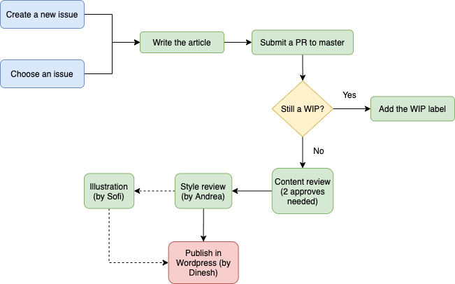

# How to write and publish an article in the Rootstrap blog

Publishing an article help us to improve the Rootstrap brand with quality content on the web. Also writing about a topic, enhance your knowledge of it. If you want to write and publish an article, please follow these simple steps:

1. If you have an idea, [submit it](https://github.com/rootstrap/blog/blob/master/SUBMIT-AN-IDEA.md) as an [issue](https://github.com/rootstrap/blog/issues). Otherwise, you can choose a submitted iddea from this repository issues and assign it to yourself.
2. Write the article. Please take a look at the [guides](https://github.com/rootstrap/blog/blob/master/GUIDE.md).
3. [Create a PR to `master`](https://github.com/rootstrap/blog/blob/master/CREATE-PR.md) and set the [corresponding labels](https://github.com/rootstrap/blog/blob/master/LABELS.md).

   - Create the `.md` file with the article under the `content` folder with the filename: `<article-title> - <author-name>`.
   - Suggested name for the branch: `article/<title>`.

4. Ask for reviewers in the `technical-blog` channel. If it's possible, choose reviewers that have knowledge about the blog topic. Try to get at least two approves.
5. After the approval of the PR, go to the [trello content board](https://trello.com/b/qdyCLffW/content) and create a card in the `Copy Write` column. Put in the card the title of the article and link to the PR. Please add a good quality picture for the article. You can wait for the design team to make a picture for the blog, or you can choose a public one on internet.
6. The copywriter will move the card to the `Wordpress` column so Dinesh can upload the article to the [Rootstrap page](https://www.rootstrap.com/blog/). You can merge now the PR and close the issue.

## Proccess flow

## Promote your article

It's very important to promote the created articles. After the blog is published in the Rootstrap site, please share it on LinkedIn and in the #company channel.

## Notion links

If you want, you can read the [Notion page](https://www.notion.so/rootstrap/Technical-Blog-a57fe28696dd409595e43f1d0a3ed866) to understand better the different parts of the proccess of creating and publishing a technical blog.

- [How to prepare an article?](https://www.notion.so/rootstrap/How-to-prepare-an-article-2e2469176cb542f3b79289937cf07127)
- [Promoting an article?](https://www.notion.so/rootstrap/Promoting-an-article-bd82086d2dc6486bb2a14a5527c9574d)
