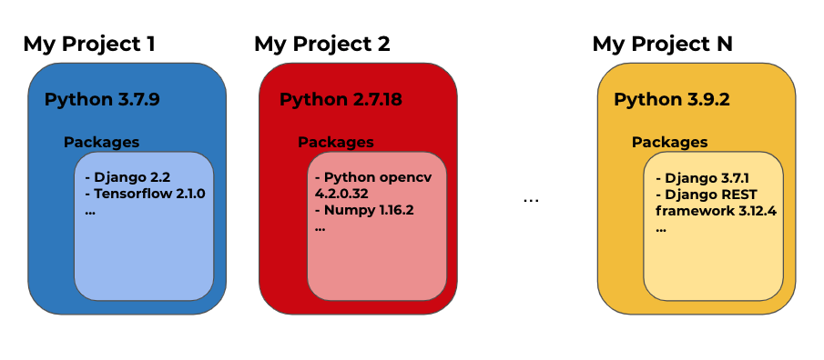
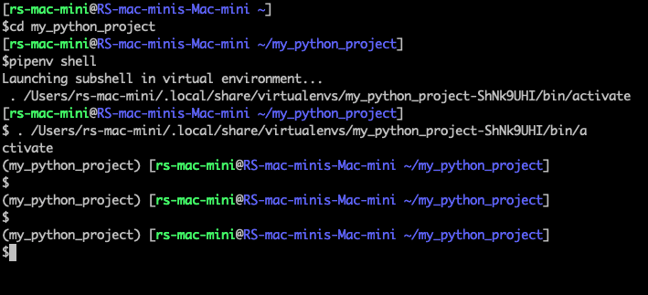

# How to Manage your Python projects with Pipenv & Pyenv

A Python virtual environment is an important tool for developers when separating project dependencies in isolated environments. If working locally on several Python projects, developers may need to use different Python versions on each to install different packages and have different versions of the named packages on each. 

However, this can generate a lot of compatibility issues unless you manage them correctly using virtual environments. There are many ways to do this and in this blog, I will highlight two tools that can help achieve this: [Pyenv](https://github.com/pyenv/pyenv) and [Pipenv](https://pipenv-fork.readthedocs.io/en/latest/). 

## Python Virtual Environments

In the following image, you can see an abstract example of different Python projects containing the different combinations of packages that you can install: 



Each big colored box represents a Python virtual environment. It's common for certain package versions to be supported only by determined Python versions. Also, you may need a determined version of a package in one project and another version for others. As well as this, a determined version of a package can generate conflicts with packages or Python versions. 
Many combinations of compatibility issues can be found, but having those isolated environments you can avoid them. You will be able to install, uninstall, update, etc in one virtual environment without affecting the rest of them. As said, there are many tools to do this and in the next sections, I will talk about the ones that I've found pretty easy to understand and use.

## Pyenv
Pyenv is a tool used to manage different Python versions. With this tool you can:
- Install several Python versions.
- Set/change the global(default) Python version in your computer.
- Set/change a Python version locally for a project.
- Create and manage virtual environments.

### Installation
On macOS, you can install this tool using [Homebrew](https://brew.sh/):

```
brew install pyenv
```

To install it on other platforms, you can watch [this section in the GitHub docs](https://github.com/pyenv/pyenv#installation). After the installation, edit your used shell startup script (`.bashrc`, `.zshrc`, `.bash_profile`, ...) adding the following line:

```
if command -v pyenv 1>/dev/null 2>&1; then
  eval "$(pyenv init -)"
fi
```

Then reload your shell startup script. An example if you have `.bashrc`:

```
cd
source .bashrc
```

That's it! You have installed Pyenv successfully.

### Managing Python versions
Now let's take a look at the possible Python versions that you can install through Pyenv, executing:

```
pyenv install --list
```

You will see a large list of Python versions. You can pick one to install it, let's say 3.9.1:

```
pyenv install 3.9.1
```

You can run that command with any version that you want to have installed on your computer. To see all the installed versions, just run:

```
pyenv versions
```

Also, you can set the global version that you want to use in your system, this will be the default one. For example, if you have already installed 3.8.8, you can set it as the global version running:

```
pyenv global 3.8.8
```

You can change that, of course, by executing the command again with the desired installed version. If you want to check your global version, just run:

```
python -V
```

With Pyenv, you can have a global and a local version for each project. To set a local version, go to the project folder in the terminal:

```
cd ~/path/to/the/project/folder
```

And set the local version, for example, 3.9.1:

```
pyenv local 3.9.1
```

This will create a `.python-version` file in the folder indicating the current local Python version for the project. Also, if you run `python -V` in that folder, you will see the local version, and not the global one.

So, to sum up, you have the following useful commands at your disposal:

- `pyenv install --list` to see the available Python versions you can install.
- `pyenv versions` to see the installed Python versions.
- `pyenv global <Python version>` to set an installed Python version as global.
- `pyenv local <Python version>`  to set an installed Python version for a given project folder.
- `pyenv uninstall <Python version>` to uninstall an already installed Python version.

Pyenv also allows us to manage environments with a plugin called [pyenv-virtualenv](https://github.com/pyenv/pyenv-virtualenv), but for this, I prefer to use Pipenv, which I will discuss in the next section.

## Pipenv
Pipenv is a tool to manage the needed packages in a Python project. With this tool you are able to:
- Create or delete automatically a virtual environment.
- Install, uninstall and update packages maintaining the desired versions.
- Setup very quickly a working Python environment.
- Have a list of the installed packages and the corresponding version.

If you use Pipenv in your projects, you will have two special files in the root folder, both generated and changed automatically. Those are:
- `Pipfile`: A file that specifies the installed packages in your virtual environment for development and execution. 
- `Pipfile.lock`: A file that specifies which versions of the installed packages (detailed in the Pipfile) has to be used. Also has another important metadata.

Then with Pipenv, is very easy to work in a project with other developers having the same packages and versions, because it provides us with those files that have all that information. Then the other developer only needs to run a command to have the same environment in his own computer.

### Installation
On macOS, you can install this tool using Homebrew:

```
brew install pipenv
```

And you don't need to do anything else. You're ready to start!
To install it in other platforms, you can watch [this section in the pipenv docs](https://pipenv-fork.readthedocs.io/en/latest/install.html#installing-pipenv).

### Creating Virtual Environments
Now, let's look at how to create a virtual environment for a Python project. First, go to the project folder:

```
cd ~/path/to/the/project/folder
```

And then execute:

```
pipenv install
```

This will create a virtual environment and:
1. If you already have a Pipfile and a Pipfile.lock: it will also install all the specified packages on them.
2. If you don't have a Pipfile and a Pipfile.lock: it will generate them for that environment.

This is how a Pipfile recently created looks like:
```
[[source]]
url = "https://pypi.org/simple"
verify_ssl = true
name = "pypi"

[packages]

[dev-packages]

[requires]
python_version = "3.7"
```

Under the `[packages]` section, you will see the installed packages for execution - the ones that your Python program will need to be executed correctly. Under the `[dev-packages]` section, you will see the packages that are needed only for development. Also, you can see in that example that the used Python version is `3.7`. If you use Pyenv, the `pipenv install` command will use the global Python version of your system. But as you already know, you can specify a local Python version in your project. For example:

```
pyenv local 3.8.8
```

And if you want to use that local Python version, you can indicate that to Pipenv executing:

```
pipenv install --python 3.8.8
```

Now, what if you want to delete the created virtual environment to create another one? You can do it by running:

```
pipenv --rm
```

Another important thing, is to activate the created virtual environment, you will do this by running:

```
pipenv shell
```

With this command, you "have entered" to your virtual environment. In your terminal you can check that you have already activated the virtual environment, if you see the name between brackets at the beginning of the line, as in this example picture:



There you can see that after the `pipenv shell` command has been executed, the name of the virtual environment appeared between brackets at the beginning of the line. To deactivate the virtual environment, just run:

```
exit
```


### Managing packages
You already know how to create, delete, activate and deactivate a virtual environment. Now let's see how to manage the packages inside them. First, don't forget to activate the virtual environment. Now, to install a package, for example [django-drip-campaings](https://pypi.org/project/django-drip-campaigns/), you can execute:

```
pipenv install django-drip-campaigns
```

That command will:
- Install the latest available version of that package.
- Automatically update the Pipfile file adding the package.
- Automatically update the Pipfile.lock file adding the package version and some other important metadata.

Now the Pipfile file looks like this:

```
[[source]]
url = "https://pypi.org/simple"
verify_ssl = true
name = "pypi"

[packages]
django-drip-campaigns = "*"

[dev-packages]

[requires]
python_version = "3.8"
```

As you can see, the package was installed under the `[packages]` section. As mentioned, in the `[dev-packages]` section you have to install the ones that you need only for development. For example, you want to have [flake8](https://pypi.org/project/flake8/) in your project, that is only required by the development process. To install it under the `[dev-packages]` section, execute:

```
pipenv install flake8 --dev
```

After that, you will see something like this in the Pipfile file:

```
[packages]
django-drip-campaigns = "*"

[dev-packages]
flake8 = "*"
```

And what if you need a specific version of a package? For example you need [django](https://www.djangoproject.com/), not the latest but the 2.2 version. Then run:

```
pipenv install django==2.2
```

Now the Pipfile is updated and is something like:

```
[packages]
django-drip-campaigns = "*"
django = "==2.2"

[dev-packages]
flake8 = "*"
```

In the `django` package line, you don't see the "*", you see the specific version indicated in the command.
If you need to uninstall a package, for example `django-drip-campaigns`, just run:

```
pipenv uninstall django-drip-campaigns
```

That command will uninstall the package, and remove the information from the Pipfile and Pipfile.lock files.
Now suppose you need the latest version of `django` in your project(not the 2.2 version). To update a package to the latest version you have to:

1. Change the `django = "==2.2"` line in the Pipfile by `django = "*"`.
2. Then run:

```
pipenv update django
```

An alternative to these steps is to uninstall `django` and then install it again without specifying the version. Of course, you can repeat those steps in an analogous way, to downgrade a package version instead of upgrading it. 
You can do a lot of things with Pipenv, but the previously detailed are to me the main ones. Pretty easy, right? Now let's see a summary of the mentioned commands provided by Pipenv:

- `pipenv install` to create a virtual environment.
- `pipenv install --python <Python version>` to create a virtual environment indicating the desired Python version (that you have installed using Pyenv).
- `pipenv --rm` to delete the current virtual environment.
- `pipenv shell` to activate the created virtual environment.
- `exit` to deactivate an already activated virtual environment.

Now let's take a look at the summary of the commands after the virtual environment has been activated:
- `pipenv install <package name>` to install the latest version of the package under the `[packages]` section.
- `pipenv install <package name>==<package version>` to install a specified version of a package, under the `[packages]` section.
- `pipenv update package` to update a version package(update or downgrade) to the one that you have previously specified in the Pipfile.
- Adding `--dev` to the previous commands, Pipenv will do the same but under the `[dev-packages]` section.
- `pipenv uninstall <package name>` to uninstall a package.


## Summary
I have presented two different tools for managing Python projects, using virtual environments. There are many ways to do this, and I talked about the one that I like the most. I think these tools are very tidy, maintainable, and easy to understand and use.
They are Pyenv and Pipenv. The first one is to manage different Python versions, and the second one to manage the Python packages. I really like it, and hope you feel the same way about these tools and Python development. Also, I hope that you enjoyed the reading and feel encouraged to use them.
