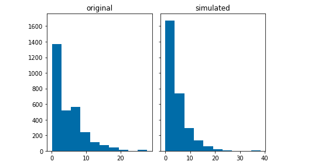
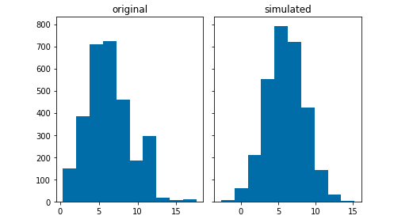
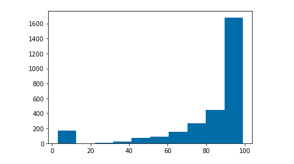
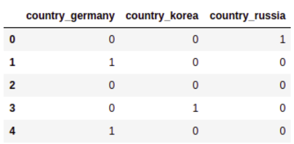
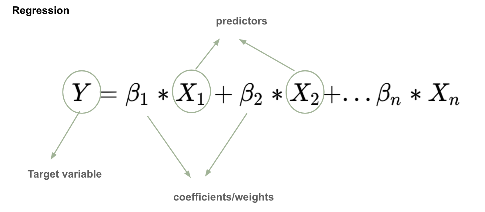
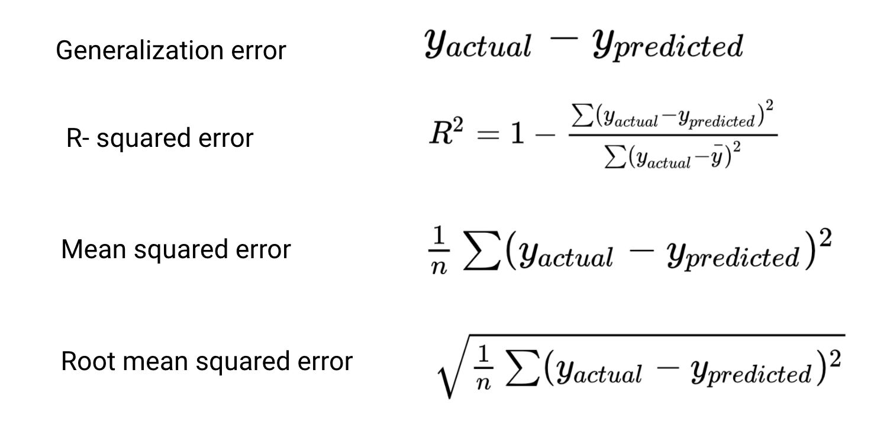

## A prediction experiment with Machine Learning

I recently participated in a Machine Learning workshop at Rootstrap, where my coworkers and I learned about the basics of data science, did some research, and created interesting experiments. We had the opportunity to choose among the studied Machine Learning algorithms and work with them. So, I decided to do an experiment where a mathematical model predicts the life expectancy of a country. That is, given some data of a given country, we can make a prediction of its life expectancy in a determined year. The experiment was made in a [jupyter notebook](https://jupyter.org/), using the [python programming language](https://www.python.org/), and the [scikit learn library](https://scikit-learn.org/stable/). In this blog, I’m going to talk about my experience and explain a little bit about the work I did and the new things that I have learned.

### Prediction in Machine Learning

The word prediction in machine learning refers to the output of a trained model, representing the most likely value that will be obtained for a given input. The model is trained with historical data, and then predicts a selected property of the data for new inputs.
Prediction is used in lots of different areas, since it allows us to make highly accurate guesses about many things, such as predicting what the stock markets will do on any given day, predict results in sports, or even help the medical industry predict diseases.
The algorithms for prediction are classified as supervised learning algorithms since they need a training dataset with correct examples to learn from them. This means that the first thing I had to do to start the experiment was finding a dataset, which contains information about countries, including, of course, their life expectancy.

### The dataset

I used a public dataset of Life expectancy from kaggle to train the model. It comes from a statistical analysis of the factors that might influence the life expectancy of a country. The dataset is a big table containing information about each country, and several factors over several years. The years are from 2000 to 2015, and some of the factors are:

- Adult Mortality: Adult mortality rates of both sexes (probability of dying between 15 and 60 years per 1000 population).
- infant deaths: Number of infant deaths per 1000 population.
  Alcohol: Alcohol, recorded per capita (15+) consumption (in liters of pure alcohol).
- Hepatitis B: Hepatitis B immunization coverage among 1-year-olds (%).
- Under-five deaths: Number of under-five deaths per 1000 population.
- Polio: Polio (Pol3) immunization coverage among 1-year-olds (%).
- Total expenditure: General government expenditure on health as a percentage of total government expenditure (%).
- Population: Population of the country.
- Income composition of resources: Human development index in terms of income composition of resources (index ranging from 0 to 1).
- Schooling: Number of years of schooling (years).

This dataset has 22 columns and 2,938 rows of data. I needed to preprocess the data before training the model. Why did I need that? because when we work in machine learning, we can hardly use the data in the way we get it. First, we need to solve consistency problems, prepare the data for the format and type that the model expects, and remove useless information, etc. If we don’t address those problems, we can’t affirm that the result of the algorithm achieves the main goal. For example, some of the problems could be:

- Missing data.
- Work with different types of data.
- Work with different formats of data.
- Properties of the data with null values.
- The data format is different from the one that the algorithm expects.

In the next section, I talk about the problems I had to face, and how they can be solved.

### Preprocessing the dataset

The process of applying the necessary transformations to the data in order to prepare it for the model is called data cleaning. There are several kinds of problems addressed in data cleaning, the ones that I faced are:

- Null values: some of the rows in the dataset had null values, and given that machine learning models are mathematical models, they can’t work with that kind of input.
- Unnormalized data: some machine learning models don't work well if they have variables that have many different ranges of values.
- Problems with types: I needed to solve how to pass to a mathematical model, values that weren’t numbered, for example, a categorical variable.

In this section, I talk about some approaches to solve those problems.

#### Null values

When a row has empty spaces, that is null values in the dataset, we can delete that row, or fill those empty spaces with data. I didn’t choose to delete the rows, because I would lose a big part of the dataset, and models don’t work well if they are trained with small datasets or I might be removing relevant information. So I decided to fill the null values. To do this, there are many techniques. For example, choosing a default value, or “simulating a distribution of the data” and selecting a value of that simulation. I chose the second example because using the simulation I’m able to generate numbers similar to the real values. I’ll explain a little bit the method in the next section.

#### Simulate a probability distribution

A random variable is a quantity that is produced by a random process. Besides, a probability distribution is a summary of probabilities for the values of a random variable. Knowing this, we can select a column of the dataset that has null values, and simulate its probability distribution. After this, we can randomly select a value in order to fill the null values affecting our dataset. So for each column in the dataset that has some null values, I executed these steps:

1. Plot a histogram of the column using the [hist function in python](https://matplotlib.org/api/_as_gen/matplotlib.pyplot.hist.html).
2. Compare the histogram with the graph of known distributions: normal, truncated normal, uniform, exponential, etc.
3. Select the probability distribution that has the most similar graph to the histogram.
4. Simulate the selected probability distribution.
5. For each null value in the column, fill it randomly choosing a value from the simulation.

Here we can see a comparison with a histogram of a column in the dataset, and the selected probability distribution simulation.



In this case, the histogram from the original data is similar to an exponential distribution. Thus, the simulation was done using an exponential distribution with the scale and size parameters taken from the original data. Another example:



In this second example, the histogram of the original data is very similar to a normal distribution. In an analogous way, I have simulated a normal distribution with parameters taken from the original data.

In the case that the histogram does not resemble any probability distribution, we can divide the mentioned histogram into intervals (looking at the graph) and approximate a probability for each one. After this, we can create a function that returns a random value of an interval, selecting it with the probabilities set. Here is an example of this case:



And the definition of the probabilities set is:

```
# Simulate ranges
ranges_list = [
    range(1,10),
    range(10, 40),
    range(40, 60),
    range(60, 70),
    range(70, 80),
    range(80, 90),
    range(90, 100)
]
probs = [0.05, 0.02, 0.03, 0.05, 0.1, 0.2, 0.55]
```

After those definitions, I created a function that gets one interval from the `ranges_list` according to the probabilities set and returns a randomly selected value within that interval. That value is the one that fills the empty space.

#### One hot-encoding

As I said, mathematical models need to work with numbers. In the dataset, I had some data that took values from a set of words, such as the country column. I needed to map each country's name to a number. But if I did that, it could have happened that the model gave more importance to a country for having a larger number. The solution to this problem is to use other techniques such as one hot-encoding: generate a new column for each country name, and put 1 if the country row has that name, and 0 if not. Here is a simple example:



In the end, I could have deleted one column of the countries, knowing that if a row has 0 in all the countries’ columns, that means that the row has the missing country name. It’s a good way to optimize the amount of data that I work with. I didn't do that because I wanted to have all the countries for better understanding of the results.

#### Split and normalize the dataset

Supervised learning algorithms need a train dataset to learn from it. Besides, it needs another dataset different from the train dataset, to check if the model has learned correctly. The second one is named test dataset. I only had one dataset, so I had to split it. The scikit learn library provides us with the split function, called [train_test_split](https://scikit-learn.org/stable/modules/generated/sklearn.model_selection.train_test_split.html). With this, we can get two datasets from the original one. Generally, the split is 80% train and 20% test.
On the other hand, when the features in the dataset have different range values, we need to normalize them. If we have a column in the dataset that has values between 0 and 1, and another column that has values between -1000 and 100000, the model can lose information or represent our data in an incorrect way. There are different scalers in scikit learn library, I used the [MinMaxScaler](https://scikit-learn.org/stable/modules/generated/sklearn.preprocessing.MinMaxScaler.html) that scales all the values in a range between two values. With that class, I created two kinds of scalers: one for the target variable (the life expectancy) and other for the rest of the features. Doing this separation of scalers, I am able to use the first scaler to convert the results to the original range, and compare that with the original values from the testing data.

### The models

In statistics, there is a kind of process named regression analysis. The processes of this kind are used to estimate the relationship of one variable (often called the target variable), with one or more other variables (often called features, or predictors). This is what I did in the experiment, considering the life expectancy column in the dataset as the target variable, and the rest of the columns as the predictors.
The scikit learn library provides us with lots of machine learning models already implemented, and among them, the regressors. In this section, I’m going to give a general idea of the used models in the experiment.

#### Linear Regression

In linear regression, the relationship between the target variable and the predictors is modeled using a linear function:



The main goal is to find the unknown coefficients, which are estimated from the data. That’s why prediction is a supervised learning algorithm. I used a linear regression with two regularization methods: Lasso and Ridge Regression.
On one hand, the LASSO (Least Absolute Shrinkage and Selection Operator) regression is a process that uses shrinkage. Shrinkage is where data values are shrunk towards a central point, like the mean. Lasso regression performs L1 regularization, which adds a penalty equal to the absolute value of the magnitude of coefficients. Some coefficients can become zero and have been eliminated from the model, something very useful when we have lots of parameters. As I said, I used the [implementation of Lasso from scikit learn](https://scikit-learn.org/stable/modules/generated/sklearn.linear_model.Lasso.html). With this python class, we can use the fit function to train the model with the preprocessed and scaled dataset, and then use the predict function with new inputs to obtain the prediction of the life expectancy.
On the other hand, the Ridge regression performs L2 regularization, that is, a penalty using the Euclidean norm. Generally, this algorithm reduces the coefficients but doesn't eliminate them. It’s good to use this type of model when we have overfitting problems. As the Lasso regression, scikit learn provides also a [python class for Ridge regression](https://scikit-learn.org/stable/modules/generated/sklearn.linear_model.Ridge.html), with the fit and predict functions.

#### Decision trees

In regression, a decision tree is a type of model that builds a regression in the form of a tree structure. It breaks down the dataset into smaller subsets while at the same time develops an associated decision tree. In that tree, the leaf nodes are results, and the other nodes are decisions.
In the experiment, I used the Random Forest model, which builds several decision trees (that is why it is called forest) and then ensembles them. Each tree takes only a random subset of the features and makes the decisions from it. What does “ensembles” mean in machine learning? Well, ensemble methods use multiple learning algorithms to obtain better predictive performance than the one that could be obtained from any of the constituent learning algorithms alone. Random forest it’s also [implemented in scikit learn](https://scikit-learn.org/stable/modules/generated/sklearn.ensemble.RandomForestRegressor.html?highlight=random%20forest%20regressor#sklearn.ensemble.RandomForestRegressor) and has the fit and predict functions.

### Metrics and results

How do we know if the regression model works well? We can use some metrics to analyze that. As I mentioned, it’s a common practice to split the dataset into training and testing datasets. The training dataset it’s used by the model to learn, and the testing dataset it’s used to evaluate the correctness of the resultant model.
How do we do this evaluation? By the moment of the evaluation, we have a trained model, and a testing dataset that has two main parts: a set of instances of the data, let’s say `X_test`, and a set of the corresponding correct result for each instance in `X_test`, let’s call it `Y_test`. A good way to measure how well our model works is by applying the predict function on `X_test`, and comparing that result with the correct one (`Y_test`). To make the comparison we have a couple of metrics that we can use:



As you can figure out, the closer to 0, the better results.
In the experiment I used R-squared, Mean squared, and Root mean squared error. For each trained model, I did a measurement of those errors, and also, I used the created scalers for the target variable to scale back the result and compare the values in the original range. In these tables you can see the results of each model:

Results with scaled data
| Model | R-squared error | Mean squared error | Root mean squared error |
|---------|-----------------------------|-----------------|-----------------------------------------------|
| Lasso | 0.57123| 0.01519 | 0.12324 |
| Ridge | 0.94795 | 0.00184 | 0.04294 |
| Random Forest | 0.94275 | 0.00202 | 0.04503 |

Results in the original range
| Model | Mean squared error | Root mean squared error |
|---------|-----------------|-----------------------------------------------|
| Lasso | 37.9725| 6.16219 |
| Ridge | 4.60964 | 2.14701 |
| Random Forest | 5.06985 | 2.25163 |

The conclusion is that Ridge and Random Forest regression work better than Lasso for this dataset, given that the errors are closer to 0. Besides, scaling back and comparing in the original range, we saw that the error in those cases are both approximately 2 years, a good threshold to predict life expectancy.

### Summary

In this blog I talked about a prediction experiment with machine learning. It was very interesting to me and I learned a lot. I hope that at this point you enjoyed your reading, and understood the main ideas of the general process of prediction. Also, I mentioned important concepts of machine learning such as supervised learning, preprocessing the data, training and testing the models, etc. We saw some of the most used models in regression, and a way to evaluate them in order to see how well they are working. Finally, after reading this blog I hope that you feel inspired to work with machine learning because it’s fun and helps us solve lots of amazing and interesting problems.
