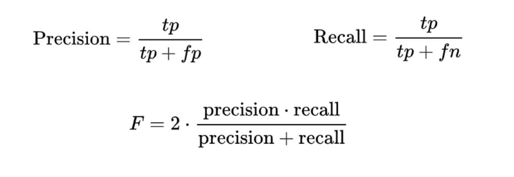
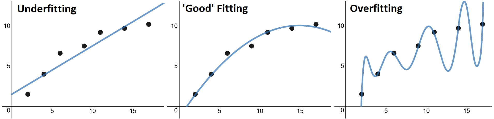

## A quick classification experiment using machine learning

My team recently faced a brand new challenge: developing a way to classify job positions written in natural language by lots of different people. It sounds simple, but there are a few factors that made this problem hard to solve. Job positions can be ambiguous depending on language usage and new job positions appear all the time. 

The set of possible positions we needed to classify is extremely wide. A few quick examples: Digital Marketing, Public Relations, Founder and Inventor of X. Creating a program with enough "if" statements to accurately analyze job positions and classify them based on the words they contain would be almost impossible. Besides that, the appearance of new job positions not yet entered into our program would cause the classifier to fail frequently. 

But what if it was possible to train a program about the nature of different job positions to face new job titles and classify them accordingly? Well, it is. And that’s where machine learning comes into play. 

### The classification problem

The problem we faced is easy to explain: classify job positions by areas and levels. Given a set of classes, we needed to build a classifier that has a job position as the input, and the corresponding class as the output. Because we need to use two different criteria for accurate classification of job positions, we needed to create two classifiers: one for the area and one for level. For example, if an area classifier receives "CEO and Founder," it has to return the “Business” class, and the level classifier needs to return the “C-Suite” class. 

The problem is simple, but the solution is not. We knew machine learning was frequently used for applications like this and started searching for the tools we’d need to create our program.

### Applying machine learning

Machine learning focuses on the development of computer programs that can use data to learn on their own. The difference between this and regular programs that execute prespecified instructions is that machine learning algorithms can use previous experience to face new incoming data and act accordingly. 

This means that machine learning programs learn using the data we provide them. A real-world example of this can be seen in this excerpt taken from "[Understanding Machine Learning: From Theory to Algorithms](https://www.cs.huji.ac.il/~shais/UnderstandingMachineLearning/understanding-machine-learning-theory-algorithms.pdf)." 

**_Rats Learning to Avoid Poisonous Baits_**

"*When rats encounter food items with novel look or smell, they will first eat very small amounts, and subsequent feeding will depend on the flavor of the food and its physiological effect. If the food produces an ill effect, the novel food will often be associated with the illness, and subsequently, the rats will not eat it. Clearly, there is a learning mechanism in play here – the animal used past experience with some food to acquire expertise in detecting the safety of this food. If past experience with the food was negatively labeled, the animal predicts that it will also have a negative effect when encountered in the future.*"

#### Supervised learning

Supervised learning is a subset of machine learning where we provide the algorithms with "labeled data." This means a dataset filled with correct examples is used to construct the mathematical model that the algorithm uses to classify job titles. In this particular case, the algorithm needs a set with elements in the form: 

`<example job position>, <corresponding classification>`

But what does learning mean in this scenario? The main concept here is that machine learning algorithms represent their knowledge of a problem using a mathematical model. They choose initial values for the model’s parameters, process the dataset, compare it with the correct results, and then go back to further refine the parameters. 

This process is repeated until the algorithms obtain the parameters that best fit the correct dataset. 

#### Scikit learn

[Scikit-learn](https://scikit-learn.org/stable/index.html) is a great resource to work with for any machine learning project. It’s an open-source library coded in [Python](https://www.python.org/) with lots of tools for predictive data analysis. It has far too many functions to cover in a single article, but we recommend clicking over and having a look if this sort of thing piques your interest. "[Working With Text Data](https://scikit-learn.org/stable/tutorial/text_analytics/working_with_text_data.html)" was one of the examples we found particularly valuable for our machine learning application. 

#### Selected classes

Our team tested two classes from Scikit learn: [SGDClassifier](https://scikit-learn.org/stable/modules/generated/sklearn.linear_model.SGDClassifier.html?highlight=sgdclassifier#sklearn.linear_model.SGDClassifier) and [MLPClassifier](https://scikit-learn.org/stable/modules/generated/sklearn.neural_network.MLPClassifier.html?highlight=mlp#sklearn.neural_network.MLPClassifier). Classification algorithms try to minimize the cost of errors from a loss function during training. 

The SGDClassifier class uses linear classifiers, minimizing the loss function using the Stochastic Gradient Descent training method. That’s where this class gets its name, and the methodology behind it is to iterate through data using a gradient of the function to achieve the minimum cost of errors. 

The MLPClassifier is an abbreviation of a neural network called Multi-Layer Perceptron. Neural networks are quite complex and out of this article’s scope. What you need to know is that both classes represent supervised learning algorithms and follow the same overall construction process. 

### General working process

Scikit-learn allows us to build classifiers and measure their results. With the tools provided by the Scikit library, it’s possible to solve this problem in a few ways. Here’s the overall framework we followed:

1. Create the dataset

2. Split the dataset

3. Represent documents as vectors of real numbers

4. Fit and tune the classifier 

Many different learning algorithms can be used as classifiers. The implementation might be slightly different depending on the tool, but this general process is the same for most classification problems. 

#### Create the dataset

Supervised learning requires a dataset with correctly classified examples. The first step is creating this dataset. It’s made by humans, and there’s no way around it. It’s boring but fundamental. Since the dataset will be used by the algorithm to train and adjust the mathematical model, it’s important to make sure all of the examples are correctly classified. 

The size of the example dataset required to train the model depends on the problem. It’s vital to have a representative dataset for each possible classification. For example, if we wanted to create a classifier that receives an image of a pet and classifies that as a dog, cat, or other, we would need a representative dataset containing several examples with a wide variety of cat images, dog images, and other pet images. 

#### Split the dataset

After constructing the classifier, we need to validate that it’s working properly. To do this, a testing set is required. Note that you can’t use the same dataset for training and testing. The testing process has to be conducted using a set unknown to the classifier. That ensures the classifier works as expected with new, incoming data. 

We need to split the dataset into two sets: a training set used for the learning process, and a test set to test how the classifier is working. A general guide is to keep 80% for training and 20% for testing, but there are many different methods to generate this ratio. 

#### Represent documents as vectors of real numbers

Because a classifier builds a mathematical model to represent its *knowledge* and it’s easier to compute numbers than strings, we have to transform each sentence from a string into vectors of real numbers. This is known as [text feature extraction](https://scikit-learn.org/stable/modules/feature_extraction.html#text-feature-extraction). The goal is to extract important information from each document to represent the training and testing sets as a collection of vectors. 

Scikit-learn provides a few functions and classes that can help us with this. The [CountVectorizer](https://scikit-learn.org/stable/modules/generated/sklearn.feature_extraction.text.CountVectorizer.html?highlight=countvectorizer#sklearn.feature_extraction.text.CountVectorizer) class is used for tokenization and occurrence counting. The tokenization consists of separating the text into a set of its containing words according to a selected separator and the right criteria. Occurrence counting is a technique that creates a vector filled with the number of times each containing word occurs. 

[TfidfTransformer](https://scikit-learn.org/stable/modules/generated/sklearn.feature_extraction.text.TfidfTransformer.html?highlight=tfidf#sklearn.feature_extraction.text.TfidfTransformer) is another useful class that creates a vector based on the frequency of each word in a document. The main idea is to minimize the impact of frequently occurring words in the English language (the, a, is, etc.) that aren’t important during classification. 

In summary, we need to transform the collection of documents into a set of vectors that we can use to train the classifier’s learning algorithm. There are many ways to go about this, and if you’re interested in learning more, check out the [feature extraction tutorial](https://scikit-learn.org/stable/modules/feature_extraction.html?highlight=tfidf) Scikit has available. 

#### Fit and tune the classifier

This is where the algorithm starts to learn. A supervised learning algorithm has parameters and hyperparameters. The parameters represent the algorithms knowledge and they are adjusted by the algorithm using the training set. An example of a parameter would be the weight selected for a determined input feature. 

The hyperparameters are related to the training process and impact the way the algorithm learns. Some examples of hyperparameters are the maximum number of iterations, the fault tolerance, the number of hidden layers in a neural network, etc. 

The SGDClassifier and MLPClassifier both have a function named fit that chooses the best parameters to fit the training set. However, the hyperparameters are defined by default. We can vary and combine them to optimize our results, but since there are so many possible combinations of these hyperparameters, this process can be quite tedious. Scikit-learn helps us find the most optimal combination of hyperparameters with the [GridSearchCV](https://scikit-learn.org/stable/modules/generated/sklearn.model_selection.GridSearchCV.html?highlight=gridsearch#sklearn.model_selection.GridSearchCV) class. This class uses a technique called cross-validation while trying all of the provided combinations of hyperparameters and measures the results from part of the training set. This part of the set is named the validation set, and it’s where the class stores the hyperparameter combination that achieves the best results. 

This is the process of tuning a classifier. After this part, we have a classifier instance and we can use the function predict to get the classification of new incoming job positions. 

### How do we know if the classifier is working as expected?

If we want to check on how our classifier is working, it’s time to use the testing set. Several metrics are used in classification problems and Scikit-learn has a few functions to work with them. Our team used a function called metrics. This function compares the classifier’s prediction of the testing set with the correct results and returns metrics that help us define whether or not the classifier is working as expected. We have a prediction for each category of classification, and we focused on some specific metrics returned by the function to gauge the accuracy of our classifier. These metrics are:



Where tp means true positives, fp = false positives, and fn = false negatives. Precision is the number of elements classified as true positive over the total number of elements classified as positive. 

The recall is the number of correctly classified elements over the total number of truly positive elements. These metrics are taken by the function for each classification category, and they will all output a number between zero and one. The closer to one, the better. We focused on the F score, a harmonic measure between precision and recall. If we get good precision but bad recall, the classifier isn’t working as expected. So, if the F score is close to one, we know our classifier is working accurately. 

### Overfitting and underfitting

There are two common problems in the classification process: overfitting and underfitting. To explain this, let’s use the pet classifier example from above. The goal is to create a classifier that receives an image of a pet and classifies that as a dog, cat, or other. 

If we create a training set using only images of big dogs like a Labrador or a Saint Bernard, then the classifier won’t classify a Chihuahua as a dog. This is an example of overfitting. Our classifier fits particular cases of the training set, so when new input comes, the classifier doesn’t respond as expected. The problem here is that our training set is too specific.

On the other hand, if we create the training set using only images of white dogs, then the classifier will classify a white cat as a dog, and a white hampster as a dog, etc. This is underfitting. Our training set is much too broad. Here’s an image that illustrates these problems in a way that’s a little easier to visualize:



How can we avoid these common problems? 

* Create representative training and test sets with good proportions of each category

* Do not overload the training set with overly specific cases

* Tune the classifier by changing the hyperparameters

* Use cross-validation

* Use early stopping techniques (stop the training before overfitting occurs)

### Our results

After many mistakes, tests, and iterations, we were able to create classifiers that work exceedingly well. These are the results we achieved for level classification: 

MLPClassifier
```
                precision    recall  f1-score   support

     C-Suite       0.90      0.93      0.92        29
    Director       0.97      0.92      0.94        37
     Manager       0.90      0.95      0.92        19
       Other       0.93      0.95      0.94        41
          VP       1.00      0.96      0.98        24

    accuracy                           0.94       150
   macro avg       0.94      0.94      0.94       150
weighted avg       0.94      0.94      0.94       150
```

SGDClassifier
```
               precision    recall  f1-score   support

     C-Suite       0.97      0.97      0.97        29
    Director       0.97      0.92      0.94        37
     Manager       1.00      1.00      1.00        19
       Other       0.95      1.00      0.98        41
          VP       1.00      1.00      1.00        24

    accuracy                           0.97       150
   macro avg       0.98      0.98      0.98       150
weighted avg       0.97      0.97      0.97       150
```
The f1-score (F score) is close to one, so it’s safe to say the classifier is working as we expected. With perfect precision and recall in more than one category, you can see the SGDClassifier works slightly better than the MLPClassifier. 

### Summary

In this article, we talked about using machine learning to solve a real-world classification problem our team recently encountered. It’s also a great little demo of our work. The Scikit-learn library has a ton of different machine learning tools anybody can use to tackle a variety of problems. We went over the general process used to build a classifier and a few common hiccups you may encounter. We know other techniques can be used to improve our work and that’s why the machine learning universe is so amazing. You’re always able to learn and discover more, and as an engineering team, that keeps us motivated and happy to continue working.

