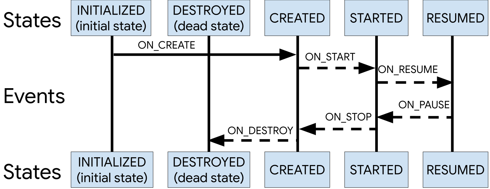

## Introduction to Android Architecture Components

According to [Android Developers](https://developer.android.com):
"Android architecture components are a collection of libraries that help you design robust, testable, and maintainable apps."

Android Architecture Components help solve many problems that Android developers face on a project. It helps create a clean and easy to maintain architecture such as MVVM, with the goal of taking advantage of all the capabilities of the Android framework and it's structure.


This post will give a brief introduction to Android Architecture Components. In later posts, we will delve deeper into each of the libraries to show the capabilities of each one.

Let's start:

- ### Android Lifecycle:

Android introduces lifecycle as a way to avoid memory leaks and keep a cleaner code, and each activity|fragment|lifecycle-owner can be abstracted from the behavior of an object at each stage of its life cycle. That object can subscribe to the activity|fragment lifecycle implementing the interface androidx.lifecycle in order to execute certain actions in each state:



To subscribe to a lifecycle event you can use annotations like:

``` kotlin
  @OnLifecycleEvent(Lifecycle.Event.ON_RESUME)
  fun yourOnResumeActionListener() {
	...	
  }
```

Available states:
- ON_RESUME
- ON_START
- ON_STOP
- ON_DESTROY
- ON_PAUSE
- ON_CREATE

Note: Each activity|fragment|lifecycle-owner needs to add the object to its own lifecycle observers:

``` kotlin 
    this.getLifecycle().addObserver(objectWithLifeCycleListener)
```

- ### Live Data:

LiveData is a new type of Observable that is lifecycle-aware. This means that LiveData takes into account their observer's lifecycle state to notify the changes to them, meaning that only active components (STARTED or RESUMED) will be notified, avoiding potential issues such as Memory Leaks, crashes due to stopped activities and dealing with configuration changes properly. All of this while keeping up to date data everywhere in your app. Isn't it awesome?

A classic example: for an app it is important to keep the user data updated, if the user changes the name, avatar, permissions, etc... you can observe it and notify the app for those changes.

- ### View Model:

It's the one responsible for providing and keeping data saved for the UI in each state of the lifecycle of the view or the app. For example: screen rotations; when the app has gone to the background; when it's sleeping. 
It is the one who "talks" to the repository and it's subscribed to its response using LiveData.
Each view (Activity|Fragment not custom views or Adapters) should have a view model. Example:

MainActivity.kt
MainActivityViewModel.kt

Note that you need to setup the view model with the View in order to register the view as the LifeCycle owner:
In the view (this case MainActivity):

``` kotlin
val viewModel = ViewModelProviders.of(this)
    .get(MainActivityViewModel::class.java)
```

- ### Room database:

Android always uses SQLite to storage|manage data, but the use of it required to write a lot of code or the use of unsafe third-party libraries. Also, SQLite didn't check the SQL queries at compile time, causing potential issues. Room was the solution to this problem, while also helping to keep data safe and facilitating the integration with LiveData to provide a clean way to provide data to the ViewModel. 
To create a DB entity all you have to do is add the @Entity annotation to a Model class and a create a @Dao annotated interface to manage the access to the model data:

``` kotlin
@Entity
class Person {
    @PrimaryKey
    var id: Long? = null
    var name: String? = null
    var lastName: Long? = null
}

@Dao
interface PersonDAO {
    @Insert( onConflict = OnConflictStrategy.REPLACE )
    fun insertPerson(person: Person): Long
 
    @Query("SELECT * FROM person WHERE id = :arg0")
    fun findById(id: Long): LiveData<Person>
}

// Setup the DB:
@Database( entities = arrayOf(Person::class), version = 1)
abstract class Database : RoomDatabase() {
    abstract fun personDAO(): PersonDAO
}
```

- ### Managing your UI components:

Android introduced a Data Binding library to provide us a new way to set up the view, as passing all data or livedata to the xml file:


``` xml
<layout xmlns:android="http://schemas.android.com/apk/res/android"
        xmlns:app="http://schemas.android.com/apk/res-auto">
    <data>
        <variable
            name="viewmodel"
            type="com.rootstrap.viewmodel.ProfileActivityViewModel" />
    </data>
    <ConstraintLayout ...>
        <TextView
            ...
            android:text="@{viewmodel.profile.name}" />
  </ConstraintLayout>
</layout>
```

Also, they added binding adapters to create custom properties or listeners for each layout. For example:

``` kotlin
@BindingAdapter("app:addPersonAdapter")
fun personAdapter(view: RecyclerView, adapter: PersonAdapter) {
  view.apply {
    it.layoutManager = LinearLayoutManager()
    it.adapter = adapter
  }
}
```

The view:

``` xml
    ...
    <variable
            name="viewmodel"
            type="com.rootstrap.viewmodel.ProfileActivityViewModel" />
    </variable>
    ...
    <RecyclerView
        ...
        add:addPersonAdapter="@{viewmodel.personAdapter}" />
```

Also, we can integrate DataBinding with LiveData, but that's for another post.

- ### Conclusions: 

As we have observed, these libraries help us write code that's cleaner, faster, more scalable, and easier to maintain.  In future posts, we will delve deeper into each of these components to provide a better understanding.
