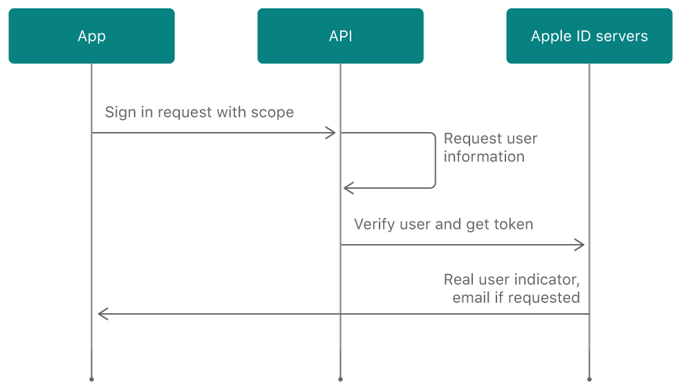

# AppleAuth, an easy ruby way to integrate with Apple Sign In.


## What is AppleAuth?

[AppleAuth](https://rubygems.org/gems/apple_auth) is a Ruby gem we developed to integrate Apple Sign In in our server side applications.

Apple announced Sign in with Apple in the [WWDC 2019 Conference](https://developer.apple.com/videos/play/wwdc2019/706/), then in September 2019 Apple updated its [App Store Review Guideline](https://developer.apple.com/news/?id=09122019b) to state that if your iOS app implements a third-party or social login service (like Facebook Login or Google Sign-In) it will be mandatory to offer Apple sign in as an option by the end of April 2020.  Besides following the standards, implementing apple authentication will let sign in using their two-factor authentication Apple ID. After the user follows Sign in with Apple to log in, your app receives tokens and user information that you can use to authenticate the user in your server.

### Apple sign-in workflow


For more information, check the [Apple Oficial Documentation](https://developer.apple.com/documentation/sign_in_with_apple/sign_in_with_apple_rest_api)

## How does AppleAuth works?

### Validation
Apple authentication follows the OAuth 2.0 flow, and this gem will help us with this flow. After the user signs in in the client side, we will have access to the user_identity, code, and JWT on our server side. The last one is a token that will be used to validate the user authentication with Apple. So Apple_Auth's first step will be to decode and validate the JWT.

```ruby
# with a valid JWT
user_id = '000343.1d22d2937c7a4e56806dfb802b06c430...'
valid_jwt_token = 'eyJraWQiOiI4NkQ4OEtmIiwiYWxnIjoiUlMyNTYifQ.eyJpc...'
AppleAuth::UserIdentity.new(user_id, valid_jwt_token).validate!
>>  { exp: 1595279622, email: "user@example.com", email_verified: true , ...}

# with an invalid JWT
invalid_jwt_token = 'eyJraWQiOiI4NkQsd4OEtmIiwiYWxnIjoiUlMyNTYifQ.edsyJpc...'
AppleAuth::UserIdentity.new(user_id, invalid_jwt_token).validate!
>> Traceback (most recent call last):..
>> ...
>>  AppleAuth::Conditions::JWTValidationError
```

### Authentication
If we successfully validate the JWT, we can authenticate users and get their information. At this point, we can persist refresh-token, to once a day, and if needed get a fresh token from Apple and ensure that the user continues to have their apple_id validated.
```ruby
code = 'cfb77c21ecd444390a2c214cd33decdfb.0.mr...'
AppleAuth::Token.new(code).authenticate!
>> { access_token: "a7058d...", expires_at: 1595894672, refresh_token: "r8f1ce..." }
```

### DeviseTokenAuth Integration
If you already have DeviseTokenAuth gem implemented on your Rails project, you can just run this generator:

```
$ rails g apple_sign_in:appple_auth_controller [scope]
```
In the scope you need to write your path from controllers to your existent devise controllers and set up the routes.

This generator will create a controller, that implements AppleAuth methods, get the user's email, and register them.

You can find more info and the guide to install the gem on the [README](https://github.com/rootstrap/apple_auth).
You can find a full implementation of this gem in this [demo](https://github.com/rootstrap/apple-sign-in-rails).
