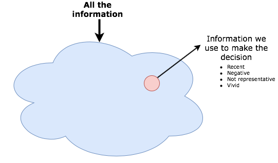

## Availability Heuristic

We are all blind. And even worse, we are blind to our blindness. 

I've found that the single most significative cognitive bias that affects our business decisions is the "Availability Heuristic". 

It can be reduced to a very simple phrase: "What I see is all there is".

We can't avoid it, this is hardcoded into our primitive brain, which has to jump to conclusions fast and take decisions to survive. More formally, it can be defined as our tendency to think about things that come readily to mind as representative of reality.

This is a psychological phenomenon that we all suffer from. It affects our critical thinking and can lead to bad decisions. Being aware of its existence is the first step to avoid falling into this trap. 

Some people have a natural tendency to be more influenced by this, but we are ALL  affected. It affects many aspects and fields, like business management, economy, health, education, you name it.

When running businesses, developing projects, or working with clients we usually take decisions with very limited information, under time constraints, with a brain that has a tendency to look for cause-effect relations and negative over positive facts  (which are two other cognitive biases). This is a dangerous cocktail. 

We can be blind, but the more aware we are of it, the better the decisions we'll take.  

If this sounds  a bit confusing, check out the following picture:

