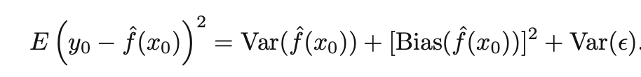
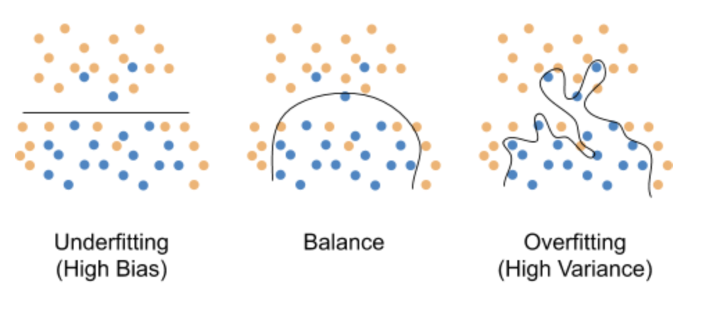
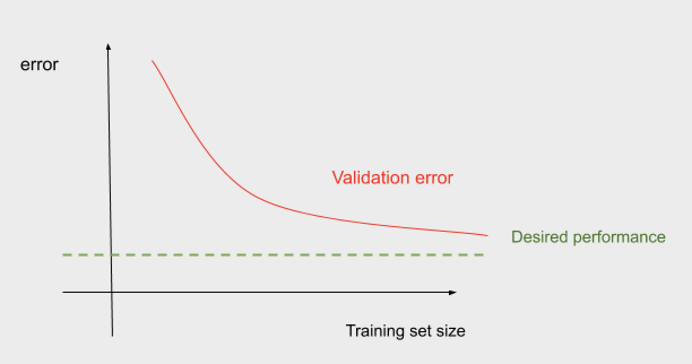
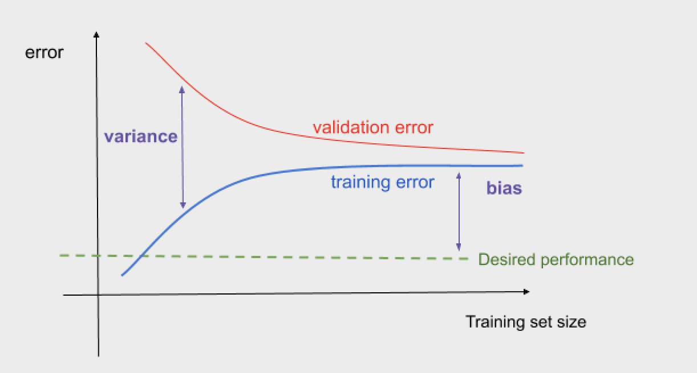
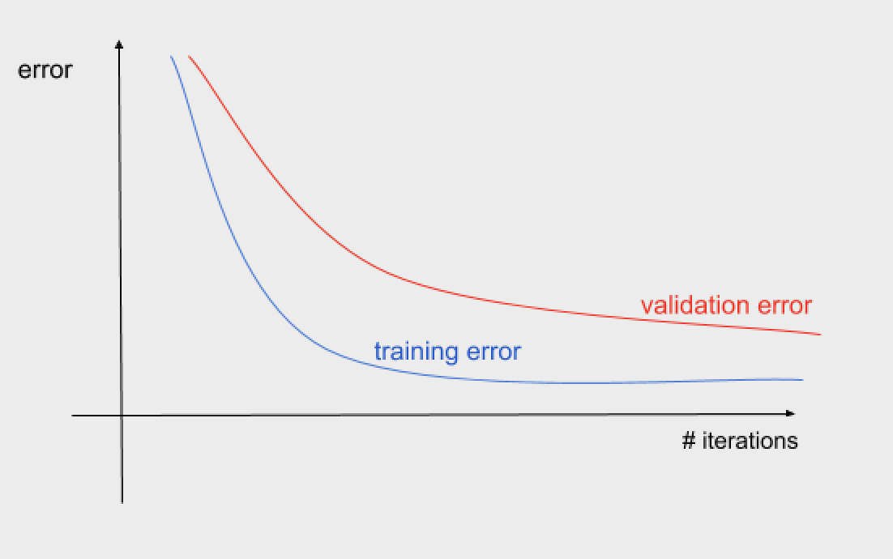
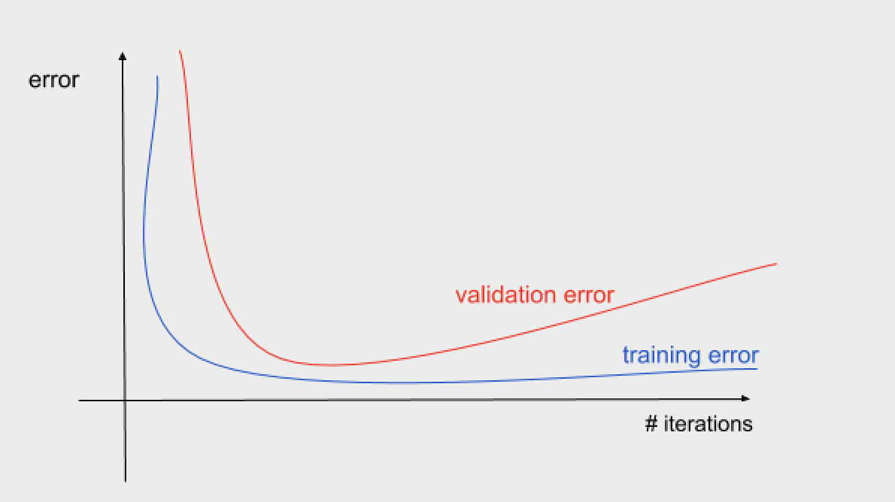

# Bias & variance 

Whenever you want to analyze the performance of machine learning algorithms, you would need to study the root cause of the error. Concepts like bias and variance would help you understand this cause and give you insights on how to improve your model. 

## What is Bias error?
Bias error corresponds to errors in the assumptions made in the model to make the target function faster to learn. **High bias can cause underfitting**, when the model misses the relevant relations between features and the target variables.
For instance, generally linear regression models have high bias (more assumptions about the form of the target function), which makes them easier to understand than faster to learn, but less flexible and with a lower performance for complex problems. 

## What is Variance error?
Variance error reflects sensitivity to the model and to small changes in the training set. Variance is calculated as the difference between the training error and the test error. Ideally, the error should not change too much from the training to testing, so we want a low variance. Models that have a high variance are influenced by the specific details of the training data. Thus, it means that specific details from the training have an influence on changes to the estimate of the target function. **High variance can cause overfitting**, when the model learns specific things from the training data and does not represent the rest of the information.

## How is the total error composed?
The error is composed by the error rate in the training set (bias) and the error generated when performing the model over the test set (variance), it means how much worse the algorithm works with new data. 

Using the MSE formula, the total error can be written as follows: 

The term on the left defines the expected test MSE, it can be calculated as the average test MSE.  It depends on the variance and the squared bias plus the irreducible error Var(e). So, to have a low error we would need to select a method that achieves low variance and low bias at the same time. 

Thus, understanding the interpretation of the error decomposed as bias and variance may help you to make changes effectively to improve the performance.  

Be careful! You might add changes in your model/data that reduce the bias but generates higher variance. We would always want low bias and low variance so we do not either underfit or overfit.    

***Bias - Variance trade off:*** *The goal always is having both low bias and low variance in order to achieve good predictions. But generally when one goes down, the other goes up. Thus, it is important to find a balance between these two values.* 

In the following image, we can visualize this trade off. The balance that we are searching for is the figure in the middle. The image in the left represents the case of underfitting when the model does not learn enough missing relevant information from the data, having high bias. Whereas in the right we have the case of overfitting, where the model learns too many details from the training data which are not present in the test data, having high variance.

**Optimal error rate:** the optimal error rate refers to the ideal point for the error rate. This error will depend on the problem that you are performing. It should be compared with the human error, it should be equal or lower than the error that a human can generate. For instance, if we are trying to analyze images and there is so much noise that even a human has a 14% error in the task, the optimal error rate would be 14%. The optimal error rate might depend also on the type of task that we are performing, it is not the same as what the error means for a medical analysis where an error might affect people’s life than a product classifier, where you might just want to achieve a reasonable error that fits with the user’s expectations. This error also is known as “unavoidable bias”, it is the error that you assume as acceptable for your algorithm.

**Avoidable bias:** the avoidable bias is calculated by subtracting the optimal error rate to the training error. It represents the error that we can reduce by improving the algorithm.

Once we define these two concepts, we can define bias as: 
> Bias = Optimal error rate (‘unavoidable bias’) + Avoidable bias

## How to diagnose bias/variance error by looking at Learning curves? 

### Plot error against the amount of training examples 
You would need to run the algorithm several times, changing the training set size. As the training set size increases, the error should decrease.

     
You can figure out how much closer you can get to the desired performance “optimal error rate” by adding more data. There is some point when adding more data does not improve performance. Graphically you can notice this point when the error curve is plateaued, it means that the error states the same.

The training error can also help you to understand the point when adding more data is useless. 
Your validation error should decrease as the training increases. But your training set error usually ​increases​ as the training set size grows. But, as we can see in the graph, It also grows up to a point. There is a point where the validation and training error do not change when adding more data. It means that from that point, it does not matter how much data we add, we cannot improve the error performance of the algorithm. 

### Plot error against the number of iterations 
The learning curve can have in the x-axis either the number of elements in the training set or the number of iterations. In the examples above the x-axis was the training set size. In the following curve, we can see that there is also a point when the error does not improve even if we increase the number of iterations. 

     
 Plotting this curve we can also detect overfitting. As we can see in the following graph, it happens when increasing the number of iterations the training error goes down but the validation error starts to increase. I recommend you to read [this](https://machinelearningmastery.com/learning-curves-for-diagnosing-machine-learning-model-performance/) blog for further information about the detection of overfitting from this kind of plot.

### How can we reduce bias? How can we reduce variance?  

**Increase the complexity of the model:** For example, in a neural network, you can change the number of nodes or layers. By increasing the complexity of your model you can reduce the bias. On the other hand, this might present computational problems and also can lead to an increase of variance, and as a consequence possibility of overfitting. 

We can visualize the effect that the complexity of a model can have over bias and variance in the following graph. As the complexity of the model increases, the bias tends to initially decrease faster than the variance increases, and as a consequence, the total error declines. However, there is some point when increasing the flexibility(complexity) has more impact on the variance than on the bias, and that is why the error starts to increase.

**Regularization:** regularization consists of the application of penalty to the weights of the model. During the learning process a penalty is added to the loss function in terms of the coefficients of the model. Regularization methods can help to reduce variance. However this will reduce bias. 

Ridge and Lasso regression are methods of regularization which add a penalty term for having large coefficients. 
While Ridge regression uses L2 norm (Euclidean distance)      

Lasso regression uses the square norm L1 (Manhattan distance)       

%5E2)

**Add more training data:** this will help you to reduce variance, taking the considerations mentioned above. Knowing that there is some point when adding more data does not change the values of bias and variance. 

**Feature seleccion:** decrease the number of features by finding the most relevant variables for the analysis. This can help to reduce variance, you have to be careful to not reduce relevant features because in that case you might suffer from high bias.   

**Dimension reduction:** apply dimension reduction techniques to reduce the amount of input variables to your model. For instance, use Principal Component Analysis to find factors that explain the variance in the data. This might help you to improve your model error performance as well as reduce the computation time.

**Early stopping:** stopping the learning process before the variance starts going up, might help you to avoid overfitting and have a good performance. However, it is recommended to apply other techniques before reaching this point, since in this case is  

In conclusion, do not panic if you have one of these problems, take your time to analyze the graphs and investigate where might be the issue. Several techniques to reduce bias and variance exist that will help you to improve your model. From the graphs, you will have insights about what is going on, and from there you might make decisions about what actions perform. 

# References
- [ISLR - An Introduction to Statistical Learning with Applications in R](http://faculty.marshall.usc.edu/gareth-james/ISL/)
- [Machine Learning Yearning, Andrew Ng](https://www.deeplearning.ai/machine-learning-yearning/)

