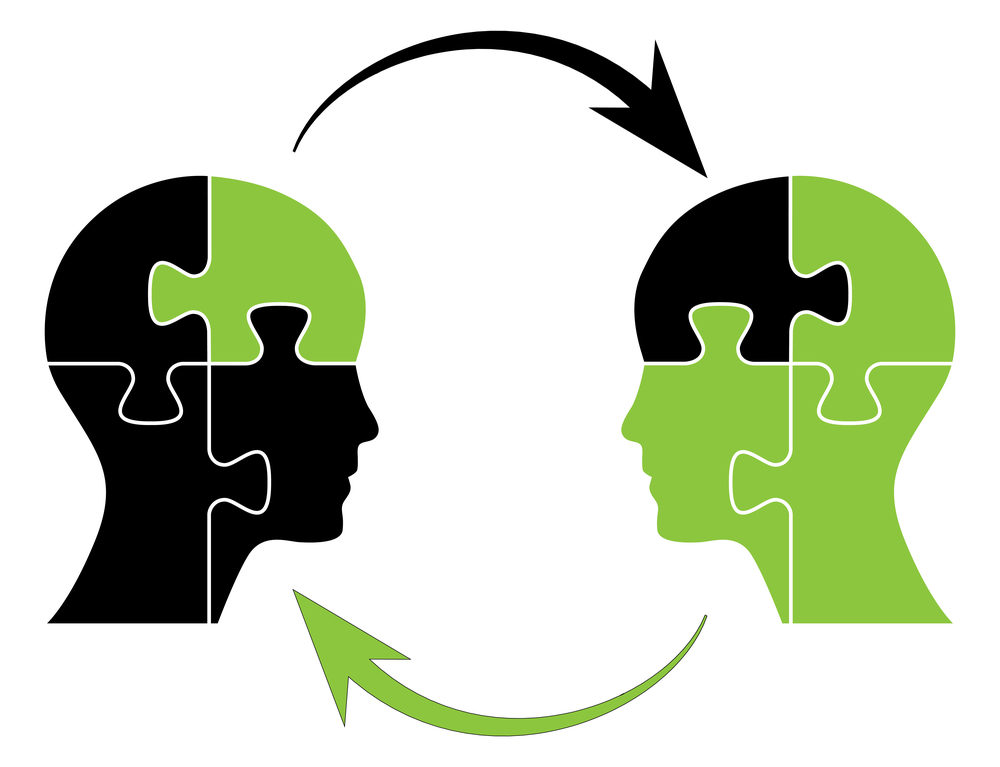

# Build and grow cross-company knowledge

*Culture* is the way a company does things, its processes and values, and how it generates outcomes. It's never easy to build, share, and promote knowledge across a medium-sized organization. That task requires leadership, rules, a strong culture, and having effective systems in place.

I've always been passionate about how knowledge sharing has a multiplier effect on the quality of what each person can deliver. I've seen junior developers, after a just few weeks, deliver higher quality work than what I could have produced years ago - even in a nonchallenging environment and even after years of experience.

## We value shared knowledge

When a new technology emerges, we allocate senior talent to research and transmit this knowledge across the organization. We communicate it through talks, meetups, and specific Slack channels. Over time, the complexity of the discussion starts to rise. We don't just cover specific questions. Our whole company brainstorms around each new engineering problem.

## Problem solving

I'm not a fan of using only specific programming languages or technologies. A fantastic technology applied to the wrong problem can create an even more significant problem. An engineer needs to know many different technologies, their weaknesses, and how to apply the right solution.

When your only tool is a hammer, you'll treat every problem as if it were a nail. You don't need an in-depth knowledge of everything, and you don't need to be a "Jack of all trades." But a basic understanding of different industry technologies is mandatory for a great engineer.

## Mentoring

At Rootstrap, we provide senior mentorship for any new hire, even if that new hire is a senior developer. Newbies need to learn how we work, what our values are, and how they can fit into the company. Then they're 100 percent prepared to give their best and to nurture our company with their knowledge.

## Code tests

Every single line of code we merge must first pass through several filters: static analysis tools, code reviews, and automated tests. Static analysis tools standardize our practices and detect potential problems, bugs, and even cosmetic details. High standards are a must for any company that supports a learning culture. Our standards are often challenged by our team members. This outstanding moment is when significant, high-level decisions take place.

## Code review

Last but not least, code reviews are an essential tool to educate a team on quality and standards. These reviews start conversations around difficult technical problems. We require that every single line of code gets approved by at least two senior members of the team. And we encourage every developer to review code.

## The value of experience

You won't find our level of technical knowledge, processes, and standards at a freelancer or startup. The best companies generate long-term value because of the skill, collaboration, and experience they've built over time. These fully staffed tech services have a proven history of working as a team to create successful products. *That's real ROI*. When you partner with an experienced, established developer, you get the best chance to succeed in this competitive world.

## Our agile standard

To become better professionals, we collaborate, generate discussions between engineers with complementary skills, and create a culture of constructive feedback. When you become our client, you become our partner, and our collaboration includes you.

Throughout my years at Rootstrap, I've had firsthand experience of learning from an agile development process that values the input of our team and our clients. I've watched our corporate knowledge grow exponentially. I look forward to seeing what we can do in the future.