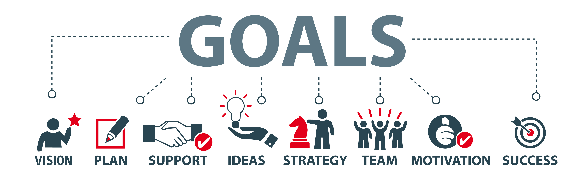

# Building engineering goals

## Our vision
Rootstrap is a digital agency that focuses on web and app development. We’re based in Uruguay and the United States. As a digital agency, our vision is to become globally recognized digital masters. This epithet doesn’t just sound nice. It also means a lot: have one of the most skilled full teams, have people who love where they work, build products our client and their users love, and much more.

### Big growth 
We had exponential growth at Rootstrap last year. Our headcount doubled to more than 100 people. Our biggest department is engineering, with about 70 people. We’re extremely excited about this growth. But no matter how much we grow and change, we won’t lose the pillars of our culture, like taking care of our most valuable asset: people.

### Company goals
Some of our company goals are to keep growing and get more and bigger clients. Our engineering team needs to build its goals to align with the company’s overall vision and goals. For example, engineering delivers products with high-code quality standards but not just because our leaders are obsessed with quality. These standards are part of our vision. They link directly to our business objectives.

## Motivation
Last year, we decided to increase transparency and get clear about our engineering goals. We spent many hours preparing a presentation because we wanted our team to deeply understand our goals. We gave the presentation, and everything went well. We got the team’s attention, and it seemed like they understood and absorbed all the information.

### Progress check
One year is a long time in the digital industry. So we track the progress of our goals each quarter, and we rewrite some of them if necessary. At the end of the year, we officially review our progress. We’d presented our goals at the beginning of the year, and we tried to be as clear as possible. So what could go wrong?

I wouldn’t say that anything went wrong. But in that year, we had a lot of growing to do. We grew up as a team not just in numbers but also in our skillsets. We launched a bunch of amazing new products. Our clients were happy, and most importantly, our team was happy too. And we learned that digital masters move fast, learn from previous experiences, and find opportunities to keep improving. What worked in the past isn’t going to work forever.

## Improvement opportunities

### Increase team engagement
Being transparent with the team about department goals is a must. A good presentation with that info works for that purpose. We encourage our team to raise their hands if they have questions, and we create opportunities to promote their participation.  
But keeping the team involved with company goals is much more difficult. We want them to be engaged. We also want to grow their feeling of ownership for their work and their contribution to the company.

**Our hypothesis.** Building goals after a couple of leader meetings and then giving a presentation to the whole team is a top-down approach. Creating a presentation without the team’s input makes them view our engineering goals as just company goals and not their own. This approach doesn’t generate a feeling of ownership.

**A possible solution.** We need to engage the team in the process of developing company goals. Let their knowledge and experience contribute to deciding the best approach to any engineering problems that might arise.

### Take advantage of our main asset
As mentioned, our team is larger and more skilled than ever before. It’s crucial to build the right engineering goals and thought strategies to face potential challenges. Even with great managers and leaders in our company, not involving our team would be a big mistake.

It might seem obvious, but we need to take advantage of our most valuable resources, our people. We need to involve the team in talks to define our plan for overcoming hurdles and making every project a success.

## A new approach
A new year was coming, and it was time to create new goals. We were anxious to move to the next level by taking advantage of our lessons learned in the last year. But it wasn’t only a matter of involving the team. We also needed a good framework to effectively capitalize on their ideas and make them valuable action items.

We learned two important lessons: 
* Increase team engagement with goals. 
* Take advantage of the company’s main asset, the team.

## World Cafe

A world cafe is a collaborative meeting place for a large group dialog. The whole team discusses strategic topics and possible solutions. In our case, it was a three-hour event. The entire engineering team participated, about 70 people. This meeting wasn’t mandatory, but it was a good sign that everyone was there. This investment might sound big in terms of hours and budget. But after some time passed, we saw that the investment was completely worth it.

### Working framework
Our engineering team includes a range of developers between junior and experienced. Even if they’re all super talented, we still need a solid framework to help and guide them to effective discussions. 

There were six tables at our World Cafe. Each table focused on a strategic engineering topic like code quality. Each team member could spend some time on each table to discuss the topic. The discussion was guided by these key questions:
* What’s the current scenario?
* What’s your ideal scenario?
* What are some action items to move from the current to the ideal scenario?

A working framework is a great way to learn your team’s perspective about many different strategic topics. There are different variations that depend on your team and the objectives you want to achieve. I’ll write more about our World Cafe in an upcoming article.
Our World Cafe was a starting point for gathering team ideas and possible actions. We learned team preferences and built new teams to keep moving forward on our goals during the year.

## Lessons learned

Even when leaders need to set up purpose and direction for the company, it is necessary to involve the whole team into the process. and even more to build possible solutions to achieve those goals.

Our engineering team is eager to participate in more of these activities and to share their ideas. We expected that, and we gathered many new ideas and action items that will be useful this year.

The World Cafe was a great opportunity to increase our engineering team’s business knowledge. Our working framework set up several different limits. For example, we want to improve our code quality but not by delivering products in a ridiculous timeframe. 

Some months after we did the World Cafe, we confirmed our theory: involving the team in building goals generated more engagement. And it increased the team’s feeling of ownership.
