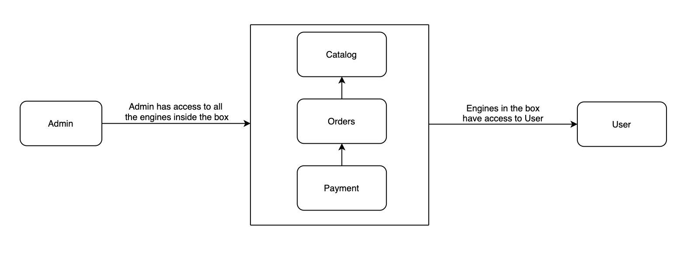
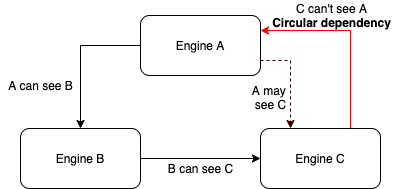
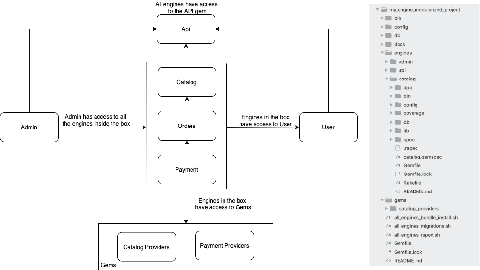

# Building an Engine-modularized API in Rails


When big development teams build an API, one of the main challenges that we face is being able to work together on different features while avoiding bottle-necks or other common issues such as conflicting perspectives or avoid overlapping efforts on particular features.

Because of this, when we started working on our latest project, we decided to work with a new approach; designed to help us to scale by splitting the app into microservices. I recommend taking a look into this article to learn more about the approach we took: [Monolith First](https://martinfowler.com/bliki/MonolithFirst.html)

We knew from the beginning that it wouldn't be easy since this approach is novel and there aren't too many examples regarding APIs built this way. It forced us to think outside the box from the start as we had to devise an approach from the ground up, by using our Rails base project with some common gems and the signup/signin already ready to use.

With all this compiled, we conducted some research, looking for some examples and studying how *engines* work on Rails. Afterwards, we proceeded to the next step: start working on building a modularized API, leaving behind the classic monolithic architecture.

## First steps: Designing the API

Before starting development, it’s crucial to take some time to give a structure to these modules.
The implication is that we must take into account the whole project, and therefore we need to think about how we can separate our application in a way that makes sense to encapsulate certain pieces of code.

In our case, we were working on an e-commerce website, which made us think that some of the larger modules could be the following: catalog, user, orders, payments and admin. Of course this may grow and we are not attached to only using these modules; we may need to add new engines/modules when the app starts growing but at least this will give us the big picture of the app.

Given this, a first picture of the API architecture may look like this:



It may look weird that the engines in the box are the ones that have access to the user engine and not the opposite but when implementing this, we need to have it this way.
To explain this better, let’s take the orders engine as an example:
  * The **order** engine has a model called **purchase**, it represents all the purchases in the system.
  * Each **purchase** belongs to a **customer** (which belongs to the **user** engine) and a **customer** can have many **purchases** in terms of business.

In order to be able to model this properly, we need to add a foreign key to the customer table in the purchases table and because of this, the **purchase** (and so too the **orders**  engine) will, by definition, need to have access to the **user** engine.
This implies two considerations in terms of code:
  1. We can define the `belongs_to` association in the purchase model due to orders engine having access to the user engine.
  2. We won’t be able to have the `has_many` association in the user engine and because of that, if we need to have all the purchases for a user, we will need to define a scope in the purchases model that retrieves that information.


## Building an engine

After going through the first steps, the benefits of working with an API built with engines are already visible. The modules make it easier to split the team and start working on different features at the same time (let’s say: a pair of devs in the catalog, another pair in the admin and a few ones in the user engine).

But it also made us feel uncomfortable as the lack of information, especially in terms of configuration and how to work between engines were a constant issue during the first few weeks.

We decided to implement some scripts that would help us when we created new engines and we also wrote down some guides. At this point the collaboration between our development team was really important to learn how to deal with the engines.

Having said that, the following is a helpful step-by-step guide on what to do when adding a new engine.

The first step, of course, is to create the engine. To achieve that, rails provides a command with some flags:
```rails plugin new engines/engine_name --mountable --skip-test --dummy-path=engines/engine_name/spec/dummy```.
Let’s got a bit deeper on how this command is built:
  * The ```--mountable``` flag means that we want to create the engine inside an isolated namespace.
  * The ```--skip-test``` flag means that we don’t want the engine to include the scaffold for the testing suite as we are going to install rspec.
  * The ```--dummy-path``` is used to define the path where we want to generate the dummy app that "works as the main app" when running the test suite.

Following this, we started by cleaning our engine, removing a lot of unnecessary files, adding some common configuration and copying some files that we need across all the engines.

After building a few engines, we decided to improve our experience and create our own script to create the engine getting some files from an "engine template" and also complete the following forementioned steps.
The script basically does the following:
  * Runs the command to create the engine
  * Removes some unnecessary folders and files
  * Copy some files to the engine, like a generic gemspec with gems that we use in all the engines. I.e: rspec, rails, pg, rubocop, etc.
  * Installs rspec
  * Runs bundle install and remove some new unnecessary files
  * Copy a generic version spec_helper, rails_helper.
  * Rename/adapt some filenames to the standard that we are following.

The script looks like this:
```Ruby
task :generate_engine do
  # Get name sent from console
  name = ENV['name'].downcase

  # Store useful paths
  engine_path         = "engines/#{name}"
  dummy_path          = 'spec/dummy'
  lib_files_path      = 'lib/tasks/files'
  dummy_relative_path = "#{engine_path}/#{dummy_path}"

  # Generate the new mountable engine with a dummy under 'spec/dummy' path
  sh "rails plugin new #{engine_path} --mountable --skip-test --dummy-path=#{dummy_path}"

  dummy_folders_to_remove = %w[app bin lib storage public log tmp]
  dummy_files_to_remove = %w[package.json Rakefile]

  dummy_folders_paths = dummy_folders_to_remove.map { |folder|
    "#{dummy_relative_path}/#{folder}"
  }.join(' ')

  dummy_files_paths = dummy_files_to_remove.map { |file|
    "#{dummy_relative_path}/#{file}"
  }.join(' ')

  # We copy the Gemfile, Rakefile and Gemspec files from our files folder to the engine
  puts '------Copying rails files------'
  sh "yes | cp #{lib_files_path}/generic.gemspec #{engine_path}/#{name}.gemspec"
  sh "yes | cp #{lib_files_path}/Gemfile #{engine_path}"
  sh "yes | cp #{lib_files_path}/Rakefile #{engine_path}"
  sh "yes | cp #{lib_files_path}/lib/engine/engine.rb #{engine_path}/lib/#{name}/engine.rb"

  # Copy our rake tasks for the engine
  puts '------Copying rake tasks------'
  sh "yes | cp #{lib_files_path}/lib/tasks/install_rspec.rake #{engine_path}/lib/tasks"

  # We replace "EngineName" place holder with the correct engine name
  puts '------Adapting system files------'
  sh "sed -i '' 's/EngineName/#{name.classify}/g' #{engine_path}/Rakefile"
  sh "sed -i '' 's/EngineName/#{name}/g' #{engine_path}/Gemfile"
  sh "sed -i '' 's/ClassifiedEngineName/#{name.classify}/g' #{engine_path}/#{name}.gemspec"
  sh "sed -i '' 's/EngineName/#{name}/g' #{engine_path}/#{name}.gemspec"
  sh "sed -i '' 's/ClassifiedEngineName/#{name.classify}/g' #{engine_path}/lib/#{name}/engine.rb"

  # Install
  puts '------Installing gemfile and rspec------'
  sh "BUNDLE_GEMFILE=#{engine_path}/Gemfile bundle install"
  sh "cd #{engine_path} && rake install_rspec"

  # We remove unnecessary files
  puts '------Removing unnecessary files------'
  sh "rm -rf #{dummy_folders_paths}"
  sh "rm #{dummy_files_paths}"

  puts '------Copying rspec helpers------'
  sh "yes | cp #{lib_files_path}/spec/spec_helper.rb #{engine_path}/spec"
  sh "yes | cp #{lib_files_path}/spec/rails_helper.rb #{engine_path}/spec"
  sh "yes | cp #{lib_files_path}/spec/helpers.rb #{engine_path}/spec"

  puts '------Adapting helper files------'
  sh "sed -i '' 's/ClassifiedEngineName/#{name.classify}/g' #{engine_path}/spec/helpers.rb"

  puts '------Engine generated successfully------'
end
```

I won’t go deeper on which files we removed or we added as this may change according to the needs of each project but I would like to mention a few configurations that are needed to make this work properly and are going to save you a couple of headaches.

  1. Related to the migrations, we want each engine to have it owns migrations files, to achieve this we added the following block of code in lib/engine_name/engine.rb:

```Ruby
initializer :append_migrations do |app|
  unless app.root.to_s.match? root.to_s
    config.paths['db/migrate'].expanded.each do |expanded_path|
      app.config.paths['db/migrate'] << expanded_path
    end
  end
end
```

So, with this code we are telling Rails to look for new migrations in the db/migrate folder that belongs to the engine.

  2. We want to be able to define a routes file in each engine and have the ability to have access to those endpoints from the main app. An easy way to achieve this and keeping it generic, is adding this piece of code in the routes.rb in the main application

```Ruby
Dir.glob(File.expand_path('../engines/*', __dir__)).each do |path|
  engine = File.basename(path)
  mount engine.classify.constantize::Engine, at: '/'
end
```

This is iterating over the engines directory and mounting the routes of each engine.

  3. A similar approach is taken to load all the engines in the gemfile in the main application.

```Ruby
Dir.glob(File.expand_path('../engines/*', __FILE__)).each do |path|
  engine = File.basename(path)
  gem engine, path: "engines/#{engine}", require: (ENV['ENGINE'].nil? || ENV['ENGINE'] == engine)
end
```

By creating the script and adding these configurations into the main application, we were able to simplify a lot of the processes to add new engines and we ensured that all the engines are going to follow the same standard.


## Developing and testing a feature: considerations and tips

Now that we have gone through all this process that may seem extra thorough at the beginning, we are ready to start.
At this point, if everything is ok, there shouldn’t be many problems or inconveniences as we are going to be doing pretty much what we already used to do while developing features in Rails.

There are still a few considerations related to how engines work that are worth mentioning:
  * An engine works like a library, so when adding dependencies in between, we must take care to avoid circular dependencies. This means that if we have the engines A, B and C; if the engine A can see B and B can see C, then A may be able to see C but C shouldn’t be able to see either B or A.

  

  * Following on from this, when adding a dependency between engines, we need to add this one into the gemfile that belongs to that engine, not the gemspec. We will also need to add the engines that the other engine has as dependencies too.
  * When installing a new gem, in order to be able to use it across the whole engine, we should require it in lib/engine_name.rb
  * As a result of the engine namespace models, services, controllers and even the tables in the database will be namespaced too.
  * Some tips I suggest:
    * Create an engine that is visible in all the engines across the application. This engine will help us to reduce repeated code and may contain things that we want to use in all the engines. In our case, we have an engine called Api that handles all the requests validations (checking headers, render some common errors, etc) and all the main controller from other engines inherit from a controller located in the Api engine
    * Create “libraries” that work as interfaces between our API and external services. I.e: In our case we have a gem called Catalog Providers and inside it we have services for each provider that we use in our system (like Target, Amazon, BestBuy)
    * It might be useful to create a few scripts to run migrations, run rspec or bundle install across all the engines. The scripts will iterate over the engines folder and run the command inside each one.
  * Finally, it's worth to mention two ways to handle the escenario where we need to trigger an action in an engine where we don't have access from the engine we are currently working:
     * Using an async pattern like queue with pub/sub where the element that is running publishes a message in the queue and the element that is responsible of running the desired triggered action is subscribed to that queue and reads any message to know which action has to take.
     * The other pattern that works fine is implementing an observer pattern, in our application we followed this pattern as Rails already has a good implementation of it for ActiveRecord. This pattern works by having classes called observers that are responsible of beware of any action happening in the "observed class" and trigger actions depending on what action was taken in the followed class.

Using the **User** and **Payment** engines where **Payment** can access to **User** but **User** can't access to **Payment** to avoid having a circular dependency, let's see step by step how we implement the **observer pattern** in our application:

1. Create an observer class inside our models folder in the **Payment engine** as we want to trigger an action in this engine as a consequence of an action in the **User** engine.

2. Set up the observer in the **engine.rb** file by adding the following line:
 ```Ruby
 config.active_record.observers = :'payment/user_customer_observer'
 ```

3. Implement your observer, we need to specify in which model we want to observe and implement an action according that behave similar to a callback in ActiveRecord. It might look like this:

```Ruby
module Payment
  class UserCustomerObserver < ActiveRecord::Observer
    observe User::Customer
    attr_reader :customer

    def after_update(customer)
      customer.update!(payments: customer.payments + 1)
    end
  end
end
```

4. Finally, if you want to disable observers while running **rspec**, you can add this line in your test suite as a before action:
```Ruby
ActiveRecord::Base.observers.disable :all
```

On the other hand, testing inside an engine with a rspec it’s quite similar to what we are used to doing and it provides us with some guarantees and the only considerations that took us some time are:
  * We will need to load manually factories from other engines when using FactoryBot in our engine
  * We need to require in our rails_helper.rb any development dependency that we are using in our test suite

After developing a feature, one of the advantages that we found out about working with engines is that we can just run the test suite for the engine where we have been working on without the necessity to go through all the suite tests in the application. This reduces the time to run tests locally dramatically.

The API architecture and the project structure will look something like this:



## Summing up

It’s been a while since we started working with this project structure. Right now we are at a point where we can already look back and find the pros and cons of making this particular decision:

**Pros:**
  * Helps to parallelize work when working with medium-sized development teams.
  * Makes the code more organized and easier to read or find where a feature should be implemented.
  * The possibility to run tests inside an engine scope reduces time when testing locally.
  * A modular application like this is a mid-step between a monolith API and microservices.
  * Possibility to pick a full engine and use it in another API. We did this with our catalog engine and an admin that we develop in another project.


**Cons:**
  * Lot of configuration and changes are needed when starting working with engines, requires a bit of time during the first weeks.
  * Lack of information on the internet, building an API with engines doesn’t seem to be a popular choice.
  * Despite our effort to avoid repeating code, we still repeat more code than when working in a monolith api

After overcoming the initial learning curve, we feel quite comfortable working with engines and we found out the benefits of having chosen this architecture instead of a monolith one, so I think that I would use it again if it fits the project requirements. In spite of that, we still have a lot to learn and improve upon what we already did.

As a pending feature, we would also like to see how we could take advantage of this architecture and try to deploy our application into microservices; of course that implies some changes will need to be made but it would be a valuable achievement.

## Learning about engines and references

When we started our investigation on how to build our application, we learn a few things from this medium post: [The Modular Monolith: Rails Architecture](https://medium.com/@dan_manges/the-modular-monolith-rails-architecture-fb1023826fc4)

To learn more about engines, the [Ruby on Rails official documentation](https://guides.rubyonrails.org/engines.html) is a good follow-on reading.


