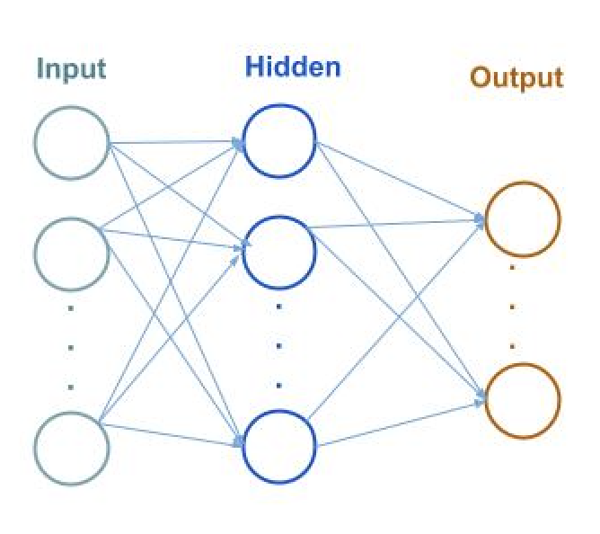
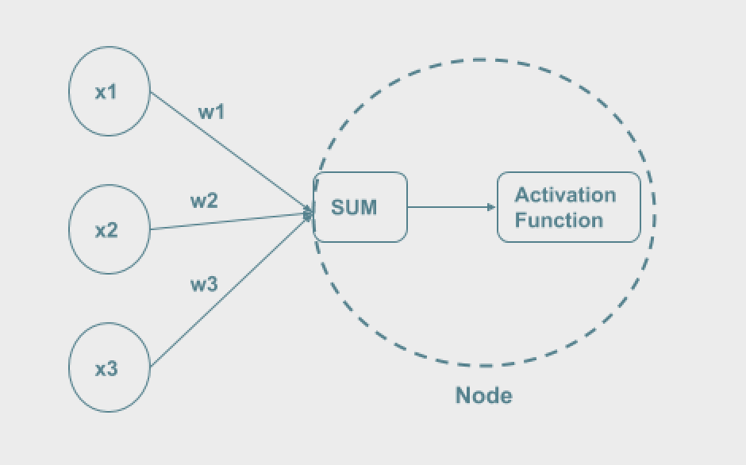

# Clustering Analisis and Neural Networks

The most popular methods in machine learning clustering and neural networks. While clustering can help you find groups in your data, neural networks let you perform complex models in a few lines of code. There exists different types of methods inside these two categories. In this article, some of the most common types are described.

## Clustering Analysis
[Clustering Analysis](https://towardsdatascience.com/clustering-based-unsupervised-learning-8d705298ae51) involves unsupervised algorithms that try to discover groups in the dataset. It divides the population into dissimilar groups, where the members of the group are related or are similar to the other data points in the group. Some of the existing clustering methods are described below.

### K-means
K-means tries to find the split of n data points into *k groups*. The goal is minimizing in each group the sum of squares (WGSS) for all variables.

 
%5E2)        
q=number of variables      
k=number of groups      
G=groups       
 is the mean of the members of the group  for the variable j.

This method is based on **distance**, therefore what it is trying to minimize is the distance between the points to the centroids. The centroids are the “middle” points for each cluster. The algorithm starts with randomly selected centroids and in each iteration, which are used as beginning points for each cluster. In each iteration, it recalculates the position of the centroids. The iterative process finishes either when the centroids do not change or when the maximum number of iterations is reached.

**Scree plot:** To determine the number of groups, a plot that shows the heights for the clusters can be used and search for the drop out point. In this example, the drop out point is 4, therefore 4 clusters will be chosen. This method to find the number of clusters is called the **elbow-test**.

   
     
**Some observations:**     
- As it is based on the distance between data points, the standardization of the data is important.     
- It only works to put the observations into groups, it does not work to put the variables into groups.     
- Different clusters can be arranged when using different random seeds.

### Hierarchical Clustering
This method establishes a hierarchy between data points based on the distance between the points. It generates a tree structure to represent the hierarchy.    

Generally, hierarchical clustering is divided into two categories according to the direction of the tree:
Agglomerative: bottom-up, each individual observation starts as a cluster, which are grouped into bigger clusters while moving up through the hierarchy.
Divisive: top-down approach, all the observations start in a unique cluster, which is split into smaller clusters while moving down through the hierarchy.    

**Distance matrix:** To compare data points based on the distance between them. Different metrics can be used to measure the distance between the data points: Euclidean, Manhattan, Mahalanobis, etc. The input for the method is the distance matrix.      

**Linkage:** refers to the logic used for comparing the distance between groups. 3 main types are used:
Single: chooses the smallest distance between 2 groups
Complete: chooses the maximum distance between 2 groups
Average: chooses the average distance between 2 groups.    

**Observations:**.   
- Uses the distance matrix, not the data.    
- It is difficult to know which linkage is the best. 

**Mean-shift:** it is another type of hierarchical clustering algorithm. It uses a window which is placed around the point. Calculates the center of the window based on the means of the points. It repeats the process until all the points are covered.  

### Model based 
This model divides the data into clusters, where the data within each cluster comes from the same distribution. The main idea is to estimate the parameters of the original distribution. The original distribution is a combination (mixture) of components, each component is described by a density function and has a probability associated.    

**Metrics-model selection:** in order to choose the best model, it measures the [BIC](https://medium.com/@analyttica/what-is-bayesian-information-criterion-bic-b3396a894be6) (Bayes Inf. Criteria). It represents the trade-off between the simplicity and quality of the model. It is determined by the following formula:    
  
$$BIC = L - 0.5(number\space of\space parameters)(log\space n)$$.    
  
  
Largest BIC is the best. Where L is the likelihood function and n the total number of observations.  
 
### DBSCAN
Based on a set of points, [DBSCAN](https://www.geeksforgeeks.org/clustering-in-machine-learning/) method groups points close to each other. In order to determine if a point belongs to the cluster or not, it uses a threshold. Two points are considered close to each other if the distance between them is less than that threshold. In addition to the threshold, the model depends on another parameter which determines the minimum number of points in a group to be considered as a cluster. 

### Fuzzy clustering 
[Fuzzy clustering](https://www.statisticshowto.datasciencecentral.com/fuzzy-clustering/) is a type of clustering where each data point can belong to multiple clusters. Each point has associated a membership level, which determines at what degree the point belongs to the cluster. 

## Neural Networks
A neural network consists of many nodes connected between each other, which pass information between them. The term refers to the neurons of the brain. A neural network consists of a sequence of layers, where each layer applies a function to the input parameters and returns a value. A layer contains several nodes, the function is applied in all the nodes of the layers, and the result will be the input for the following layer.    

     
     

**Definitions**        
* Input layer: it is the first layer.  
* Output layer: last layer of the network.   
* Hidden layers: layers that are between the input and output layer.         
* nodes/neurons: points where the function is applied.       
* Activation function: function that is applied in each of the nodes for the layer.     
* Weights: each node is connected to other nodes from another layer by a communication link, that has associated a weight.      
* Forward propagation: the input is propagated through one layer of the network to another layer. This process can be computed by applying matrix multiplication followed by an element-wise operation.     
* Backpropagation: consists of adjusting the weights based on the error measured by the loss function.   
* Learning algorithm (optimizer): process that the algorithm uses to learn.    

The input for each of the nodes is calculated by a sum of weighted values.
For example, a node has 3 inputs $$x1,x2,x3$$, with weights $$w1,w2,w3$$. Therefore, the input value would be $$x1*w1+x2*w2+x3*w3$$. This is the input of the activation function. The result would be the output value of the layer and an input value for the following layer.  

     
     
### Types of activation function

An activation function is a mathematical function that is responsible for determining the output for each layer.    

The most common activation functions are:    
1. **Step function:** it is based on a condition over a threshold. (if x>threshold then activate). It is a binary activation because the result indicates if it should be activated or not.  
2. **Linear:** it gives, as a result, a range of activations. It is represented by a linear functiony $$x*c$$. Where c (the input) is multiplied by c(a constant), so the output is a value which is proportional to the input.       
3. **Non-linear:** this type of activation function allows the creation of more complex transformations that can improve the learning of more complicated datasets. Provide the advantage that backpropagation can be performed, because the function has a derivative. The most common non-linear functions are:     
3.1. Sigmoid: the outputs are normalized between 0 and 1.  
3.2. Tanh: the outputs are between -1 and 1.   
3.3. Relu: the outputs are transformed to 0 if the value is lower than 0, if not the original value is returned.   

## Types of optimizers

The main purpose is to minimize or maximize the cost function by choosing the best parameters. This method is based on the derivative that shows if the function is decreasing or increasing at a certain point. It uses a gradient that contains derivatives for a function that depends on more than one variable. The gradient is represented by a matrix (Jacobian Matrix) which contains the partial derivatives. The optimizer updates the weight parameters to minimize the loss function. 

Different types of Gradient Descent exists:    
1. Batch Gradient Descent: calculates the error for each data point in the training set. Once all training data points are evaluated, it updates the model parameters. This process corresponds to an iteration (epoch). When the dataset is large it is very slow.   
2. Stochastic Gradient Descent: calculates the error for one data point in the training set and updates the parameters right after.     The frequent updates might make the training error rate fluctuate more slowly.   
3. Mini batch Gradient Descent: is a combination of batch and stochastic, it divides the training set into smaller batches. Then, it evaluates and updates the parameters for each data point.     
    

When using the Hessian method for minimizing or maximizing the loss function, the matrix contains 
the second order partial derivatives. The second order derivative shows if the first derivative is decreasing or increasing at a certain point. 

## Types of networks
When a network contains only one hidden layer is called **Neural Network**. When it is more complicated and contains more hidden layers is called **Deep Neural Network**.        
Here are described other variations of neural networks.           
      
**Fully connected networks:** a network is fully connected when all nodes are connected with all the neurons in the following layer. 

     
     
            
**1. Feedforward neural network:** is a neural network where the connections between nodes do not form a cycle or loop. The information goes from the input layer through the hidden layer until the output layer.

  

**2. Recurrent neural networks:** in contrast with a normal neural network, the outputs values depend on past outputs. A specific type of recurrent neural network is Long-short term memory (LSTM) that can process sequences of data points. Usually used for speech recognition. 

**3. Convolutional neural networks (CNN):** it is a specific type of deep neural network, commonly used for image analysis, it uses convolution as matrix multiplication. Convolution is a mathematical operation between two functions, it takes the reverse and shifts to one of the functions, and then calculates the product. Finally, the integral of the product is calculated. CNNs in addition to convolutional layers, need pooling layers to reduce the dimension of the image summarizing the presence of features.

**4. Autoencoder:** it is a neural network where the amount of inputs is the same as the outputs. The network tries to create a reconstruction of the input data by compressing it into a lower dimension, and then generating an output which is the reconstruction from the compression. An autoencoder has 3 parts: encoder (compressor of the inputs), code (output of the compression) and decoder (reconstructor from the compression). It can have one or more encoders and decoders (hidden layers). The code (the compression) should be the output of the middle layer and can be of any size smaller than the original input size. It is used for anomaly detection based on the comparison of the reconstruction error against a threshold. 

  
     
[**Generative adversarial networks (GAN):**](https://blog.dominodatalab.com/category/machine-learning/) uses two neural networks, the generative (which generates possible new instances) and the discriminative networks (evaluates the new instances for authenticity).       

**5. Multilayer Perceptron (MLP):** each of the nodes is a neuron that applies a nonlinear activation function.

