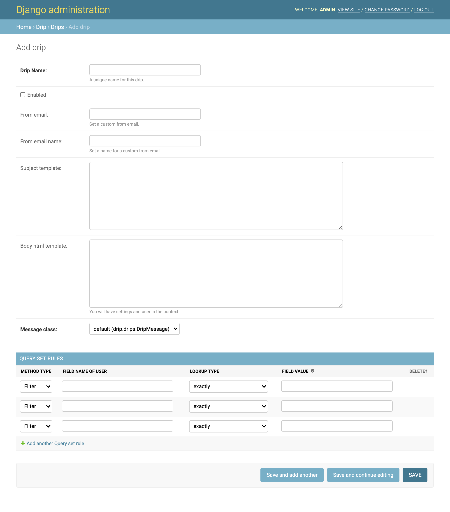
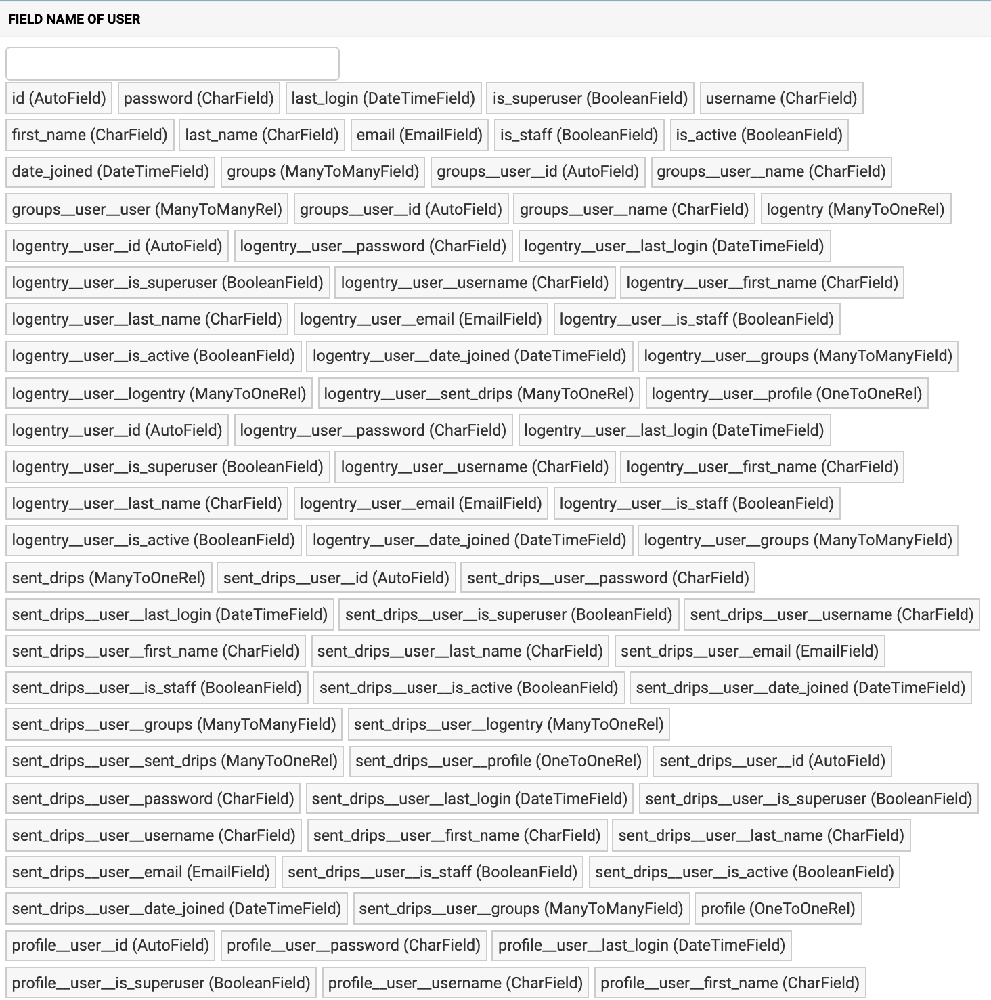
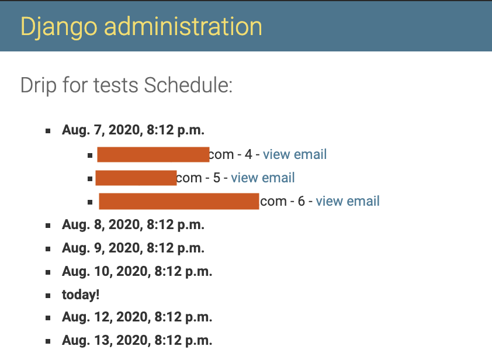

## Contributing to open source: An overview of the django-drip-campaigns project

At Rootstrap we work with many initiatives, one of them is the Open Source one. The main goal in this case, is to analyze, maintain and develop open source software (OSS). In this blog post I'm going to talk about a particular project named Django Drip Campaigns and how was the process of publishing it as a [pypi](https://pypi.org/) package.  
Pypi (that stands for Python Package Index) is a repository of software for the [Python](https://www.python.org/) programming language that helps us find and install software developed by the Python community. One of our contributions to the OSS community is to publish and maintain the mentioned project and I want to share that experience in this article.

### The Django Drip Campaigns Project

Django Drip Campaigns Project is an open source app to create drip campaigns for email using [Django’s admin](https://docs.djangoproject.com/en/3.1/ref/contrib/admin/) interface and a User queryset. This means that using this app, you are able to easily schedule and send emails to the registered users, creating querysets in a friendly interface.  
For example, you can very quickly configure your app to send a periodic email to the users that haven't logged in in a day or more, send a custom email to the users that registered more than a week ago, etc. To do this, you only need to define one or more querysets in the admin page.
If you want to install it and work with it, you can follow the simple steps documented in [the github page of Django Drip Campaigns](https://github.com/rootstrap/django-drip-campaigns).  
We didn't create this project, we just made a fork of the one written by [Zapier](https://zapier.com/z/qO/) that is no longer maintained. After this, we worked on fixing some bugs, doing a couple of enhancements, creating more documentation and publishing the app as a pypi package.  
Since it's published, any programmer that wants to use this project in his django app is able to quickly download it with a simple command described in the mentioned docs.

### Features

After a successful installation and configuration, you are able to easily create drip campaigns for email using the admin interface of Django. If you don't have an admin user, create one with the [django createsuperuser command](https://docs.djangoproject.com/en/3.0/intro/tutorial02/#creating-an-admin-user). After this, login into Django's admin page and click on `Drips` to manage them. There you are able to:

- View created and sent drips.
- Create a new drip.
- Select and delete drips.

#### Creating a new drip

Click on the `ADD DRIP +` button to create a new drip. You will see a page like this:



In the next section I will talk about the queryset rules that you can build in an easy way to create very useful drips.

#### Queryset rules

When you create a drip, you need at least one queryset so the users in it will be the ones that receive the defined email. In the `METHOD TYPE` menu you are able to choose to filter or to exclude the users in the defined queryset.  
On the other hand, when you click in the `FIELD NAME OF USER` input, you will see the fields of your User model, and the fields of your user model in the models related to it:



In the previous image, for example, `last_login` is the field in the User model, and `groups__user__id` is the user id from the Groups model that is related to it. So you can enter the name of the field or select it from the list that you see when you click on the input.  
After the selection of the field name, you have to choose the type of lookup that you want to do over the field. The possibilities are `exactly`, `exactly (case insensitive)`, `contains`, `contains (case insensitive)`, `greater than`, `greater than or equal to`, `less than`, etc. This lookup type will be done over the user field and the `FIELD VALUE` that you enter.  
The `FIELD VALUE` input can be a string, a number, or a regular expression. The correctness of the queryset rule will depend on the type of the user field, the lookup type, and the field value.  
When you enter a user field that has a date type, Django Drip Campaigns allows you to enter a date value in natural language combining the current time and some operation with seconds, hours, days, etc. For example, if you have selected the field `last_login` that has a date type, and you want to create a drip to send emails to the users who logged in exactly one week ago; you can enter:

```
now-1 week
```

or

```
now- 1 w
```

Possible operations and values:

- Add (`+`) or subtract (`-`) dates.
- On the left side of the operation, write the current datetime value: `now`.
- On the right side of the operation:
  - `seconds` or `s`.
  - `minutes` or `m`.
  - `hours` or `h`.
  - `days` or `d`.
  - `weeks` or `w`.
  - If you enter the number `1`, you can write `second`, `minute`, etc.
  - Don't enter a space between `now` and the operation symbol. Optionally you can add (or not) a space around the number value.

Let's see some examples of the date values that you can enter:

- `now-1 day`
- `now+ 8days`
- `now+ 1 h`
- `now-4hours`
- `now- 3 weeks`
- `now-1 weeks`

To finalize this subsection, I would like to show you two examples to clarify the queryset rules creation:

- Send a recordatory email to the users that haven't logged in for a week or more:
  - method type: `filter`
  - user field: `last_login`
  - lookup type: `less than or equal to`
  - field value: `now- 1 week`
- Send an email to the users that have a gmail account, excluding the ones that registered yesterday:
  - Rule 1:
    - method type: `filter`
    - user field: `email`
    - lookup type: `contains`
    - field value: `gmail`
  - Rule 2:
    - method type: `exclude`
    - user field: `date_joined`
    - lookup type: `exactly`
    - field value: `now- 1 d`

As you can see, the queryset rules creation is very powerful and for each drip you can add as many as you want.

#### View the timeline of a drip

In the django admin, you can select a drip and then click on the `VIEW TIMELINE` button to view the emails expected to be sent with the corresponding receivers:



#### Message class

By default, Django Drip creates and sends messages that are instances of Django’s `EmailMultiAlternatives` class. If you want to customize in any way the message that is created and sent, you can do that by creating a subclass of `EmailMessage` and overriding any method that you want to behave differently. For example:

```python
from django.core.mail import EmailMessage
from drip.drips import DripMessage

class PlainDripEmail(DripMessage):

    @property
    def message(self):
        if not self._message:
            email = EmailMessage(self.subject, self.plain, self.from_email, [self.user.email])
            self._message = email
        return self._message
```

In that example, `PlainDripEmail` overrides the message property of the base `DripMessage` class to create a simple `EmailMessage` instance instead of an `EmailMultiAlternatives` instance.

In order to be able to specify that your custom message class should be used for a drip, you need to configure it in the `DRIP_MESSAGE_CLASSES` setting:

```python
DRIP_MESSAGE_CLASSES = {
    'plain': 'myproj.email.PlainDripEmail',
}

```

This will allow you to choose in the admin, for each drip, whether the `default` (`DripMessage`) or `plain` message class should be used for generating and sending the messages to users.

#### Send drips

To send the created and enabled drips, run the command:

```
python manage.py send_drips
```

You can use cron to schedule the drips.

### What we have been doing in the project

As I said, we didn't create this project. We forked it and started to make some fixes and improvements. The first thing we did was to upgrade the used Django version. Now it has django 3.0.7.  
Besides we started to create the documentation with [Sphinx](https://www.sphinx-doc.org/en/master/) to have this project in [Read the Docs](https://readthedocs.org/) in the future.  
Another enhancement was to add [flake8](https://flake8.pycqa.org/en/latest/) to enforce the use of style guides in the code. Finally we added an integration with [travis-ci](https://travis-ci.com/) to have a continuous integration service on any change in the project.  
We registered and fixed some issues such as the view of the User fields, and configuration problems to run the app locally. There are some issues to address and discover yet so if you like OSS you are more than welcome to work with Django Drip Campaigns.  
In the open source initiative we wanted to publish this app as a pypi package, so I'll explain this a little more in the next section.

### Publish a pypi package

Despite Django Drip Campaigns is still a work in progress, we already published the package in PyPI. It's nothing fancy, but it's a must to know a few things before starting, so in this section, I'll be talking about the main steps for publishing an app.

- Project structure: Your project needs a couple of files in a determined place to be published correctly. An appropriate structure could be:

```
root_project_folder/
  |
  |__ docs/    # Documentation files
  |__ project_folder/  # Code of the app
  |__ AUTHORS.md
  |__ LICENSE.txt
  |__ MANIFEST.in
  |__ README.md
  |__ setup.py
```

- AUTHORS: Specify the author's information of your project in this file.

- LICENSE: You have to specify the license of the project. That is a document that provides legally binding guidelines for the use and distribution of software. In OSS the most known are [BSD](https://en.wikipedia.org/wiki/BSD_licenses) and [MIT](https://en.wikipedia.org/wiki/MIT_License). We used an MIT license in this case.

- MANIFEST: Here you can specify the files that aren't programming files but you want to include anyway in the build of your project. For example the authors file, the docs, etc.

- README.md: A file where you introduce and explain your project. It's very important because otherwise you can have a very good and useful project but if new people see it and don't understand what it does nor how it works, then it won't be used.

- setup.py: This is a fundamental file. It contains a global `setup` function that is in charge of the building and configuration of your project at the moment of the installation.

- docs folder: Here is where the files of the documentation are.

You can see examples of the described files in the [django-drip-campaigns github page](https://github.com/rootstrap/django-drip-campaigns). Of course your project can have other files, the ones mentioned are the most important to publish a pypi package.  
Having all set and ready to be published, you need now to [register in the pypi.org page](https://pypi.org/account/register/). After you are registered, go inside the terminal to your project folder and follow these steps:

1. Install `setuptools` and `wheel`. They are used to generate the distribution package: a group of files needed to upload your app.

```
python3 -m pip install --user --upgrade setuptools wheel
```

2. Generate the distribution package. The next command will create all the necessary files under a `dist/` folder:

```
python3 setup.py sdist bdist_wheel
```

3. Install [twine](https://packaging.python.org/key_projects/#twine), that a allows you to upload your app as a package:

```
python3 -m pip install --user --upgrade twine
```

4. Once installed, run twine to upload the archives under `dist/`. This will ask for a user and a password, that are the ones you used on the registration at pypi:

```
python3 -m twine upload --repository pypi dist/*
```

If everything went well, you have published your project as a pypi package. Now you anyone is able to download it with:

```
pip3 install <project-name>
```

### Summary

In this blog post I talked about the Django Drip Campaigns project, its main features and what we did with it at Rootstrap. We love to make contributions to OSS because it's a wonderful way of learning, of sharing knowledge, and creating useful programs to be used by other programmers.  
Besides I talked about the experience and how to publish a project as a pypi package so anyone who wants to give it a try can download it with a simple command.  
OSS gives a great opportunity not only to see how some other group of people solves a problem addressed by the program, but also to purpose and contribute with fixes and improvements. Finally, I hope you have enjoyed this blog and feel motivated to use and work with Django Drip Campaigns and to contribute with OSS.
