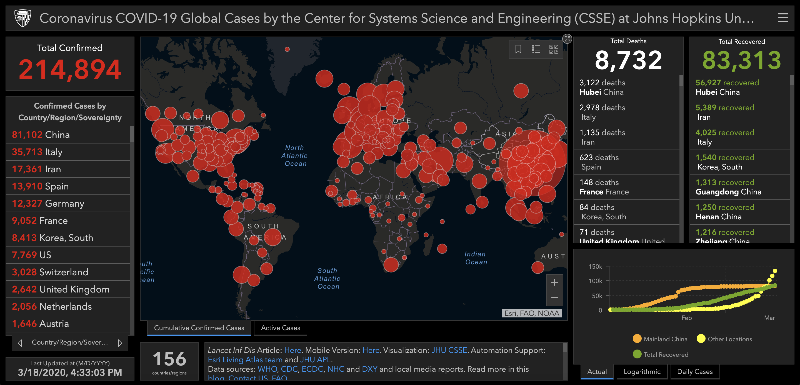

# Coronavirus, Psychology, and Data Science

As a young adult, I’m not as concerned about how the virus can affect my own health. However, I am, and must be, extremely concerned about how I can be another node in the graph, and contribute indirectly to the suffering of populations at risk. 

As a business person, I am also a bit concerned about my own business. I think that the technology sector will suffer, as any other business, but it’s also a great opportunity to create value in areas like healthcare, telemedicine, e-learning, among others. Similar to personal health issues, I’m also a little bit concerned about myself (and my business) but very concerned about the globe’s overall economic health. The most affected areas will likely be hospitality and tourism, but a lot of businesses will have to innovate and thrive to survive. 
**Potentially millions will lose their jobs, or life-savings, which poses a great risk to a number of people.**

As a scientific person,  I’m intrigued about all the data that is being collected during the outbreak, as well as all the behavioral experiments that are taking place naturally. It has a huge cost. Thousands of lives, and millions of businesses will go bankrupt. However, if we are smart enough, we’ll learn much more about outbreaks, society at large, and how we can prevent future pandemics from having the catastrophic impact that we are seeing now. 

**We, as technology builders, can come together to solve the hardest problems of our time.**

We as a species have been given the greatest responsibility of our time. We are facing an immense challenge but the insights and data that we gain will set us up, not only to tackle the current pandemic, but also future outbreaks to come.

It’s time to step up. 
It’s time to up our game. 
It’s time to learn.

## Psychology
The goal of this article is to explore psychological conditions and biases that became evident during the outbreak. 

Let’s start with the most noticeable problem. 

### Toilet paper bulk-buying
Ok, it’s a very important item, but was the bulk-buying necessary?

The panic buying of toilet paper transcended borders and cultures. There is something in there. Our panic button is hard wired with our desire of stocking large quantities of toilet paper. 

In my opinion, there are three main traits in play here:

First, our evolutionary psychology is dictated by an **illusion of control bias**. If the government is telling us to stay at home, and wash our hands, it sounds like it’s not a lot to ask. 

But people, naturally, want to take initiative and steps to feel safer since a situation is threatening their lives. Marketing, unfortunately, contributes to this trait by giving us an illusion of safety through consumption. This feeling is hard-wired, implicit for our very survival, and doesn’t dissipate easily. Through stockpiling, we feel that we are taking the steps to be prepared.

The illusion of control bias is derived from our perception that we can control or influence outcomes. While this can be done on a mass scale, with many millions of people all taking the same action, a single individual can unfortunately not affect outcomes of a macro nature. This bias has been documented to affect health, investments, businesses, etc. It’s strongly related to the well-known “Gambler’s fallacy”, where participants are shown to throw dice harder when they require a high number and softer when they require a small number. Dice velocity has no effect on the number rolled, but subjects still believed that they had control over the outcome depending on how they threw the dice.

Related to this bias, we can also identify the **Zero risk bias**.
By eliminating one risk entirely, we reduce the amount of cognitive strain we face, making the option to reduce that risk more appealing. Some people will choose to reduce this risk, even if not eliminating that risk would, ironically, reduce the total risk they face by a greater factor. Stocking up on toilet paper is a relatively cheap action that tells our feedback mechanisms that we are taking action.

Second, there’s evidence that suggests that there is a very strong correlation between **fear** of getting infected and **disgust**. Toilet paper is a tool for eliminating waste that we find undesirable. Disgust is like an alarm mechanism that warns you to avoid some form of contamination.

Lastly, we need to investigate **herd behavior**. Humans are social beings and it’s no surprise that we have a tendency to follow the crowd. In evolutionary terms, this kept us protected by ensuring safety in numbers. It’s been observed in multiple scenarios: sporting events, stock market bubbles, and religious gatherings.  The interesting thing about toilet paper is that it’s big and bulky, and you can easily notice when other people are buying it, or when the shelves are empty. As the shelves start to empty, toilet paper begins to acquire an increasing psychological value for people. If you ask shoppers’ motivation for bulk-buying toilet paper, they’ll say that everyone else is doing the same. 

Bottom line, the bulk-buying of toilet paper can be attributed to an aggregation of different biases and behaviors: illusion of control, zero risk bias, our primitive reaction to fear and disgust, and herd behavior. 

### What can we learn from Italy’s response
Italy’s response to the outbreak serves as a warning to the rest of the world. It quickly became out of control with exponential compounding rates.  Moreover, it became the biggest hub in spreading the disease to Europe and the Americas. 

Are the Italian citizens to blame? Is the Italian government the big villain? No. 

Biologically, our brain is a pattern detection machine. The most complex that we know. We spend a good part of our existence detecting patterns. We can even detect patterns where they don’t exist (**Pattern-Recognition Bias**) like seeing the figure of Christ on a slice of toast. This outbreak brought an unprecedented situation to our lives. 

While society and the governments struggled to find the best way to react, the unfortunate truth was they didn’t have a reference point. They weren’t able to examine past situations and evaluate what worked and what didn’t work. The Covid-19 outbreak and the society upon which it was afflicted are fundamentally different to other events in the past, like the 1918 Flu, the HIV outbreak, SARS, MERS or the plague.  

**The reality didn’t match any known pattern**. Our society and governments are forced to  improvise, with the scientific knowledge that they have, and unfortunately underestimating the problems. 

The silver lining is that through the study of this outbreak, we will be able to develop appropriate models and tools to be better prepared for the next one.

### Flatten the Curve and Super Bowl restroom breaks
Flatten the curve means that we are attempting to control the spread to avoid everyone getting sick at the same time, and placing unbearable strain on our healthcare systems. Different measures can and have been adopted, like quarantine and social distancing. The Washington Post created an insightful article about this, including the following [simulator](https://www.washingtonpost.com/graphics/2020/world/corona-simulator/).

A good example of what can happen if we don’t put appropriate measures in place is looking at a phenomenon that occurs during the Super Bowl.

On that day, many people drink large quantities of beer, which is a diuretic and makes you go to the restroom frequently. This causes a large mass of people to go during halftime and places immense strain on our city’s sanitary infrastructure. While a lot of people are watching the second half, sanitation workers are underground, working to repair collapsed pipes, sanitary sewers and other problems. This scenario is a distinct possibility if we don’t do everything we can to flatten the curve. 

To help solve this crisis collectively, we have to look at our own behavior. 

A good first step is to be aware of these three cognitive biases.

     The **normalcy bias** causes our brains to assume things will keep going as they have been — ‘normally’ — and evaluate the near-term future based on our short-term experience. Because of this, we can underestimate the likelihood and impact of a serious disruption to our way of life.

     The **planning fallacy** causes us to be too optimistic when trying to plan ahead. A good example of this is the construction of the Scottish parliament’s building. The cost estimate was £40 million but the final cost £431 million. We naturally believe that the future will go according to plan. That mental blindspot results in us not preparing for contingencies and problems, both predictable ones and unknown unknowns.

     The **hyperbolic discounting bias** is our tendency to prioritize the short term and undercount the importance of medium and long-term outcomes. It is especially pertinent now since we as a society need to evaluate the potential long-term impacts of the COVID-19 pandemic, not just the short-term effects.

### Individualistic or collectivistic
When analyzing human behavior, a good methodology is to look back at evolutionary trends to try to explain irrational or sub-optimal behavior. Sometimes, what is good for us individually, is not the best for society, and vice-versa. We look to the government to attempt to fairly weigh individual desires and collective needs, via the creation of laws, rules, boundaries and regulations. Society is the best example of [Game Theory](https://plato.stanford.edu/entries/game-theory/). This theory explains how the interaction of agents’ choices of produce outcomes with respect to the preferences (or utilities) of those agents, where the outcomes might not have been intended by any of these agents.

Different cultures have important differences. Individualistic cultures encourage thinking of people as independent human beings. By contrast, collectivistic cultures endorse thinking of people as highly interconnected to one another. Individualistic cultures emphasize self-expression and pursuit of individuality over group goals, whereas collectivistic cultures favour maintenance of social harmony over assertion of individuality.

There is evidence that in addition to cultural factors, human behaviour is influenced by specific genes, such as the serotonin transporter gene (SLC6A4), which regulates serotonergic neurotransmission (5-HTT).

Both cultural and genetic responses are not a coincidence, they are an evolutionary consequence. Nations with greater historical and contemporary prevalence of infectious diseases (e.g. malaria, typhus and leprosy) are more likely to endorse collectivistic cultural norms, likely due to the anti-pathogen defence function that collectivistic norms may serve.

In a climate of fear, it’s understandable that people will have a natural tendency to forget about society’s needs and do whatever it takes to feel safer. It could be by overstocking (causing shortages) or being a node in the contamination graph if they feel that it’s not a personal threat (for instance, by being young and healthy).  

We have been trained by evolution to be more individualistic than collectivistic. However, we have evolved enough to recognize that our personal behavior can be part of the problem, trust in science, and make wise decisions for the greater good. 

## Data Sciences
Let’s analyze how countries prepare for war. 

They create armies, weapons, technology and tools. They simulate combat situations, emergencies, combat scenarios and how to respond to all kinds of different problems. They have huge budgets, reserve troops and during peaceful times they train and simulate, over and over again. 

In the healthcare industry, simulations at scale are unable to be run, often due to the cost associated with large experiments and mass preparation. Consequently, this left many of us unprepared as we didn’t have concrete ideas of how to thoughtfully and effectively respond to the crisis. 

We can, however, act on the future. Coronavirus has been a world altering problem and we must be mindful to learn from this outbreak so that we can prepare for the next. We have to examine correlations, hypothesize causal inferences, generate insights, visualizations, and build the next generation of tools that’ll allow us to be one step ahead of the game. 

There are some datasets related to the outbreak:
  * [COVID-19 in South Korea](https://www.kaggle.com/kimjihoo/coronavirusdataset)
  * [COVID-19 cases](https://www.kaggle.com/sudalairajkumar/novel-corona-virus-2019-dataset)
  * [COVID-19 in Italy](https://www.kaggle.com/sudalairajkumar/covid19-in-italy)
  * [COVID-19 Time Series](https://github.com/CSSEGISandData/COVID-19/tree/master/csse_covid_19_data/csse_covid_19_time_series)

Personally, I have many questions that I can ask just by looking at this data very briefly. 

  * What is the correlation between infection rate and climate? 
  * How does culture influence it? What aspects of culture have more correlation? Personal space?
  * What are the main routes that the virus followed?
  * How can we prevent the spread of the next infection? Can we use machine learning to learn from existing data?
  * What’s the correlation between mortality and other factors?
  * What happened in countries with high mortality rates? Can we hypothesize that some of them are underdiagnosed? 
  * What’s the correlation between healthcare system capacity (i.e. # of doctors) and mortality rate. 
  * How different measures impact the way the virus spreads? What’s more effective in containing the virus? 

And the list can keep going.

Answering these questions is essential, and can lead to lifesaving breakthroughs. It will require work, collaboration, funding, and skills. 

The next outbreak might catch a lot of people by surprise. 

But if we can analyze this outbreak effectively, we position ourselves to solve, or at the very least minimize some of the biggest problems of our time.

Together we can ensure that an outbreak of this scale never happens again.

## References

Charles Holm. The 25 Cognitive Biases. Uncovering the Myth of Rational Thinking (2015). 

Matthew Syed. Black box Thinking (2015). 

Chris Hadfield.  An Astronaut's Guide to Life on Earth What Going to Space Taught Me About Ingenuity, Determination, and Being Prepared for Anything (2013).

Daniel Kahneman. Thinking fast and slow (2011).

The Washington Post. [Corona Simulator](https://www.washingtonpost.com/graphics/2020/world/corona-simulator/). Referenced 03/16/2020.

CSSE Dashboard. [Dashboard](https://www.arcgis.com/apps/opsdashboard/index.html#/bda7594740fd40299423467b48e9ecf6). Referenced 03/18/2020.

Harry Triandis, Michele Gelfand. A theory of Individualism and collectivism (2012).
Joan Y. Chiao and Katherine D. Blizinsky. Culture–gene coevolution of individualism–collectivism and the serotonin transporter gene (2019).

Lesch K. P. Association of anxiety-related traits with a polymorphism in the serotonin transporter gene regulatory region (1996).

