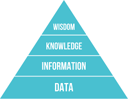

# Data Demystified - Chapter 1: DKIW model

Data is one of the biggest new trends in both tech and business in general. Data "experts" are quickly becoming some of the best-paid individuals in the industry, and every single company wants to surf the wave of data capabilities. 

It is becoming a fundamental way of understanding the world around us. We can think of data sciences as epistemology or a way of knowing. We can think of it, about a way to approach problems and solving them.

But as with any new trend, we have to ask ourselves: what do all these buzzwords actually mean? 

What is a data scientist? In short, **a person who is better at statistics than any software engineer and better at software engineering than any statistician**.

The goal of this article is to demystify data analysis. We'll explain what these buzzwords mean, what big data can and cannot do, and which technologies you should explore if you're jumping on the data train

This article is the first of a four-part series on data analysis. We'll start with some foundational knowledge, then build on that foundation, step-by-step, to expliain the more sophisticated and robust systems in both computational and thinking processes and help you understand why everyone is so crazy about data. 

## DIKW Pyramid

Before getting into the meet of data analysis, let's start with a simple, but incredibly important, concept: the DIKW Pyramid. While many people are familiar with the pyramid, few understand how to interpret it, how to use it, and where they themselves stand.



To elaborate on the concept, listen to Jennifer Rowley (2007): "Typically information is defined in terms of data, knowledge in terms of information, and wisdom in terms of knowledge."

Now let's explain each level of the pyramid. 

**Data** is just a set of signals or symbols. Nothing more – just noise. It may be server logs, user behavior events, or any other data set. It's unorganized and unprocessed. It's inert. And if we don't know what it means, it's useless. 

You get **Information** when you start to make data useful. When we apply systems to organize and classify data, we can transform this unstructured noise into Information. The "What", "When" and "Who" question should be answered at this stage. In short, Information is data with meaning. This "meaning" can be useful, but it isn't always useful.

**Knowledge** is the next step in the journey, and probably the most significant leap. It implicitly requires learning. It means that we can take data, categorize and process it generating Information, then organize all this Information in a way that it can be useful. Whereas Information can help us to understand relationships, Knowledge allows us to detect patterns. It's the foundation that will let us build predictive models and generate real insights. A definition that I like is that Knowledge is a mental structure, made from accumulated learning and systematic analysis of Information. 

**Wisdom** is the final frontier. It allows us to predict the future correctly, not only by detecting and understanding patterns but also deeply comprehending the "Why" behind those patterns. Wisdom is all about the future: it relies on Knowledge and pattern models, but it can help to shape your "gut feeling" and intuition, giving you an exponential competitive advantage. Knowledge ages quickly because of how fast reality changes, but wisdom remains more rigid. For now, this is a pure human skill, but AI is catching up fast. When AI wisdom becomes better than human wisdom, the outcomes are unpredictable. 

The following image exemplifies perfectly this mental model:


This example also introduces the 'Insight' concept, sometimes known as 'Intelligence'. It's a sporadic manifestation of Wisdom. Insight is what connects Knowledge and Wisdom.

## A dummy example
**Data**: It's raining

**Information**: The temperature dropped 5 degrees, the humidity went up by 5% in one hour and then it started raining at 3 pm. 

**Knowledge**: An quick increase in the humidity, accompanied by a temperature drop caused by lower pressure areas, will likely make the atmosphere unable to hold the moisture and rain. 

**Wisdom**: Based on the observations and maths model, we can predict why and when it will rain in the future, and we can do it so fast and systematically that it won't require a lot of analysis. We already have an understanding of all the interactions that happen between evaporation, air currents, temperature gradients, changes, and raining.

## Bonus points
**Representativeness heuristic** is used by our brain to infer patterns. Our brain uses a vast percentage of its capacity to create patterns and is obsessed with trying to understand and predict patterns in the real world. That means that when working with data, we need to be extremely mindful in avoiding jumping to conclusions too soon. Knowing that we have this tendency to chase and see patterns everywhere can help us to slow down when it comes to inferring patterns. This is a topic warrants its own article, but it's good to keep in mind from the very beginning.

**Availability Bias** is somewhat related to the previous concept. It's a mental shortcut that relies on immediate, urgent Information, and tries to generalize the findings using only the most obvious information. Under this bias, people tend to heavily weigh their judgments toward more recent Information, making new opinions biased toward the latest or closest news. 

### Origin of the DIKW hierarchy

It's not data sciences. Not even the engineering field. The origin of this mental framework is poetry. The poet T.S.Eliot was the first to mention the "DIKW hierarchy," although he didn't it by that name. In 1934 Eliot wrote in "The Rock":

```
Where is the Life we have lost in living? 
Where is the wisdom we have lost in Knowledge? 
Where is the Knowledge we have lost in Information?  
```

Though this is the first mention of the hierarchy in the arts, it is not the only one. Before management and information science caught on, Frank Zappa alluded to the hierarchy in 1979:

```
Information is not Knowledge, 
Knowledge is not wisdom, 
Wisdom is not truth, 
Truth is not beauty, 
Beauty is not love, 
Love is not music, 
and Music is THE BEST
```

### References
1. Russell .L. Ackoff, "From Data to Wisdom," Journal of Applied Systems Analysis 16 (1989): 3-9. 
2. Milan Zeleny, "Management Support Systems: Towards Integrated Knowledge Management," Human Systems Management 7, no 1 (1987): 59-70. 
3. M. Cooley, Architecture or Bee? (London: The Hogarth Press, 1987). 
4. Harland Cleveland, "Information as Resource," The Futurist, December 1982, 34-39. 
5. T.S. Eliot, The Rock (Faber & Faber 1934). 
6. Frank Zappa, "Packard Goose" in album Joe's Garage: Act II & III (Tower Records, 1979).
7. Nikhil Sharma, "The Origin of Data Information Knowledge Wisdom (DIKW) Hierarchy", (Google Inc, February 2008).
