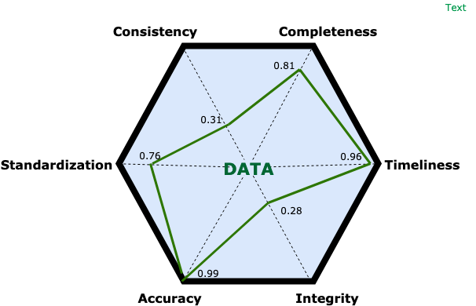

## Data Demystified - Data Quality
*[Anthony Figueroa](https://www.rootstrap.com/tech-blog/author/anthfig/) is CTO on the Rootstrap team and writes about his experience tackling difficult problems for  our many clients. You can also follow Anthony on [LinkedIn](https://uy.linkedin.com/in/figueroaanthony).*

This article contains information and a mental framework to organize our work around Data Quality. Referencing the well-known DIKW Pyramid, this is the enabler that'll allow us to generate information, starting from raw data. 
We'll go over a few common scenarios, some theory and finally drop some pieces of advice for anyone having an increasingly more common problem. 

### Why?
Data is being generated massively every second. Our estimate is that 294 billion emails and 65 billion messages on WhatsApp are sent per day. Everything leaves a data trail. The world economic forum estimates that the entire digital universe is expected to reach 44 zettabytes by 2020. Before you wonder how much is this, here are the bytes prefixes: kilo, mega, giga, tera, peta, exa, zetta.
 
Data comes in different forms. Originally, it's just noise. It doesn't have an implicit sense. It's subjective and needs interpretation. On this interpretation effort, people create software to organize data in different ways. It can be structured or unstructured.

Since Software is created by people and operates in real life, we can imagine what happens. People commit mistakes,  the world changes, programs have bugs, and data has quality problems. Always. 
Our job is to create processes to identify the problems, process and improve the quality and make sure we add value in all this process. We have to make sure that we have information, not random noise. 

Bad data quality leads to inaccurate and slow decision-making. It's not a one-time process since data quality tends to deteriorate over time. Like, everything else, it follows the second law of thermodynamics ( total entropy of an isolated system can never decrease over time ). 

### Where are we at?
The first step is understanding where we are at, and where we want to go. What are our metrics? What's our business goal? How good is our data? 

For this, we have to cover the following aspects:

* **Completeness**: Data is considered complete when it meets the expectations. We can always have optional data, but lack of completeness means that information that we do want is missing. 
* **Consistency**: Data is considered inconsistent if we have contradictory or conflicting information about the same thing in two or more different places.
* **Timeliness**: Is the information available when it's expected? For example, log reports of an error being accessible 5 hours after the error happened is not acceptable. 
* **Integrity**: This concept speaks to well-designed data and systems. As an example, in a relational database, it means no orphaned records or lack of linkages between semantically linked data.
* **Accuracy**: This means that what we store should be accurate enough to reflect real life values. If we store the wrong birthday for a person, there's an accuracy problem. 
* **Standardization**: This dimension is subject of discussion. In my opinion, decisions taken during databases design should be consistent, following standards (either using common standards or coming up with your own variation). In relational models, the different ways of normalization are standards. Often times, you end up consciously denormalizing data (to increase performance, as an example) but that decision should be taken using objective arguments, that can be part of your own standard. Other details like date formats are also important. 

### How do we measure these dimensions?
Unfortunately, there's not a single answer or silver bullet. My recommendation is to create an algorithm based on the reality of the project. The algorithm can take inputs and give a score to each dimension, for example, between 0 and 1. There are multiple ways to process large chunks of data and calculate scores, or even choose a representative part of the database to process. Heuristics and common sense are extremely valuable here. Doing it programatically makes sure that you can run the same tests over and over again, comparing the results.

Ideally, in a professional process, you should come up with an output like the following:

After taking this first but crucial step, we can start assigning a weight to each dimension. Meaning that some of them could be important to achieve business goals, where others might not be as important. This analysis, done in conjunction with stakeholders, should give you a pathway to take an informed decision. It should be clear what's the priority, and what you have to do first. 

### What's next?
After narrowing your focus, you can decide if you have a real problem. If that's the case, you can work on one dimension at a time, employing the techniques that best suite your needs. 

An example of this could be using Python's Panda library, read and process either from files or a relational database, create transformations that will increase one of the dimensions and pushing the fresh data again to the original database.

Another approach could be trying to mitigate future data problems because you tracked down the problem to an algorithm in your code, or even you realized that your database design needs adjustments. 

We'll explore some techniques on another article, but this conceptual model is the basis for any systematized data quality efforts. 

*If you are the owner of a digital platform and would like to discuss the challenges you face on a technical level, contact us [here](https://www.rootstrap.com/contact). Alternatively you can reach out to [anthony@rootstrap.com](mailto:anthony@rootstrap.com) and he will arrange a free consultation with Anthony or another relevant member of the Rootstrap technical team.*

*☞ Please tap or click “Star icon” below to help to recommend this article to others.*

### References
1- Russell .L. Ackoff, "From Data to Wisdom," Journal of Applied Systems Analysis 16 (1989): 3–9.
2- Harland Cleveland, "Information as Resource," The Futurist, December 1982, 34–39.
3- Arkady Maydanchim, "Data Quality Assessment", September 15, 2007
4- https://www.forbes.com/sites/bernardmarr/2018/05/21/how-much-data-do-we-create-every-day-the-mind-blowing-stats-everyone-should-read/#2cf97cb160ba
5- https://www.weforum.org/agenda/2019/04/how-much-data-is-generated-each-day-cf4bddf29f/