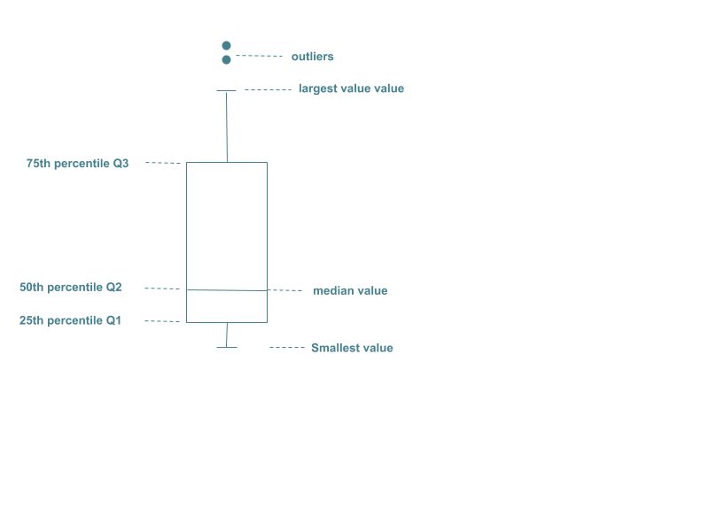

# Data visualization
Data visualization is important to understand the data, its distribution and get insights and check hypotheses. It also may help to better explain results and make comparisons between models. 
Different visualization techniques are used to extract information from the data. 

## Histogram
It is a representation of the distribution of numerical data. It is an estimate of a probability distribution of a continuous variable. It is useful to give you an idea of the shape of the distribution and see outliers. First, the data is splitted into bins (intervals). Then, sum the number of occurrences for each interval.

## Scatter plot
 Shows possible relationship between two variables by dots, where each axes corresponds to a variable. It can be interpreted from this graph the correlation between variables and also detect outliers. As it represents two variables it is said that represents bivariate data.
 
 

**Scatterplot matrix:** It is a square and symmetric grid of several scatterplots. It has rows and columns, each one corresponding to a variable. Each quadrant shows a scatterplot for the variables x and y of the grid. 

## Correlation matrix
A correlation matrix is a table that shows the relationship between the variables. Each cell (i,j) corresponds to the value of the correlation between the variables i and j. The correlation is a value between -1 and 1 that represents the relationship between the variables. 
The graph of the example is a heatmap, which is a graphical representation of the correlation matrix, where the values of the correlation are represented by colors. 

## Biplot 
A biplot shows information about samples and variables of the dataset by graph. This kind of plot is used for visualizing the relationship between principal components within each other and with the variables. 
The samples are represented by points and the variables by vectors. 
The length of the vectors represents the variance of the variable.
The angle between the arrows represents the correlation, smaller angle corresponds to higher correlation. 
Points that are close to each other, are similar observations. 

The example in the image shows the relationship between some products (Fish, Vegetable, Milk,etc) for each country (Portugal, Spain, etc). Thus, the biplot is useful to understand the relationship between variables, between observations and between variables and observations. 

## Boxplot 
It is a graphical representation of the distribution of the data based on its quartiles.  The quartiles divide the data into four equal parts. 
**First quartile Q1:** is the middle value between the median and the smallest value in the dataset. Corresponds to the 25th percentile.
**Second quartile Q2:** is the median for the dataset. Corresponds to the 50th percentile.
**Third quartile Q3:** is the middle between the median and the highest value in the dataset. Corresponds to the 75th percentile. 

These values are represented inside a box, and the distance between the different parts of the box represents the level of dispersion of the data. The boxplot may represent outliers by points. 
The **IQR** value corresponds to the difference between Q3 and Q1. 

For the normal distribution, the data is equally distributed around the mean, so the location of the marks in the boxplot will be equally space. We can see this in the graph. 

## Other types
Other types like bar plots, pie plots and map plots can help you to visualize certain information. You can plot the original data to see or validate assumptions about certain characteristics. In addition, you can plot your results comparing the predicted values for testing and the real values. What is more, you can also plot the clustering results to see how the data is grouped, finding what are the variables that are affecting more the determination of the clusters. 

Furthermore, there are more plots available like 3-dimensional scatter plots and other representations that might be useful for more complicated sceneraries. 

# Conclusion
So, data visualization is important in many ways. Firstly, it helps you to understand the data, find outliers and take insights about the distribution of the data. Secondly, it can provide information about how variables are related. Finally, it can help you to explain the output of your model as well as compare different models’ performance. 

