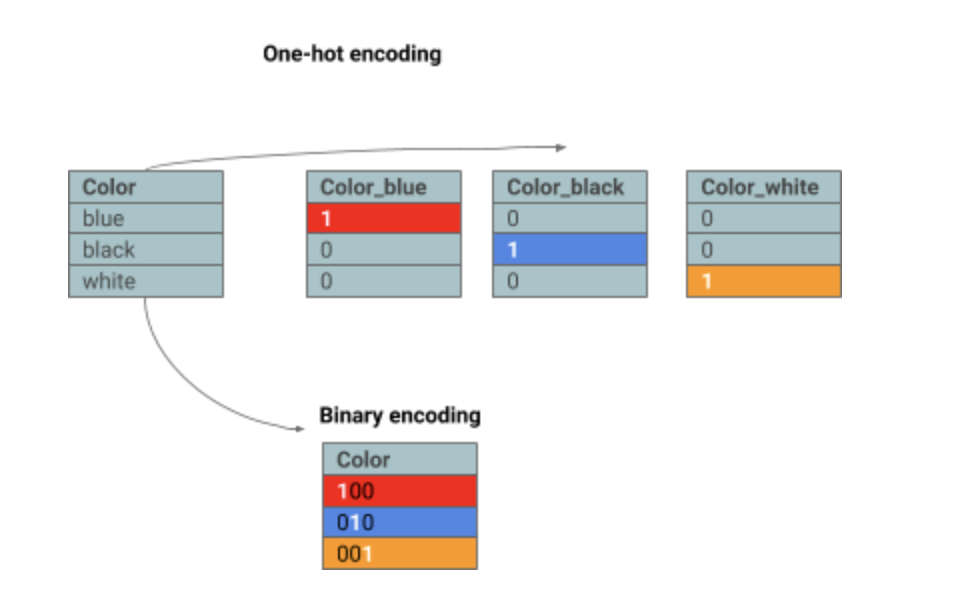

# Data cleaning

The data never comes perfect. There is always missing information, different formats, or it is full of useless information for your analysis. The process of data cleaning consists of the correction and transformation of the values, standardizing all the formats, fixing encoding, removing unnecessary information, splitting columns and extracting relevant information. In addition, the data needs to be analyzed, in order to understand the distribution of the data and the meaning of the values for each column. 

## Outliers 

Sometimes in your data there are points that are outside the norm ([outliers](https://towardsdatascience.com/a-brief-overview-of-outlier-detection-techniques-1e0b2c19e561)) - those points can dramatically affect your results. Therefore, you should identify them, analyze each case and make decisions about what to do. According to what each outlier represents, you will have to decide whether to keep it or not. If you have doubts, just apply the model with and without the outliers and analyze the results with a critical eye. 

## Missing values
The data is not always complete, it is necessary to make decisions in regard to the completion of this missing information. Different techniques to resolve missing values are explained in this section. 

### Omission
A common approach, and it is a lazy one, is just remove the information that is incomplete, it is called omission or listwise deletion. When a row or column is full of missing values, omitting them might be a good option. It means that the entire row or column will be removed. But, take into account that you might be deleting a lot of data that might be useful. It does not mean that choosing this approach is a bad choice, it will just depend on the importance of the column for the analysis.

### Imputation
The missing data can be filled with possible values or default values. Those values can be generated by different methods. 

- **Default value:** Filling with a fixed default value, depending on the meaning of the variable. For instance, if you have a column that indicates a quantity, filling all the missing values with 0. 
- **From the original column data:** if only some of the values are missed, you can take the rest of the data to calculate possible values for the ones that are missed. This can be done by:
	- Calculation: taking the average, mean, median or the most frequent value
	- Randomness: generating random values between a certain range
	- Substitution: for each missing value of a column randomly select a value from the column and fill with that value.
	- Simulation:  simulation from a distribution like normal distribution. 
- **From the original row data:**
	- Calculation: Doing a calculation from information of other columns
	- Condition: Applying a condition over the other values of the data, for instance if the column_x < 0 then fill with 0 or else fill with 1. This technique actually can be mixed with any of others to establish the filling criteria either when the condition is true or not. 
	- Interpolation/Extrapolation: An estimated value from other observations from the same row/item/individual. While in interpolation the range is defined based on the meaning of the column, for extrapolation the range is based on the actual data.
	- Regression: create a regression to predict the missing values in function of the other variables.  
	- Hot deck imputation: it can be used for some type of classification algorithm to find “similar” features in function of the rest of the columns to fill the missing value for a variable.

## Scale the data
Several Machine Learning algorithms are based on distance between data points. As the different features’ values might be in different units, it is important to take all the information to the same scale, in order to be able to make sense from it and make comparisons. In addition, having the data on the same scale is better to visualize the information graphically. 

Sometimes this step is not necessary, it is important to understand the meaning of each column and the whole data. There are several formulas for scaling the data.
 
[Normalization and standardization techniques](https://towardsdatascience.com/normalization-vs-standardization-quantitative-analysis-a91e8a79cebf) are used to scale the data. Although these terms might be used interchangeably, there is a slight difference between them. **Normalization** scales the data between 0 and 1. Whereas, **standardization** transforms the data to have mean 0 and standard deviation 1. 

Levels of measurement
There are different levels of measurement for the variables. The variables can be numerical or categorical (corresponding to different values for classes).   

1. Nominal: corresponds to unordered categorical variables.  
2. Ordinal: there is an order, but no implications of equal distance between the points of the scale. For example: social class, education level.    
3. Interval: the jumps between successive points are equal on the scale, but the position of zero is arbitrary. For example, temperature (C°/F° degrees).   
4. Ratio: in this level the observations have equal intervals and the position of zero is fixed. For instance, age and weight variables enter into this level.   

## Handle non numerical data 
Some of the data might not be numerical, but as most of the algorithms are based on algebra, the data types should be numerical. Therefore, it is needed to transform this type of data to numbers.  
Other types of data might be:     

- Images or videos, that can be transformed easily to numbers because in the end images are pixeles.      
- Text, which can be transformed to numbers by tokenization.     
- Categorical data: when the values means labels of different categories.   

### Ordinal features

[Ordinal features](https://towardsdatascience.com/understanding-feature-engineering-part-2-categorical-data-f54324193e63) refers to the case that an order exists between categories, then the categories can be transformed to numbers as a ranking. Depending on the meaning of the category, It can be assigned as 0,1,2,... or it can be in terms of **percentage** or **probability** by choosing values between 0 or 1. 

Another possibility is to assign **weights** for the categories, for example if there is a category that is Low, Medium, High and the interest is to give more relevance when the category is High, it can be assigned something like 0,2,10, or any desired values that represents the meaning of the category. 

### Nominal features
In the case that there is no order for the categories, techniques like one-hot encoding should be applied. [One-hot encoding](https://towardsdatascience.com/understanding-feature-engineering-part-2-categorical-data-f54324193e63) consists of changing the column for several binary columns one for each category, where the value for each column is 1 if it belongs to that category, 0 if not. Those columns are called **dummies**. In this case, if there is a high correlation between features, one of those dummy columns can be removed, without losing any information, because that column can be deducted from the others. For instance, if we have three colors such as black, white and blue, generating the dummy columns color_black, color_white, color_blue, when color_black is removed, the information is still there since if color_black was 1, the other two columns must be 0 and it will be the only case that occurs. So, the information is implicit in the other two columns. 

Another technique used in this case is **binary encoding**, which consists of the concatenation of all the results from one-hot encoding into one column.

     
Another strategy to deal with categorical variables, is **frequency encoding**. It is used when the frequency of each category means something in the data. Thus, this can be achieved by grouping by each category and dividing by the total rows of the data. Then, each category is replaced with the calculated value. 

Other methods are based on the target variable. For instance, **mean encoding** groups by category and calculate the mean of the target value. 
Finally, several methods are based on a **contrast matrix**. The most basic method in this group is one-hot-encoding (dummy encoding), but there are others like simple, helmert, orthogonal, backward difference. 

Further reading for categorical data can be found in the following links: 
    
- [Machine learning on categorical variables](https://towardsdatascience.com/machine-learning-on-categorical-variables-3b76ffe4a7cb)     
- [All about Categorical Variable Encoding](https://towardsdatascience.com/all-about-categorical-variable-encoding-305f3361fd02)   
- [Dealing with categorical features in machine learning](https://medium.com/hugo-ferreiras-blog/dealing-with-categorical-features-in-machine-learning-1bb70f07262d)    
- [Category Encoders](http://contrib.scikit-learn.org/categorical-encoding/)     
- [Simple Methods to deal with Categorical Variables in Predictive Modeling](https://www.analyticsvidhya.com/blog/2015/11/easy-methods-deal-categorical-variables-predictive-modeling/)   

# Conclusion
Thus, cleaning your data is essential to pre-process the information and get the dataset ready for the execution of the model. Data preparation is the most time-consuming activity during the data science pipeline. But it is important to pay attention since this data is going to be the one that is input of your model, if you make mistakes during this step, then your predictions are going to be affected by this error. Sometimes the data cleaning process is overwhelming but it is necessary to focus the attention and double check the decisions made during the process.  

