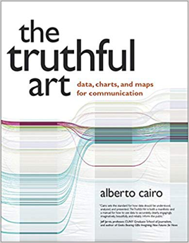

# Data visualization and truthful art
An amazing book about data visualization that I can't recommend enough is The Truthful Art by Alberto Cairo.

In The Truthful Art, Cairo explains the principles of good data visualization. He describes five qualities that should be your foundation when you work with data visualization: truthful, functional, beautiful, insightful, and enlightening. Cairo also gives some great examples of biased and dishonest visualization.

## Data-ink ratio

Before I dive into the "Five Qualities of Great Visualizations," there's another related concept that I want to cover: data-ink ratio, introduced by Edward Tufte in The Visual Display of Quantitative Information.

Tufte defines the data-ink ratio as the amount of data-ink divided by the total ink required to print a graphic. Now, I don't think he asks us to measure the amount of ink laid down on the page. Instead, Tufte suggests we remove those elements that don't add new information to the graphic.

Perhaps one of the best-known examples of data-ink reduction was created by Darkhorse Analytics, an information, visualization, and design company in Edmonton, Alberta, Canada. Darkhorse put together four examples of how the data-ink ratio can be improved. Their main concepts are "data looks better naked" and "remove to improve."

This animation by Darkhorse is super illustrative:

## Five Qualities of Great Visualizations

According to Cairo, the five qualities aren't independent of the others. All the different qualities are interrelated, and they interact with all the others.

### Truthful

We need to advocate for true data. Truth based on data analysis can be subjective. But as data scientists, we should make our best effort to protect the truth. These methods help you achieve truthfulness:

- First, be honest with yourself when you clean and summarize data. Think carefully about each modification you make to the raw data. Are you obscuring anything? Practice what Cairo calls "self-deception" - understanding the trickery of your own mind. The ability to question yourself is critical for a data scientist. We can get so focused on looking for patterns that we reduce or present data in ways that are inauthentic to the phenomena being described.
- Second, remember that your obligation is to the audience. Use industry-accepted techniques of data science and information visualization to shine light on specific pieces of data. Getting answers from data through approved processes and systems is the definition of data science. Adapt your data visualization to your audience, not the other way around. And consider the audience's reading ability and level of comprehension.

### Functional

Consider whether your visualization is functional or not. The data-ink ratio can help increase the functionality of a visualization. I'll cover this in another article. There are many heuristics for increasing functionality, like user testing.

### Beautiful

It might sound like a weird quality, but beauty is important to data visualization. To achieve beauty, you need to know your audience. "Beauty is in the eye of the beholder" is a common but accurate expression. Different perceptions of beauty are based on people's life experiences and other aspects like gender and culture. Creating a visualization that's judged as beautiful by its audience is a great achievement for any data scientist.

### Insightful

A good visualization doesn't merely replicate data from tables or files. It displays relevant data in a visual format that reveals trends or relationships. When insights are successfully visualized, the viewer gets an "aha!" moment.

One practice common to novice data science writers is to include a figure for every piece of data they have. Too much information is unnecessary and contributes to reader fatigue. The right figure drives home the results of a study quickly.

### Enlightening

Although it sounds similar, enlightening is a different concept from insightful. Cairo says this quality is composed of the previous four: truthful, functional, beautiful, and insightful. Enlightenment means that every important component has been successfully combined to produce a new and valuable revelation.

## What about social responsibility?

Cairo also poses the question of whether social responsibility is a dimension to consider in ethical data visualization. There isn't an obvious answer to that question. Who can judge whether the suppression or selective release of specific scientific knowledge is harmful or helpful?
Create meaning, not deception

Most importantly, have the intention to create meaningful visualization and to identify deception and unethical work. A data scientist is responsible for putting the right information in front of the right audience, in a way that adapts to their skillset and purposes. Without doubt, applying Cairo's Five Qualities of Great Visualizations will help produce data visualization with factual and relevant value.

## References
- Alberto Cairo, The Truthful Art: Data, Charts, and Maps for Communication
- DarkHorse Analytics Blog, July 2018.