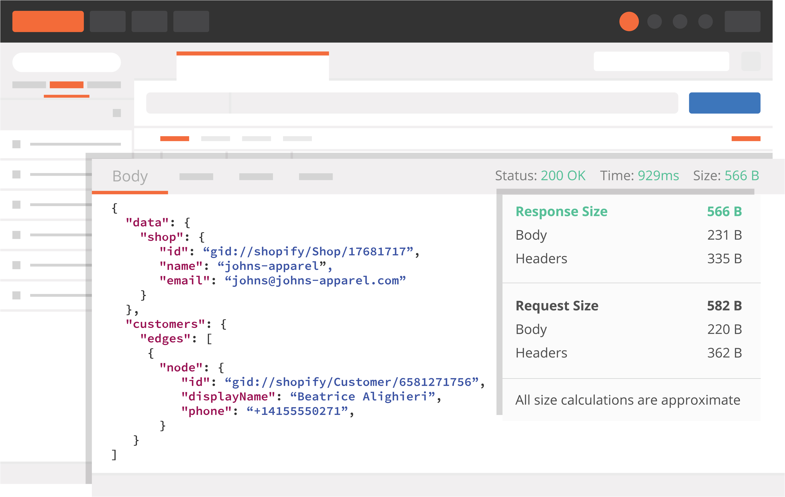
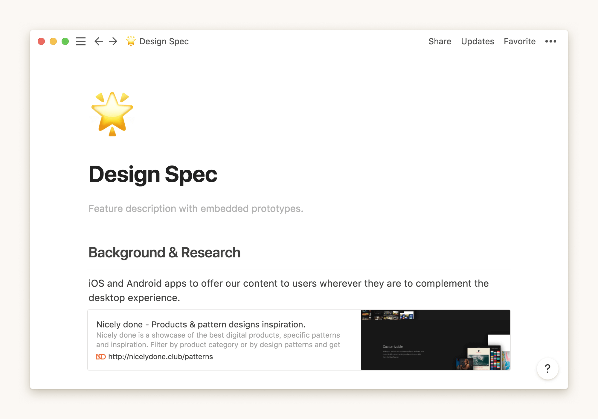

## Why is Documentation Important For Development?


Here at Rootstrap, we help our clients reach their business goals by developing high-quality, performant, and scalable software solutions. To achieve this, our team continuously focuses on improving all aspects of our processes, through several initiatives across all company departments.

In this article, we will examine why documentation is vital for the software development cycle.

### Why is Documentation so Vital?

You may be wondering what exactly the benefits of documenting are. Let me tell you a brief story. In March 2020, we started working with a client on a very exciting project. However, the whole team then had to switch to remote work, as a result of COVID-19. Therefore, we had to focus on maintaining fluent communication among our frontend and backend developers. To achieve this, the backend team started to document the API features and the available deliverables right away with different tools. Doing this helped to maintain the team's velocity, reduce synchronization time between devs, and kept everyone up to date on each other's work.

Many features require backend work to be done first so that frontend devs can integrate their mocked code with the API afterward. This now implies that backend devs not only have to code and test but also add documentation on each newly released feature. By the time a frontend dev starts working with any API endpoint, they already have a detailed description of returned objects. They will also be aware of whether authentication is needed or not and will see any error messages that may arise based on different use case scenarios.

Later on in the project, the client hired a content manager who was tasked with uploading new episodes and exclusive content to the platform. As a result, the team started developing documentation for the content manager to understand all the logic behind the administration site, for example,  how to upload new content, schedule episode releases, and so on. These documents were linked on the administration's dashboard site itself for easy access.

### **Documentation Tools**

Here are some of the tools we use everyday to document project deliverables.

#### **Oracle Apiary**
[Oracle Apiary](https://apiary.io/) is an API design stack we use to describe all endpoints using `API Blueprint`, a really cool description language based on Markdown. It allows for specifying actions, declaring objects, and data structures. The online editor provides an automatic validation which helps developers to keep documents consistent. Here is a brief syntax example that is taken from our open-source [Rails API Template](https://github.com/rootstrap/rails_api_base):

```apib
FORMAT: 1A
HOST: http://rails5-api-base.herokuapp.com

# API BASE

Rails Api Base is a boilerplate project for JSON RESTful APIs.

## Users Collection [/api/v1/users]

### Sign Up [POST]

+ Request (application/json)
    + Attributes
      + user (Profile Edition, required)


+ Response 200 (application/json)
    + Headers

            access-token: sO2bm_Bpdyoo8r78jZ-fqg
            client: QADgNCWRJj0LyRruqzYbBg
            expiry: 1489009792
            uid: test@test.com


    + Attributes
      + user (Profile Response, required)

+ Response 401


# Data Structures

## Profile Response (object)
+ id: 100 (number)
+ email: test@test.com (string)
+ first_name: John (string)
+ last_name: Doe (string)

## Profile Edition (object)
+ email: test@test.com (string)
+ password: 12345678 (string)
+ first_name: John (string)
+ last_name: Doe (string)
```

---

#### **Postman**



[Postman](https://www.postman.com/) is an amazing API client we use locally or with our testing environments so everyone on the team is able to inspect endpoint responses and debug. This is especially useful for frontend developers since it enables them to quickly get responses based on the request attributes. Furthermore, the environment can be easily switched in order to make a request (e.g. `staging`, `production`, and so on). Postman helps the team to better understand how the API works.

---

#### **Repository READMEs**
[READMEs](https://docs.github.com/en/github/creating-cloning-and-archiving-repositories/about-readmes) is a powerful yet simple way to communicate to your team developers about important project settings. Here is an [example](https://github.com/rootstrap/rails_api_base) from our Rails API Template. There are plenty of aspects that may be included, but it's important that developers take ownership of this initiative and update this file whenever is needed. Besides keeping the README file updated on setting up the project for development and listing used Ruby gems, we also started listing all the environment variables names needed for the different environments to work correctly.

---

#### **ActiveAdmin Dashboard**
[ActiveAdmin](https://activeadmin.info/) is a popular administration framework for Ruby on Rails applications. This plugin makes implementing interfaces for managing content simple. Not only does it offer an extensible way to customize all different sections, but it also provides the user with a dashboard. So, as mentioned before about documenting different aspects of the administration site, we added these links on a new *Documentation panel*.

---

#### **Notion**



[Notion](https://www.notion.so/product) is an all-in-one platform that connects all the company areas: from product & design, to engineering. It allows us to share knowledge about projects, internal initiatives and so much more. In this specific project, designers portrayed content guidelines so that both web & mobile versions keep visual consistency. As an example, designers detailed some image upload specifications. By doing this, the content manager is able to adapt content so that it fits perfectly on the site. This is just one example of the different capabilities this tool offers.

---

### **Conclusions**

I strongly believe good coding practices should be accompanied by high-quality documentation all along the development cycle. It helps new team members onboard faster and understand the project right away. It helps designers to understand content architecture so they can reason on it. It helps clients to communicate stakeholders about product capabilities. It helps developers to be aware of the whole system. In conclusion, **documenting increases product quality and reduces development time in the long run.**

### **References**

- [ActiveAdmin](https://activeadmin.info/)
- [Apiary](https://apiary.io/)
- [API Blueprint](https://apiblueprint.org/)
- [Postman](https://www.postman.com/)
- [Github README files](https://docs.github.com/en/github/creating-cloning-and-archiving-repositories/about-readmes)
- [Notion](https://www.notion.so/product)
- [Rootstrap's Rails API Template](https://github.com/rootstrap/rails_api_base)
