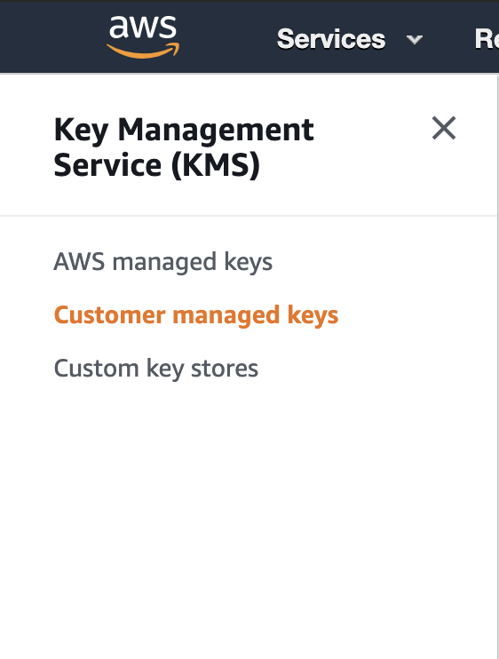
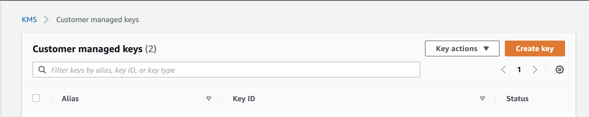
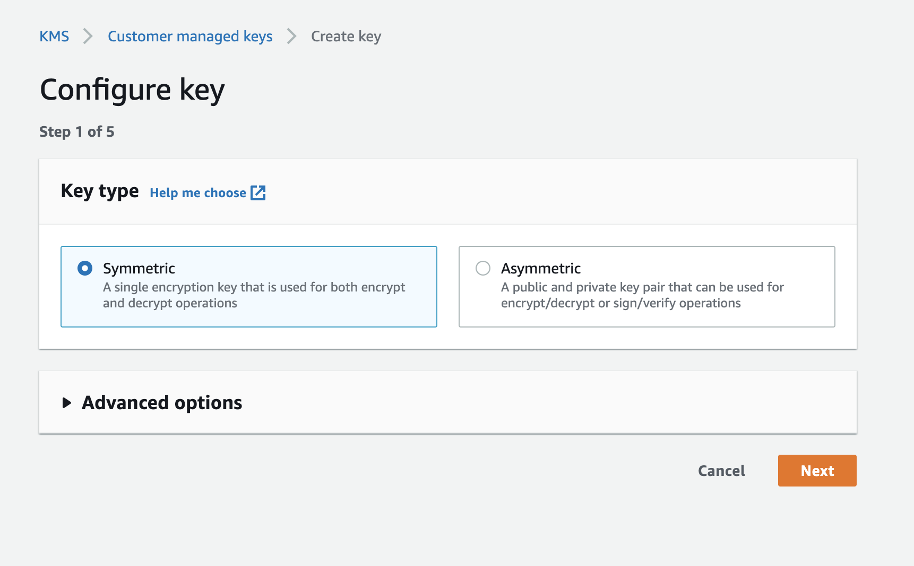
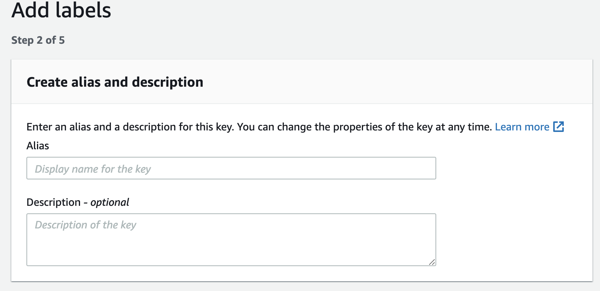
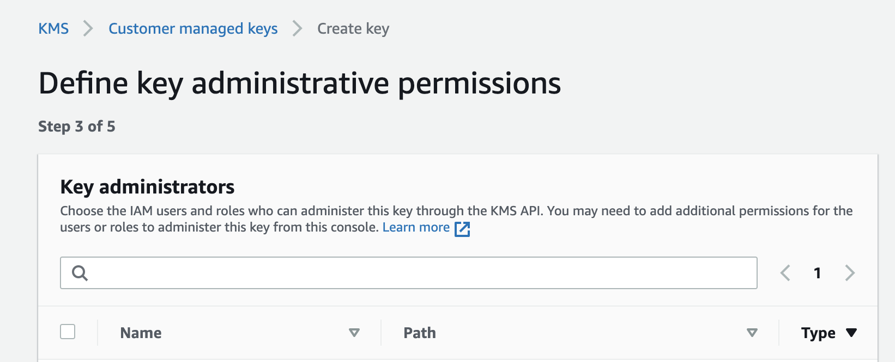
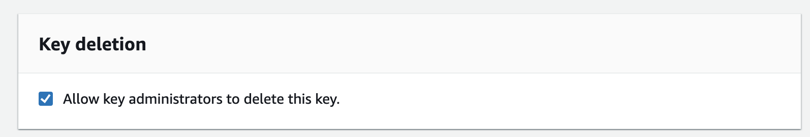
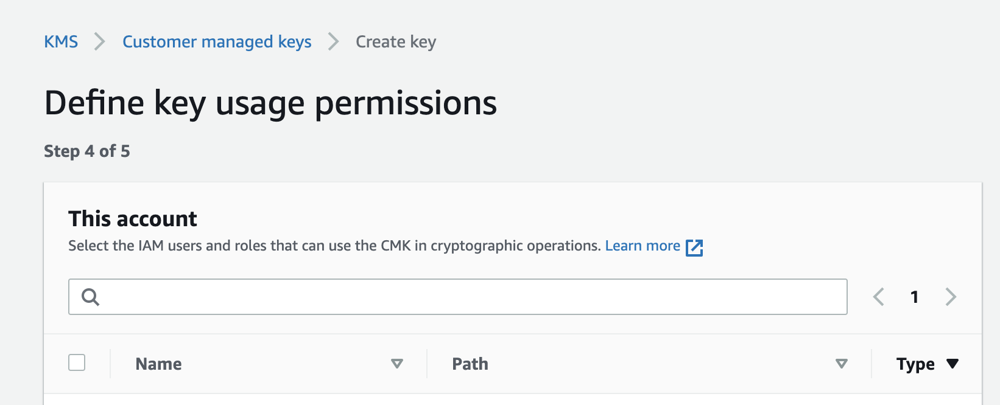

# Encrypting files with Active Storage and S3 Bucket Server-Side Encryption

In this article, we are going to see how encrypt/decrypt the files that we storage at Amazon S3 Bucket in our Rails API using Active Storage to manage our files.

## Why we need to encrypt the files at S3 Bucket

This requirement born from a client who wants to ensure the security of their clients' files which they upload or consume on the web site.

Analyzing the context of the requirement, the first option that the team suggests was E2EE (end-to-end encryption). But this approach has a critical point: the user needs to share an encryption key between them, so, according to the user target of the business and the complex user experience, this option was discarded.

Finally, the best option was to use an AWS Key to encrypt the files when the users upload it and decrypt when the user wants to view or play the file on the web site. Following the **server side encryption** approach.

## What is an AWS Key?

The [AWS Key Management Service (KMS)](https://aws.amazon.com/kms/) is the amazon services where we can create and manage cryptographic keys. Also, it is a cheap option than the monthly cost is USD 0.03 per 10,000 requests after the free tier of 20,000 requests and USD 1 by key.

> NOTE: The prices suggested above are updated to the date that the article was published.

### How creates a key

Creating a key is a short process of a few steps:

The first step is to go to [Amazon Console](console.aws.amazon.com) and search the `Key Management Service`.

On the sidebar, select the option `Customer managed keys`. Check that you are creating the key in the **same region that the S3 Bucket** to avoid differents future troubles.



Then, click the `Create key` button and walk through the wizard.



The first option to choose is the **Key Type**: select the `Symmetric` box.



The second step is to add the **Alias Key** which you will be able to identify the key easily. We could use the following nomenclature to name it: `<business name>-<enviroment>-bucket-key`.



The third step is about who can administrate this key. In this screen, we see the list of the different roles in our Amazon account. For example, the S3 Bucket administrators.



Also in the same step, we can set if the administrators will be able to delete the key. For example, the S3 Bucket **Administrator** role.



The fourth step is about who can use this key. In this screen, we see the list of the different roles in our Amazon account. For example, the S3 Bucket **API Access** role.



In the last step, we can check the key policy. Finally, click the `Finish` button.

Once completed the key creation, we should be redirected to the list of `Customer managed keys` where we can see the `Key ID` of the recently created key. This value will be useful in the future, so, remember where it is.

## Amazon S3 Bucket specifications

According to the S3 Bucket API specifications to ensure that files are encrypted with our key, we need to send some headers in the request to store the files. These headers are two:
- `X-Amz-Server-Side-Encryption`: indicates which server-side encryption algorithm will be used when storing the file in Amazon S3. In our case, the value must be `aws:kms`.
- `X-Amz-Server-Side-Encryption-Aws-Kms-Key-Id`: indicates the `Key ID` of the AWS Key Management Service (AWS KMS) symmetrical customer managed customer master key (CMK) that will be used for the file.

### How we send the headers through Active Storage

The last trouble to solve is how forces Active Storage to send the headers. There is not an option to do it by an out of the box feature. So, we need to override the default Rails S3 Service to add the mentioned headers to the upload requests.

Firstly, we need to create a class which extends from `Service::S3Service` to override the default services used for Rails. The class name has to follow the nomenclature `<name>Service`, *ie.*, `SecureS3Service`.

```ruby
# lib/active_storage/service/secure_s3_service.rb

require 'active_storage/service/s3_service'

module ActiveStorage
  class Service::SecureS3Service < Service::S3Service
  end
end
```

The name also has to be replaced at `storage.yml` configuration. We can see the result in the following example:

```yml
# config/storage.yml

amazon:
  service: SecureS3 # replace the default value: 'service: S3'
  access_key_id: <%= ENV['AWS_ACCESS_KEY_ID'] %>
  secret_access_key: <%= ENV['AWS_SECRET_ACCESS_KEY'] %>
  bucket: <%= ENV['S3_BUCKET_NAME'] %>
  region: <%= ENV['AWS_BUCKET_REGION'] %>
```

At `storage.yml`, we need to add the `Key ID` value that we should find in the list of `Customer managed keys` at the AWS Key Management Service. We can see the result in the following example:

```yml
# config/storage.yml

amazon:
  service: SecureS3
  access_key_id: <%= ENV['AWS_ACCESS_KEY_ID'] %>
  secret_access_key: <%= ENV['AWS_SECRET_ACCESS_KEY'] %>
  bucket: <%= ENV['S3_BUCKET_NAME'] %>
  region: <%= ENV['AWS_BUCKET_REGION'] %>
  kms_key_id: <%= ENV['S3_BUCKET_KEY_ID'] %> # add Key ID
```

Now, we need to load the `Key ID` value at the new custom service. First, we have to get all values from configuration and remove the hash key `kms_key_id` because it is not recognized by the Rails `S3Service` so throw an exception.

Finally, we add the value of the required headers. We need to add `ssekms_key_id` and `server_side_encryption` to service instance variable `upload_options` which map the hash keys to the right headers: `ssekms_key_id` to `X-Amz-Server-Side-Encryption` and `server_side_encryption` to `X-Amz-Server-Side-Encryption-Aws-Kms-Key-Id`.

```ruby
# lib/active_storage/service/secure_s3_service.rb

require 'active_storage/service/s3_service'

module ActiveStorage
  class Service::SecureS3Service < Service::S3Service
    ENCRYPTION_TYPE = 'aws:kms'.freeze

    def initialize(bucket:, upload: {}, **options)
      super_options = options.except(:kms_key_id)
      super(bucket: bucket, upload: upload, **super_options)

      upload_options.merge!(ssekms_key_id: options[:kms_key_id],
                            server_side_encryption: ENCRYPTION_TYPE)
    end
  end
end
```

## Check the presence of the headers

To ensure that the headers were added right, we can check if the headers are being sent on the upload request to S3 Bucket. To check it, we can add the gem [httplog](https://github.com/trusche/httplog). According to the description of the gem, we will be able to *log outgoing HTTP requests made from your application...*.

First, add the gem to the `Gemfile`.

```yml
# Gemfile

group :development do
  ...

  gem 'httplog'
end
```

Then, add some development configuration related to `httplog` and change the development configuration of the Active Storage Service from `:local` to `:amazon`.

```ruby
# config/environments/development.rb

Rails.application.configure do
  ...

  config.active_storage.service = :amazon

  HttpLog.configure do |config|
    config.enabled       = true
    config.log_connect   = true
    config.log_request   = true
    config.log_headers   = true
    config.log_data      = true
    config.log_status    = true
    config.log_response  = true
    config.log_benchmark = true
  end
end
```

Now, if we run the Rails API, we can check the presence of the header in the upload request (search the mentioned headers).

```bash
[2020-02-18T19:58:56.941852 #77762] DEBUG -- : [httplog] Connecting: xxxx-bucket.s3.us-east-2.amazonaws.com:443
[2020-02-18T19:59:01.984452 #77762] DEBUG -- : [httplog] Sending: PUT http://xxxx-bucket.s3.us-east-2.amazonaws.com:443/xxxxxxxxxxxxxxxxxxxxxxxxxxxx
[2020-02-18T19:59:01.984508 #77762] DEBUG -- : [httplog] Header: content-type: image/jpeg
[2020-02-18T19:59:01.984527 #77762] DEBUG -- : [httplog] Header: accept-encoding:
[2020-02-18T19:59:01.984547 #77762] DEBUG -- : [httplog] Header: user-agent: aws-sdk-ruby3/3.72.0 ruby/2.6.3 x86_64-darwin18 aws-sdk-s3/1.51.0
[2020-02-18T19:59:01.984564 #77762] DEBUG -- : [httplog] Header: content-md5: XxXxXxXxXxXxXxXxXxXxXx==
[2020-02-18T19:59:01.984580 #77762] DEBUG -- : [httplog] Header: x-amz-server-side-encryption: aws:kms
[2020-02-18T19:59:01.984594 #77762] DEBUG -- : [httplog] Header: x-amz-server-side-encryption-aws-kms-key-id: XxXxXxXx-XxXx-XxXx-XxXx-XxXxXxXxXxXx
[2020-02-18T19:59:01.984611 #77762] DEBUG -- : [httplog] Header: expect: 100-continue
[2020-02-18T19:59:01.984625 #77762] DEBUG -- : [httplog] Header: host: xxxx-bucket.s3.us-east-2.amazonaws.com
[2020-02-18T19:59:01.984640 #77762] DEBUG -- : [httplog] Header: x-amz-date: 20200218T225856Z
[2020-02-18T19:59:01.984656 #77762] DEBUG -- : [httplog] Header: x-amz-content-sha256: XxXxXxXxXxXxXxXxXxXxXxXxXxXxXxXxXxXxXxXxXxXxXxXxXxXxXxXxXxXxXxXx
[2020-02-18T19:59:01.984690 #77762] DEBUG -- : [httplog] Header: content-length: 60551
[2020-02-18T19:59:01.984706 #77762] DEBUG -- : [httplog] Header: accept: */*
[2020-02-18T19:59:01.984722 #77762] DEBUG -- : [httplog] Data:
[2020-02-18T19:59:01.984740 #77762] DEBUG -- : [httplog] Status: 200
[2020-02-18T19:59:01.984763 #77762] DEBUG -- : [httplog] Benchmark: 2.292628 seconds
[2020-02-18T19:59:01.984793 #77762] DEBUG -- : [httplog] Header: x-amz-request-id: XxXxXxXxXxXxXxXx
[2020-02-18T19:59:01.984807 #77762] DEBUG -- : [httplog] Header: date: Tue, 18 Feb 2020 22:59:00 GMT
[2020-02-18T19:59:01.984822 #77762] DEBUG -- : [httplog] Header: x-amz-server-side-encryption: aws:kms
[2020-02-18T19:59:01.984840 #77762] DEBUG -- : [httplog] Header: x-amz-server-side-encryption-aws-kms-key-id: arn:aws:kms:us-east-2:XxXxXxXxXxXx:key/XxXxXxXx-XxXx-XxXx-XxXx-XxXxXxXxXxXx
[2020-02-18T19:59:01.984897 #77762] DEBUG -- : [httplog] Header: etag: "XxXxXxXxXxXxXxXxXxXxXxXxXxXxXxXxXx"
[2020-02-18T19:59:01.984924 #77762] DEBUG -- : [httplog] Header: content-length: 0
[2020-02-18T19:59:01.984946 #77762] DEBUG -- : [httplog] Header: server: AmazonS3
[2020-02-18T19:59:01.985003 #77762] DEBUG -- : [httplog] Response: (not showing binary data)
```

## References
- https://aws.amazon.com/kms
- https://edgeguides.rubyonrails.org/active_storage_overview.html
- https://docs.aws.amazon.com/AmazonS3/latest/dev/UsingServerSideEncryption.html
- https://docs.aws.amazon.com/sdk-for-ruby/v3/api/Aws/S3/Object.html
