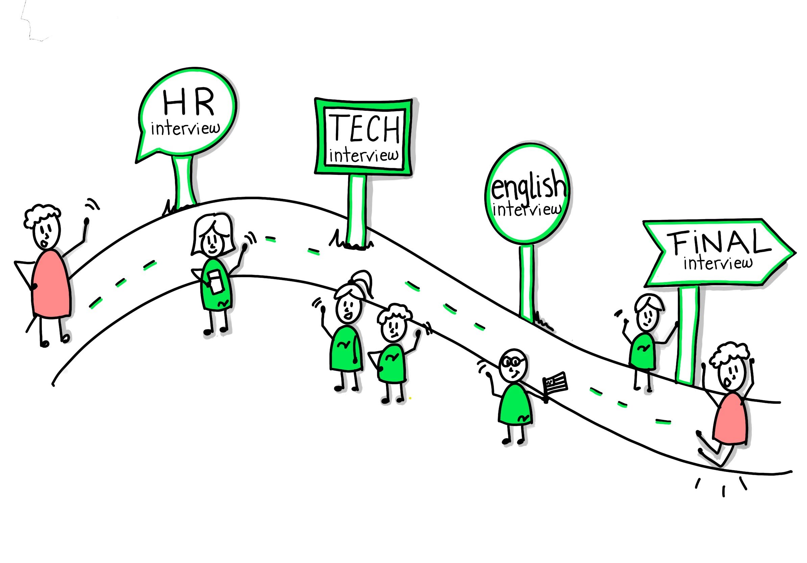
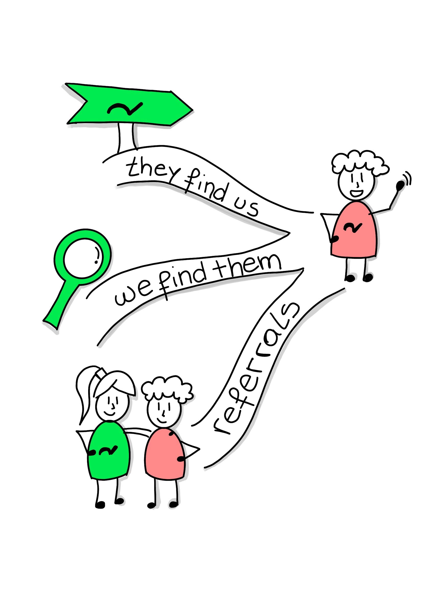

# The Engineering Hiring Process at Rootstrap

To be globally recognized digital masters, that’s our vision at Rootstrap. And we are convinced that to get there we should hire the right people. We seek those that will help us continue to offer a premium service, create remarkable products and be the perfect addition to our creative and relaxed office environment.

At Rootstrap, we believe that having a hiring process strategy in place is the ultimate tool to help your organization find the perfect candidates. It should help detect those applicants who would fit, not just cause of their skill set but also for their soft skills that can contribute to the company's culture and diversity. We believe everything really does start with a thoughtful hiring process. 

## How We Organize

We have a hiring team of about 14 people, consisting of HR analysts and engineers. Among the engineers, we divide ourselves depending on the technologies we specialize in. The team meets on a monthly basis, and we discuss upcoming job postings, new interview exercises, and review hiring process performance to identify areas for improvement. 

We see each member of this team as a Rootstrap brand ambassador. Someone that can make the candidate feel comfortable through the interview despite how nervous they may be, and someone that can clearly convey Rootstrap’s culture.

## Process

We’re going to focus on explaining how we implement this process here at Rootstrap: how it looks like, what are the steps, which areas of the company participate in each of those steps, etc.

We have four main steps. Though this may seem quite long, it’s not, a normal flow should not take much longer than 10 days. We try to maximize the interviewee’s experience while still getting the most out of it in terms of quality and information.

### Step 0: Getting the candidates

Even though we are a service company, our main goal of hiring is getting talent. We obviously have project requirements, a sales pipeline, and a bench for each technology we work with, but we make an effort to not be distracted by those demands and focus on finding the people who will continue helping Rootstrap grow.

Also, it’s very important to note that when we say we want someone who would fit in Rootstrap, we are not saying they have to fit a certain mold. We look for a diversity of profiles, we want a variety of personalities and backgrounds, because diverse teams are strong teams, and different people bring different perspectives to the table. We wouldn’t have gone this far as a company if all of us thought and behaved the same way.

So, there are basically three different ways of getting candidates into the process: 

They find us: Through articles, flyers, or posts on dedicated hiring sites where we ask for developers, designers, product owners, etc. 

We find them: Using sites like LinkedIn we target specific roles or skills that the company needs. 

Referrals: This is one of the best ways of contact between the candidate and the company. Not only is it a good indicator of your employees’ happiness with their job (they are probably not going to recommend a place to work if they aren't content), but also favorable cause employees generally recommend candidates that are a good fit. 

These three different approaches lead to the same point, once we finish with step 0 we get a candidate, and we are ready to start our interview process.

### Step 1: Human Resources Interview

Depending on the candidate’s location and availability, this interview can take place in the office itself or through a video call. It’s a 30-minute meeting carried out by one or two of our HR Analysts.

Generally, it consists of a first call in which we explain a lot of things about Rootstrap, what we do, our history, how we work, the technologies we work with, growth and learning opportunities within the company, the work environment, etc. And then, it’s time to get to know them, we want to know about their previous experiences, their attitude towards work, how they see themselves in the future, and what they are looking for in their next job, among other things. A pretty important aspect of this meeting, apart from evaluating their experience, is to assess their personality and see if the person would fit in within Rootstrap’s culture.

Once this is complete, and if the candidate seems like a good fit, a technical interview will be set with one or two of our engineers depending on the tech the person works with and the level of experience they have.

### Step 2: Technical Interview

The technical interview is the longest of all steps (it usually takes about two hours). It’s where our engineers have to assess the technological proficiency of the candidate, their reasoning and thinking process, as well as how the person seems to work in a team,  and what they would contribute to the company in terms of culture.

There are mainly three different parts to this interview.

First, we explain what we do, our teams,  internal teams, processes, and share feedback. We also want to answer any questions they have about the work they’ll be doing and their place within the company. We also want to know about them, whether they are still studying, or about past job experiences, teams they’ve worked on, projects they’ve helped create, and what are their future goals are. 

Secondly, we spend some time asking them technical questions. Some of these questions are for general programming or for the specific skill set we are hiring them for. We also show code snippets and discuss with them what is wrong with the code they are seeing, and how that code can be improved.  Our goal is to verify the level of coding knowledge they possess. 

Lastly, we give them two short written exercises to solve. These are technology agnostic and we use them to assess their problem-solving abilities.

In the next few months we will be adding online hiring tools to carry out a part of this interview and test the interviewee’s technical proficiency. This will save us some time and allow us to interview a growing number of candidates and make the process more dynamic. However, this won’t replace the face to face interview in its entirety, since it’s an integral part in order to get to know the person. 

This technical interview is very important, but technical proficiency is not all we look for in a candidate, and we’ve also forgone some candidates that were very good technically but lacked other characteristics, like being open to feedback, eager to take on new challenges, and wanting to continually improve themselves. 

### Step 3: English Interview

This step is very important, because the great majority of our clients are English speakers, so it’s vital that we can all communicate fluently with them. However, in most cases this interview does not deter us from hiring the person. We provide on-site English classes for those people who may need more support once they become a part of the team.

We usually have a video call with the candidate which takes about 15-20 minutes. Depending on the level of English the candidate expressed to have, we take one of two approaches:

If the candidate has a basic level of English we have a simple conversation about general topics where we try to cover different subjects and grammatical structures.
On the other hand, if their level is higher, we play pretend and ask them to select a web page they would like to demo for us, pretending they are the ones that developed it.

We obviously check for grammatical correctness, sentence building, and vocabulary diversity, but we mostly try to see that the person is able to communicate their ideas effectively and is able to get their message across.

### Step 4: Final Interview

The fourth and last step would be to have an interview with some of our engineering managers in order to meet the candidate before officially joining the company. It’s also an excellent opportunity for them to ask any other questions they have before finishing the process, to connect with them individually, and to close the interview process.

And that is how people have been joining the engineering team at Rootstrap in the last year. It’s the process we have had success with, but that doesn’t mean it’s the best. We are constantly evaluating it, modifying the things that are not working, and making improvements where we see fit to accommodate an ambitiously growing company with new challenges each day.

If you’d like to join our team you can contact us at hr@rootstrap.com, or send us a message to our [LinkedIn account](https://www.linkedin.com/company/rootstrap-it).

*Thanks to Cami Gimenez for the awesome drawings and my teammates who helped and gave me feedback about this article.*
