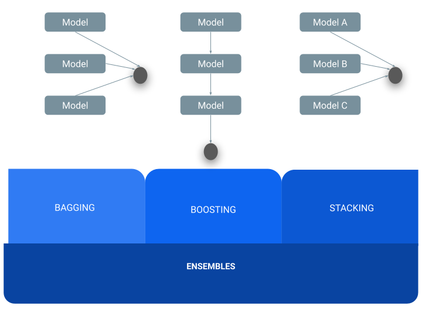

# Ensembles

Sometimes some models perform well for certain cases and in other cases other models fit better the data. Why not combine those models to create a more powerful model? Your predictions are going to be much more accurate! However, do not get so ex 

Ensembles are a combination of several ML models in order to generate a better model. 
There are [three](https://stats.stackexchange.com/questions/18891/bagging-boosting-and-stacking-in-machine-learning) main ways of combining models:         
- **Baggin:** the *same* model is performed several times changing the training dataset, the outputs are combined by averaging (prediction) or voting (classification).                  
- **Boosting:** *consecutive* execution of the model learn in sequence correcting errors that the predecessor model made. The goal is to improve areas of the data where the model makes errors.             
- **Stacking:** several models learn in *parallel* and finally are combined by averaging (prediction) or voting (classification).         

While the ensembles seem to resolve all the problems, they are not magic and they also have disadvantages. In this table advantages and disadvantages are presented. You might need to find a balance between them and decide if it is convenient to use them or not for your specific problem. 

|Advantages|Disadvantages|
|----------|-------------|
|Ensembles usually have a **better prediction** than a single model|It requires more **computational cost**|
|Ensembles that can be performed in **parallel** are a fast way to improve the prediction, since different teams can work separately and execute in different environments, and then combine the results	|Ensembles that use multiple data sets require data to be **collected and stored**|
|Ensembles that use different samples of the data help to **avoid overfitting**, since more cases are covered|The ensembles might turn on into **blackboxes**, since it can get complex to understand the relationship between predictors and outcomes|
