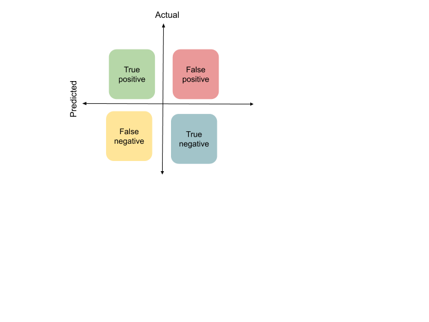
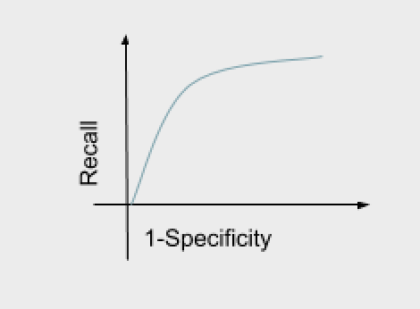

# Evaluating models
Once that we have executed the model, we would need to know if it works correctly and measure how well it works. So, here several questions come up:           

- How can we know if the algorithm is working correctly?       
- How can we trust the outputs?          
- How can we know if an algorithm is better than other?        

Metrics are needed so as to be able to evaluate the models and make comparisons between them. In this article metrics are defined either for regression and classification techniques to give you an idea about what you should have to compare and take care of when performing the model.  

## Loss function
The loss function is a method of evaluating how well the ML algorithm fits the data. If the predictions are good, when the predicted values are close to the real values, so the error is lower, it means that the loss is lower. We always are trying to minimize the loss function in order to have less error. The loss function can take different formats, depending on the problem that you are trying to solve, which loss function it is better to use. It depends on the meaning. 

## Classification
For classification problems, there are several metrics used, to see different aspects of the prediction. It not only matters how well the classification was, but also matters which are the classes that were wrong classified. Thus, here are provided definitions for different metrics. 

The following example is for 2 classes oriented to “yes/no” questions. The table is called the confusion matrix and shows the possible combinations between the predicted and the actual values. The table describes the predicted values as Positive and Negative ,and the Actual values as True and False.       

- True Positive: You predicted positive and it’s true.       
- True Negative: You predicted negative and it’s true.      
- False Positive: (Type 1 Error)       
- Interpretation: You predicted positive and it’s false.       
- False Negative: (Type 2 Error)

**Precision:** is the fraction of the number of true positives among the total instances classified as positive. Out of all instances classified as positive, how many were predicted correctively classified.

)  

**Recall (sensitivity):**  is the fraction of true positives among the total positive instances. Out of all positive instances, how many were predicted correctively as positive. 

)

**Specificity:** is the fraction of true negatives among the total negative instances. Out of all instances, how many were predicted correctively as negative. 

)

**Accuracy:** Out of all the instances, how much were predicted correctly. 

%2F(TP%2BFP%2BFN%2BTN))

**F1 score:**  it is used to show if the classifier has good value for precision and recall.

**AUC - ROC:** ROC is a probability curve, it plots Recall vs (1-Specificity). It means that plots the True positive rate vs False positive rate. The area under the curve is AUC. AUC represents degree of separability. It tells you how much the model is capable of distinguishing between classes. The higher the AUC, the better the model is. 

**Logarithmic loss(cross-entropy):** is a probability value between 0 and 1. Log loss increases when the predicted value is far from the actual value. The objective is to minimize the log loss. Thus, a perfect model would have a log loss of 0.

**Jaccard index:** it is a statistic to measure similarity between two sets. Given two sets A and B, the Jaccard index is defined as the intersection divided by the union.

%3D%5Cfrac%7BA%5Cintersection%20B%7D%7BA%5Cunion%20B%7D)

**Lift chart:** A lift chart represents the improvement that the model provides when compared against a random guess. Compares the model predictive performance to the baseline.

**Decile chart:** the records are ordered by their predicted score and grouped into 10 equal parts “deciles”. The ideal situation is the staircase effect from left to right.  

**Gain:** Gain at a given decile is the ratio of cumulative number of events up to that decile to the total number events in the entire data set.

**Cutoff value:** the record is assigned to the class if the probability is below a threshold (cutoff value). 

## Regressions
For prediction problems, several [metrics](https://www.jeremyjordan.me/evaluating-a-machine-learning-model/) are used, all of them compare predicted vs actual values. 

**[Generalization error:](https://medium.com/@yixinsun_56102/understanding-generalization-error-in-machine-learning-e6c03b203036)** it shows how well a model is able to predict outcome values for previously unseen data. It is just the difference between the predicted values and the actual (the true) values. 

**R-squared error:** represents the percentage of observed variance from the mean that is explained by the model. Higher is better. 

**Mean squared error:** is the average of squared differences between the predicted output and the actual output. Lower is better.

%5E2)

If there is a single very bad prediction, the squaring will make the error even worse.  

**Root means squared error:** is the standard deviation of the residuals ( the prediction errors). It measures how far from the regression line the data points are. 

%5E2%7D)

**Mean Absolute Error:** average of absolute difference between the actual values and the predicted values.  

It penalizes huge errors. Thus, it’s not that sensitive to outliers as Mean Square Error.

## Trees
For trees there are some [metrics](https://medium.com/@rishabhjain_22692/decision-trees-it-begins-here-93ff54ef134), which are explained below.

**Impurity:** The result of a tree classification is different groups of elements. If a group contains only elements of the same class it is called pure, if the elements are from different classes is impure. Measuring the impurity of a tree means analyzing the homogeneity among the classes grouped. If all the elements belong to a single class, then it can be called pure.

**Gini impurity:** it measures the probability of a particular variable being wrongly classified when it is randomly chosen. We want the lower gini impurity. It is a value between 0 and 1, where 0 refers to the case when all elements belong to the same class. Therefore, a Gini Index of 0.5 denotes equally distributed elements into some classes.

*(1-p(i)))%7D)

**Entropy:** It is the degree of uncertainty, it measures the level of disorder in the division done. if the sample is completely homogeneous the entropy is zero. if the sample is equally divided then it has entropy of one. High entropy means low level of purity. The value p refers to the probability. 

*(log(p(i))))%7D)

**Information gain:** is used to determine the level of  information that the features gives about a class. It is based on the concept of entropy. It aims to reduce the level of entropy starting from the root node to the leave nodes. A larger information gain suggests a lower entropy. 

# Conclusion
Thus, in order to evaluate the performance of the algorithms there are different metrics according to the type of model that you are using. By using the same metric in different models you can compare the performance to see which one is the best. Be careful, you need to pay attention to the meaning of your data, a model that might have less performance works better because it predicts well cases that are more interesting.

