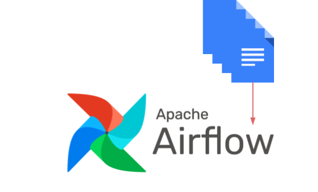
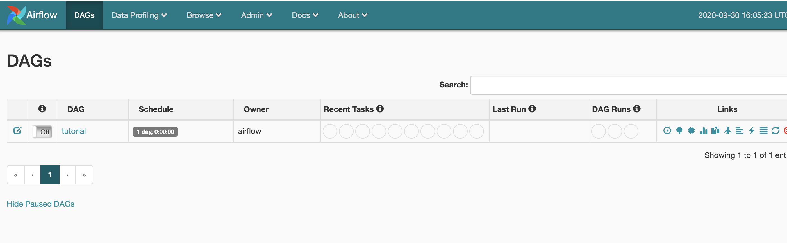
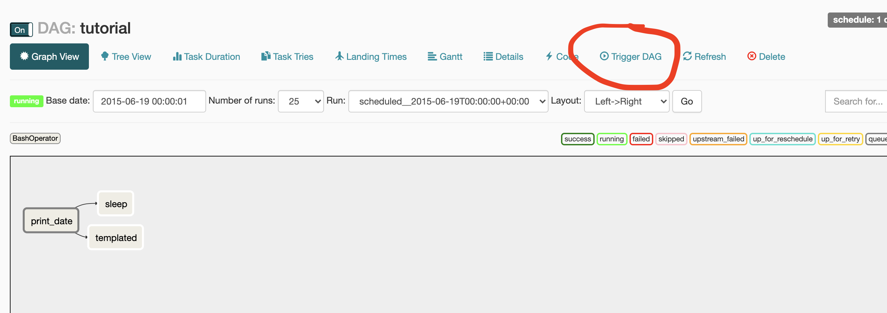
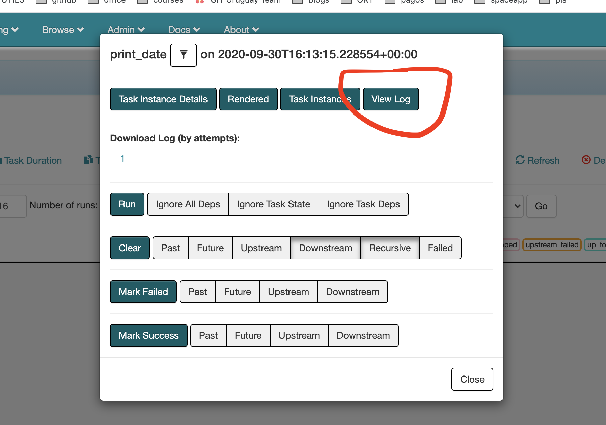
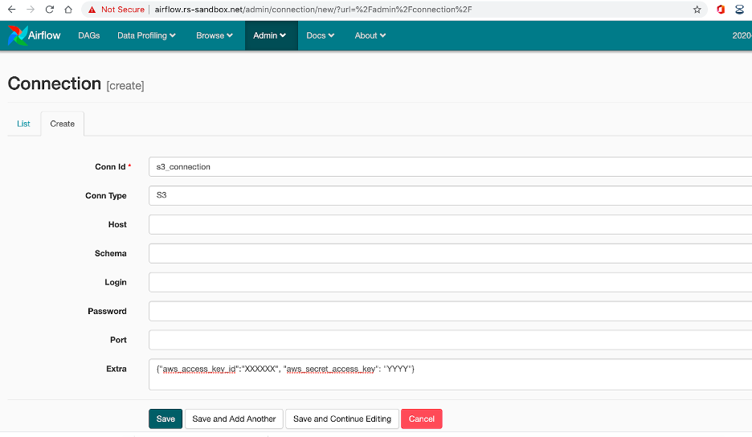
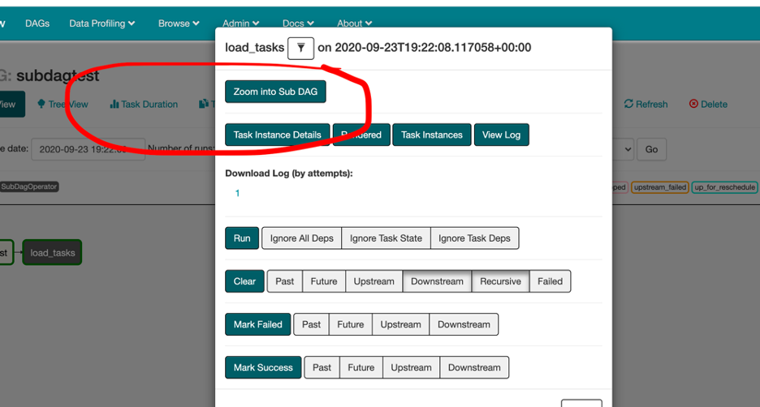
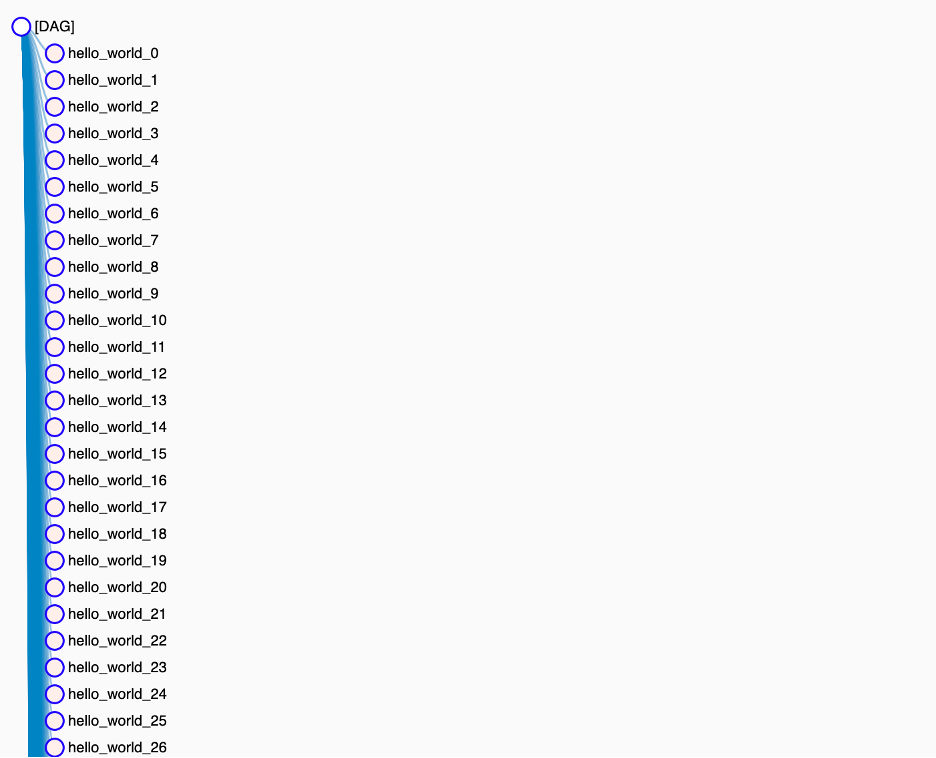

# Experimenting with Airflow to Process S3 Files


With machine learning, we always need to deal with ETL processing (Extract, Transform, Load) to get data ready for our model. Airflow can help us build ETL pipelines, and visualize the results for each of the tasks in a centralized way.   
In this blog post, we look at some experiments using Airflow to process files from S3, while also highlighting the possibilities and limitations of the tool.


## What is Airflow? 
Airflow is a platform used to programmatically schedule and monitor the workflows of tasks. This workflow is designed as a dependency graph between tasks. 

It is composed of a **scheduler** which sends tasks to be executed following the dependencies and **workers** which execute the tasks. It also provides a **user interface** to visualize and monitor running pipelines, view logs, and start workflows manually.

**Airflow executors:** Executors are the mechanism by which task instances get run. Airflow has different executors, you can them find [here](https://airflow.apache.org/docs/stable/executor/index.html). The most common ones are:

- **SequentialExecutor:** The default executor where tasks are executed sequentially.        
- **LocalExecutor**:  LocalExecutor runs tasks on the same node as the scheduler. It allows you to locally run multiple jobs in parallel. 
- **CeleryExecutor** **:  This is the **_most mature option_** and requires Redis or RabbitMQ to queue the tasks.
- **KubernetesExecutor**: This executor was introduced in version **1.10.0**. With KubernetesExecutor, you can prepare different docker images for your tasks with more flexibility.      

FYI - since CeleryExecutor is more mature, experiments have been performed with this executor in the architecture.   

## Airflow Architecture 

So, when using the Celery Executor, these are the componentes of the architecture:  

- A **Database**: This contains DAG's (workflows) status and task instances.
- Airflow **Web Server**: A web interface to query the database status, and monitor and execute DAGs.
- Airflow **Scheduler**: This sends tasks to the queues and updates information in the database. 
- **Message broker**: Inserts the task's commands to be run into the queue.
- Airflow **Celery workers**: Retrieves commands from the queue, executes them, and updates the database.


So, the Airflow Scheduler uses the Celery Executor to schedule tasks. The Celery Executor enqueues the tasks, and each of the workers takes the queued tasks to be executed. 

All of the components are deployed in a Kubernetes cluster. The database can be MySQL or Postgres, and the message broker might be RabbitMQ or Redis. 

## DAG 

A [DAG](https://airflow.apache.org/docs/stable/concepts.html) (Directed Acyclic Graph) represents a group of tasks, where dependence might exist between them. It is defined as a python script that represents the DAG's structure (tasks and their dependencies) as code.

Each of the tasks is implemented with an operator. Different types of operators exist, and you can create your custom operator if necessary. The most common operators are BashOperator (to execute bash actions), and PythonOperator (to execute python scripts/functions). In this blog post, different examples are provided using some of the [operators available](https://airflow.apache.org/docs/stable/_api/airflow/operators/index.html).  


## Running Airflow locally 

You can locally run the Kubernetes cluster for airflow locally with Docker Compose. Download this [repo](https://github.com/puckel/docker-airflow]).

Docker Compose runs an airflow architecture composed by:    
	- 1 worker & scheduler       
	- Flower (jobs' UI)   
	- Redis (as broker)      
	- Postgres (database)      

So you know, all components are docker containers.

**Run with Celery Executor:**           

```bash
docker-compose -f docker-compose-CeleryExecutor.yml up -d
```

## Basic Operations

**List DAGs:** In the [web interface](http://localhost:8080/admin/) you can list all the loaded DAGs and their state. 



You can use the command line to check the configured DAGs: 

```bash
	docker exec -ti docker-airflow_scheduler_1 ls dags/
```

**Run Manually** 
In the list view, activate the DAG with the On/Off button. Then, enter the DAG and press the Trigger button. 



**See Logs:**

To see the logs for a task from the web, click on the task, and press the 'View Log' button. 



You can also check the logs for the scheduler and the worker from the console via the following:

- Scheduler's logs :

```bash
	docker logs -f docker-airflow_scheduler_1
```

- see worker's logs:

```bash
	 docker logs -f docker-airflow_worker_1
```

## Experiments with Operators:

### BashOperator

The BashOperator executes a bash command. This example contains three bash tasks, two of which can be executed in parallel. 
To execute it, activate the tutorial DAG and enter the view for the DAG. You will then see that the first task of the DAG will be scheduled and then queued for completion. 
 
### S3FileTransformOperator
      
This Operator is used to download files from an S3 bucket, before transforming and then uploading them to another bucket. Therefore, in order to use this operator, we need to configure an S3 connection.

In the web interface, go to Admin->Connections, and set the connection id and type. Add the access key and the secret key as ‘extra’ arguments.

To get the canonical user for S3: 
```bash
	aws s3api list-buckets --query Owner.Ioutput text
```

```python
from airflow import DAG
from airflow.operators.bash_operator import BashOperator
from airflow.operators.s3_file_transform_operator import S3FileTransformOperator

from datetime import datetime, timedelta


default_args = {
    "owner": "airflow",
    "depends_on_past": False,
    "start_date": datetime(2020, 9, 7),
    "email": ["mikaela.pisani@rootstrap.com"],
    "email_on_failure": False,
    "email_on_retry": False,
    "retries": 1,
    "retry_delay": timedelta(minutes=5)
}

with DAG("s3_transformer", default_args=default_args, schedule_interval= '@once') as dag:

    t1 = BashOperator(
        task_id='bash_test',
        bash_command='echo "hello, it should work" > s3_conn_test.txt'
    )


    transformer = S3FileTransformOperator(
        task_id='ETL_medical_records',
        description='cleans ETL_medical_records',
        source_s3_key='s3://XXX/YYY/ZZZ.xml',
        dest_s3_key='s3://XXX/YYY/WWW.xml',
        replace=False,
        transform_script='/usr/local/airflow/dags/scripts/transform.py',
        source_aws_conn_id='s3_connection',
        dest_aws_conn_id='s3_connection'
    )

    t1.set_upstream(transformer)
```
Change the parameters source\_s3\_key and dest\_s3\_key in the script, and then copy the dag to the dags folder.  

```bash
	 docker cp test_s3_file_transform_operator.py  docker-airflow_webserver_1:/usr/local/airflow/dags/
```

Create the script 'transform.py'

```python
	#!/usr/bin/python3
	
	
	import sys
	
	input=sys.argv[1]
	output=sys.argv[2]
	
	print("Starting data transformation...")
	# DO SOMETHING
	print("Completed data transformation!")
```

Copy it to the container: 

```bash
	 docker exec -ti docker-airflow_webserver_1 mkdir /usr/local/airflow/dags/scfipts/ & docker cp transform.py  docker-airflow_webserver_1:/usr/local/airflow/dags/scfipts/
```

To run this task, we will need to install some libraries in the containers and then restart them: 

```bash
	docker exec -ti docker-airflow_worker_1 pip install boto3 boto botocore & docker exec -ti docker-airflow_scheduler_1 pip install boto3 boto botocore & docker exec -ti docker-airflow_webserver_1 pip install boto3 boto botocore
```

Restart the containers:

```bash
	docker restart docker-airflow_worker_1 & docker restart docker-airflow_scheduler_1 & docker restart docker-airflow_webserver_1
```



It's important that the script you set in the S3FileTransformOperator starts with **#!/usr/bin/python3 **in the form of python.      

**Potential problem: If your script needs specific libraries to be installed (like pandas), they are NOT installed in the worker. So, when it executes, the task then gives you an error. There is not a clean solution for this issue unless you use KubernetesExecutor instead of celery.**

If you are having problems, you can create a **DAG** that contains a [S3KeySensor](https://airflow.readthedocs.io/en/stable/_modules/airflow/sensors/s3_key_sensor.html) to test the connection.         


### AWSAthenaOperator

This connector allows you to make a query to Athena's database. You will need to set the s3_connection in the ``aws_conn_id`` parameter. This connection should be defined in the connection configuration. 

Update the following script with the correct database and desired query. You need to create a database in [AWS Athena](https://aws.amazon.com/es/athena/?whats-new-cards.sort-by=item.additionalFields.postDateTime&whats-new-cards.sort-order=desc) to query the S3 files.  

```python 
from airflow import DAG
from airflow.operators.bash_operator import BashOperator
from airflow.operators.s3_file_transform_operator import S3FileTransformOperator
from airflow.contrib.operators.aws_athena_operator import AWSAthenaOperator

from datetime import datetime, timedelta


default_args = {
    "owner": "airflow",
    "depends_on_past": False,
    "start_date": datetime(2020, 9, 7),
    "email": ["mikaela.pisani@rootstrap.com"],
    "email_on_failure": False,
    "email_on_retry": False,
    "retries": 1,
    "retry_delay": timedelta(minutes=5)
}

with DAG("query_s3", default_args=default_args, schedule_interval= '@once') as dag:

    t1 = BashOperator(
        task_id='bash_test',
        bash_command='echo "Starting AWSAthenaOperator TEST"'
    )

    run_query = AWSAthenaOperator(
        task_id='run_query',
        database='{DATABASE}',
        query='select {PARAM} FROM "{DATABASE}"."{TABLE}"',
        output_location='s3://s3://XXX/YYY/ZZZ',
        aws_conn_id='s3_connection'
    )

    
    t1.set_upstream(run_query)
```    
Copy the DAG to the DAG's directory and execute it from the web interface. 

**KubernetesPodOperator**

This DAG executes the task into a pod, and you then have the option to kill the pod once it finishes the execution.  
If you have the following error: 

```bash 
	{pod_launcher.py:84} ERROR - Exception when attempting to create Namespaced Pod.
```
Add **in_cluster=True** in the DAG to specify that the pod will be running in the same cluster. 

**SubdagOperator**

This dynamically creates a subDag inside the dag. 

```python 
from airflow import DAG

from airflow.operators.subdag_operator import SubDagOperator
from airflow.operators.bash_operator import BashOperator
from airflow.hooks.S3_hook import S3Hook
from airflow.operators.dummy_operator import DummyOperator
from airflow.operators.python_operator import PythonOperator

from datetime import datetime, timedelta


default_args = {
    "owner": "airflow",
    "depends_on_past": False,
    "start_date": datetime(2020, 9, 7),
    "email": ["mikaela.pisani@rootstrap.com"],
    "email_on_failure": False,
    "email_on_retry": False,
    "retries": 1,
    "retry_delay": timedelta(minutes=5)
}

def hello(file):
    print('Hello!!!! ', file)


def loop_files(parent_dag_name, child_dag_name, args):
    dag_subdag = DAG(
        dag_id='{0}.{1}'.format(parent_dag_name, child_dag_name),
        default_args=args,
        schedule_interval="@once",
    )
    
    tasks = []
    for i in range (5):
        tasks = tasks + [PythonOperator(
            task_id='hello_world' + str(i),
            op_kwargs={'file': str(i)},
            python_callable=hello,
            dag=dag_subdag)]


    return dag_subdag
            


dag = DAG("subdagtest2", default_args=default_args, schedule_interval= '@once')

start_op = BashOperator(
    task_id='bash_test',
    bash_command='echo "Starting TEST"',
    dag=dag )

loop_files = SubDagOperator(
    task_id='loop_files',
    subdag=loop_files('subdagtest2', 'loop_files', default_args),dag=dag
)


start_op >> loop_files
```

When you run it it, from the web it appears the option to enter to the subdag's information and logs:


This example lists the files in a s3 bucket and for each file creates a subdag "hellow_wold_X". 



**Problem: too many tasks are queued, and it is probable that you will need to add more workers.**


# Lessons learned
- When you don't need specific dependencies, use BashOperator or PythonOperator
- When your tasks need specific dependencies, use KubernetesOperator    
- Subdags are useful when you need to repeat a serie of tasks for each S3 file, but you need to be careful to control the size of the queue. 
