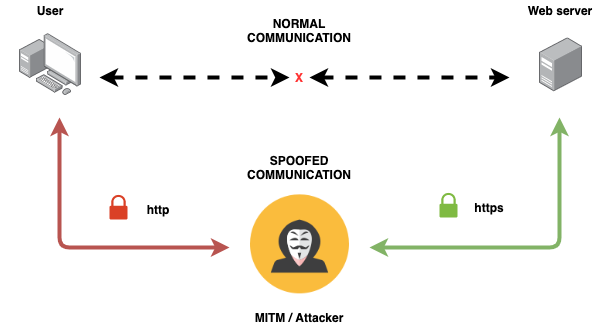

# HTTPS is not enough

_[Pablo Blanco](https://www.rootstrap.com/blog/author/pabloblancorootstrapcom/)
is a Full-Stack developer on the Rootstrap team and writes about his experience
with ethical hacking and information security. You can also follow Pablo on
[LinkedIn](https://www.linkedin.com/in/pablo-blanco-a6b5a371/)._


Nowadays it is common to implement HTTPS for the sites and APIs we develop, well
that’s fine but it is not enough to protect users from being hacked because
there are chances of identity getting stolen, and an extra security layer should
be applied. In this post, we are going to explain why only HTTPS is not enough
to secure our sites and how can we improve user’s protection. But first, let’s
recap with a few definitions.

**What is TLS/SSL?**

TLS (Transport Layer Security), formerly known as Secure Sockets Layer (SSL) is
a standard security protocol for establishing an encrypted link between a server
and a client. This is typically used to secure communications between web
servers and a browser, or a mail server and a mail client.

**What is HTTPS?**

HTTPS (Hypertext Transfer Protocol Secure) is a secure version of the HTTP
protocol that uses the SSL/TLS protocol for encryption and authentication.

## Why only HTTPS is not enough?

Encrypted communications are an essential requirement for health, banks,
financial and other applications where information security is crucial.

To improve accessibility, most secure websites run an HTTP(301) service to
redirect users from HTTP to HTTPS endpoints. That redirection **does not** fully
protect the user since it can be intercepted between when the visitor requests
the HTTP version of the site, and when it reaches the HTTPS destination, this
gives the attacker the opportunity to implement **"man in the middle SSLstrip"**
and **"session hijacking"** attacks.

Let’s suppose this scenario, a user of our application logs into a free WiFi
access point at an airport and starts surfing the web, visiting our online
banking service to make some transactions, and pay a couple of bills.
Unfortunately, that access point can be sniffed by an attacker, and it’s really
easy to intercept all the original HTTP requests and redirect them to a clone of
the bank's site instead of the real thing. Then, the user’s data is exposed to
the attacker.

Well maybe you are thinking, no-one is supposed to access their bank account on
a public Wifi network, and you are completely right, but the same scenario can
be considered if someone hacks into our **private Wifi network** too.

This kind of man in the middle attack is basically performed by the following
steps:



1.  User asks for `https://somedomain.com`
2.  MITM intercepts that, and asks for `https://somedomain.com` to the Server
3.  The server responds to MITM `https://somedomain.com`
4.  MITM responds to the User with `http://somedomain.com`

After that, the attacker can see plain data over the requests made by the user.

## How can we mitigate HTTPS vulnerabilities?

Whenever a browser requests a page from a web server, the server answers to the
browser with the content along with some useful information, contained in
**headers**. Many SSL-related vulnerabilities can be mitigated with a special
type of headers, called security headers that can tell browsers how to treat
content on a web page such as “whitelist certain types of content from trusted
sites” or “only load this site over HTTPS”, for this particular vulnerabilities
there are 2 types of headers we can use, **HSTS** and **CSP**.

### HTTP Strict Transport Security (HSTS)

The HTTP Strict-Transport-Security response header, lets a website tell browsers
that it should only be accessed using HTTPS strictly, instead of using HTTP, and
should automatically convert all attempts to access the site using HTTP to HTTPS
requests instead.

This header is specified by [RFC6797](https://tools.ietf.org/html/rfc6797) and
contains three directives:

- **max-age** (mandatory): time in seconds, that the browser should remember
  that a site is only to be accessed using HTTPS.

- **includesubdomains** (optional): indicates if this rule applies to all of the
  site's subdomains as well.

- **preload** (optional): indicates that the site meets requirements for HSTS
  preloading and is on the HSTS preload list or has applied for it.

Once the browser has set up HSTS for a site, all communication with that site
will use HTTPS, which **eliminates the SSL stripping threat** and guarantees
secure transmission.

#### Keep browsers updated

Everything looks fine still here, but the first time a user visits an unknown
site, the browser relies on the server’s responses to determine the correct
protocol. Attackers could intercept this first visit and redirect it to an
insecure website using a man-in-the-middle attack. This is not as rare as it
seems – it just means that the site is not present in the browser’s HSTS
database. While this can be the result of a time-based attack via NTP, it can
also happen if the max-age expiry period since the last visit has passed, the
browser is a fresh install, the server is misconfigured (for example max-age was
left at 0 after testing) and so on.

To remedy this issue and also improve page load speeds,
[modern browsers](https://caniuse.com/#feat=stricttransportsecurity) (Chrome,
Firefox, Safari, among others) check if a certain domain is HSTS-enabled against
a common preloaded list called [hstspreload.org](https://hstspreload.org/).

There, webmasters and site administrators can submit it’s domains for inclusion
in Chrome's HTTP Strict Transport Security (HSTS) preload list. By including our
domains to that list we are sure to force the user’s browser to navigate our
site over HTTPS **strictly**.

If a site is listed, the browser always connects to it using HTTPS, even on the
first visit. This effectively eliminates the only significant vulnerability in
HTTPS enforcement, ensuring end-to-end encryption.

**To add our site to the preloaded list we need:**

1. Present a valid certificate
2. Redirect all HTTP requests on port 80 to HTTPS
3. Include the HSTS header in any additional HTTPS redirects
4. Serve all subdomains over HTTPS
5. Specify all header directives: max-age must be at least 31536000 seconds (1
   year), and **includesubdomains** and **preload** must be present

### Content Security Policy (CSP)

Another header that can help us is Content Security Policy (CSP), this is used
to detect and mitigate certain types of attacks like cross-site scripting (XSS),
clickjacking and other code injection attacks resulting from execution of
malicious content in the trusted web page context. A CSP can be used for simple
purposes like enforcing HTTPS on SSL-enabled sites, to more sophisticated uses
like authorizing only truly trusted sources and blocking others.

Using CSP also makes sure that we don’t have mixed content errors on our site.
For example, if we have a HTTPS site and HTTP is embedded in the site (like a
video), then we will wind up with mixed content errors in the browser console. A
CSP could direct a website to set all URLs as HTTPS, to avoid any mixed content
errors.

This header contains only the policy, and can be defined this way:

`Content-Security-Policy: default-src 'self'`

Here we are saying that all content to come from the site's own origin
(excluding subdomains). The policy provides many options that can be found
[here](https://developer.mozilla.org/en-US/docs/Web/HTTP/CSP).

**How can I check if any site uses security headers?**

We can check server response headers by using curl or nmap (more detailed
information), here are a few examples:

**_An example of a redirection without HSTS or CSP_** -
[(Gists reference)](https://gist.github.com/pablanco/0f299835b207db93b39f108bbb4fe87e)

```
$> curl --head https://www.not-hsts-header.com
HTTP/1.1 301 Moved Permanently
Content-length: 0
```

```
$> nmap -p 443 --script http-security-headers not-hsts-header.com
....
PORT    STATE SERVICE
443/tcp open  https
| http-security-headers:
|   Strict_Transport_Security:
|     HSTS not configured in HTTPS Server
|   X_XSS_Protection:
|     Header: X-XSS-Protection: 0
|     Description: The XSS filter is disabled.|
|_
```

**_An example with HSTS_** -
[(Gists reference)](https://gist.github.com/pablanco/765821aa10128d3e57c4847c070c38f4)

```
$> curl --head https://www.hsts-header-enabled.com
HTTP/2 200
strict-transport-security: max-age=15552000; preload
```

```
$> nmap -p 443 --script http-security-headers hsts-header-enabled.com
....
PORT    STATE SERVICE
443/tcp open  https
| http-security-headers:
|   Strict_Transport_Security:
|     Header: Strict-Transport-Security: max-age=15552000; preload
|   X_XSS_Protection:
|     Header: X-XSS-Protection: 0
|     Description: The XSS filter is disabled.
|_
```

## Summary

If our site uses HSTS, the browser would connect over HTTPS automatically,
without needing a redirect, so apart from gaining in security, we also gain in
performance because we don’t need to make server redirections. HSTS headers,
like any other data that handles time records are vulnerable to NTM attacks
(tampering attack that modifies the machine's clock to trick the browser). HSTS
and CSP headers provide the user with a good level of security by minimizing
some vulnerabilities present at HTTPS.

## References

https://cheatsheetseries.owasp.org/cheatsheets/HTTP_Strict_Transport_Security_Cheat_Sheet.html
