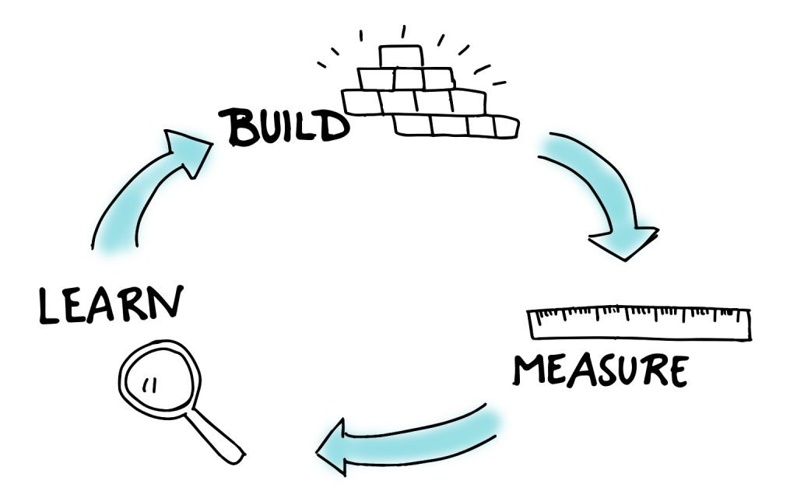
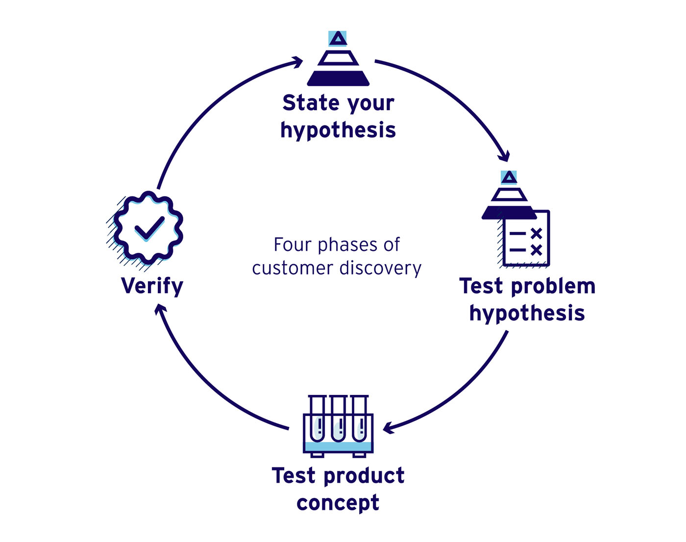

# **GROWTH - Data Analysis based decisions**

Have you ever said one of these tricky phrases?
  - I'm sure this feature is going to rock!
  - We need this feature before going live, it is a must!
  - Users will use this for sure!

Well, if you found yourself saying any of those without any numbers that support you, you may probably be making a lot of assumptions.
So is like you are playing roulette, due to lacking data to prove your hypothesis.
Give growth a try! And find out how to move smarter with your development team along with really learning what your users want!

## What's GROWTH?

I see growth as a way of working around data analysis based decisions. So first let's explain a bit what data analysis is:

`Data analysis is defined as a process of cleaning, transforming, and modeling data to discover useful information for business decision-making. The purpose of Data Analysis is to extract useful information from data and taking the decision based upon the data analysis`

You may see that the word `data` came up a lot, that's not because I want to be redundant but because I want to emphasize it as a really important concept. Nowadays the more data you have the more power you have to make better decisions.

## How to start?

As I mentioned before, start gathering data, it doesn't need to be super high-quality data, you will start learning from your users and your business reality and improve step by step.
A simple step you can take at a really low cost is adding some forms and analytics to your landing page. This way you will start getting feedback from users and also start knowing your user's interactions and interests.

First, see an initial approach on how you should approach your changes:

You will start building something as small as possible to lessen the number of mistakes you can make.
Then you measure it by testing it with users since they are the only ones with the truth on whether it will succeed or not.
Finally, learn from your measures and keep building, but now with a clearer idea of what users want.

To plan what to build you can follow this simple process, also to manage each specific change.

  - Write down your hypothesis based on your business goals
  - Plan tests on your product to validate your hypothesis
  - Measure
  - Verify your numbers against what you thought

The most important step at the end is to make decisions based on your learnings, adjusting your upcoming features/hypothesis based on learnings.

## Common mistakes

#### First and most usual mistake: assuming you know how users will behave

You will probably be wrong, instead of that write a hypothesis and try to prove it. It can be as simple as "I want to prove that I get more sales if I place the BUY button at the top with a brighter color" or more complex like "I think users are tempted to buy if I offer discounts after 10 minutes of looking at items in my store"

#### Misread data

Actually is really easy to fall on this error, as you have an idea in your mind and naturally, you want it to end up with that being truth.
So my proposal for this is to again write down your ideas based on hypothesis and set up expected metrics for each of them, so you can properly check against something objectively.

Here are some tips to prevent falling into misreading data:
  - Write down your findings, don't make decisions on the go (just reading data)
  - Do multiple rounds of data check (like reading something multiple times before releasing)
    - First round: check the more granular data
    - Second one: try to detect patterns or contradictions between previous deductions
    - Third one: take into account the "big picture", you are analyzing data and users under a certain context, so think about how your context may compromise your data
    - Last one: remember you are evaluating a subset of your universe, so consider you may have some deviation and so don't make absolute decisions

#### Think you have finished

This is a continuous delivery process that never ends. User preferences changes and you can always detect new opportunities or tends to look at data.
I see this as a simple process that prevents you to take wrong decisions, so you only can win from using it.

## Do I need an engineer?

Actually you don't, but having one will provide you a different perspective from a structured data result mindset. Let's see what does this means...
You as a product owner, sales manager, investor, etc. will probably be the one with the most knowledge about users and your product, but, do you know how to measure your product performance and record your user's interactions over your app? Probably not.
So here is where an engineer can help you:
  - Adding metrics on your app
  - Recording user journeys to provide you a better understanding of their experience
  - Crossing information from different inputs (social media, ads, etc)
  - Generating reports
  - Processing data so you can take more time on your business instead of the product development

And honestly depending on the level of expertise of the engineer I can continue providing good reasons to work with one of them.
So my recommendation for you is to look for a complete engineer, not just a developer. That will help you look at your business from more points of view

## Conclusions

#### Mindset
Be curious, be analytical, and try to validate as much as possible as you introduce changes.

#### Changes
Changes are good! Make them as much as possible so you learn more, but keep them organized so it doesn't become anarchic. 

#### Organization
"Diversity is a source of wealth" we all know that, so the only problem to deal with is how to work with other roles while keeping an open mindset.
Invest some time explaining your team what you want and why. People understanding what they are doing is way more effective.
