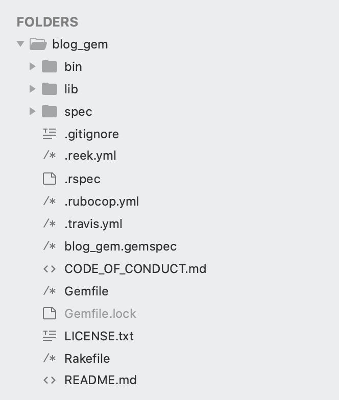
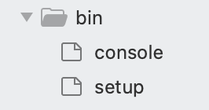
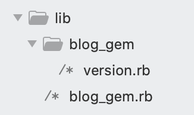
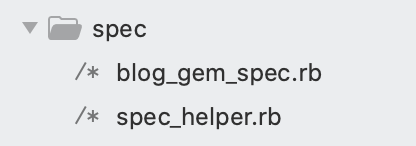

# **How To Make Your First Ruby Gem ( a step-by-step guide)**

Every developer who has worked with ruby on rails and has felt passion or interest for the open source world, has wanted or wants to do a contribution to this community of development with a gem which could solve a particular or generic problem or improve an existing one, that appears in different projects across the developer career.

However, sometimes it happens that one doesn't know where to start or how is a gem made in the first place, or other times one thinks or has the idea that to make a gem is a really hard or complicated task. For that reason, this article is aimed to inquire how to make your first gem and to explain a bit the different components of it.

Here at Rootstrap, we are very interested in being reconized in the open source world. For that reason, we have been working in this topic for some time, making libraries for diferents languages and frameworks and making them visible with blogs and posts in social media. In particular, we made [rsgem](https://github.com/rootstrap/rsgem), a gem which generates a base project to make a gem, in which one this article is based on.


## Starting The Gem

The first step to start is to install the rsgem, this is able to do easily by running `$ gem install rsgem`. After we have the gem installed, we have to run `$ rsgem new [name]`, with the name that we want for our gem. In particular, in this blog, we will be running the command `$ rsgem new blog_gem`, and this will generate a project with the following structure:



It's important to mention that the gem rsgem is based on the command 'bundle gem', said command is the one that generates the directories and the files that we see. Now, we will mention the different components which are generated for the gem that we want to create.

## Bin Folder



In the Bin folder, we can find the console and setup files. The important thing to highlight here is the utility of console file where we can see the next code:


```ruby
#!/usr/bin/env ruby

require 'bundler/setup'
require 'blog_gem'

# You can add fixtures and/or initialization code here to make experimenting
# with your gem easier. You can also use a different console, if you like.

# (If you use this, don't forget to add pry to your Gemfile!)
# require "pry"
# Pry.start

require 'irb'
IRB.start(__FILE__)
```

If we have to do test from the terminal with our gem, we only need the command bundle console 'require_name' to be able to access to the interactive ruby shell with each of our methods and dependecies of the gem. In our example of gem, we have just to do bundle console blog_gem.

## Lib Folder



In the Lib folder is where the magic will be done, here we will put our classes, our code, our methods that will be offered to those developers who want to use the gem that we make. If we look closely, we will see a folder with the name of our gem and if we look inside the folder, we will find a file with the name version. This version file is used to indicate what is the version of our gem and it is the file that is used to complete the version attribute of our gemspec file which we will see later.

On the other hand we have the file name_gem.rb (in our example 'blog_gem.rb'), which is the main file of the gem. This file contains code similar to the following:

```ruby
require 'blog_gem/version'

module BlogGem
  class Error < StandardError; end
  # Your code goes here...
end

```

As we can see, it is a class where, in principle, you could put code directly. That decision is up to the developer's wish, but generally no code is added to this file, instead of it, 'requires' are done to the files which contain the classes which offer the methods of our gem. We can also see this class does generic error handling which follows the ruby guidelines.

## Spec folder



Both in Rootstrap and in the software world it is considered that good software always has to have unit tests which support the implemented code, for this very reason we use rspec. In the spec folder, we will put all the test files, where the unit tests of our gem will be implemented and which we can execute from the console with the rspec command.

## Gemspec file

```ruby
require_relative 'lib/blog_gem/version'

Gem::Specification.new do |spec|
  spec.name          = 'blog_gem'
  spec.version       = BlogGem::VERSION
  spec.authors       = ['TimoPeraza']
  spec.email         = ['timothy@rootstrap.com']

  spec.summary       = ''
  spec.description   = ''
  spec.homepage      = ''
  spec.license       = 'MIT'
  spec.required_ruby_version = Gem::Requirement.new('>= 2.3.0')

  # spec.metadata["allowed_push_host"] = "TODO: Set to 'http://mygemserver.com'"

  # spec.metadata["homepage_uri"] = spec.homepage
  # spec.metadata["source_code_uri"] = "TODO: Put your gem's public repo URL here."
  # spec.metadata["changelog_uri"] = "TODO: Put your gem's CHANGELOG.md URL here."

  # Specify which files should be added to the gem when it is released.
  # The `git ls-files -z` loads the files in the RubyGem that have been added into git.
  spec.files = Dir['LICENSE.txt', 'README.md', 'lib/**/*']
  spec.bindir        = 'exe'
  spec.executables   = spec.files.grep(%r{^exe/}) { |f| File.basename(f) }
  spec.require_paths = ['lib']
  spec.add_development_dependency 'rake'
  spec.add_development_dependency 'reek'
  spec.add_development_dependency 'rspec'
  spec.add_development_dependency 'rubocop'
  spec.add_development_dependency 'simplecov', '~> 0.17.1'
end
```

In this file we will put all the information about our gem, who made it, contact email, description, version, the files that compose the gem to do a release and also add all the external dependencies which the gem needs.

By default, rsgem adds the dev dependencies: rake, reek, rspec, rubocop, and simplecov. This is because in Rootstrap we focus a lot on the quality of the code, it seems to us something very important when developing therefore, we add these dependencies to control that our gem has good quality.

## Readme file

Finally, in the readme file we will add all the information about our gem, how it works, how to install it, the methods it offers and everything that is useful so another developer can use it.

Now we have a general idea of the components that the project has, just get down to work and make your first gem! For more information about how to make a gem I strongly recommend looking at the page of [rubygems](https://guides.rubygems.org/make-your-own-gem/)
