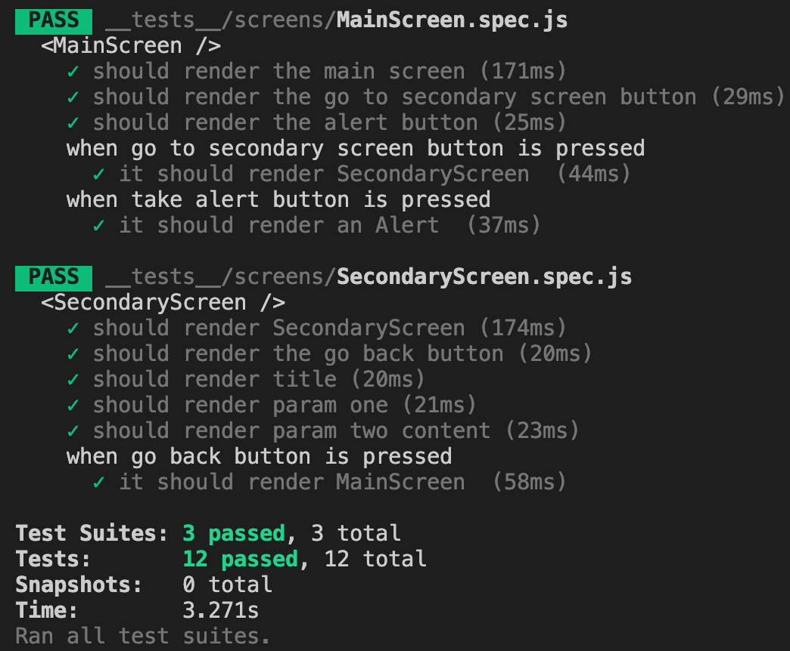

# How to Test React Native Apps

## Introduction

Have you ever had a bug introduced by solving another problem and didn't realize it until weeks later? This could have been easily avoided if you had tests for your App.

In a project with a tight schedule, tests are generally the first thing to be forgone, but they are being underestimated. Once you make that click and understand how to create tests, it's not that complicated to add them and avoid future problems.

## Overview

In this article, you will learn how to test React Native Apps using [jest](https://jestjs.io/docs/en/getting-started) and [@testing-library/react-native](https://www.npmjs.com/package/@testing-library/react-native).

## About @testing-library/react-native

One important thing to point out is that this testing library has changed many times and migrations were needed from one version to another. This tutorial will work with the latest version at the time of writing it (`7.0.1`). For migrations, you can check their [migration guide](https://callstack.github.io/react-native-testing-library/docs/migration-v7/#guide-for-testing-libraryreact-native-users).

## App to be tested

For this tutorial, we are going to use [this](https://github.com/ManuViola77/testing_react_native_apps) simple app, but of course, you can apply everything learned in any app you want. In this app, we just have two simple screens with some components we can test.

## Configuration

Since we are going to use the `@testing-library/react-native` library, we need to install it. To use the specific `7.0.1` version we can install it like this:
`npm install @testing-library/react-native@7.0.1`

We also need to configure jest. We should create a `jest.config.js` file in the projects root folder and for our example, we can fill it with this content:

https://gist.github.com/ManuViola77/d98f577c8ea35655d96dcd4654ab398e

I will mention some of these configurations later in this tutorial and you can find more information [here](https://jestjs.io/docs/en/configuration).

## Tests folder

As you can see, our project already has a `__tests__` folder with an `App-test.js` file inside. This tests if the app is created and rendered correctly.

## Creating tests

To actually create a test, we should create a file with a `.spec.js` extension inside the `__tests__` folder. We could even add folders inside to better organize the tests, for example, add a folder called `screens` and have one test per screen inside.

Inside these tests, we are going to use `describe()` just to describe what we want to test, `it()` (same as `test()`) to create the tests we want to have, `expect()` to assert our expected behavior and `beforeEach()` to execute some code before each `it()` test. [Here](https://jestjs.io/docs/en/api) is a complete list of `jest` methods to use inside tests.

Correspondingly, we use the `@testing-library/react-native` library to test our components behavior. We could use `fireEvent` to fire a button pressed event or `waitFor()` to wait for promises results. [Here](https://www.native-testing-library.com/docs/cheat-sheet) is a cheat sheet with the possible methods to use.

Notice that to know how to ask for a specific component, we can simply add the `testID="componentId"` property to the component we want to identify. To simplify, I already added this property to all the components we are testing.

## Creating tests for our App

Now we need to create our own tests, so we can test our `MainScreen` and `SecondaryScreen`. We can create the `screens` folder inside the `__tests__` folder to have better organized tests.

Also, we are going to need some extra files to handle navigation and screen parameters data, so we can create an `extras` folder inside the `__tests__` folder for this purpose. If you paid attention you may have noticed that we added `modulePathIgnorePatterns: ['extras']` to the `jest.config.js` file. This is to tell jest to ignore the `.js` files that this folder contains, otherwise, it will consider them as tests and we don't want that.

### Navigation helper

To test our app we need to start on some screen. If we use a simple `render AppStack` we would always start on the same screen and we would need to have some flow to go to a different one. To avoid this, we could just start our stack with the screen we want and if we need to test our screen redirecting to some other screen we just need to add that other screen to the stack for the test to work.

Keeping this in mind, we will create a `helpers.js` file inside the `extras` folder that looks like this:

https://gist.github.com/ManuViola77/ebb7e47769a54b2fb6759eeefc912809

We will get more into detail when we use it in the `SecondaryScreen` test.

### MainScreen test

Inside the `screens` folder, we should create the `MainScreen.spec.js` file.

Since we are in the AppStack's first screen we can just render the entire `AppStack` and it would start rendering the screen we want.

This file should test the `MainScreen` components existence and behavior:

- It renders the `MainScreen` component
- It renders the `button-to-secondary-screen` component
- When pressing `button-to-secondary-screen` component, it redirects to the `SecondaryScreen` component
- It renders the `alert-button` component
- When pressing `alert-button` component, it shows an alert

Each of these items should translate to an `it()` jest method and so our `MainScreen.spec.js` file should look like this:

https://gist.github.com/ManuViola77/809d28c61fdad272d2ce1b3d3147bde5

### SecondaryScreen test

Inside the `screens` folder we should create the `SecondaryScreen.spec.js` file.

Since we are not in the AppStack's first screen and our screen receives parameters, we are going to take advantage of the helper we created. We will call the function `renderWithNavigation` with these parameters:

- `mainComponent`: `SecondaryScreen`
- `otherComponents`: `[{name: 'MainScreen', component: MainScreen}]`
- `screenConfig`: `{initialParams: { screenParameters }}`

We will create a `data.js` file inside the `extras` folders to set our `screenParameters`:

https://gist.github.com/ManuViola77/2871545d426cdda330f322e517c46b0e

This file should test the `SecondaryScreen` components existence and behavior:

- It renders the `SecondaryScreen` component
- It renders the `back-button` component
- When pressing `back-button` component, it redirects to the `MainScreen` component
- It renders the `title` component
- It renders the `param-one` component
- It renders the `param-two-content` component

Notice that our `param-one` and `param-two-content` only render if they have content to render, so if our tests pass means that the screen is getting the parameters right!

Our `SecondaryScreen.spec.js` file should look like this:

https://gist.github.com/ManuViola77/84c055e49f70d48423d5db302bb2fefd

## Running tests

To run the tests we just simply need to execute `npm test`. This command will run all the tests we have under the `__tests__` folder. If we want to just run one particular test, we can do `npm test __tests__/screens/one_particular_test.js` instead.

We can see how our tests run successfully:

## Debugging tests

If we want to debug our tests we can use [ndb](https://www.npmjs.com/package/ndb).

To use this, first, we need to install it, as the documentation explains, by running `npm install ndb` and you can add the `-g` option to make it global.

Then, we can configure our project by setting the value `"test:debug": "ndb jest",` inside our `package.json` file under the `"scripts"` section (we can put it right after the `"test"` value).

Finally, we can debug our tests by running `npm run test:debug` and this will install Chromium where you will be able to set breakpoints in your tests and debug them.

## Mocks

Since our app was really simple, we didn't need to implement mocks, but it's really an important part of testing react native apps. I will explain why we need them and how we can create them.

The first thing you need to know is that there are lots of functionalities you will have to mock in order to use and test. For this purpose, you can create a `__mocks__` folder inside the `__tests__` one. Every file in there will be named after a react native library, so when you are testing something that uses that library, jest will take and use the implementation made in the mock.

Let's exemplify. Suppose that in our project we have a backend we access through a URL that we have saved in an `.env` file with the name `API_URL` and we use the library `react-native-config` to access that information. Our tests won't be able to access that `.env` file, so instead, we have to mock it. We would create (if we haven't already) the `__mocks__` folder and inside we would create a file named `react-native-config.js` that contains the URL we want, like this:

https://gist.github.com/ManuViola77/2847c82b2dd3f7e8a8ffbe015735c63e

A slightly more complex example would be if we use an `ImagePicker` to access our photos gallery. Let's say we use the `react-native-image-crop-picker` library and in our code we call `ImagePicker.openPicker()` expecting a selected image as a result. If our test calls the button that opens the picker expecting a selected image as a result but we don't have the picker mocked, our test would fail, getting a null result, which is not what we expected. So, we have to create our `react-native-image-crop-picker.js` file and inside we could have something like this:

https://gist.github.com/ManuViola77/ca176e397e8b013535ac892bc928034c

What we are doing here is mocking our `openPicker` function, by saying it is a function (`jest.fn()`) and that its mocked implementation would be `Promise.resolve(result)`. Notice that since our real `openPicker` is a promise, our mocked implementation is also a promise. We can decide if we want our mocked promise to be completed successfully (with `Promise.resolve()`) or if we want it to fail (with `Promise.reject()`). We also decide if we want to return something, like in this case, we are returning `result`. A question you might be asking is, how do I test both fail and success results by only mocking one `openPicker` function? Well, the answer is quite simple actually, and it would look like this:

https://gist.github.com/ManuViola77/00899b450baebb8ef676c69a31af1b67

By using the method `mockImplementationOnce()` we can give different behaviors to our function, depending on each time you call it. So in this case, the first time we call it we would get a rejected promise (for example to mock that we don't have access to the gallery yet), the second time would be a successful case with our expected result and if we were to call it more times it would use the default implementation inside the `fn()` method, which in this case would also be successful.

## Summary

In this tutorial, we saw how to use `jest` and `@testing-library/react-native` to test React Native Apps. You can find the complete GitHub project (with tests included) [here](https://github.com/ManuViola77/testing_react_native_apps_with_tests).
