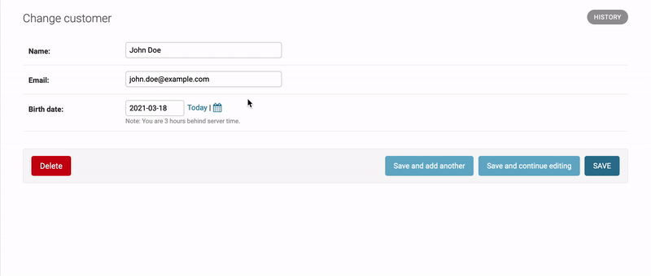
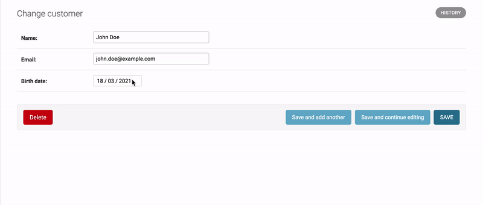

When you register a model in your Django admin page it automatically matches each of the model's fields to
a widget so you can input data and manage instances of the models easily from the Django admin panel, 
most of the time the default widgets are enough but in some cases they may not be the most suitable for our particular needs.

For instance, if one of your models has a `DateField` which represents the birth date of a user and you know that for whatever
reason you will need to create user instances frequently from the admin panelthen the default datepicker may be very inconvenient
if you want to input realistic data since you can't input the year in a straightforward way and would have to navigate month to month to reach a desired year.

In such a case you may want to change the widget to pick the date but after doing some research may not find a clear explanation
on how to do this, but you are on luck because not only is it pretty easy but it is also what we will be guiding through in this article! Let's begin.

### Set up

I'm going to asume that you have python and django installed as well as a project ready on which you are going to make these changes.
In my case I made a very simple project called `project` with just one app called `customers`, and the following layout:


```
| project
├── customers
│   ├── __init__.py
│   ├── admin.py
│   ├── apps.py
│   ├── migrations
│   │   ├── 0001_initial.py
│   │   ├── __init__.py
│   ├── models.py
│   ├── tests.py
│   └── views.py
├── db.sqlite3
├── manage.py
└── project
    ├── __init__.py
    ├── asgi.py
    ├── settings.py
    ├── urls.py
    ├── widgets.py
    └── wsgi.py
```

We will be working in the `Customer` model in `customers.py` which looks something like this:

```python
from django.db import models

class Customer(models.Model):
    name = models.CharField(max_length=100)
    email = models.CharField(max_length=100)
    birth_date = models.DateField()

```

Having registered the model in the admin page then when trying to create/modify a new instance from the admin panel it will look like this



We will now change this widget for a new one that makes navigating through years easier and more fitting to handle birth dates.


### Changing the widget

We will define a new datepicker, first a generic one with the specific date format we want to use and then we will create a more
specific one that inherits from it and also doesn't allow for the user to input dates that don't make sense as a birthday
(i.e. future dates)

It all boils down to which date format the widget uses, the date format that the default widget enforces is `day-month-year`.
Our new `CustomDatePickerWidget` will require the `year-month-date` format, to define this new widget lets create a new
file `widgets.py` which in my case I will create at `project/project/widgets.py` with the following code:


```python
from datetime import date
from django import forms


class CustomDatePickerWidget(forms.DateInput):

    DATE_INPUT_WIDGET_REQUIRED_FORMAT = '%Y-%m-%d'

    def __init__(self, attrs={}, format=None):
        attrs.update(
            {
                'class': 'form-control',
                'type': 'date',
            }
        )
        self.format = format or self.DATE_INPUT_WIDGET_REQUIRED_FORMAT
        super().__init__(attrs, format=self.format)

```

Here we are defining what date format the input is gonna enforce (`%Y-%m-%d` meaning `year-month-day`) and in the class constructor we are doing two things:
- Adding `class`: `form-control` and `type`: `date` to `attrs` which is important to ensure that a calendar widget will be displayed from where we can select a date (if we didn't the input displayed for this field in the form would be a plain text one)
- Setting `%Y-%m-%d` as the class' `format` attribute if no other format is provided as an argument
Then we are simply calling the parent class' constructor to handle the rest.

With this we already have a widget that addresses our main concern of navigating through years in a convenient way, you can subclass
it to more specific properties to better handle your use case, for our `Customer` model since we will be handling birth dates we
also want to make sure that no future dates will be used as input, so in the same file just under this class we will define:


```python
...

class PastCustomDatePickerWidget(CustomDatePickerWidget):

    def __init__(self, attrs={}, format=None):
        attrs.update({'max': date.today()})
        super().__init__(attrs, format=format)

```

As you can se in the constructor we updates `attrs` specifying `max` as `date.today()`.
Now, with our new widget defined we just need to use it where we registered the model in the admin page to override the default one.
At `project/customers/admin.py` I already had a `CustomerAdmin` which was the class I used to register the `Customer` model in the
admin page, in my case it was empty so I am going to add to it the following code:


```python
from django.contrib import admin
from django.db import models
from .models import Customer
from project.widgets import PastCustomDatePickerWidget


@admin.register(Customer)
class CustomerAdmin(admin.ModelAdmin):
    formfield_overrides = {
        models.DateField: {'widget': PastCustomDatePickerWidget},
    }


...

```

Which basically amounts to import the datepicker and using it as the value for `widget` in the `formfield_overrides` as shown in the code.



And that's it! Now we can input birth date values in a much more comfortable manner instead of scrolling through months endlessly!


### Conclusion

In this blog post you learned how to create a new custom datepicker for Django as well as how to use it as the default datepicker for on the Django admin page.
