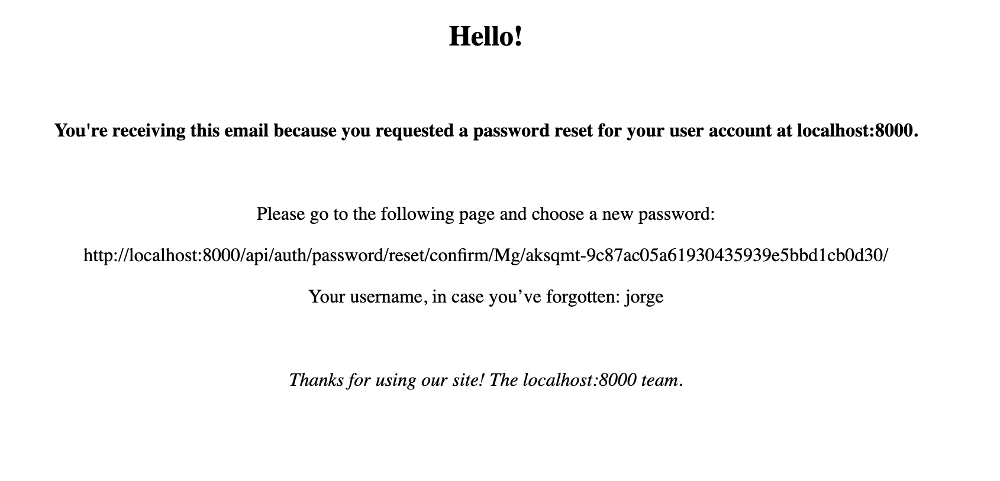
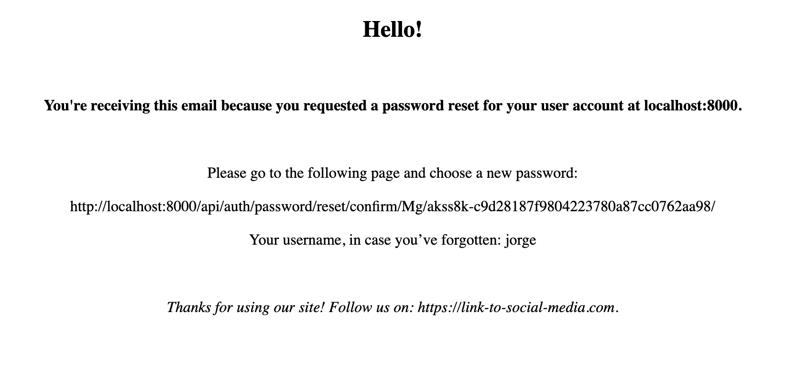
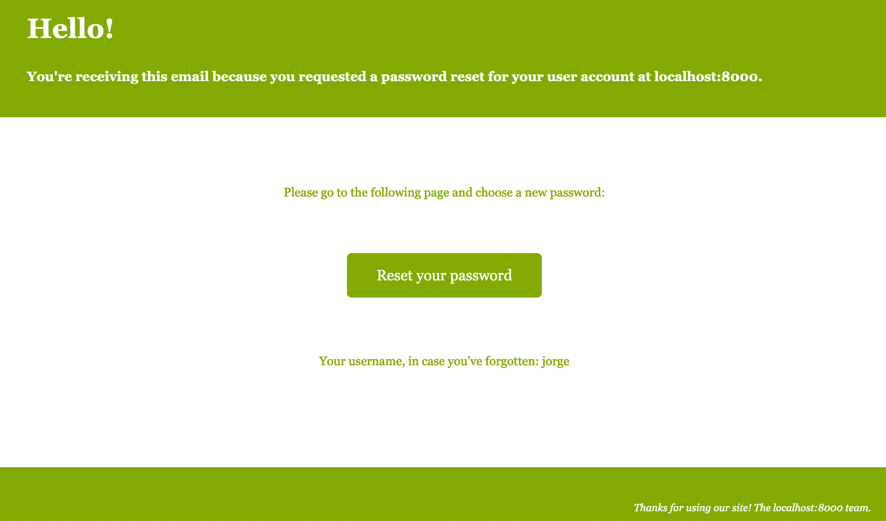

We have talked in previous blog posts about Django REST framework and about dj-rest-auth, both amazing libraries for Django that allow us to easily create rest APIs and handle user authentication respectively. In this blog, we will focus particularly on rest-auth and in one of its built-in functionalities which is the reset password feature.

If the user wants to reset their password because they forgot it, or because they want to start using a different one, then usually they must make a reset password request, and then they'll receive an email with a link to a page in which they will be able to introduce and set their new password.

This feature is provided by the dj-rest-auth library but the email that is sent to the user is a plain text one and the link that comes in it, is from a built-in dj-rest-auth endpoint, which may be exactly what you want in some cases, but not in others.
If you want to change the content of the email the process is well documented but only if you want to change it to a plain text file. In case you want to change to a custom HTML template then there is not much information covering how to do it, that is why we will explain it in this article.

### Set up

I'm going to assume that you have python, Django, Django REST framework and dj-rest-auth installed as well as a project ready on which you are going to make these changes.
In my case I made a very simple project called `project` with just one app called `api`, and the following layout:


```
├── api
│   ├── __init__.py
│   ├── apps.py
│   ├── migrations
│   │   ├── __init__.py
│   └── serializers.py
├── db.sqlite3
├── manage.py
├── project
│   ├── __init__.py
│   ├── asgi.py
│   ├── settings.py
│   ├── urls.py
│   ├── widgets.py
│   └── wsgi.py
└── templates
    └── registration
        └── custom_reset_confirm.html
```

As you can see I have a `templates` folder in which I made a new folder called `registration` with a file called `custom_reset_confirm.html` inside of it.
The context in the html email template looks like this:

```html
<html>
  <head>
    <meta name="viewport" content="width=device-width" />
    <meta http-equiv="Content-Type" content="text/html; charset=UTF-8" />
    <title>Confirm reset password email</title>
  </head>
  <body style="text-align: center;">
    
    <h2>Hello!</h2>
    <br>
    <p><b>You're receiving this email because you requested a password reset for your user account at {{ site_name }}.</b></p>
    <br>
    <p> Please go to the following page and choose a new password: </p>
    <p> {{ protocol }}://{{ domain }} </p>
    <p> Your username, in case you’ve forgotten: {{ user.get_username }} </p>
    <br>
    <p><i> Thanks for using our site! The {{ site_name }} team.</i></p>
  </body>

</html>


```

As you may have noticed, the content is pretty much the same as in the default email, and for the sake of simplicity I didn't add a lot of style, just some bold and italic text as well as greeting in a bigger font size.
The relevant variables like `site_name`, `domain` and such will be automatically assigned values passed on the context to the template.

### Changing the default email

Now that we have our template what we need to do is indicate that this is what we want to send to our users when they request a password reset. To do that we have to define a serializer that inherits from `dj-rest-auth`'s `PasswordResetSerializer` and overwrite
its `get_email_options` method and then use that serializer instead of the default one.

So first we will define the new serializer:

```python
from dj_rest_auth.serializers import PasswordResetSerializer


class CustomPasswordResetSerializer(PasswordResetSerializer):
    def get_email_options(self):
        return {
            'html_email_template_name': 'registration/custom_reset_confirm.html',
        }

```

And then in our `settings.py` we will indicate that this is the serializer we want to use:


```python

...

REST_AUTH_SERIALIZERS = {
    'PASSWORD_RESET_SERIALIZER': 'api.serializers.CustomPasswordResetSerializer',
}

...

```

Now if you send a reset password request you should receive something like this:





In my case because I'm running this project locally it uses `localhost:8000` for the `site_name`.

Now, let's say that you want to add something else to this email, some information that is bound to change and 
you wouldn't be able to hardcode it on the template itself. Let's say I want to add a link to social media, in that case
I can add the key `extra_email_context` to the dictionary that `get_email_options` returns and as its value a dictionary with the extra
context.

For example, let's replace `The {{ site_name }} team` at the end with a fake url:

```html
...

    <br>
    <p><i> Thanks for using our site! Follow us on: {{ social_media_url }}.</i></p>
  </body>

...
```

And now define the value of `social_media_url` in the serializer.

```python
class CustomPasswordResetSerializer(PasswordResetSerializer):
    def get_email_options(self):
        return {
            'html_email_template_name': 'registration/custom_reset_confirm.html',
            'extra_email_context': {
                'social_media_url': 'https://link-to-social-media.com',
            },
        }

```



It is also possible to overwrite default values like `site_name` in the same way by using `extra_email_context`, but it is not recommended to do so.


Finally, here is some code to make a simple but much prettier template so you can appreciate how much more visually appealing your email can be!

```html
<html>
<head>
<style>
  
  body {
    font:11px/18px Georgia, Palatino, "Times New Roman", Times, Serif;
    
  }

  p {
    margin:0 0 15px;
    line-height:1.6em;
  }
  h1 {
    width:320px;
    line-height:1.5em;
    font-size:2.7em;
    color:#fff;
    margin:0 0 20px;
    text-shadow:#89A213 1px 1px 1px;
  }
  h3 {
    margin:0 0 7px;
    font-size:1.3em;
    clear:both;
    color:#fff;
    line-height:1.3em;
  }

  #content {
    margin:0 auto;
    width:960px;
  }
  #header {
    color: #fff;
    padding:30px 0 10px 30px;
    background-color:#82AA00;
  }

  #pitch {
    clear:left;
    float:left;
    width:960px;
    font-size:1.2em;
    padding:70px 0 70px 0px;
    background:#fff;
    color: #82AA00;
    text-align: center;
  }

  #footer {
    clear:both;
    border-top:1px solid #fff;
    color:#fff;
    padding:35px 20px 70px 0;
    background-color:#82AA00;
  }

  #footer .right {
    float:right;
  }

  .button {
    background-color:#82AA00;
    border-radius: 5px ;
    border: none;
    color: #fff;
    padding: 15px 32px;
    text-align: center;
    text-decoration: none;
    display: inline-block;
    font-size: 16px;
    margin: 4px 2px;
    cursor: pointer;
    }

  a:hover {
    color:#fff;
  }

</style>
</head>
<body>
<div id="content">
  <div id="header">
    <h1 style=>Hello!</h1>
    <h3><b> You're receiving this email because you requested a password reset for your user account at {{ site_name }}.</b></h3>
    <br>
  </div>
  <div id="pitch">
    <p> Please go to the following page and choose a new password: </p>
    <br>
    <br>
    <a href="{{ protocol }}://{{ domain }}" class="button">Reset your password</a>
    <br>
    <br>
    <br>
    <br>
    <p> Your username, in case you’ve forgotten: {{ user.get_username }} </p>
    <br>
  </div>
  <div id="footer">
    <p class="right"><i>Thanks for using our site! The {{ site_name }} team.</i></p>
  </div>
</div>
</body>
</html>
```

And this is how it looks:





### Conclusion

In this blog post you learned how to change the default dj-rest-auth reset password email with a new HTML one by defining a custom `PasswordResetSerializer`,
as well as how to change/add information to the content of the email dinamically using the `get_email_options` method of the `PasswordResetSerializer` base class.
