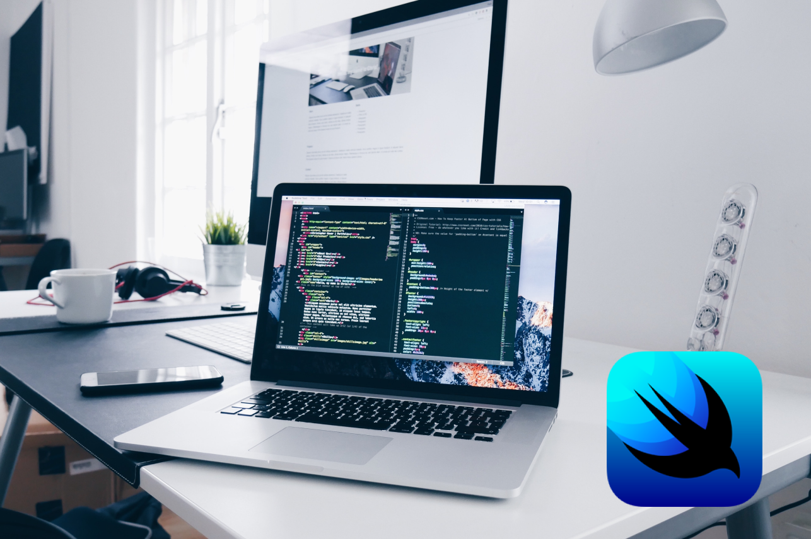
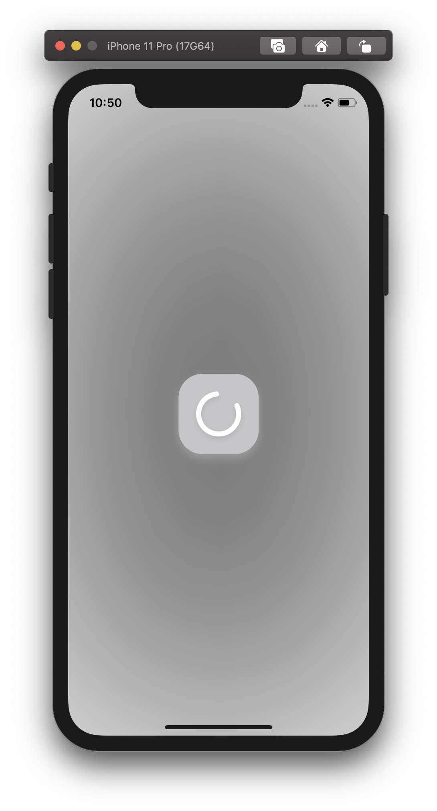

# How to create an Activity Indicator with SwiftUI

## Introduction

The year was 2019 (far far away from any COVID-19 or natural disasters) and me as many other developers were at the San Jose McEnery Convention Center waiting for all the new announcements Craig, Tim and all the engineers from Apple were about to share with us.  

Thats's when SwiftUI took us by storm. We’re delighted by this new way to create our UI on a declarative way and let the data flow between the views with all the new tools SwiftUI and Combine provide. This new addition to the Apple family was huge, and even that was too early for production, we couldn’t stop ourselves to start playing around with it. But this "beta" state started to being noticed when some performance issues or even lack of support for some primitive components that were part of our daily work appeared. 

One of them is the lack of a native Activity Indicator. Lucky us, we can host UIKit views on our SwiftUI code, but we know that’s tempting to create our own Spinner made 100% with this new tools.

## Overview

In this tutorial, we’ll be building a simple but functional SpinnerView from scratch using entirely SwiftUI views. 

We’ll animate and define a quick way to call the spinner when we need it, and who knows, maybe we have time to make it customizable.

Down bellow you can follow the steps to create the Spinner, but if you’re to lazy to follow all the steps, [here](https://github.com/rootstrap/spinner-playground) you can find a small project with the final version to copy & paste into your apps.

## Lets do this

### The Basics

For this tutorial I’ll assume you already have some knowledge about SwiftUI and how the view behaves, or what is a modifier. 

So, to start if you don’t a have a project to add the spinner, you can create one with SwiftUI as base framework or you can just go to your existing project and create a new SwiftUI file to start working.

In this case we’ll be creating a rounded square with a spinning view in the middle, a full blurred background and some shadows just in order to say that we made something fancy. The final result will look like this: 

### The middle spinning thing 

Starting from a Circle() view, we can trim it to get the final spinning shape. Now we can embed that inside a `ZStack` and add a background color with opacity bellow the trimmed shape. Final details for this step: we can modify the frame, color and corner radius of our `ZStack`. 

https://gist.github.com/pMalvasio/bad867cbc86e099ffe38458056568daf

### The Background

Now that we have the middle part done, we can work on the blurred background so when the Spinner is called the current content will be blocked by this view but barely visible on the background.
To accomplish this we can embed our current code on a new `ZStack` and add the blurred color background ignoring the safe areas in order to cover the entire screen.

https://gist.github.com/pMalvasio/d1d8c8fb0c3f33abcdfb7469314ad5a2.js

### Shadows to look fancy

Feel free to try any color combination. I’m sticking to this monochromatic palette just to avoid overthinking the design. Don’t forget that the idea is to have a pretty simple SpinnerView to use right away.

Spining view shadow:

https://gist.github.com/pMalvasio/c662b9223766795031a7173b7607e98a

And rounded rectangle shadows:

https://gist.github.com/pMalvasio/ffd666101cbe09637cd9cce05cc6aebf

### Animation

To create the already known spinning animation we’ll use a combination of `animate` and `rotation` modifiers and a `@State` variable in order to trigger the animation as soon as the view is loaded with the `.onAppear` modifier.

So, we need to add the following code before the body of our view: `@State var isAnimating = false`

Now we can add the animation depending on the value of that state. That working together with an `.onAppear` modifier will do the trick.

https://gist.github.com/pMalvasio/12952b393bdb6e207104d3d7448e8ba4.js

Done. You can now call your brand new SpinnerView() from where ever you want and see how is working. Usually you will want to call it when you detect you're waiting for some task to end (like a backend request) or any local task that needs to block the user and indicates that you are performing some action in order to continue.

### Extra time? Cool, we can make this view customizable.

In a few steps we can make our new view customizable so you can call SpinnerView() with any combination of colors, size or even rotation speed.
First we need to create a SpinnerConfiguration `struct` to allocate all the configurable parameters to call the SpinnerView.

https://gist.github.com/pMalvasio/8be5fd2ed3f23169fb19690ff55fd85d.js

Now that we successfully extracted this values from the code we can start replacing them. 

Quick note: given that we code/design all in a specific set of values regarding size, we'll calculate a multiplier using that base value to accomplish a proper resize for new values.
This multiplier will be: 

`let multiplier = configuration.width / 40`

And given that we need calculate this inside the body of our view, we also will be adding a `return` before the paren view.

Last, but not least, we will add the following line: `var configuration: SpinnerConfiguration = SpinnerConfiguration()`. This will allow us to call our spinner like this: `SpinnerView(configuration: ...)` or without parameter given that we're providing by default a configuration object with our initial values.

### Calling the Spinner

You can now use this on any of your views just putting all your content inside a `ZStack` and drawing the SpinnerView() below that, based on any state control you have.

Something like: `if showSpinner { SpinnerView() }`

Being `showSpinner` a state var on my main view that's updated depending on any blocking task I'm running

## Summary

In this tutorial, you learned how to create a small but robust SpinnerView 100% made on SwiftUI. As I already mentioned before, you can see the final code (here)[https://github.com/rootstrap/spinner-playground] on a small project with a tiny demo app.