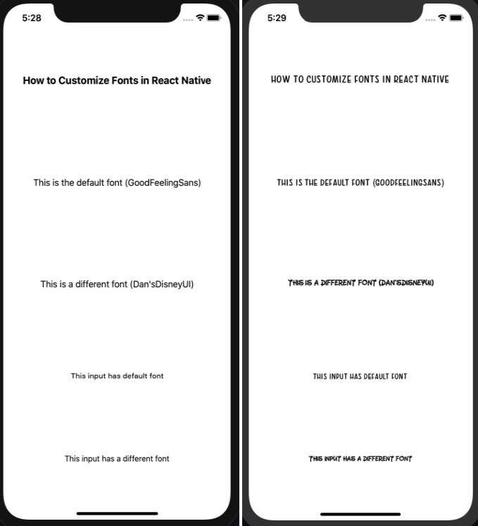
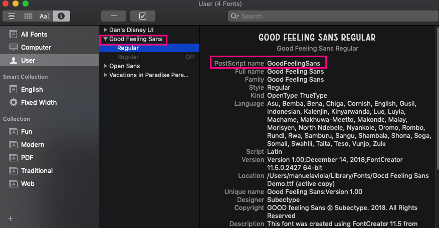
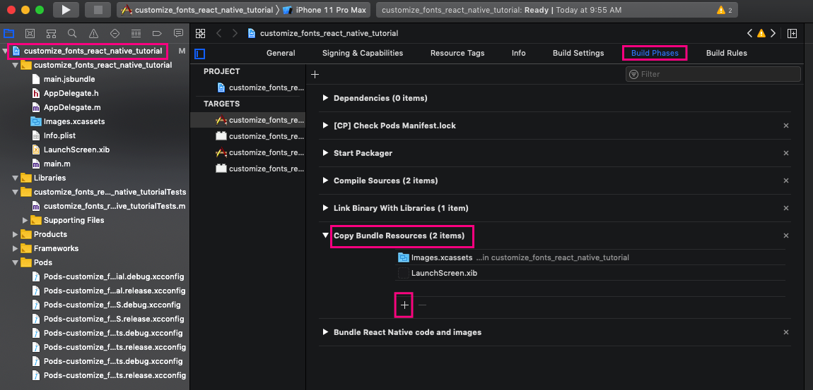

# How to customize fonts in React Native



## Introduction

Like every newbie in Rootstrap, my first assignment was to develop Target MVD application, in my case, in React Native. While doing this, one of the first things I tried was to set the family font that the application uses, and I found out it wasn't as easy as I expected.

The biggest issue was that all the tutorials said to excecute "react-native link" command and after executing it, the application would stop building successfully.

## Overview

In this tutorial you will learn how to add and link fonts manually, without using the link command.

First you will see all the configurations that need to be done in order to be able to use customize fonts and then you will learn its usage in a simple application.

## Configuration

### Create Project

First of all, you should create a project in react native. To do that, initiate terminal in the folder where you want to create your project and excecute:

```sh
react-native init customize_fonts_react_native_tutorial
```

### Install libraries

After creating the project, there are some libraries that need to be installed:

```sh
cd customize_fonts_react_native_tutorial
npm install --save react-native-global-props
npm install --save babel-plugin-module-resolver
```

### Download and rename fonts

Since this is a tutorial about customizing fonts, you will need to have some fonts downloaded, in order to add them to your React Native project.

There are many places where you can get this customized fonts. For this tutorial, I used two different fonts, [GoodFeelingSans](https://www.wfonts.com/font/good-feeling-sans) and [Dan'sDisney](https://www.fontspace.com/dans-disney-font-f24536). In both cases I ended up with a .ttf file.

For IOS is important the font's filename, because it should be the same as its PostScript name. To know this, you should open your .ttf file with Font Book, see what its PostScript name is and rename the font to it.



### Configurations in React Native

There are some steps that need to be done in order to use your custom fonts in a React Native project. There are also special configurations depending on if you want to use android or IOS.

#### General

In both cases, you will need to create this folders in your project's root: **src/assets/fonts**. Inside the fonts folder, you should add you custom fonts .ttf files, one for every font you want to use.

Also, modify **babel.config.js** adding this code:

```js
plugins: [
    [
      'module-resolver',
      {
        alias: {
          assets: './src/assets',
        },
      },
    ],
  ],
```

#### Android

In android, you need to add this folders into android/app/src/main/ : **assets/fonts**. You should also add your `ttf` files to the fonts folder.

#### IOS

In IOS, the configuration is a little more tricky. You need to go to **ios/** folder and open the
**customize_fonts_react_native_tutorial.xcodeproj** file with Xcode.

Afterwards, you need to press on **customize_fonts_react_native_tutorial -> Build Phases** and find the **Copy Bundle Resources** section.



You should add your fonts by pressing the plus symbol, then **Add Other...** option, select your fonts from your src/assets/fonts folder and **Finish**.


## Usage

Finally, after all this steps you will be able to use customized fonts in your React Native project.

As an example, you can create a very simple screen, just to test everything is configured correctly. Add in src folder App.js and styles.js files.

App.js:

https://gist.github.com/ManuViola77/8ef19537877f00114dbaee49b1f44752

styles.js:

https://gist.github.com/ManuViola77/bde10a388c32f40011e7e475a327bd18

Also modify **index.js** to point to new ./src/App instead of ./App.

In this app, you are using the **react-native-global-props** library to set a custom font as default, in case you have an entire app with some default font. This is not necessary if you don't need it, you can just set the custom font only in the texts you want. Note how you can still do this even if you define a default custom font. Also note that there are two different default settings, one for the Text component and another for the TextInput.

Now, if you execute **react-native run-ios** or **react-native run-android** you should see the text with your custom fonts.

## Summary

In this tutorial you learned how to add, link and use custom fonts in React Native. You can find [here](https://github.com/ManuViola77/customize_fonts_react_native_tutorial) the github project.
