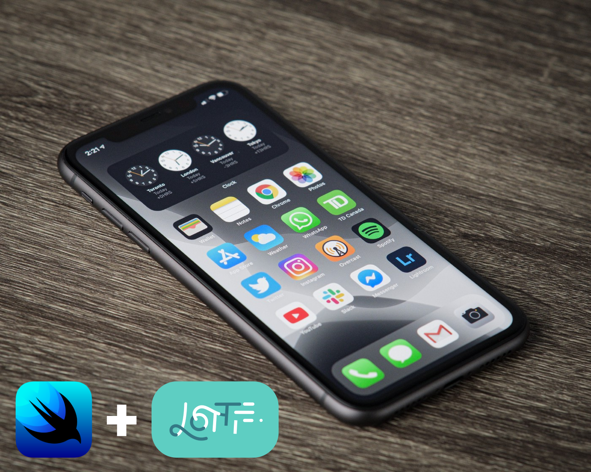

# How to use Lottie Animations in SwiftUI

## Introduction

If you're here already, there's a 99.999% chance you know what Lottie is. For those still confused on what this article is about: Lottie is an awesome iOS, Android, and React Native library created by Airbnb that renders After Effects animations in real time, allowing you to use animations as easily as you use static images. You can find more info on their [website](https://airbnb.design/lottie/) and all the technical documentation you want on their [github](https://github.com/airbnb/lottie) page.

## Overview

In this tutorial, we’ll create a simple SwiftUI view using `UIViewRepresentable` in order to create and load any Lottie animation into your project.

## Lets get started

### Installation

In order to use Lottie inside your project, we need to install the library. For this, we have a few different options like Cocapods, Carthage, or the one we will use in this tutorial Swift Package Manager.

First of all, on Xcode click on `File` and then select the `Add Package Dependency...` option in Swift Packages. In the input box, enter: `https://github.com/airbnb/lottie-ios.git` (this is the library repository from where Xcode will download the code), hit next and leave the major version that is selected by default to use the latest Lottie release.

### Hosting Lottie on SwiftUI 

Now that you have Lottie already installed in your project, we can start creating the view. For this, you'll need to create a new Swift file. Call it `LottieView`, add the `import SwiftUI` statement on top and then the following:

https://gist.github.com/pMalvasio/93a02c5fb8d2f35509d78df8571915cd

So far we're using a `UIViewRepresentable` to allocate an empty `UIView` with frame `.zero`.

### Loading the Animation

Next, you need to import Lottie on your code, so you have to add `import Lottie` below the SwiftUI import that's already there. In the `makeUIView(...)` method you can now call Lottie to load the animation and add it to the view we already created.

https://gist.github.com/pMalvasio/82ec0abbdcf9b1776a533e673e8f6533

### Adding the constraints

To ensure that it takes the full height and width of the container, we'll specify constraints. To do so, add the following before returning the view:

https://gist.github.com/pMalvasio/06844e05841cc42cc26797e9e6d38ff1

### Almost there

The last part will be to allow the `LottieView` to load any animation you import into your project. To do it we can add a new var and pass it at the moment of calling the animation inside the `makeUIView(...)` method:

Add `var filename: String` below the `typealias` line and use it to call the animation replacing the current call for: `let animation = Animation.named(filename)`

### Ready to go

Done. You successfully created a `LottieView` with SwiftUI that can load any animation you want into your project and start playing it. Now you only need to call `LottieView(filename: YOUR_ANIMATION)` and you will see it.

This is the final result:

https://gist.github.com/pMalvasio/73184eb5142139cad9a92a7752fb2752

## Tons of animations

Usually, these animations are provided by a designer, but if you wanna dive into tons of animations that are already there for you to use you can visit [LottieFiles](https://lottiefiles.com). Most of them are free, but, if you want to contribute with that huge community of designers, you can also buy some animations to support them.