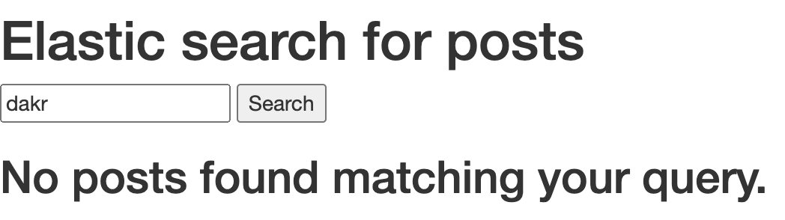
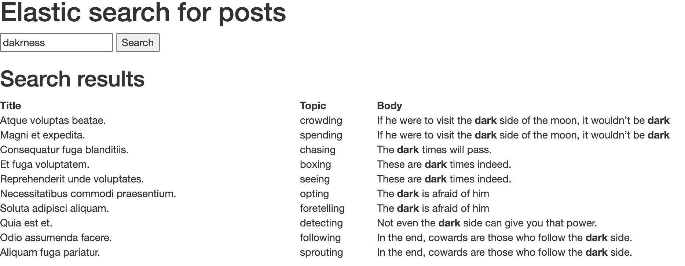

# Improve your Rails Apps searches with Elasticsearch

## Introduction

When it comes to apps with a lot of data, some SQL queries take more time than expected, especially when we want to search text through several model attributes. The most known examples are e-commerces, but this kind of complex queries can happen in apps like social media or any other one that implies making suggestions based on user information or interaction with the platform.

In these cases, we want to retrieve data from our database given a query a user made.

It would be reasonable to wait for a user query containing fields from different models’ attributes and in these cases queries start to get complex and inefficient. What happens when our models attributes and their relationships start to grow? How do we manage user typos in those queries? What happens when a user looks for ‘ps4’ instead of ‘playstation 4’?

We’ll try to answer these and more questions in this post using Elasticsearch in our Ruby on Rails app.

In this tutorial we will assume you have a basic understanding of Ruby on Rails applications and have Elasticsearch server installed and a Rails app we will integrate with. If this is not your case, you can [follow the official Elastic documentation]([https://www.elastic.co/guide/en/elasticsearch/reference/current/brew.html](https://www.elastic.co/guide/en/elasticsearch/reference/current/brew.html)) and use [our awesome Ruby on Rails boilerplate]([https://github.com/rootstrap/rails_api_base](https://github.com/rootstrap/rails_api_base)).

## But first… What is Elasticsearch?

In their [official web]([https://www.elastic.co/elasticsearch/](https://www.elastic.co/elasticsearch/)) they describe Elasticsearch as a _"distributed, RESTful search and analytics engine capable of addressing a growing number of use cases. (...) it centrally stores your data for lightning fast search, fine‑tuned relevancy, and powerful analytics that scale with ease”_ and in my humble opinion that’s pretty true due to its scalable and distributed architecture.

This [open source project]([https://github.com/elastic/elasticsearch](https://github.com/elastic/elasticsearch)) was built under the full-featured text search engine [Apache Lucene]([https://lucene.apache.org/core/](https://lucene.apache.org/core/)) and there is where most of the efficient magic happens.

In a nutshell, we’ll use Elasticsearch as a secondary database (a non-relational one), taking advantage of its text pre-processing and indexing power.

## A small disclaimer

Although there are lots of interesting and useful gems in Rails to work with Elasticsearch like [chewy](https://github.com/toptal/chewy), [searchkick](https://github.com/ankane/searchkick) or [search_flip](https://github.com/mrkamel/search_flip) (which I encourage you to take a look at), in this project we are going to use the two basic libraries provided by the Elasticsearch team: [elasticsearch-rails](https://github.com/elastic/elasticsearch-rails) and [elasticsearch-model](https://github.com/elastic/elasticsearch-rails/tree/master/elasticsearch-model). These two gems will let us both interact with the Elastic server instance using an ActiveRecord-like syntax without having to write all the specific DSL and also update our records in the Elastic instance so we always keep as synchronized as possible with our relational database.

## Let’s get down to work!

### What are we going to build?

We’re gonna build a really simple microblogging searcher, where we are going to make available to find posts accepting possible typos and highlighting the matching results really fast and performantly. For this, we will use text analyzers and tokenizers ([natural language processing tools]([https://en.wikipedia.org/wiki/Natural_language_processing](https://en.wikipedia.org/wiki/Natural_language_processing))) that come out the box with Elastic.

**Step 1: Including required gems**

Add to your Rails Gemfile the two Elastic gems:

```ruby
gem 'elasticsearch-model', '~> 7.1.0'
gem 'elasticsearch-rails', '~> 7.1.0'
```

and install them running **bundle install**.

**Step 2: Adding Elastic behaviour to our model**

Given a simplified `Post` model with only a `title`, `body` and a `topic`, include the next lines into it:

```ruby
class Post < ApplicationRecord
 include Elasticsearch::Model
 include Elasticsearch::Model::Callbacks
end
```

The first `include` will let us make Elasticsearch calls in a friendly ActiveRecord-like syntax. This way we can, for example, just call `Post.search(query)` for searching. Otherwise we should manually make an API call to the Elastic server instance every time we want to interact with our data.

The second `include` adds callbacks in our model, so every time we create, delete or edit a `Post`, this action will be replicated into Elasticsearch data.

This last point is very important. Take into account we have two independent databases: one in which we’re gonna persist all the model data as you’re used to (Postgres) and this other new one for making fast searches, suggestions and use all other Elasticsearch fantastic features.

Sometimes (for performance or even business requirements), we don’t want to update data in Elasticsearch instantaneously every time a record has been changed in our main database (this is customizable but we won’t tackle this in the current article).

**Step 3: Defining our Elasticsearch index**

In Elasticsearch we don’t have tables or rows. Our models are stored in _`indexes`_ and each instance is called _`document`_. Although Elastic can automatically detect the attributes types of our model, we are going to declare them explicitly so we have more control over them by adding the following to your model:

```ruby
 settings do
   mappings dynamic: false do
     indexes :id, index: :not_analyzed
     indexes :title, type: :text, analyzer: :english
     indexes :body, type: :text, analyzer: :english
     indexes :topic, type: :keyword
   end
 end
```

**What are we doing here?**

In the second line, with `dynamic: false` we are avoiding new fields to be created accidentally. If you choose `dynamic: true`, every not-listed attribute will be automatically added in the index in an update or create query.

In the third line we are telling Elastic we want to take our `id` attribute and add it to the `Post`’ index as an index but without analyzing it. This means it won’t apply any filter or transformation to it.

In the fourth and fifth line, we're adding both `title` and `body` as text type and with an English analyzer. This will automatically run text tokenizers, analyzers and will apply a lot of natural language processing tools every time we insert or edit a document in our index, making the searches faster, easier and typo-resistant (be aware all these things take an extra time). Follow these links if you’re interested in learning more about [language analyzers](https://www.elastic.co/guide/en/elasticsearch/reference/current/analysis-lang-analyzer.html) and [tokenizers](https://www.elastic.co/guide/en/elasticsearch/reference/current/analysis-tokenizers.html).

And last but not least, we are declaring `topic` as a _keyword_, meaning we are expecting this field only to be tokenized (and not processed or analyzed) making the inserts and edits faster. This is because we are not expected to search through this field, but feel free to play with different options.

**Step 4: Starting our Elasticsearch instance and creating our index**

Assuming we already installed Elasticsearch, we'll start an instance of Elastic by just executing in a terminal **elasticsearch** (remember I’m using _homebrew_). This will launch a server in the 9200 port by default. To check if everything is working as expected we can make a `GET` request with `curl "http://localhost:9200/"` (or could be just opening the URL in a browser).

The response should look something like this:

```json
{
  "name" : "192.168.0.100",
  "cluster_name" : "elasticsearch_instance",
  "cluster_uuid" : "LjE5yneZRWOUFnlasU6y7g",
  "version" : {
    "number" : "7.4.2",
    "build_flavor" : "default",
    "build_type" : "tar",
    "build_hash" : "2f90bbf7b93631e52bafb59b3b049cb44ec25e96",
    "build_date" : "2019-10-28T20:40:44.881551Z",
    "build_snapshot" : false,
    "lucene_version" : "8.2.0",
    "minimum_wire_compatibility_version" : "6.8.0",
    "minimum_index_compatibility_version" : "6.0.0-beta1"
  },
  "tagline" : "You Know, for Search"
}
```

Now we have our Elastic instance up and running, let's open a Rails console and create the corresponding index by executing:

```ruby
Post.__elasticsearch__.create_index!
```

If you already had some posts created, you will need to reindex them by running the following:

```ruby
Post.import
```

This can take A LOT of time if you have too many records, since Elastic has to analyze and tokenize all of them.

**Step 5: define the search method we will call from the controller**

In the Posts’ model we'll define this basic method that will execute a query in our Elasticsearch instance, taking a string and looking in the specified fields.

```ruby
   def self.our_first_query(query)
     search(
       query: {
         multi_match: {
           query: query,
           fields: %w[title body^5]
         }
       }
     )
   end
```

This simple query will search through all our posts and retrieve them in order of importance. The ‘`^5`’ after `body` will make a match in this attribute to weigh 5 more times than one on `title`.

**Step 6: create your searches method in the controller, its view and routes.**

My controller method looks just like this

```ruby
 def search
   return unless query.present?

   @posts = Post.our_first_query(query)
 end
```

Also, I did this simple view with a little of Bootstrap.


As you can see, I created a bunch of posts using [faker]([https://github.com/faker-ruby/faker](https://github.com/faker-ruby/faker)).

Take a look into that search again… Don’t you see anything special? We looked for ‘_darkness_’ and although we don’t have any matching result, we can see that the ones containing ‘_dark_’ were displayed. This is because of the text analyzers. They know these two words are not the same but they do have similar semantics.

Pretty easy, wasn’t it?

What happens if we look for ‘_dakr_’ instead of ‘_dark_’?



Oops, no results. Let’s fix this.

**Step 7: searching with typos and highlighting the match in searches’ results.**

Our search will now look like this:

```ruby
def self.highlight(query)
 search(
   query: {
     multi_match: {
       query: query,
       fuzziness: 'AUTO',
       fields: %w[title body]
     }
   },
   highlight: {
     pre_tags: ['<b>'],
     post_tags: ['</b>'],
     fields: {
       body: {}
     }
   }
 )
end
```

In this case we are basically adding two new features: _fuzziness_ and _highlight_.

With `fuzziness` we are making Elastic know that errors may appear in the query. This way, it will try to match similar words, so we now will not only cover semantic but syntactic errors too.

With `highlight` we are making the match to be highlighted by adding pre and post tags (in this case HTML bold, but you can add whatever you want).

Let’s now search for ‘_dakrness_’: a word that is neither in our database nor is well written.



## Conclusions

Although in this post we’ve just covered the tip of the iceberg, we can see the potential of this search engine when it comes to full-text searches thanks to its cutting-edge natural language processing tools. Also, we could see how easy it is to integrate it to our Rails application using the official Ruby gems they provide.

But that's not all. Elastic also has several other applications. For example, we have been using it in some of our applications not only to admit typos and make searches smarter and faster but also to add [synonyms to some list of words]([https://www.elastic.co/guide/en/elasticsearch/reference/current/analysis-synonym-tokenfilter.html](https://www.elastic.co/guide/en/elasticsearch/reference/current/analysis-synonym-tokenfilter.html)) in our e-commerce apps where we expect searches like ‘ps4’ to match with ‘playstation 4’, ‘playstation four’, or ‘ipad’ to match ‘i pad’ or ‘i-pad’. It also has several interesting uses in [geospacial queries](https://www.elastic.co/guide/en/elasticsearch/reference/current/geo-queries.html) including geodistances and geoshapes.

I encourage you to get lost into the wide [Elastic documentation]([https://www.elastic.co/guide/index.html](https://www.elastic.co/guide/index.html)) and discover the huge potential that it can add to our applications.
