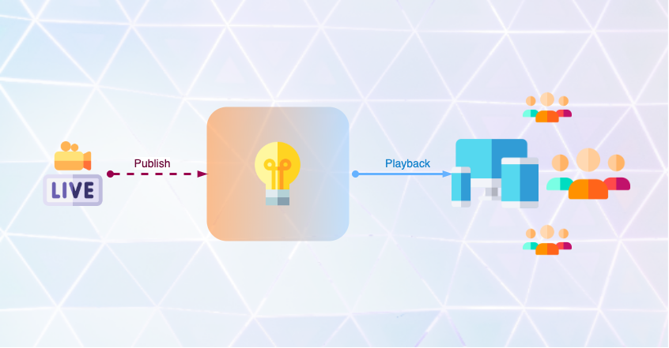
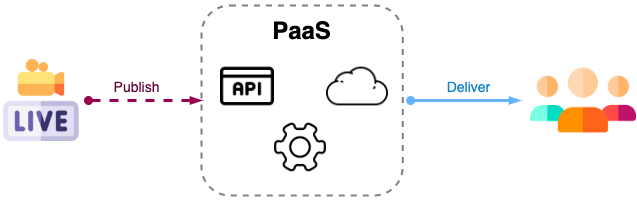
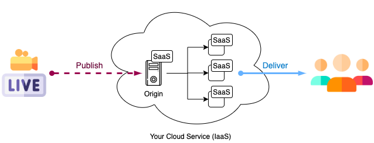
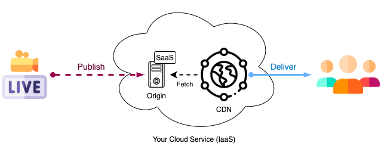
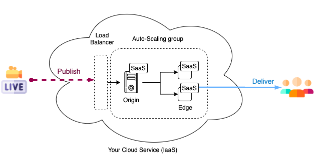

# Live Streaming apps architecture - Part 1

**Abstract:** A few ideas and considerations for architecting a live streaming application based on our previous experience.

## Live streaming

The term implies that the media(audio, video, or both) is broadcasted to the end-users in real-time. This is different than just _streaming_ which could refer to previously recorded content such as VOD(Video On Demand), music streaming, etc. Streaming media is delivered and played on demand rather than being generated simultaneously.

This specific difference makes **live streaming** a lot harder to design, implement and scale.

## Building a Live Streaming App

There are different approaches you can take to build your live streaming platform:

1. Implement your own.
2. Use one of the existing [**Platform as a Service (PaaS)**](#paas) solutions.
3. Use an existing software solution that you can run on your own **Infrastructure as a Service (IaaS)**.

While the first option sounds complicated (it is), it might be the best choice if you have the time, resources, and super specific requirements for your live streaming app. Since I wouldn't recommend coding the entire streaming software from scratch; a good starting point would be the [open source solutions](#open-source).

Now, let's take a look at the pros and cons of options 2 and 3.
These are proven to be a great launch pad for startups and also more complex solutions.

### PaaS

There are a few PaaS around that allow you to quickly build your streaming app and take some sort of control on specific aspects of the streaming process, the audience, etc.
The most popular are:
- [Wowza Streaming Cloud](https://www.wowza.com/products/streaming-cloud).
- [AntMedia](https://antmedia.io/).
- [Brightcove](https://www.brightcove.com/)
- [Azure Media Services](https://azure.microsoft.com/en-us/services/media-services/#overview)

Pros: these platforms will take care of all the scalability, configuration, and infrastructure.

Cons: if your solution requires the live transmissions to start right away; these solutions won't work for you most of the time. The warm-up times are usually up to several minutes.

A simple architecture preview using one of the PaaS above would look like this:
 

 

**Take Away No.1:** These platforms are the best fit if you plan to broadcast scheduled live events. i.e: Sport events, concerts, TV Channels.

### SaaS

The following media server software gives you all the capabilities required to live stream(ingest, transcode/transrate, output, etc).
Pros: These are very flexible and allow you to tweak almost every parameter of the streamflow, add custom behaviors, and integrate with third-party tools.

Contrary to the platforms, they don't provide any infrastructure and you will be in charge of putting all this together in your cloud service. All the installation, configuration, and the design of a solution design that scales correctly is on you.

Some of them provide software based load balancers and other mechanisms that helps you to ease all the work previously mentioned.

- [Wowza Streaming Engine](https://www.wowza.com/products/streaming-engine)
- [AntMedia Server - Enterprise Edition](https://github.com/ant-media/Ant-Media-Server/wiki)
- [Red5 Media Server](https://www.red5pro.com/red5-media-server/)
- [Flussonic Media Server](https://flussonic.com/flussonic-media-server/)

Without much details on scaling and other mechanisms, a live streaming platform architecture using a SaaS could look like this:

 
 

**Take Away No.2:** This approach requires more work and resources to get your final solution working properly, but the possibilities are endless.

### Considerations

There are some questions that we must ask ourselves before thinking about a solution or anything else.

- How critical is to achieve the lowest latency possible?
- Where will the end users be watching the live streaming?
- Should my platform support thousands or even millons of users?

The answers to these questions will set a starting point for your investigations, POCs and even technologies and tools to use.

#### Latency matters

This is one of the most important topics to analyze when architecting your solution, and you have basically two different scenarios.
Let's say your platform will be streaming TV shows on a schedule, where viewers aren't allowed to comment or anything.
In this particular scenario achieving low latencies is not necessary, and embracing a 15-30 seconds delay would be my recommended way to go.
HTTP Live Streaming (HLS), Dynamic Adaptive Streaming over HTTP (DASH or MPEG-DASH) and Microsoft Smooth Streaming are some of the technology standards designed to stream media content to clients. They all work over HTTP and in a very similar way, where the media consist in a playlist of small chunks of data. The duration of the chunks, the number of chunks in each segment, among othe things define the theorical delay mentioned above, making these standards worth considering for the current scenario.

Then we have the second scenario, where your platform will need support for user engagement and interaction during the live streaming, and the real time factor is critical. The most common real time features we see in nowadays apps are chats, polls, reactions and screen sharing/collaboration.
This requirement makes things more complex, specifically if we talk about scalability and syncronization.

Real Time Messaging Protocol (RTMP), Real Time Streaming Protocol (RTSP) and Web Real-Time Communication (WebRTC) are the best options out there when ultra low latency is in play.
They all support really low latencies, but the clear winner is WebRTC with its sub-second delay capabilities, closely followed by RSTP with just above 1 second delay. This is because WebRTC is based on UDP rather than TCP like RTMP does.
Of course there are more differences and technical factors to consider. [Here](https://blog.streamaxia.com/rtmp-versus-webrtc-which-one-to-choose-2020-report-fed7e4d84b18) is a short reading on those.

#### Playback and end users

Live streaming apps often allow users to watch the content from their mobile devices, computers, laptops and smart TVs.
To support all these your streaming servers could transcode the original media into various streams to provide multiple playback formats.
You should consider that not all platforms support all playback formats, or at least not natively and that some of them are more problematic with certain formats.

Here are some of the facilities and obstacles you might face:

##### 1. Mobile
- HLS playback is natively supported in both, iOS and Android.
- MPEG-DASH is not supported and third party player.
- RTMP is not supported and since it is Flash based you will need to find a third party player to use in your native app.
- RTSP playback is supported in Android but not in iOS.
- WebRTC is kind of in the same place that RTMP. It is designed for the web therefore you will also need a third party library. This technology is gaining popularity rapidly so it will not be hard to find projects to bring support to the other platforms.

For React Native apps, you can find ports for the most common libraries in iOS and Android. Have in mind that they usually don't offer the same flexibility or expose all the features from the original ones.

##### 2. Web browsers
- Apple HLS is supported by Safari(as you should expect) in its iOS and MacOS versions.
- RTMP lacks of support in this area as well. With Flash out of the picture, it is not a common choice for today's browsers.
Of course you are not alone in this world, there are a few decent JavaScript implementations that you can use to play RTMP in your web.
- MPEG-DASH and RTSP are not supported out of the box in any browser. You still can find open source or propietary libraries though.
- Being WebRTC the most modern one, it is supported by pretty much every browser out there.

**Take Away No.3:** HLS and WebRTC are the options to have in mind when it comes to the playback with broad compatibility. It basically boils down to your latency needs.

#### Scalability

Making your platform/app able to support more concurrent users than the estimate is key. This is one of the success metrics for your live streaming app and means that your end users will not suffer from huge delays, video stuttering and connection drops when the numbers get high.

Here is when the delivery formats play an important role. If we will be streaming to our end users via HLS(or any of the HTTP based protocols) we are one step closer to the goal. The fact that the media chunks are sent over HTTP makes these protocols way mor easy to scale. The solution recommended is to put a well-known Content Delivery Network (CDN) to do all the work for us.

The high availability servers of the CDN will allow the delivery of our streaming to scale undefinitely.

By doing this we are surpassing a couple of challenges at the same time. A CDN will reduce the number of connections to our live streaming servers, allowing us to make better use of those and get the costs down. Since CDNs have servers all around the globe, it will also reduce the latency for already cached chunks when requested from regions too far from the origin servers.

**Most common cloud providers and their CDNs**
- [AWS CloudFront](https://aws.amazon.com/cloudfront/)
- [Akamai](https://www.akamai.com/us/en/products/media-delivery/)
- [Azure CDN](https://azure.microsoft.com/en-us/services/cdn/#features)

**Bonus:** [Wowza CDN](https://www.wowza.com/products/cdn) matches perfectly with the Wowza Streamin Engine software.

 
 

**Take Away No.4:** Delivering the content over HTTP is probably the best option for making your platform easily scalable.

 

So, what happens if you choose to stream via RTMP, RTSP or WebRTC to the end users?
Unfortunately, traditional CDNs aren't prepared for these protocols. We need to design our own server infrastructure to handle the load and scale properly, but don't worry; this is not a new problem.

A broadly used concept is the **origin-edge** configuration for the core of the architecture. This defines a clear separation of responsibilities between the live streaming servers. A **origin** server would be the one in charge of ingesting the stream, and in some cases, also transcoding it to the delivery formats. On the other hand, **edge** servers will fetch the stream from the origin (or a designated transcoder) and distribute it to the end users.

This allow us to use our computing resources more efficiently. In the case of 1:many streaming applications it also allows to distribute the connections between the edge servers, instead of overburden the origin.

With this in mind, a common practice is to horizontally scale the core of the platform architecture. This means we will be adding more **origin-edge** groups as the application needs them. For the orchestration, a load balancer and an auto-scaling group can be placed around all the streaming groups.

 
 

Bear in mind this is not the only way to scale a live streaming application when using the previously mentioned protocols.

**Take Away No.5:** Scaling ultra low latency live streaming applications is way more expensive than using HTTP-Based protocols.

## Is that it?

Let's keep it short. In the next post of this series we will go a bit more technical. Stay tuned to see how we solved challenges on a real Live Streaming app, test scalability and more.

## Open Source

If you decide to build your own platform, you want to build a quick POC or maybe your are just curious about the technologies; there are a few Open Source projects that worth looking at.

- [Red5](https://github.com/red5pro)
- [WebRTC](https://github.com/webrtc)
- [AntMedia Server - Community Edition](https://github.com/ant-media/Ant-Media-Server)(based on Red5)

  
    Icons by:
    <a href="http://www.freepik.com/" title="Freepik">Freepik</a> at <a href="https://www.flaticon.es/" title="Flaticon"> www.flaticon.es</a>
  

