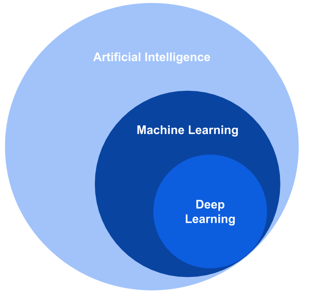

# MACHINE LEARNING

# Chapter 1 - Introduction

Machine learning is one of the hottest topics nowadays. People talk about machine learning as if it is magic. Organizations are racing to integrate machine learning into their functions. Everyone talks about it, but not too many people know what it really is. It is just math and statistics plus data!  

Machine learning is an analytical method that automates model building by learning from the available data, identifying patterns and making decisions with minimal human intervention. Since lots of articles in the industry take some words for granted, in this article important definitions and concepts are clarified. Once you are clear about these concepts, it is going to be easier to read more specific details about each machine learning technique.  

## Definitions

Before getting deeper into Machine Learning, it is necessary to clarify certain concepts used in many articles and books. Important terms are listed below:    

- Sample: it is a segment of the population.     
- Training set: set used for learning.      
- Validation set: set used to correct mistakes learned from the training set.
- Test set: set used to check how well the algorithm has learned. 
- Normalization: set the same scale to all the variables.
- Objective function: function which you are trying to minimize/maximize.
- Cost function: represents the error for the entire training set.
- Loss function: computes the error for a single training example.
- Sometimes cost and loss function are used interchangeably. Because in the end when you are trying to minimize the loss function in each iteration, the overall objective is to minimize the cost function.
- Times series data vs Cross-sectional: while times series refers to data for which the observations are collected over intervals of times, the observations for cross-sectional data are for a single point in time. 
- Machine learning model: design of a mathematical model that makes predictions or finds patterns from data. Different definitions for a machine learning model can be found here. 

## Concepts

Concepts related to machine learning that are relevant to identify are deep learning and artificial intelligence. Sometimes people get confused with these terms and use them interchangeably. However, there are relevant differences. 

**Artificial intelligence:** is a more general concept that consists of the use of machines to perform tasks based on algorithms. 

**Machine learning:** is a part of AI that focuses on the ability of machines to learn from past data and correct themselves. 

**Deep Learning:** is a subset of machine learning, where multi-layer neural networks are used to apply pattern matching. 

Machine learning is a huge field, which has a variety of algorithms and methods to resolve different problems. Here are some of them. 

## Types of machine learning
There are different types of machine learning: Supervised learning, Unsupervised learning, Semi-supervised learning, Reinforcement learning. The methods are different on the way the algorithm learns. While some methods need that the data is labeled, others discover patterns in the unlabeled data. 

### Supervised learning
In supervised learning the main purpose is to predict or classify future data based on past data. Examples of prediction are sales or prices, it always corresponds to a numerical value. In the case of classification, it can be a situation of only two classes for example, for example yes or no questions, or more classes like determining the level of the water (Low, Medium, High). 

### Unsupervised learning
In the case of unsupervised learning the model learns from data that does not include desired outputs. In the data detects trends or patterns, find groups in data points creating clusters. Different clustering techniques will be explained in the following section. 

### Semi-supervised learning
It is intermediate between supervised and unsupervised, where the learning process starts with the tagged training data and after uses untagged data. It mixes both models.

### Reinforcement learning
Labelled input/output pairs are not needed. The algorithm focuses on maximizing reward in a particular situation. The reinforcement agent decides what action to perform based on the given task. It learns from experience, correcting itself. This type of learning is used for example in autonomous vehicles. 

# Conclusion
Now that some of the commonly used concepts in machine learning have been clarified, you are ready to get deeper and study each of the types. Here’s a pro tip, start from the most basic algorithms, supervised and unsupervised models, and from there you can do further investigation for your specific problem. 

