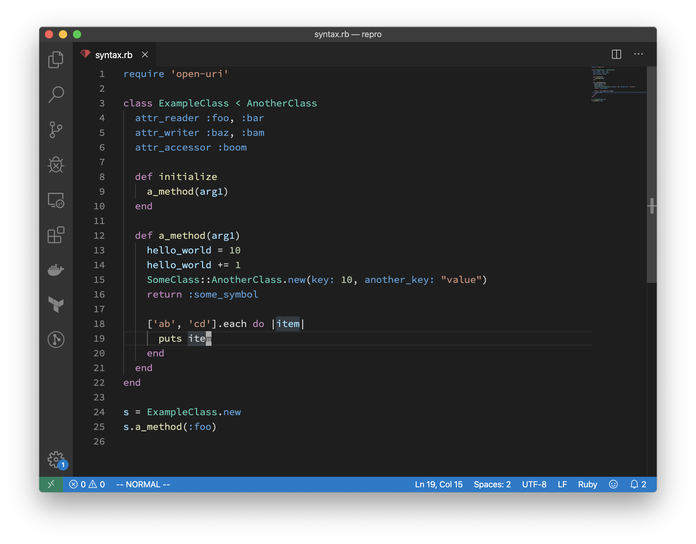
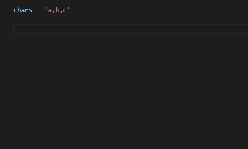
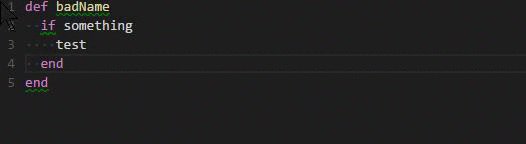

# Choosing a Text Editor for Ruby

## Choosing a Text Editor

It may be a tough decision, as a programmer, to choose a text editor, since it will be your main tool to do your work, and you will use it every day in your work-life.

Everybody has their favorite text editor, I have known people who use **[Vim](https://www.vim.org/), [Notepad++](https://notepad-plus-plus.org/), [Sublime Text](https://www.sublimetext.com/), [Atom](https://atom.io/)**, and many others.

I tried different text editors in my career, always looking for the perfect one. At first, I started with Sublime Text, later the pretty UI of Atom hooked me, and for the last year I have been coding with **Visual Studio Code**.

I was enjoying Atom, but in some cases, my computer at the time couldn't handle it very well and it was getting a bit laggy to open the text editor or work with it. So a friend of mine told me that maybe Visual Studio Code could fit my needs, and he was right.

# Visual Code Studio Extensions

## [GitLens](https://marketplace.visualstudio.com/items?itemName=eamodio.gitlens)

This extension includes a lot of cool functionalities of Git in Visual Studio Code: "GitLens simply helps you **better understand code**" says Eric Amodio, the creator of the extension.

I love Gitlens because it allows me to detect who wrote the code that I am reading, and this is really useful because when I have doubts about the code, I know who to talk to.

**Features:**

- An unobtrusive current line blame annotation at the end of the line with detailed blame information accessible via hovers
- Authorship code lens showing the most recent commit and # of authors to the top of files and/or on code blocks
- A status bar blame annotation showing author and date for the current line
- On-demand gutter blame annotations, including a heatmap, for the whole file
- On-demand gutter heatmap annotations to show how recently lines were changed, relative to all the other changes in the file (hot vs. cold)
- On-demand recent changes annotations to highlight lines changed by the most recent commit
- And much [more](https://gitlens.amod.io/#features).

## [Ruby](https://marketplace.visualstudio.com/items?itemName=rebornix.Ruby)

This extension provides enhanced Ruby language and debugging support. One of the coolest things about this extension is the syntax support to our ruby files, so this is a **must-have** if you are a Ruby developer.

**Features:**

- Automatic Ruby environment detection with support for rvm, rbenv, chruby, and asdf
- Lint support via RuboCop, Standard, and Reek
- Format support via RuboCop, Standard, Rufo, and RubyFMT
- Semantic code folding support
- Semantic highlighting support
- Basic Intellisense support

## [Ruby Solargraph](https://marketplace.visualstudio.com/items?itemName=castwide.solargraph)

Another **vital** extension if you are a Ruby developer, which gives Visual Studio Code some features that can be found in IDE's like "Go to definition" for classes, modules, and methods. Also provides documentation and code completion. If you are learning Ruby, this extension will help you a lot.

**Features:**

- Context-aware suggestions and documentation for the Ruby core
- Detection of some variable types and method return values (e.g., String.new. returns String instance methods)
- Identification of local, class, and instance variables within the current scope
- Find references and rename symbols (experimental as of solargraph gem v0.22.0)
- Support for gems
- Near-complete support for the Ruby core and stdlib
- Partial support for Ruby on Rails

## [ruby-rubocop](https://marketplace.visualstudio.com/items?itemName=misogi.ruby-rubocop)

Having RuboCop configured in your ruby project will help you to maintain the quality of the code, especially if your project is being developed by a team. This extension will let you autoformat and correct your code basing it the directives written in the .rubucop.yml file. With only a key shortcut your code will be formatted in a second, is fast, is good, is an **essential** extension.

**Features:**

- Lint by executing the command "Ruby: lint by rubocop" (cmd+shift+p and type command)
- Auto invoke when saving file
- Auto correct command "Ruby: autocorrect by rubocop"

## [Prettier](https://marketplace.visualstudio.com/items?itemName=esbenp.prettier-vscode)

This extension will help you to format the code of Javascript, HTML, CSS, JSON, and many more files. Is simple and quick, is not as configurable as other code-formatter extensions.

**Features:**

- Supports many languages
- You press save and code is formatted
- No need to discuss style in code review
- Saves you time and energy

## [VSCode Great Icons](https://marketplace.visualstudio.com/items?itemName=emmanuelbeziat.vscode-great-icons)

A very simple one, adds icons to your files and it personally helps me a lot to know instantly which kind of file I'm seeing.

Switching from Atom to Visual Studio Code

I fully understand you, I missed the Atom shortcut keymap so much when I made the switch, but here is your salvation.

## [Atom Keymap](https://marketplace.visualstudio.com/items?itemName=ms-vscode.atom-keybindings)

This extension ports popular Atom keyboard shortcuts to Visual Studio Code and helps to make the switch between code editors a lot easier.

## [Atom One Dark Theme](https://marketplace.visualstudio.com/items?itemName=akamud.vscode-theme-onedark)

And the last extension that I will share with you is an aesthetic one, when I started using Visual Studio Code I missed the theme that Atom has, so this extension fix that problem for me.

# Conclusion

These are my favorite extension for Visual Studio Code at the moment that I'm writing this. I hope that they help you to improve your experience using this famous code editor and please feel free to comment below this article if you have any other extensions recommendation!
