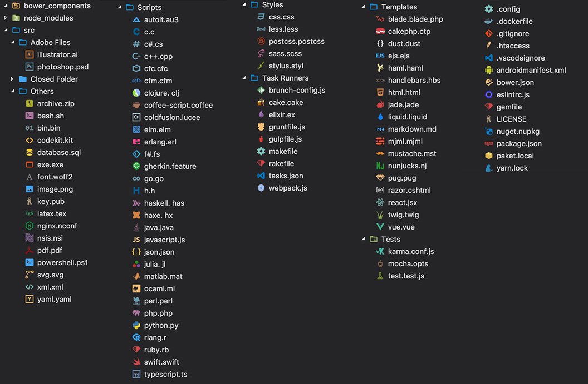

# Choosing a text editor

It may be a tough decision, as a programmer, the text editor that you choose will be your main tool to do your work, and you will use it every day in your work-life.

Everybody has their favorite text editor, in my life I have known people who use **Vim, Notepad++, Sublime Text, Atom**, and many others.

I tried different text editors in my career, always looking for a perfect one -- at first I started with SublimeText, later the pretty UI of Atom hook me, and for the last year I have been coding with **Visual Studio Code**.

I was enjoying Atom, but in some cases, my computer at the time couldn't handle it very well and it was getting a bit laggy to open the text editor or work with it. So a friend of mine told me that maybe Visual Studio Code could fit my needs, and he was right.

# I use Visual Studio Code too! Tell me about the extensions

## [GitLens](https://marketplace.visualstudio.com/items?itemName=eamodio.gitlens)

This extension includes a lot of cool functionalities of Git in Visual Studio Code "GitLens simply helps you **better understand code**" says Eric Amodio, the creator of the extension.

I love Gitlens because it permits me to detect who wrote the code that I am reading, this is really useful because when I have doubts about the code, I know who to talk to.

## [Ruby](https://marketplace.visualstudio.com/items?itemName=rebornix.Ruby)

This extension provides enhanced Ruby language and debugging support, one of the coolest things about this extension is the syntax support to our ruby files, is a **must-have** if you are a Ruby developer.

## [VSCode Ruby](https://marketplace.visualstudio.com/items?itemName=wingrunr21.vscode-ruby)

This extension could be an optional one. But provides improved syntax highlighting, language configuration, and snippets to Ruby and ERB files.

It is meant to be used alongside the [Ruby extension](https://marketplace.visualstudio.com/items?itemName=rebornix.Ruby) and is used to lint code by [ruby-rubocop](https://marketplace.visualstudio.com/items?itemName=misogi.ruby-rubocop) too.

## [Ruby Solargraph](https://marketplace.visualstudio.com/items?itemName=castwide.solargraph)

Another **must-have** extension if you are a Ruby developer, gives Visual Studio Code some features that can be found in IDE's like "Go to definition" for classes, modules, and methods. Also provides documentation and code completion. If you are learning Ruby, this extension will help you a lot.

## [ruby-rubocop](https://marketplace.visualstudio.com/items?itemName=misogi.ruby-rubocop)

Having rubocop configured in our ruby project will help us to maintain the quality of the code, especially if our project is being developed by a team. This extension will let us autoformat and correct our code basing it the directives written in the .rubucop.yml file. With only a key shortcut your code will be formatted in a second, is fast, is good, is a **must-have** extension.

## [Prettier](https://marketplace.visualstudio.com/items?itemName=esbenp.prettier-vscode)

This extension will help us to format the code of Javascript, HTML, CSS, JSON, and many more files. Is simple and quick, but is not so much configurable like other code-formatter extensions.

## [VSCode Great Icons](https://marketplace.visualstudio.com/items?itemName=emmanuelbeziat.vscode-great-icons)

A very simple one, adds icons to our files, it personally helps me a lot to know instantly which kind of file I'm seeing.

# I&#39;ve been using atom and now I switched to Visual Studio Code, I&#39;m a bit lost

I fully understand you, I miss so much the Atom shortcut keymap when I made the switch, but here is your salvation.

## [Atom Keymap](https://marketplace.visualstudio.com/items?itemName=ms-vscode.atom-keybindings)

This extension ports popular Atom keyboard shortcuts to Visual Studio Code helps you a lot to make easier the switch between the code editors.

## [Atom One Dark Theme](https://marketplace.visualstudio.com/items?itemName=akamud.vscode-theme-onedark)

And the last extension that I will share with you is an aesthetic one, when I started using Visual Studio Code I missed the theme that Atom has, so this extension fix that problem for me.

# Conclusion

Those are my favorite extension for Visual Studio Code at the moment that I'm writing this, I hope that they help you to improve your experience using this famous code editor, comment below this article if you have any other extensions recommendation!
