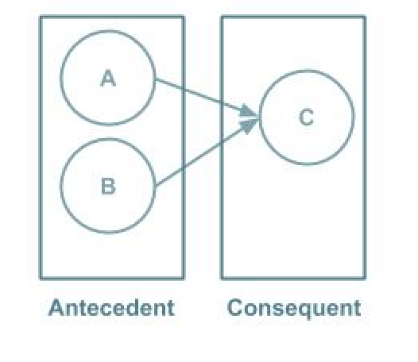

# Other unsupervised learning

In addition to clustering methods, several other unsupervised machine learning techniques exist. Unsupervised learning means finding patterns in the data, those patterns might provide insights.  This article is focused on three other types of algorithms: 
anomaly detection: discover deviations from the data
association rules: find rules in the data
recommendation systems: suggest items to users

## Anomaly detection

[Anomaly detection](https://blog.floydhub.com/introduction-to-anomaly-detection-in-python/) consists of the identification of data points that differ from the norm.
The detection of the anomalies can be just statistical for visualization, or it can be by the application of a machine learning model. The complexity of the model would depend on the nature of the data. Thus, the algorithm can be either supervised (when you already know beforehand which data points are outliers and you can construct training and test data sets) or it can be unsupervised and the model would discover the outliers by itself. 
Examples of some algorithms that are being applied to detect anomalies are:

- Isolation forest: based on trees 
- [Autoencoder:](https://blog.cloudera.com/deep-learning-for-anomaly-detection/) it is a neural network which reconstructs the original data
- Clustering methods: By grouping data points into clusters, data points that do not match with any cluster means that are anomalies. 

The anomalies can be classified into three categories:
- Global: in comparison with the rest of the data 
- Contextual: is anomalous in a specific context or situation 
- Collective: when a set of data points is anomalous in comparison to the rest of the data.

## Association rules
The objective for [association rules](https://towardsdatascience.com/association-rules-2-aa9a77241654) is to discover relationships between variables by identifying rules in the data. For example, people who generally buy A and B, also buy C. From this discovery,  promotions can be offered or develop a marketing strategy.          

 
    

The rules are represented in a IF-THEN format. In the example of the image, A and B are called antecedent (the IF part), and C the consequent (the THEN part). The list of items in the antecedent and the consequent is called itemset.  

Several metrics are used to determine the strength or the relationship between items.  

**Support:** represents the popularity of the combination of items based on the frequency of the event. It also can be seen as the estimated probability that a transaction randomly selected will contain all items in the antecedent and the consequent. 

           

)         

**Confidence:** represents the probability that item Y is bought if item X is bought. In terms of antecedent and consequent, the confidence is the estimated conditional probability that a trans- action randomly selected will contain all the items in the consequent given that the transaction contains all the items in the antecedent.           

  
              
%3DP(%5Cspace%20antecedent%20%5Cspace%20and%20%5Cspace%20consequent%5Cspace%20)%20%5Cspace%20%2F%20%5Cspace%20P(%20%5Cspace%20antecedent%20%5Cspace%20))               

**Lift:** compares the confidence of the rule with a benchmark value under the assumption that antecedent and consequent are independent events. Thus, the lift is the ratio between the confidence and the benchmark value.         

      

        

In order to be useful the rule, the lift ratio needs to be greater than 1.

## Recommender Systems
A [recommender system](https://heartbeat.fritz.ai/recommender-systems-with-python-part-i-content-based-filtering-5df4940bd831) predicts the rating that a user would give to an item. This method is used in a variety of areas where there list of items or products that people categorize and the system from this data is able to recommend users other items that they might like. Examples are Spotify, Amazon, Netflix, YouTube and Facebook.
 
**Types**         

There are two types based on the model used.          

- Memory-based: generates recommendations from the entire dataset using statistical methods to measure the proximity between users or items.
- Model-based: creates a model to learn preferences from the data.

**Most common methods**    

* Content-Based: based on the content (characteristics) of the item and the user profile. It determines similar items that users might like by finding similar items.  
* [Collaborative Filtering:](http://www.salemmarafi.com/code/collaborative-filtering-with-python/) based on the users’ preferences. It determines items that the user might like by finding items that similar users liked. 
	* User-based: based on similar rating patterns. It is based on a user-item matrix to discover users that are neighbors, where each cell contains the rating made by the user for each item.  
	* Item-based: based on similarities between items ratings. It is based on an item-item matrix to find similar items, where each cell contains a value that represents the relationship between the two items. 

The following challenges are present in this types of systems:        
      
- Data sparsity: generally users do not rate all the items.
- Cold start: difficult to make recommendations for new users.
- Scalability: if the number of users or items gets bigger, the performance will be severely affected.

# Conclusion
Different unsupervised learning techniques are available to help us to resolve problems and generate value from the data. The ones benefited from the applications of these techniques are the companies that provide better services and the customers who are experiencing those services. 

 

