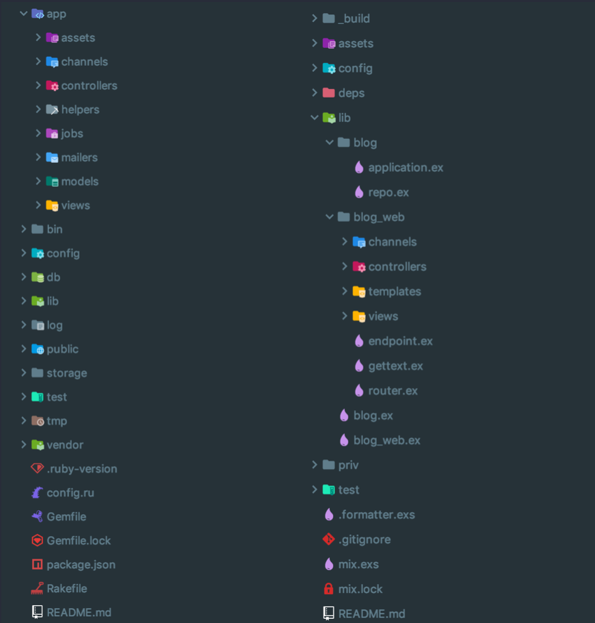

# Phoenix for Rails developers: a practical example

This is an introductory post to Phoenix, Elixir's web framework. It does not intend to be a complete guide, since it’s a big framework with lots of things to get into, but rather to show a side by side comparison of how things are done in both frameworks using the scaffolding they provide to throw some insight into their best practices with a classic blog example.

It is a two-part blog post, on the first half we'll take a look at the web layer where both frameworks are most alike and in the second half we'll dive into the business layer which is where the frameworks diverge.

The idea is to show how similar they are and get you hyped enough to try it by yourself!


### Introduction

I started working on Ruby after an exploratory phase of many languages led me to it. The syntax just captivated me, it was so expressive that it could be read like English and it had so many tools that allowed me to do things more productively than ever before. No more string helper functions or awkward loops to manipulate arrays, you could have all those things out of the box and just focus on coding your solution. After a while I found Rails, and it felt right in with Ruby’s philosophy. I felt much more productive than with other tools and it came with batteries included. No hours of configurations or research for a library that just required you to do all the work.

Since that time I’ve tried many other web development frameworks in a wide variety of languages but I never felt at home with any of them. Even if many tried to replicate what Rails did there was always something missing, whether it was because of the language or some decision where it diverged they always felt like mere copies to me.

### Phoenix

Enter Phoenix, a web framework built on top of Elixir, a functional language with a Ruby-like syntax that runs on top of the Erlang virtual machine. This framework took after many of the features that make Rails what it is: MVC architecture, an opinionated file structure, included tools such as an ORM, a template engine and a routing layer. But it never tried to be another copy, instead, it diverged with time and took many decisions that fit better the functional paradigm and the different language, all without sacrificing productivity or developer happiness.

In time, this led to an independent web framework but with that special flavor we all love from Rails. There’s one difference though, since Elixir was built on top of Erlang, which was designed to build massively scalable applications, all apps built with Phoenix inherit this perk. This means that you can code away without having to worry about how your app will perform once you reach the big leagues. This is something with which many Rails apps struggle and it’s the main reason why Jose Valim developed Elixir in the first place.

But enough preaching, let’s see some code!


### File structure



No opinionated framework would be complete without a take on how files should be organized. Phoenix's structure inherits from how packages (Elixir's equivalent for gems) are structured, all custom code goes inside the `lib/` folder. Inside it you'll find right away the main difference between both frameworks in this aspect: Phoenix separates the layer of web presentation from the business logic. In the image above, we have a `blog/` folder, which contains the basic modules to build our business logic and the `blog_web` which looks pretty similar to the Rails' `app/` directory. There are some subtle differences though but we'll take a deeper look into the them in the following sections.

### Scaffold away

As I mentioned, both frameworks provide commands to scaffold different parts of the application. For this example, we'll compare the output of generating a full resource including views and routes, but first, the commands used:

```bash
bin/rails generate scaffold Article title:string text:text
```

```bash
mix phx.gen.html Articles Article articles title:string text:text
```

Once more they look alike with subtle differences, in this case, Phoenix goes for a more verbose fashion by asking us to specify the context module where it'll be created, the name of the schema module (equivalent to the model) and its plural to be used as the table name.

### Migrations

Speaking of table names, let's take a look at the way migrations are done. First, to refresh the memory, ActiveRecord's migrations:

```ruby
def change
  create_table :articles do |t|
    t.string :title
    t.text :text

    t.timestamps
  end
end
```
And now Ecto's (Phoenix's ORM):

```elixir
def change do
  create table(:articles) do
    add :title, :string
    add :text, :text

    timestamps()
  end
end
```

Notice the difference? At first glance, it looks like the same thing, but if you take a closer look you'll notice that the first snippet takes an Object Oriented approach while the second one is functional. This makes it very easy to apply our Rails knowledge into this new and exciting framework, we just need to tweak a bit the syntax but the basis is still there. For example, let's add a unique constraint to our article's title.

```elixir
def change do
  create table(:articles) do
    add :title, :string
    add :text, :text

    timestamps()
  end

  create unique_index(:articles, [:title])
end
```

So even though it might be different from the common approach of adding the `index: { unique: true }`, it's still very similar to the way an index is created on an existing table. Mainly because that's what's happening here.

### Models and schemas

Here we find one of the first great differences. While models are the heart of a Rails app, Phoenix just has schemas. These are basically structs that contain the database data, like the table fields and their types. It is also responsible for validating this data and generating error messages. Aside from that, it doesn't know a thing about the database, it does not save update or delete any records. But enough chatter, let's see how they look:

```elixir
defmodule Blog.Articles.Article do
  use Ecto.Schema
  import Ecto.Changeset

  schema "articles" do
    field :text, :string
    field :title, :string

    timestamps()
  end

  def changeset(article, attrs) do
    article
    |> cast(attrs, [:title, :text])
    |> validate_required([:title, :text])
    |> unique_constraint(:title)
  end
end
```

Don't be scared of all those `|>`, it's just the pipe operator (just like Unix's). It just passes the result on the left-hand side as the first argument of the function on the right-hand side. So for example cast is being called with `article` as its first argument, making the two first lines equivalent to `cast(article, attrs, [:title, :text])`. 

Phoenix's solution is once again much more verbose than your standard ActiveRecord:

```ruby
class Article < ApplicationRecord
  validates :title, uniqueness: true
end
```

But let's use this new uniqueness constraint to show another difference between how data is treated, which I think it's one point where Ecto has improved upon its cousin. If you take a look at the `changeset` function on the article schema you'll see that the last line calls the `unique_constraint` function with the article and the name of the attribute with the constraint. All it's doing here is preparing to receive a possible exception from the database, it doesn't do any queries, it just delegates those validations to the database. This is one of Ecto's philosophies, constraint validations belong in the database, which is much more efficient at checking them and which ends up validating them anyway in most systems.


### Routes

Let's go with the simple routes first:

```ruby
Rails.application.routes.draw do
  resources :articles
end
```

Rails' routes are pretty straightforward once you get to know them, they just specify which endpoints are available for the end user, allow gems (or more precisely engines and plugins) to mount their routes and some validation like Devise's `authenticate` method. The manipulation of the request is done on the controllers and from time to time it's a bit difficult to know where a value came from, who parsed a request or who rejected it. Phoenix has a different take on this:

```elixir
defmodule BlogWeb.Router do
  use BlogWeb, :router

  pipeline :browser do
    plug :accepts, ["html"]
    plug :fetch_session
    plug :fetch_flash
    plug :protect_from_forgery
    plug :put_secure_browser_headers
  end

  pipeline :api do
    plug :accepts, ["json"]
  end

  scope "/", BlogWeb do
    pipe_through :browser

    resources "/articles", ArticleController
    get "/", PageController, :index
  end

  
  scope "/api", BlogWeb do
    pipe_through :api
  end
end
```

That's a lot more code, but just because that's more responsibilities too. The `plug` calls you see here define something that could be compared to middlewares, they get executed serially in the order they are defined. They get grouped together with the `pipeline` function so they can be called inside scopes (which are just like Rails'), to perform things like parsing, authentication, authorization and pretty much anything else you might want to do before an action gets executed.

This allows decoupling controllers from the logic of authorizing users and rejecting requests most of the time, which substitutes `before_action` calls and, in many cases, reduces the need for complex inheritance between controllers.

### Controllers

For controllers I decided just to show some actions and do a quick walkthrough of the differences, there is much to understand on functional programming to decipher what's Phoenix doing and this is not the post for that. If you feel interested to learn some more on Elixir's syntax the [Elixir Getting Started Guide](https://elixir-lang.org/getting-started/introduction.html) is a good place to start. Without further ado, I present to you the controllers: 

```ruby
class ArticlesController < ApplicationController
  before_action :set_article, only: [:show, 
                                     :edit,
                                     :update,
                                     :destroy]

  def index
    @articles = Article.all
  end

 def new
    @article = Article.new
  end

 def create
    @article = Article.new(article_params)

    respond_to do |format|
      if @article.save
        format.html { redirect_to @article }
        format.json { render :show, status: :created, 
                             location: @article }
      else
        format.html { render :new }
        format.json { render json: @article.errors, 
                             status: :unprocessable_entity }
      end
    end
  end
end
```

```elixir
defmodule BlogWeb.ArticleController do
  use BlogWeb, :controller

  alias Blog.Articles
  alias Blog.Articles.Article

  def index(conn, _params) do
    articles = Articles.list_articles()
    render(conn, "index.html", articles: articles)
  end

  def new(conn, _params) do
    changeset = Articles.change_article(%Article{})
    render(conn, "new.html", changeset: changeset)
  end

  def create(conn, %{"article" => article_params}) do
    case Articles.create_article(article_params) do
      {:ok, article} ->
        conn
        |> put_flash(:info, "Article created successfully.")
        |> redirect(to: Routes.article_path(conn, :show, article))

      {:error, %Ecto.Changeset{} = changeset} ->
        render(conn, "new.html", changeset: changeset)
    end
  end
end
```

The main difference here is just the programming paradigm. Elixir is functional so the request (or connection) and the params are received as parameters of the action, while Ruby, being object oriented, provides the same data through local state and accessor functions. Still, the syntax is quite similar and I think it's easy to get a grasp of what's going on in the Phoenix snippet. 

Another small difference is that the generator used on Phoenix will scaffold a controller that just responds to HTML, while Rails' will render views for both JSON and HTML. There is, of course, another generator to make a JSON resource but it'll create a new controller which will go on a different pipeline (if you go back to the routes section you'll see there's an `:api` pipeline).

### Contexts

Yes! My favorite part, the business logic. Remember how I said schemas on Phoenix do not call the database but are just a bag of data? Well, you must have wondered where are the database calls, right here on the contexts:

```elixir
defmodule Blog.Articles do
  @moduledoc """
  The Articles context.
  """

  import Ecto.Query, warn: false
  alias Blog.Repo

  alias Blog.Articles.Article

  def list_articles do
    Repo.all(Article)
  end

  def get_article!(id), do: Repo.get!(Article, id)

  def create_article(attrs \\ %{}) do
    %Article{}
    |> Article.changeset(attrs)
    |> Repo.insert()
  end

  def update_article(%Article{} = article, attrs) do
    article
    |> Article.changeset(attrs)
    |> Repo.update()
  end

  def delete_article(%Article{} = article) do
    Repo.delete(article)
  end

  def change_article(%Article{} = article) do
    Article.changeset(article, %{})
  end
end
```

Again, this follows the functional paradigm so all a context does is provide methods to interact with the data and it does so by using the repository pattern. If you are not familiar with the concept, just think of it as an abstraction of your database (or another kind of storage) where you can query, update and create records by sending the necessary data. This pattern allows separating the data from the way it's saved, after understanding that contexts are straightforward to comprehend.

This way of managing the data layer and the business logic opens up a world of opportunities in my opinion. Assume for example that we have a process for publishing in our blog, so all articles must be reviewed after they are changed and before they are published. We would probably do some validations in our model to only insert it if it's approved, the same would go in our context here. But we also like to allow admins to bypass these validations, a common case, and publish whenever they want. So in Rails we would probably change our code to reflect this new case while in Phoenix we might wish to create a new context altogether.

As with any choice, you always have pros and cons, but I really like the way contexts allow you to avoid polluting a model with different responsibilities. If you've been working on Rails long enough you might notice they have a similar purpose as service objects which the community has embraced and which are a part of our daily development cycle.

### Helpers and Views

Last but not least is how we present the data. You probably noticed in the file structure that there were two directories called `views/` and `templates/` on the Phoenix project structure, if you didn't go and take a closer view. You might be wondering what's the difference between them, well the templates are just that, text files with embedded code (just like erb we have eex) which you use to respond to requests. Views, on the other hand, resemble to helpers but with one noticeable difference: they are not global by default.

Let's take a look at how they differ with an example; we would like to show the read time in our articles. Since we don't track this value on our DB and it's just for presentation you'd normally want to put this on a helper, like this:

```ruby
module ArticlesHelper
  WORDS_PER_MINUTE = 200

  def read_time(article)
    words_count = article.text.split.size
    read_time_in_minutes = words_count / WORDS_PER_MINUTE.to_f
    “#{read_time_in_minutes.ceil} minutes"
  end
end
```

Easy peasy, now we just have to call this on our `show.html.erb` and we are done. Not so fast, the problem I see with this is that it gets included in every view. Sure, for a small app like this and with a name so specific, there's no problem, but when it starts to grow and you have helpers with names like `format_title` and `format_title_for_user` you start having troubles. Phoenix's helpers (or views as they are called in the framework) are very similar:

```elixir
defmodule BlogWeb.ArticleView do
  use BlogWeb, :view

  alias Blog.Articles.Article

  @words_per_minute 200

  defp read_time(%Article{text: text}) do
    words_count =
      text
      |> String.split(" ")
      |> Enum.count()
    read_time_in_minutes = Float.ceil(words_count / @words_per_minute)
    "#{trunc(read_time_in_minutes)} minutes"
  end
end
```

But as I said before they are scoped to some presenter so this view, for example, has functions that can only be called on an article template. This allows you to use whatever name you want knowing you won't pollute the global scope. And what about if you want to use common functions across many templates? Simple, make another module with those functions and include it across the views where you need it.

### Conclusion

You might be thinking I threw a lot of dirt on Rails and the ways things are done, that I recommend not using Rails anymore and start using Phoenix. This is not one of those "why X sucks and you should migrate all your code to Y", this is one of those "hey look at this cool new tool, you might find it useful/enjoyable". I still use Rails on a daily day basis and love the way it works, there are also many ways to mitigate some of the "bad" things about it, like presenters, services, form objects, and much other stuff.

So if you also like Rails give Phoenix a try, you may struggle with it in the beginning, as with any new technology, but I'm confident it'll grow on you as it did on me. To start learning I recommend the official guides, they are very friendly and 
complete:

- Elixir: [https://elixir-lang.org/getting-started/introduction.html]()
- Phoenix: [https://hexdocs.pm/phoenix/up_and_running.html]()


