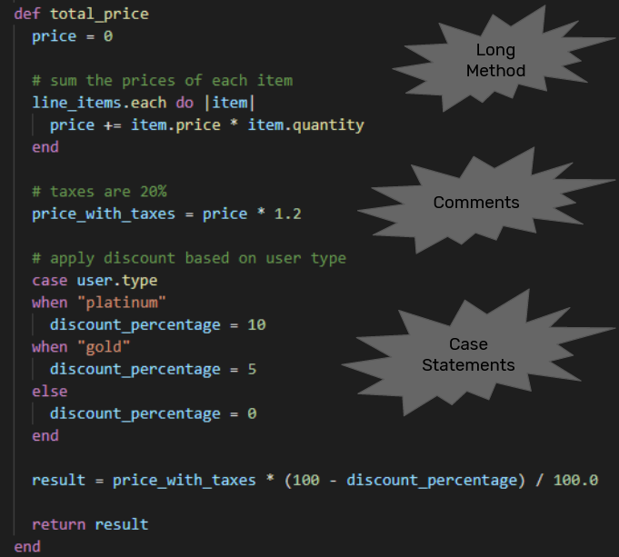

# Refactoring
If you are reading this article I can assume that you are a software developer, you have probably both heard the term “refactoring” and applied it yourself (conscious or not) several times in the code you have written. To begin, let's see the definition:

**Refactoring (noun):
A change made to the internal structure of software to make it easier to understand and cheaper to modify without changing its observable behavior.**

I became interested in the topic once in my early years as a developer, when I was asked to refactor a piece of code that had plenty of opportunities for improvement. It was a very long method with several steps that performed different things, even with multiple responsibilities.

My first approach to that refactoring was to apply lots of “Extract Method” to that long method, giving those extracted the most representative names that I could find, for them and for the parameters. When I finished doing that, I felt that the code was much better and that I had accomplished the task I was assigned.

Then I presented it to the architect of the project, and he instantly noticed that my refactoring skills were similar to my guitar-playing skills (FYI: I don't play guitar, I just play air guitar). As any good mentor should do, he saw an opportunity for me to improve, so we paired up, and had about 3 different 1-2 hours long working sessions, designing a new solution together, applying some design patterns here and there.

After reaching a really much better solution than the original, I really liked what we had done, and I saw a lot of potential in this technique. A code that already worked, now it still worked the same, but it was much easier to understand and modify when needed.

Last year, I felt that I definitely could keep improving my skills, so after searching for book recommendations, I reached one very well known: "Refactoring" by Martin Fowler. Now I can say that I understand why it is so recommended. This topic I became interested long ago, now made much more sense to me.

For you interested in the origins of things, refactoring wasn’t invented by Martin Fowler as some people might think. He says that he learned this technique from Kent Beck and a group of developers of a community of Smalltalk language back in the 90s, and by that time there were just a few articles and thesis about it, but there were no books.

So, enough introduction, this is about what I learned from that book.

## 1) WHY TO DO REFACTORING?
Maybe the most important question to ask yourself before doing anything, is why should you do it, meaning what value does it give in return.

These are some of the main reasons why doing refactoring is recommended:
- Refactoring improves the design of software.
  - Creating software that has a good architecture isn't something that can be done the first time. The design we believe that best fits today, might not be the one that best fits next week.
  - Without refactoring the design of the program will decay over time.
- Refactoring makes software easier to understand.
  - *“Any fool can write code that a computer can understand. Good programmers write code that humans can understand.”* - Martin Fowler
- Refactoring makes you find bugs.
  - When the code is more simple, it is easier to understand, easier to debug, and also easier to detect non-considered cases.
- Refactoring helps you program faster.
  - Without a good design, you can progress quickly for a while, but soon the poor design starts to slow you down.

**Conclusion: Refactoring lowers the cost of enhancements :dollar: :chart_with_downwards_trend:**

## 2) WHEN TO DO REFACTORING?
Refactoring isn't a special task that will show up in a project plan, so when should you do it?
- When you need to add a new feature to a codebase, look at the existing code and consider whether it's structured in such a way to make the new change straightforward.
  - If it isn't, then refactor the existing code to make this new addition easy.
  - Once that change is done, then add the new feature.
- After you add a feature and get it working, you can review the resulting code, that while it works, it may not be as clear as it could be.
  - If it isn't, then refactor it into better shape so that when you (or someone else) return to this code in a few weeks, won't have to spend time puzzling out how this code works.
- If you struggle to understand the code, refactor it so you won't have to struggle again next time you look at it.

**Conclusion: Refactoring is a part of day-to-day programming :calendar:**

## 3) CODE SMELLS
Probably you’ve heard about code smells, and for sure you have already seen tons of them. Let’s see their characteristics.
- A code smell is a surface indication that usually corresponds to a deeper problem in the system.
  - Firstly a smell is by definition something quick to spot - or sniffable.
  - A long method is a good example of this - just looking at the code and my nose twitches if I see more than a dozen lines.
- The second is that smells don't always indicate a problem.
  - Some long methods are just fine. You have to look deeper to see if there is an underlying problem - smells aren't inherently bad on their own - they are often an indicator of a problem rather than the problem themselves.

Below is an example written in Ruby (it should be simple enough for anyone to follow). Don't look at the image yet! I know the gray boxes already grab much attention, just cover them with your hand and look at the code for no more than 10 seconds, thinking of the code smells that you can find. Then uncover the boxes. I’m quite sure that in that amount of time you could find the same code smells (or even more). What I’m trying to show, is exactly what code smells are, they are something very quick to spot, and they are not a problem by themselves (think that this code works perfectly fine).

Here you can find a [catalog of code smells](https://github.com/lee-dohm/code-smells/blob/master/README.md), defined mainly by Martin Fowler and Kent Beck.

I highly recommend reading, understanding and memorizing them. If you do, whenever you are doing code review to another person, or just reviewing your code, you will see much more easily the possible improvements.

**Conclusion: Pay attention to code smells. They might be whispering (or even shouting!) asking for a better solution :warning: :eyes:**

## 4) ROLE OF TESTING
By definition, refactoring is the process of changing the code structure, without altering its behavior.
- How do we know that we have not altered its behavior then?
  - Yes, you’ve guessed. We need tests.
- And what if the code we want to refactor doesn’t have enough tests?
  - Then you should first write the tests, and then refactor.

You may be asking other things like whether it's better to have more unit tests or integration tests, or if it's necessary to have near 100% code coverage on tests.

As a short answer, take this quote from Dijkstra: *"Program testing can be used to show the presence of bugs, but never to show their absence."* It means that there is no specific technique or condition to be met, in order to be sure that your program works exactly as expected without any errors.

So test the way you prefer, and try to cover as much as possible without adding unnecessary duplicated tests. Keep in mind that this will allow you to apply refactoring with much more confidence.

**Conclusion: Having tests is a precondition for refactoring, unless you want to take the risk of breaking things :bug:**

## 5) MECHANICS OF A REFACTORING
After this long introduction, we are finally reaching the part where I present a couple of examples. Before doing that, I would like to mention that the refactorings as described by Martin Fowler in his book, they have a format, and they have a mechanics.

**Format of a refactoring:**
- They have a name
  - Is important to building a vocabulary of refactoring.
- They have a motivation
  - Describes why the refactoring should be done and describes circumstances in which it shouldn’t be done.
- They have a mechanic
  - A step-by-step description of how to carry out the refactoring.

**Mechanics of a refactoring:**
- Each step in the refactoring is as small as possible.
- Test after every step. 
- In practice, if you want to take larger steps, you can, but if the tests fail, then you should go backward and take smaller steps.

In the book they are presented within 6 different categories which may not be worth it to explain them in this article. Here you can find a [catalog of refactorings](https://refactoring.com/catalog/).

**Conclusion: There is no conclusion here :sweat_smile:**

## 6) SOME EXAMPLES
If you read up to here, first thank you, and second, now you have to finish it.

I will present just 2 simple refactorings as examples. I don’t think the purpose of this article should be for you to learn many of them or learning some complex ones. I believe that is something you can learn by yourself somewhere else, but you will do it only if you feel enough motivation to do it.

**First Example - Decompose Conditional Expression:**
You have a complicated conditional (if-then-else) statement.
→ Extract methods from the condition, “then” part, and “else” part.

- **Motivation:** Conditional logic adds complexity to the code. You can make your intention clearer by decomposing it and replacing chunks of code with a method call named after the intention of that block of code.
- **Mechanic:**
  1.  Extract the conditions into their own methods.
  2.  Test.
  3.  Extract the actions inside the conditional code into their own methods.
  4.  Test.

**Second Example - Extract Class:**
You have one class doing work that should be done by two.
→ Create a new class and move the relevant fields and methods from the old class into the new class.

- **Motivation:** In practice, classes grow over time. One class with lots of methods and data is too big to understand easily, so it becomes hard to maintain.
- **Mechanic:**
  1. Decide how to split the responsibilities of the class.
  2. Create a new class to express the split-off responsibilities. If the responsibilities of the old class no longer match its name, rename the old class.
  3. Make a link from the old to the new class.
  4. Use Move Field on each field you want to move.
  5. Test after each move.
  6. Use Move Method to move methods over from the old to the new. Start with lower-level methods and build to the higher level.
  7. Test after each move.
  8. Review and reduce the interfaces of each class.
  9. Decide whether multiple clients will be able to access the class. If you do allow access to multiple clients, decide whether to expose the new class as a reference object or as an immutable value object.

## 7) FINAL THOUGHTS
In my own experience as a software engineer, I have seen many projects grow a lot over time, and by the hand, their code became harder to understand, harder to maintain, harder to work with and more prone to introducing bugs. And I know for as long as I work in this industry, I will continue to see this happen.

There is no magic trick for that. However, so far I have also seen that refactoring the code as part of your daily programming, is probably the best technique you and your team can apply to counter those undesired effects.

Give it a chance, and practice it until it just becomes a habit. I can assure that you will live the benefits of it.
