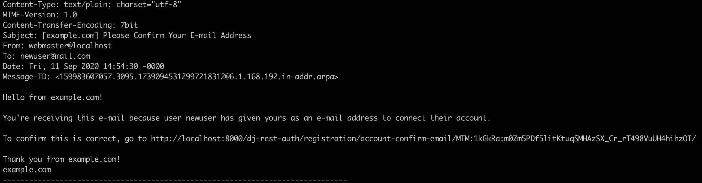

## Registration and Authentication in your Django app with dj-rest-auth (part 2)

In the [first part of this blog post](link-to-part-1) I've presented the dj-rest-auth package that allows us to handle registration and authentication through REST API endpoints with a minimal configuration.
I've also talked about different customizations that you can take advantage of.
When I started to use this package I faced some problems because I was learning Django and dj-rest-auth offers many features and possibilities for each feature. This is why first-time users may experience some confusion. I will be sharing more examples and give you some tips.  
Let's continue with the example of the `CustomUser` shown in the previous part, with no username, unique email, gender, and phone number attribute. First I will show you how to implement email validation at signup, and how to customize the emails that are sent by your app. Then I will talk about the reset password functionality, and finally how to customize the templates with your own desired values.

### Sign-up with email verification

Having installed and integrated dj-rest-auth to your Django app, it's possible to configure email verification at the moment that a user registers. This means that a successfully registered user has to check the inbox and confirm through the received email that he really is the owner of the email account. To do this, go to your settings and turn on email verification:

```python
# Your settings file
...

ACCOUNT_EMAIL_VERIFICATION = 'mandatory'
```

With this, after a correct sign-up your app will send a verification email to the entered account. But you didn't finish: as dj-rest-auth [documentation](https://dj-rest-auth.readthedocs.io/en/latest/api_endpoints.html#registration) says, after enabling the email verification, you need to add a path to your urls that will be used by the verification view:

```python
# Your urls file
...
from dj_rest_auth.registration.views import VerifyEmailView

...

urlpatterns = [
    ...
    path(
        'dj-rest-auth/account-confirm-email/',
        VerifyEmailView.as_view(),
        name='account_email_verification_sent'
    ),
    ...
]

```

If you don't do that, you will get a [NoReverseMatch](https://docs.djangoproject.com/en/3.1/ref/exceptions/#noreversematch) error.  
Also, let's use an allauth configuration to activate the email account after the user clicks on the link received in the email. Add this to your settings:

```python
# Your settings file
...
ACCOUNT_CONFIRM_EMAIL_ON_GET = True
```

And add this path to your urls file `before` the definition of the `dj-rest-auth` registration path:

```python
# Your urls file
...
from dj_rest_auth.registration.views import VerifyEmailView, ConfirmEmailView

...

urlpatterns = [
    ...
    path(
        'dj-rest-auth/registration/account-confirm-email/<str:key>/',
        ConfirmEmailView.as_view(),
    ), # Needs to be defined before the registration path
    path('dj-rest-auth/registration/', include('dj_rest_auth.registration.urls')),
    path('dj-rest-auth/account-confirm-email/', VerifyEmailView.as_view(), name='account_email_verification_sent'),
    ...
]

```

That path needs to be there to avoid a template error in dj-rest-auth. As mentioned in the previous part, dj-rest-auth it's an open source software and sometimes we can find some errors. The good part of this is that anyone can address the discovered bugs.  
Having this configuration, the user will be redirected to the login page after clicking in the received link. Don't forget to set the `LOGIN_URL` parameter in your settings, otherwise you can get an error if the default value is not a valid URL of your app. During development, you can set the `LOGIN_URL` as the login endpoint; remember that dj-rest-auth has browsable endpoints thanks to django-rest-framework. So you can test sign-up flow by setting for example:

```python
# Your settings file
...
LOGIN_URL = 'http://localhost:8000/dj-rest-auth/login'
```

Finally, you need to specify to Django the email backend that is in charge of sending the emails of your app.

#### Email backend

The [Django email backend](https://docs.djangoproject.com/en/3.1/topics/email/#email-backends) is the component that handles the sending of an email. You can choose among different possibilities that Django provides. The most common are SMTP and console backend.

You can configure an SMTP server by adding:

```python
# Your settings file
...

EMAIL_BACKEND = 'django.core.mail.backends.smtp.EmailBackend'
EMAIL_HOST = 'your.email.host'
EMAIL_USE_TLS = True
EMAIL_PORT = 587
EMAIL_HOST_USER = 'your email host user'
EMAIL_HOST_PASSWORD = 'your email host password'
```

You have to choose the `EMAIL_HOST`, for example `'smtp.gmail.com'`. In the `EMAIL_HOST_USER` and `EMAIL_HOST_PASSWORD` parameters put the information of the account that will be the email sender. If you are using Gmail as a mail server you will need to allow less secure apps and display unlock captcha. After this, your Django app will send verification emails for all the new users. I recommend you to use environment variables to keep sensitive information in your settings such as keys, the email host account, and its password, etc.  
In real applications the best way to do this is integrating with an email service such as [SendGrid](https://sendgrid.com/docs/for-developers/sending-email/django/).

In the second option, you can locally test the signup feature during development, by setting:

```python
# Your settings file
...
EMAIL_BACKEND = 'django.core.mail.backends.console.EmailBackend'

```

In this case the email is sent and received by the console. So after a successful registration you will see in the console something like this:



If you open your browser and go to the link shown in the printed email, the user's account will be activated and you will be redirected to the `LOGIN_URL`. Now you are able to login with the entered email and password.  
And there it is! You have configured signup with email verification. Let's see how to customize the emails that your application sends.

### Email templates

Django allauth provides a few templates that are used by dj-rest-auth at the moment of sending the emails. As shown in previous section, the verification email printed in console has a template defined by the allauth package. It's possible to customize those email templates by overwriting a couple of files. First of all, let's create a `template` folder inside your main Django app folder.  
From now on, let's assume that the name of your main Django app folder is `myapp`; so you need to add this in your `TEMPLATES` settings:

```python
# Your settings file
...
import os
...

TEMPLATES = [
    {
        'BACKEND': 'django.template.backends.django.DjangoTemplates',
        'DIRS': [
            os.path.join(BASE_DIR, 'myapp/templates'), # Add this inside the DIRS list
        ],
        'APP_DIRS': True,
        ...
    },
]
```

Now you have to overwrite the corresponding template files for the desired customization. In this case, the path used by dj-rest-auth will be `myapp/templates/account/email/`. In there you can add these files to overwrite the ones used by default:

- email_confirmation_message.txt
- email_confirmation_signup_message.txt
- email_confirmation_signup_subject.txt
- email_confirmation_subject.txt

For example, to customize the email confirmation message, you have to create an `email_confirmation_message.txt` file in `myapp/templates/account/email/`. You can even reuse some of the content of the default file that you can find in the [github repository of allauth](https://github.com/pennersr/django-allauth/tree/master/allauth/templates/account/email). Besides, you can set a value to the `ACCOUNT_EMAIL_SUBJECT_PREFIX` parameter in your settings, to add a prefix to the subjects in the emails of your app.  
It's important to say that there are some variables defined in the email templates that are needed and you have to keep them in case you overwrite the files. For example, this is the file of `email_confirmation_message.txt`:

```html
Hello from {{ site_name }}! You're receiving
this e-mail because user {{ user_display }} has given your e-mail address to
register an account on {{ site_domain }}. To confirm this is correct, go to {{
activate_url }}  Thank you from {{
site_name }}! {{ site_domain }} 
```

There you have `activate_url`, that is the link for the user confirmation. So you can remove for example the `site_name` if you want (or change it to show a different one) but you definitely have to keep the `activate_url` value. Otherwise, registered users won't be able to activate their accounts. Summarizing this section, if you decide to overwrite the `email_confirmation_message.txt`, your project structure will look like this:

```
root-project-folder
    |__myapp
    |    |__templates
    |        |__account
    |            |__email
    |                |__email_confirmation_message.txt
    |
    ...
```

Now let's see about the reset password functionality and how to customize it.

### Reset password

If you want to have a reset password feature in your app, you can do it very easily with dj-rest-auth. The first thing to say is that by default you can't test it as a browsable endpoint because it will show a `NoReverseMatch` error. So you need to add this path to your urls file:

```python
# Your urls file
...
from dj_rest_auth.views import PasswordResetConfirmView
...

urlpatterns = [
    ...
    path(
        'rest-auth/password/reset/confirm/<slug:uidb64>/<slug:token>/',
        PasswordResetConfirmView.as_view(), name='password_reset_confirm'
    ),
]

```

And now you are good to go! You can test the browsable endpoint which receives the email of the registered user, and dj-rest-auth sends the instructions to reset the password. You need of course to have configured the email backend.  
You are able to modify the email template for the reset password functionality too. Assuming that you have already configured the `TEMPLATES` folder as in the previous section example, you can create a file in `myapp/templates/registration/` called `password_reset_email.html` to overwrite the one used by default. Why do you have to define it there? Because is the [default path used by Django](https://github.com/django/django/tree/master/django/contrib/admin/templates/registration). You can even reuse some code of the default file, that looks like this:

```html
 You're receiving this
email because you requested a password reset for your user account at {{
site_name }}.   {{ protocol }}://{{
domain }}   {{
user.get_username }}  The {{ site_name }} team 
```

As said in the email validation section, remember to keep some of the needed variables in the template. In this case the most important is the `url` with the `uid` and the `token` that are required to update the user's password.  
 After these steps, you have finished the reset password functionality customization! Taking the previous section into account, your project folder would be now like this one:

```
root-project-folder
    |__myapp
    |    |__templates
    |        |__account
    |        |   |__email
    |        |        |__email_confirmation_message.txt
    |        |__registration
    |            |__password_reset_email.html
    |
    ...
```

Let's see in the last section how we can modify some of the default variables used in the templates.

### Customize variables used in the templates

Let's think about this example: What if you want to modify the URL sent by default in the reset password email template? Well, Django allows you to define variables to be used in the templates by creating your own template tags. The first thing you need to do is define the custom value desired for the URL in your settings:

```python
# Your settings file
...
CUSTOM_PASSWORD_RESET_CONFIRM = 'desired URL'
```

Then you have to create two files under `myapp/templatetags/`: One has to be an empty `__init__.py` file, and the other one registers and gets the tags. Let's call it `password_reset_template_load.py`:

```python
from django import template
from django.conf import settings

register = template.Library()


@register.simple_tag
def get_settings_var(name):
    return getattr(settings, name)
```

Finally, go to your customized email template that you have created to overwrite the default one, and load the defined value by adding `` at the top of the file, and after that add the line that has the custom value (in this case don't forget the `uid` and `token`):

```html
// Your template  ... ?uidb64={{ uid }}&token={{ token }}
```

With these settings you have defined your custom template tags. I'm going to show you the final project structure with all the customization that I talked about:

```
root-project-folder
    |__myapp
    |    |__templates
    |    |   |__account
    |    |   |   |__email
    |    |   |        |__email_confirmation_message.txt
    |    |   |__registration
    |    |       |__password_reset_email.html
    |    |__templatetags
    |        |__password_reset_template_load.py
    ...
```

From now on, the email for password reset will show a customized URL. Remember that this was an example, you can create any template tag you want and use it in any template you have.

#### Notes

1. If while trying this you have an error that shows `Site matching query does not exist.`, you can solve it by adding `SITE_ID = 1` to your settings.
2. When you create your own templatetags make sure that the main app is added in the `INSTALLED_APPS` list in your settings.

### Summary

This article discussed some very useful features that you can have with dj-rest-auth and how to solve the possible upcoming errors. I have shown you how to implement email validation at signup, and how to customize the emails that are sent by your app. We learned about the reset password functionality, and finally how to customize the templates with your own desired values. I recommend using the presented package because it solves lots of common problems and provides a set of features that are very important for the most of the existent applications. Maybe in the future, you can not only use it but also contribute to it.
