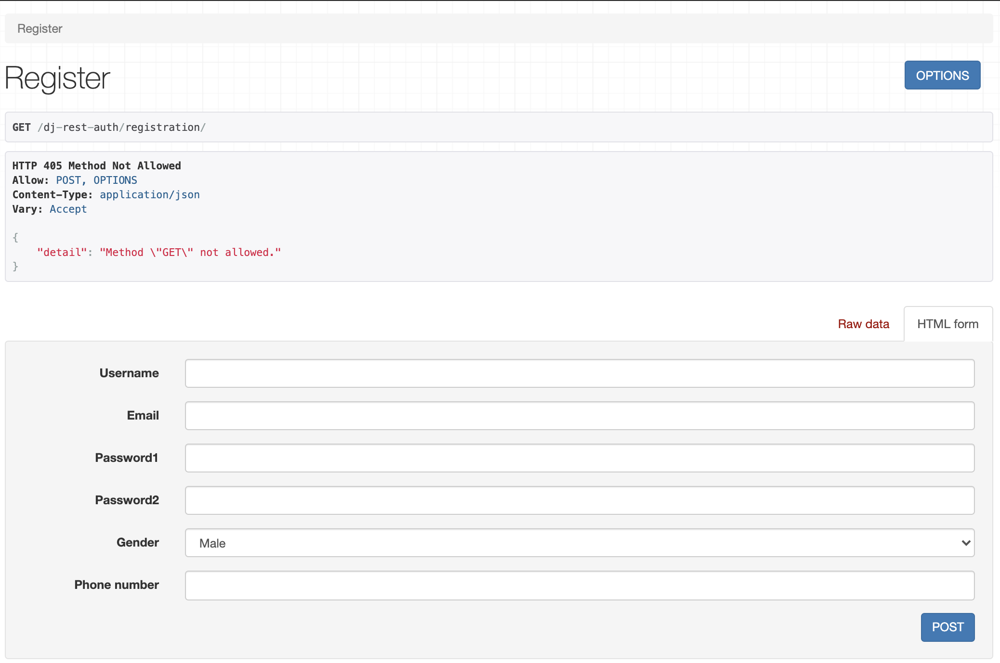
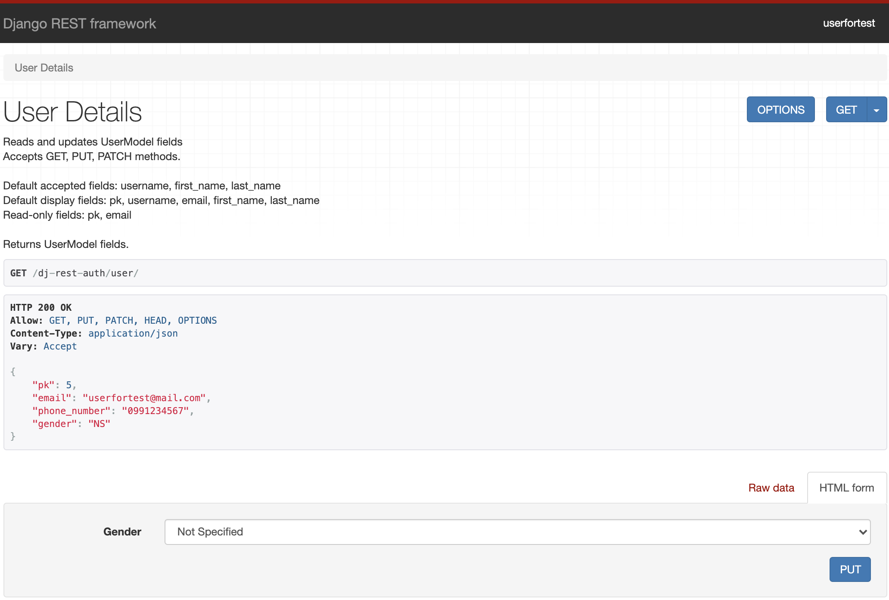

## Registration and Authentication in your Django app with dj-rest-auth (part 1)

A huge amount of existing applications have registration and authentication for users. Maybe every developer in the world has implemented something related to this in their work or while they learned. After the creation of the [Django REST framework](https://www.django-rest-framework.org/), Django developers started to implement more and more app-level REST API endpoints.  
As a result, an open-source package called [dj-rest-auth](https://dj-rest-auth.readthedocs.io/en/latest/index.html) has been developed to provide a set of REST API endpoints to handle user registration and authentication tasks. In this article divided into two parts, I will not only talk about this particular package but will also give you some tips to avoid some of the most common problems faced when configuring it.

### The dj-rest-auth package

If you are a Django developer and you are coding a REST API with authentication, you will find the dj-rest-auth package very useful. This project is a fork from [django-rest-auth](https://github.com/Tivix/django-rest-auth) that is no longer maintained.  
As said, dj-rest-auth provides a set of REST API endpoints to manage user registration and authentication. After an easy [installation and configuration](https://dj-rest-auth.readthedocs.io/en/latest/installation.html), you will have endpoints for:

- User registration with optional activation.
- Login and logout.
- Retrieve and update the Django User model.
- Password change.
- Password reset via e-mail.
- Social media authentication.

You don't need to do too much work to have those functionalities in your app. Besides, given that dj-rest-auth is an open source package, it has the advantage of being used by lots of programmers that can find errors, propose and add improvements, and so on. So, if you use dj-rest-auth you can be sure that you are using code created and maintained by an open source community.

### Browsable endpoints

Most of the endpoints that dj-rest-auth provides are browsable. This means that if you have added the package to your Django app, you can test those endpoints through the browser. As an example, if you open the browser and put the URL of the login endpoint, you will see something like this:


In the image above you can enter a username, email, and password to test the login functionality. The message of `Method GET not allowed` is not an error. It means that your endpoint doesn't allow the GET method but you can test it doing a POST. That method is possible because the corresponding blue button is shown.  
As you can see, it's very useful to very quickly have a nice interface to use while you are coding.

### Configuration

The documented installation and minimal configuration of dj-rest-auth is pretty clear and I won't talk about that in this blog post. The main idea of this section is to tell you about the big set of possibilities that you can have in your Django app just by adjusting a couple of parameters. This package uses [django-allauth](https://django-allauth.readthedocs.io/en/latest/index.html) behind so you can take advantage of all the [available settings](https://django-allauth.readthedocs.io/en/latest/configuration.html) in your own app. For example, you can define these parameters in your app configuration:

- `ACCOUNT_EMAIL_REQUIRED (false by default):`: If true, the user is required to provide an e-mail address when signing up.
- `ACCOUNT_LOGOUT_ON_PASSWORD_CHANGE (false by default)`: If true, users will automatically be logged out once they have reset their password.
- `ACCOUNT_USER_MODEL_EMAIL_FIELD ('email' by default)`: The name of the field in the user model containing the email.
- `ACCOUNT_USERNAME_REQUIRED (true by default)`: If true, the user is required to enter a username when signing up.
- `ACCOUNT_EMAIL_VERIFICATION ('optional' by default)`: Determines the e-mail verification method during signup. The possibilities are one of `mandatory`, `optional`, or `none`.

And many other parameters. As a conclusion, we can say that adjusting a couple of parameters in your Django app settings, you get lots of different behaviors for the registration and authentication.

#### Note:

To better understand the examples in the next sections:
1. You need to follow the dj-rest-auth installation steps.
2. Have installed django allauth.
3. Make sure you have the authentication backends in your settings:


```python
AUTHENTICATION_BACKENDS = [
    # allauth specific authentication methods, such as login by e-mail
    'allauth.account.auth_backends.AuthenticationBackend',
    # Needed to login by username in Django admin, regardless of allauth
    'django.contrib.auth.backends.ModelBackend',
]
```

### Customization

If you are coding a REST API with Django and Django REST framework, you may need to customize the functionalities related to the registration and authentication. With those frameworks and dj-rest-auth it's quite simple. You can customize the Django User model, the views, the serializers, the main functionalities, etc.  
For example, let's define a custom User model with a unique email, with no username, with a gender and a phone number attribute:

```python
# models.py in the users Django app
from django.db import models
from django.contrib.auth.models import AbstractUser


GENDER_SELECTION = [
    ('M', 'Male'),
    ('F', 'Female'),
    ('NS', 'Not Specified'),
]


class CustomUser(AbstractUser):
    # We don't need to define the email attribute because is inherited from AbstractUser
    gender = models.CharField(max_length=20, choices=GENDER_SELECTION)
    phone_number = models.CharField(max_length=30)
```

In our settings, we have to use the Django parameter called `AUTH_USER_MODEL` to specify our User model. If the `CustomUser` model is defined in an app called `users`, we must add:

```python
AUTH_USER_MODEL = 'users.CustomUser'
```

Besides, we have to add in our settings these parameters to use the email as the User identifier in our app:

```python
ACCOUNT_AUTHENTICATION_METHOD = 'email'
ACCOUNT_USERNAME_REQUIRED = False
ACCOUNT_EMAIL_REQUIRED = True
ACCOUNT_UNIQUE_EMAIL = True
```

Also, let's configure a signup without email verification just for now:

```python
ACCOUNT_EMAIL_VERIFICATION = 'none'
```

I'll talk about account verification in the second part of the article.  
Now we need to add our custom serializer to define the two added attributes and use them in the registration. The custom register serializer needs to be a child class of the one named `RegisterSerializer` that dj-rest-auth provides. Also we have to overwrite the save method to set those values that came in the request:

```python
# serializers.py in the users Django app
from django.db import transaction
from rest_framework import serializers
from dj_rest_auth.registration.serializers import RegisterSerializer

from users.models import GENDER_SELECTION


class CustomRegisterSerializer(RegisterSerializer):
    gender = serializers.ChoiceField(choices=GENDER_SELECTION)
    phone_number = serializers.CharField(max_length=30)

    # Define transaction.atomic to rollback the save operation in case of error
    @transaction.atomic
    def save(self, request):
        user = super().save(request)
        user.gender = self.data.get('gender')
        user.phone_number = self.data.get('phone_number')
        user.save()
        return user

```

Now we can't forget to tell dj-rest-auth to use the recently created serializer. Let's add the `CustomRegisterSerializer` to the settings:

```python
REST_AUTH_REGISTER_SERIALIZERS = {
    'REGISTER_SERIALIZER': 'users.serializers.CustomRegisterSerializer',
}
```

After this, if we go to the registration endpoint, we would see something like this:



The username appears in the browsable endpoint, but thanks to the configuration you can leave it empty.  
And that's it! We have added a customized registration endpoint to our Django app. Now we can create users with email, gender, and phone number, and make some tests around the login functionality too.

### Use of JWT

When an app manages authentication, a good and standard implementation of authentication by token authorization is using [JWT (JSON web tokens)](https://auth0.com/docs/tokens/json-web-tokens). JWTs are a good way of securely transmitting information between parties because they can be signed, which means you can be sure that the senders are who they say they are. We can easily configure our Django app to use JWT. First we need to install [djangorestframework-simplejwt](https://pypi.org/project/djangorestframework-simplejwt/):

```python
pip install djangorestframework-simplejwt
```

Then add to the settings:

```python
REST_FRAMEWORK = {
    'DEFAULT_AUTHENTICATION_CLASSES': (
        'dj_rest_auth.jwt_auth.JWTCookieAuthentication',
    ),
}

REST_USE_JWT = True
JWT_AUTH_COOKIE = 'my-app-auth' # The cookie key name can be the one you want
```

And we are good to go! We have an app that manages the authentication with JWT.

### The User endpoint

If you need to modify or just retrieve the information of an authenticated user; you can use an endpoint provided by dj-rest-auth: `dj-rest-auth/user/`. It's a very useful endpoint in the case you want the user to be able to modify its own information.  
What happens if you have customized the Django user model? Well, in that case you need to overwrite the user serializer to be able to see and update those added attributes. Let's continue with the example of a customized model with a gender and a phone number. In that case we need to tell dj-rest-auth to use the customized serializer already created (`CustomRegisterSerializer`) as the user's detail serializer, adding this to the settings:

```python
REST_AUTH_SERIALIZERS = {
    'USER_DETAILS_SERIALIZER': 'users.serializers.CustomRegisterSerializer',
}
```

With that definition, we can retrieve and update the gender and phone_number of an authenticated user with the named endpoint. Let's say now, that our app only allows the gender to be updated after registration. In the `CustomRegisterSerializer` the phone number can be modified of course, because we want the user to add that value at the moment of the registration. We can define then another serializer that doesn't allow the phone number to be modified. Let's call it `CustomUserDetailSerializer` and add it in the same file that is `CustomRegisterSerializer`:

```python
# serializers.py in the users Django app
...

from users.models import CustomUser

...

class CustomUserDetailsSerializer(serializers.ModelSerializer):

    class Meta:
        model = CustomUser
        fields = (
            'pk',
            'email',
            'phone_number',
            'gender',
        )
        read_only_fields = ('pk', 'email', 'phone_number',)
```

Then we have to add this as the correct user details serializer in our settings, replacing `CustomRegisterSerializer` with the new one:

```python
REST_AUTH_SERIALIZERS = {
    'USER_DETAILS_SERIALIZER': 'users.serializers.CustomUserDetailsSerializer',
}
```

And this is what you will see in the endpoint of the user:



As you can see in the picture, the only value that can be modified is the gender.

### Summary

This was the first part of the blog post. I have presented a very useful package to handle registration and authentication with a set of REST API endpoints.
With minimal configuration, you can add endpoints to your Django app that already have those features implemented. We reviewed some advantages of the package, how easy it is to customize it, and code snippet examples. In my next article, I’ll explain customization, and go over a few problems that I had to face when I started with dj-rest-auth, and how they can be solved. I hope you enjoyed this article and feel encouraged to use the package and read the second part.
