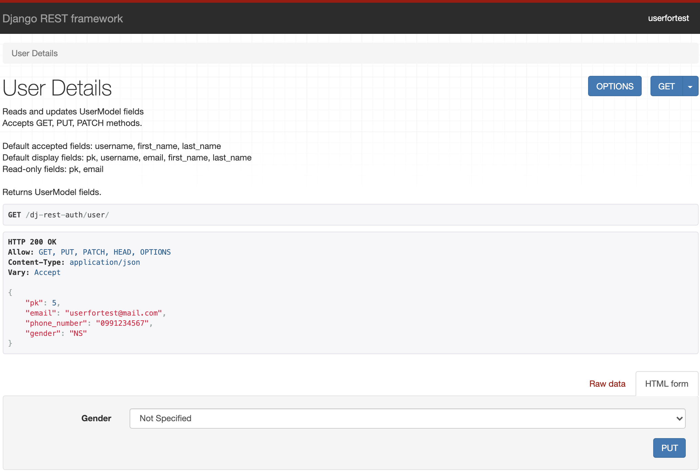
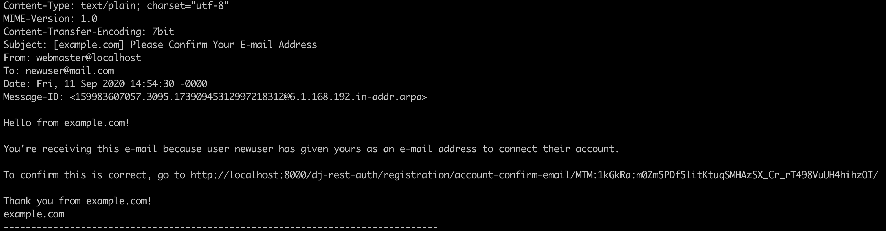

## Registration and Authentication in your Django app with dj-rest-auth

A huge amount of existing applications have registration and authentication for users. Maybe every developer in the world has implemented something related to this in their work or while they learned. After the creation of the [Django REST framework](https://www.django-rest-framework.org/), Django developers started to implement more and more app-level REST API endpoints.  
As a result, an open-source package called [dj-rest-auth](https://dj-rest-auth.readthedocs.io/en/latest/index.html) has been created to provide a set of REST API endpoints to handle user registration and authentication tasks. In this article I will not only talk about this particular package but will also give you some tips to avoid some of the most common problems faced when configuring it.

### The dj-rest-auth package

If you are a Django developer and you are coding a REST API with authentication, you will find the dj-rest-auth package very useful. This project is a fork from [django-rest-auth](https://github.com/Tivix/django-rest-auth) that is no longer maintained.  
As said, dj-rest-auth provides a set of REST API endpoints to manage user registration and authentication. After an easy [installation and configuration](https://dj-rest-auth.readthedocs.io/en/latest/installation.html), you will have endpoints for:

- User registration with optional activation.
- Login and logout.
- Retrieve and update the Django User model.
- Password change.
- Password reset via e-mail.
- Social media authentication.

You don't need to do too much work to have those functionalities in your app. Besides, given that dj-rest-auth is an open source package, it has the advantage of being used by lots of programmers that can find errors, propose and add improvements, and so on. So, if you use dj-rest-auth you can be sure that you are using code created and maintained by an open source community.

### Browsable endpoints

Thanks to the Django REST framework, most of the endpoints that dj-rest-auth provides are browsables. This means that if you have added the package to your Django app, you can test those endpoints through the browser. As an example, if you open the browser and put the URL of the login endpoint, you will see something like this:


In the image above you can enter a username, email, and password to test the login functionality. The message of `Method GET not allowed` is not an error. It means that your endpoint doesn't allow the GET method but you can test it doing a POST. That method is possible because the corresponding blue button is shown.  
As you can see, it's very useful to very quickly have a nice interface to use while you are coding.

### Configuration

The documented installation and minimal configuration of dj-rest-auth is pretty clear and I won't talk about that in this blog post. The main idea of this section is to tell you about the big set of possibilities that you can have in your Django app just by adjusting a couple of parameters. This package uses [django-allauth](https://django-allauth.readthedocs.io/en/latest/index.html) behind so you can take advantage of all the [available settings](https://django-allauth.readthedocs.io/en/latest/configuration.html) in your own app. For example, you can define these parameters in your app configuration:

- `ACCOUNT_EMAIL_REQUIRED (false by default):`: If true, the user is required to provide an e-mail address when signing up.
- `ACCOUNT_LOGOUT_ON_PASSWORD_CHANGE (false by default)`: If true, users will automatically be logged out once they have reset their password.
- `ACCOUNT_USER_MODEL_EMAIL_FIELD ('email' by default)`: The name of the field in the user model containing the email.
- `ACCOUNT_USERNAME_REQUIRED (true by default)`: If true, the user is required to enter a username when signing up.
- `ACCOUNT_EMAIL_VERIFICATION ('optional' by default)`: Determines the e-mail verification method during signup. The possibilities are one of `mandatory`, `optional`, or `none`.

And many other parameters. As a conclusion, we can say that adjusting a couple of parameters in your Django app settings, you get lots of different behaviors for the registration and authentication.

#### Note:

To better understand the examples in the next sections:

1. You need to follow the dj-rest-auth installation steps.
2. Have installed django-allauth.
3. Make sure you have the authentication backends in your settings:

```python
AUTHENTICATION_BACKENDS = [
    # allauth specific authentication methods, such as login by e-mail
    'allauth.account.auth_backends.AuthenticationBackend',
    # Needed to login by username in Django admin, regardless of allauth
    'django.contrib.auth.backends.ModelBackend',
]
```

### Customization

If you are coding a REST API with Django and Django REST framework, you may need to customize the functionalities related to the registration and authentication. With those frameworks and dj-rest-auth it's quite simple. You can customize the Django User model, the views, the serializers, the main functionalities, etc.  
For example, let's define a custom User model with a unique email, with no username, with a gender and a phone number attribute:

```python
# models.py in the users Django app
from django.db import models
from django.contrib.auth.models import AbstractUser


GENDER_SELECTION = [
    ('M', 'Male'),
    ('F', 'Female'),
    ('NS', 'Not Specified'),
]


class CustomUser(AbstractUser):
    # We don't need to define the email attribute because is inherited from AbstractUser
    gender = models.CharField(max_length=20, choices=GENDER_SELECTION)
    phone_number = models.CharField(max_length=30)
```

In our settings, we have to use the Django parameter called `AUTH_USER_MODEL` to specify our User model. If the `CustomUser` model is defined in an app called `users`, we must add:

```python
AUTH_USER_MODEL = 'users.CustomUser'
```

Besides, we have to add in our settings these parameters to use the email as the User identifier in our app:

```python
ACCOUNT_AUTHENTICATION_METHOD = 'email'
ACCOUNT_USERNAME_REQUIRED = False
ACCOUNT_EMAIL_REQUIRED = True
ACCOUNT_UNIQUE_EMAIL = True
```

Also, let's configure a signup without email verification just for now:

```python
ACCOUNT_EMAIL_VERIFICATION = 'none'
```

I'll talk about account verification later.  
Now we need to add our custom serializer to define the two added attributes and use them in the registration. The custom register serializer needs to be a child class of the one named `RegisterSerializer` that dj-rest-auth provides. Also we have to overwrite the save method to set those values that came in the request:

```python
# serializers.py in the users Django app
from django.db import transaction
from rest_framework import serializers
from dj_rest_auth.registration.serializers import RegisterSerializer

from users.models import GENDER_SELECTION


class CustomRegisterSerializer(RegisterSerializer):
    gender = serializers.ChoiceField(choices=GENDER_SELECTION)
    phone_number = serializers.CharField(max_length=30)

    # Define transaction.atomic to rollback the save operation in case of error
    @transaction.atomic
    def save(self, request):
        user = super().save(request)
        user.gender = self.data.get('gender')
        user.phone_number = self.data.get('phone_number')
        user.save()
        return user

```

Now we can't forget to tell dj-rest-auth to use the recently created serializer. Let's add the `CustomRegisterSerializer` to the settings:

```python
REST_AUTH_REGISTER_SERIALIZERS = {
    'REGISTER_SERIALIZER': 'users.serializers.CustomRegisterSerializer',
}
```

After this, if we go to the registration endpoint, we would see something like this:


The username appears in the browsable endpoint, but thanks to the configuration you can leave it empty.  
And that's it! We have added a customized registration endpoint to our Django app. Now we can create users with email, gender, and phone number, and make some tests around the login functionality too.

### Use of JWT

When an app manages authentication, a good and standard implementation of authentication by token authorization is using [JWT (JSON web tokens)](https://auth0.com/docs/tokens/json-web-tokens). JWTs are a good way of securely transmitting information between parties because they can be signed, which means you can be sure that the senders are who they say they are. We can easily configure our Django app to use JWT. First we need to install [djangorestframework-simplejwt](https://pypi.org/project/djangorestframework-simplejwt/):

```python
pip install djangorestframework-simplejwt
```

Then add to the settings:

```python
REST_FRAMEWORK = {
    'DEFAULT_AUTHENTICATION_CLASSES': (
        'dj_rest_auth.jwt_auth.JWTCookieAuthentication',
    ),
}

REST_USE_JWT = True
JWT_AUTH_COOKIE = 'my-app-auth' # The cookie key name can be the one you want
```

And we are good to go! We have an app that manages the authentication with JWT.

### The User endpoint

If you need to modify or just retrieve the information of an authenticated user; you can use an endpoint provided by dj-rest-auth: `dj-rest-auth/user/`. It's a very useful endpoint in the case you want the user to be able to modify its own information.  
What happens if you have customized the Django user model? Well, in that case you need to overwrite the user serializer to be able to see and update those added attributes. Let's continue with the example of a customized model with a gender and a phone number. In that case we need to tell dj-rest-auth to use the customized serializer already created (`CustomRegisterSerializer`) as the user's detail serializer, adding this to the settings:

```python
REST_AUTH_SERIALIZERS = {
    'USER_DETAILS_SERIALIZER': 'users.serializers.CustomRegisterSerializer',
}
```

With that definition, we can retrieve and update the gender and phone_number of an authenticated user with the named endpoint. Let's say now, that our app only allows the gender to be updated after registration. In the `CustomRegisterSerializer` the phone number can be modified of course, because we want the user to add that value at the moment of the registration. We can define then another serializer that doesn't allow the phone number to be modified. Let's call it `CustomUserDetailSerializer` and add it in the same file that is `CustomRegisterSerializer`:

```python
# serializers.py in the users Django app
...

from users.models import CustomUser

...

class CustomUserDetailsSerializer(serializers.ModelSerializer):

    class Meta:
        model = CustomUser
        fields = (
            'pk',
            'email',
            'phone_number',
            'gender',
        )
        read_only_fields = ('pk', 'email', 'phone_number',)
```

Then we have to add this as the correct user details serializer in our settings, replacing `CustomRegisterSerializer` with the new one:

```python
REST_AUTH_SERIALIZERS = {
    'USER_DETAILS_SERIALIZER': 'users.serializers.CustomUserDetailsSerializer',
}
```

And this is what you will see in the endpoint of the user:



As you can see in the picture, the only value that can be modified is the gender.

### Sign-up with email verification

It's possible to configure email verification at the moment that a user registers. This means that a successfully registered user has to check the inbox and confirm through the received email that he really is the owner of the email account. To do this, go to your settings and turn on email verification:

```python
# Your settings file
...

ACCOUNT_EMAIL_VERIFICATION = 'mandatory'
```

With this, after a correct sign-up your app will send a verification email to the entered account. But you didn't finish: as dj-rest-auth [documentation](https://dj-rest-auth.readthedocs.io/en/latest/api_endpoints.html#registration) says, after enabling the email verification, you need to add a path to your urls that will be used by the verification view:

```python
# Your urls file
...
from dj_rest_auth.registration.views import VerifyEmailView

...

urlpatterns = [
    ...
    path(
        'dj-rest-auth/account-confirm-email/',
        VerifyEmailView.as_view(),
        name='account_email_verification_sent'
    ),
    ...
]

```

If you don't do that, you will get a [NoReverseMatch](https://docs.djangoproject.com/en/3.1/ref/exceptions/#noreversematch) error.  
Also, let's use a django-allauth configuration to activate the email account after the user clicks on the link received in the email. Add this to your settings:

```python
# Your settings file
...
ACCOUNT_CONFIRM_EMAIL_ON_GET = True
```

And add this path to your urls file `before` the definition of the `dj-rest-auth` registration path:

```python
# Your urls file
...
from dj_rest_auth.registration.views import VerifyEmailView, ConfirmEmailView

...

urlpatterns = [
    ...
    path(
        'dj-rest-auth/registration/account-confirm-email/<str:key>/',
        ConfirmEmailView.as_view(),
    ), # Needs to be defined before the registration path
    path('dj-rest-auth/registration/', include('dj_rest_auth.registration.urls')),
    path('dj-rest-auth/account-confirm-email/', VerifyEmailView.as_view(), name='account_email_verification_sent'),
    ...
]

```

That path needs to be there to avoid a template error in dj-rest-auth. As mentioned, dj-rest-auth it's an open source software and sometimes we can find some errors. The good thing of this is that anyone can address the discovered bugs.  
Having this configuration, the user will be redirected to the login page after clicking in the received link. Don't forget to set the `LOGIN_URL` parameter in your settings, otherwise you can get an error if the default value is not a valid URL of your app. During development, you can set the `LOGIN_URL` as the login endpoint; remember that dj-rest-auth has browsable endpoints thanks to Django REST framework. So you can test sign-up flow by setting for example:

```python
# Your settings file
...
LOGIN_URL = 'http://localhost:8000/dj-rest-auth/login'
```

Finally, you need to specify to Django the email backend that is in charge of sending the emails of your app.

#### Email backend

The [Django email backend](https://docs.djangoproject.com/en/3.1/topics/email/#email-backends) is the component that handles the sending of an email. You can choose among different possibilities that Django provides. The most common are SMTP and console backend.

You can configure an SMTP server by adding:

```python
# Your settings file
...

EMAIL_BACKEND = 'django.core.mail.backends.smtp.EmailBackend'
EMAIL_HOST = 'your.email.host'
EMAIL_USE_TLS = True
EMAIL_PORT = 587
EMAIL_HOST_USER = 'your email host user'
EMAIL_HOST_PASSWORD = 'your email host password'
```

You have to choose the `EMAIL_HOST`, for example `'smtp.gmail.com'`. In the `EMAIL_HOST_USER` and `EMAIL_HOST_PASSWORD` parameters put the information of the account that will be the email sender. If you are using Gmail as a mail server you will need to allow less secure apps and display unlock captcha. After this, your Django app will send verification emails for all the new users. I recommend you to use environment variables to keep sensitive information in your settings such as keys, the email host account, and its password, etc.  
In real applications the best way to do this is integrating with an email service such as [SendGrid](https://sendgrid.com/docs/for-developers/sending-email/django/).

In the second option, you can locally test the sign-up feature during development, by setting:

```python
# Your settings file
...
EMAIL_BACKEND = 'django.core.mail.backends.console.EmailBackend'

```

In this case the email is sent and received by the console. So after a successful registration you will see in the console something like this:



If you open your browser and go to the link shown in the printed email, the user's account will be activated and you will be redirected to the `LOGIN_URL`. Now you are able to login with the entered email and password.  
And there it is! You have configured sign-up with email verification. Let's see how to customize the emails that your application sends.

### Email templates

Django allauth provides a few templates that are used by dj-rest-auth at the moment of sending the emails. As shown in previous section, the verification email printed in console has a template defined by the django-allauth package. It's possible to customize those email templates by overwriting a couple of files. First of all, let's create a `template` folder inside your main Django app folder.  
From now on, let's assume that the name of your main Django app folder is `myapp`; so you need to add this in your `TEMPLATES` settings:

```python
# Your settings file
...
import os
...

TEMPLATES = [
    {
        'BACKEND': 'django.template.backends.django.DjangoTemplates',
        'DIRS': [
            os.path.join(BASE_DIR, 'myapp/templates'), # Add this inside the DIRS list
        ],
        'APP_DIRS': True,
        ...
    },
]
```

Now you have to overwrite the corresponding template files for the desired customization. In this case, the path used by dj-rest-auth will be `myapp/templates/account/email/`. In there you can add these files to overwrite the ones used by default:

- email_confirmation_message.txt
- email_confirmation_signup_message.txt
- email_confirmation_signup_subject.txt
- email_confirmation_subject.txt

For example, to customize the email confirmation message, you have to create an `email_confirmation_message.txt` file in `myapp/templates/account/email/`. You can even reuse some of the content of the default file that you can find in the [github repository of django-allauth](https://github.com/pennersr/django-allauth/tree/master/allauth/templates/account/email). Besides, you can set a value to the `ACCOUNT_EMAIL_SUBJECT_PREFIX` parameter in your settings, to add a prefix to the subjects in the emails of your app.  
It's important to say that there are some variables defined in the email templates that are needed and you have to keep them in case you overwrite the files. For example, this is the file of `email_confirmation_message.txt`:

```html
Hello from {{ site_name }}! You're receiving
this e-mail because user {{ user_display }} has given your e-mail address to
register an account on {{ site_domain }}. To confirm this is correct, go to {{
activate_url }}  Thank you from {{
site_name }}! {{ site_domain }} 
```

There you have `activate_url`, that is the link for the user confirmation. So you can remove for example the `site_name` if you want (or change it to show a different one) but you definitely have to keep the `activate_url` value. Otherwise, registered users won't be able to activate their accounts. Summarizing this section, if you decide to overwrite the `email_confirmation_message.txt`, your project structure will look like this:

```
root-project-folder
    |__myapp
    |    |__templates
    |        |__account
    |            |__email
    |                |__email_confirmation_message.txt
    |
    ...
```

Now let's see about the reset password functionality and how to customize it.

### Reset password

If you want to have a reset password feature in your app, you can do it very easily with dj-rest-auth. The first thing to say is that by default you can't test it as a browsable endpoint because it will show a `NoReverseMatch` error. So you need to add this path to your urls file:

```python
# Your urls file
...
from dj_rest_auth.views import PasswordResetConfirmView
...

urlpatterns = [
    ...
    path(
        'rest-auth/password/reset/confirm/<slug:uidb64>/<slug:token>/',
        PasswordResetConfirmView.as_view(), name='password_reset_confirm'
    ),
]

```

And now you are good to go! You can test the browsable endpoint which receives the email of the registered user, and dj-rest-auth sends the instructions to reset the password. You need of course to have configured the email backend.  
You are able to modify the email template for the reset password functionality too. Assuming that you have already configured the `TEMPLATES` folder as in the previous section example, you can create a file in `myapp/templates/registration/` called `password_reset_email.html` to overwrite the one used by default. Why do you have to define it there? Because is the [default path used by Django](https://github.com/django/django/tree/master/django/contrib/admin/templates/registration). You can even reuse some code of the default file, that looks like this:

```html
 You're receiving this
email because you requested a password reset for your user account at {{
site_name }}.   {{ protocol }}://{{
domain }}   {{
user.get_username }}  The {{ site_name }} team 
```

As said in the email validation section, remember to keep some of the needed variables in the template. In this case the most important is the `url` with the `uid` and the `token` that are required to update the user's password.  
 After these steps, you have finished the reset password functionality customization! Taking the previous section into account, your project folder would be now like this one:

```
root-project-folder
    |__myapp
    |    |__templates
    |        |__account
    |        |   |__email
    |        |        |__email_confirmation_message.txt
    |        |__registration
    |            |__password_reset_email.html
    |
    ...
```

Let's see in the last section how we can modify some of the default variables used in the templates.

### Customize variables used in the templates

Let's think about this example: What if you want to modify the URL sent by default in the reset password email template? Well, Django allows you to define variables to be used in the templates by creating your own template tags. The first thing you need to do is define the custom value desired for the URL in your settings:

```python
# Your settings file
...
CUSTOM_PASSWORD_RESET_CONFIRM = 'desired URL'
```

Then you have to create two files under `myapp/templatetags/`: One has to be an empty `__init__.py` file, and the other one registers and gets the tags. Let's call it `password_reset_template_load.py`:

```python
from django import template
from django.conf import settings

register = template.Library()


@register.simple_tag
def get_settings_var(name):
    return getattr(settings, name)
```

Finally, go to your customized email template that you have created to overwrite the default one, and load the defined value by adding `` at the top of the file, and after that add the line that has the custom value (in this particular case don't forget the `uid` and `token`):

```html
// Your template  ... ?uidb64={{ uid }}&token={{ token }}
```

With these settings you have defined your custom template tags. I'm going to show you the final project structure with all the customization that I talked about:

```
root-project-folder
    |__myapp
    |    |__templates
    |    |   |__account
    |    |   |   |__email
    |    |   |        |__email_confirmation_message.txt
    |    |   |__registration
    |    |       |__password_reset_email.html
    |    |__templatetags
    |        |__password_reset_template_load.py
    ...
```

From now on, the email for password reset will show a customized URL. Remember that this was an example, you can create any template tag you want and use it in any template you have.

#### Notes

1. If while trying this you have an error that shows `Site matching query does not exist.`, you can solve it by adding `SITE_ID = 1` to your settings.
2. When you create your own templatetags make sure that the main app is added in the `INSTALLED_APPS` list in your settings.

### Summary

I have presented a very useful package to handle registration and authentication with a set of REST API endpoints.
With minimal configuration, you can add endpoints to your Django app that already have those features implemented. We reviewed some advantages of the package, how easy it is to customize it, and code snippet examples.  
In addition to this, I have shown you how to implement email validation at sign-up, and how to customize the emails that are sent by your app. We learned about the reset password functionality, and finally how to customize the templates with your own desired values. I recommend using the presented package because it solves lots of common problems and provides a set of features that are very important for most applications. Maybe in the future, you can not only use it but also contribute to it.
