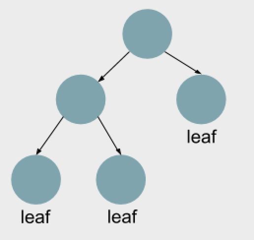

# Regression and Classification Models
In machine learning, we want to determine something from the available data. Either it is a numerical value (prediction) or is a class(classification). Most of the common models for regression and classification techniques are presented in this section. From these base models, several variations might exist.

## Regressions
The basis for ML problems is an equation that tries to define the value of a variable in function of a linear combination of other variables. The variable that we are trying to determine (dependent variable) is called target variable (Y) and the other variables (independent variables) are called predictors (Xi). The terms i are the coefficients or weights. 
$$Y=\beta_1*X_1+ \beta_2*X_2+ ...$$

The most common regression is when the target variable is numeric the method is called [Linear Regression.](https://towardsdatascience.com/the-fundamental-algorithms-of-data-science-a00dbe2c953)
 
## Prediction
Prediction implies predicting future values from past data. The most simple method used for prediction is the described Linear regression. Several models can be used for prediction, such as trees, neural networks, etc. Those models will be described in other sections.

## Classification 
### Regression
The linear regression is adapted to make a classification, by fixing the values that the target variable can take.        
* **Probit regression:** the target variable is binary, it only takes the values 0 or 1. Which corresponds to 2 different classes. The purpose is to estimate the probability of belonging to each of the classes and assign the class with higher probability.       
* [**SVM:**](https://medium.com/machine-learning-101/chapter-2-svm-support-vector-machine-theory-f0812effc72) represents data points in the space divided by a gap, which determines 2 classes. New data points are categorized by the side of the space that they fall.     
* **Logit regression:** the target variable can only take some values, each one corresponding to one class. The difference with probit is that more than 2 classes can be classified. 

### Naive Bayes Classifier
Naive Bayes Classifier is  the most simple classifier and is based on the Bayes Theorem. Therefore, it assumes that the variables (predictors) are independent of each other. It is difficult to know whether or not this assumption is completely true because even if the assumption is violated sometimes it still is a good fit. 
Exist different classifier of [Naive Bayes](https://www.geeksforgeeks.org/naive-bayes-classifiers/) depending on the type of predictors:

* Multinomial Naive Bayes: when the predictors are discrete
* Bernoulli Naive Bayes: predictors are binary variables 
* Gaussian Naive Bayes: when the predictors take continuous values.

### K-nearest neighbor (KNN) 
[K-nearest neighbor](https://towardsdatascience.com/building-a-k-nearest-neighbors-k-nn-model-with-scikit-learn-51209555453a) is based on the distance between data points. Group into K neighbors which are nearby and assign a class to each group. When new data comes to be classified, based on the distance from a new data point to the groups, the nearest group is selected to assign the class. This algorithm does not work well for a large number of dimensions, because it turns difficult to calculate the distance for each dimension. Another issue, when the data has too many categories, the algorithm does not work well, because it is difficult to establish distance between categories since they do not represent numerical data.  

### Trees
The main goal is to predict or classify an outcome based on the predictors. It is based on a set of rules (if-then-else), that represents the decisions made by the algorithm which is represented by a tree structure. It is drawn with the root at the top. It splits into branches, based on conditions on each of the nodes. When the tree does not split anymore it reaches a leaf, the final result. During the training, the rules are defined, and the algorithm applies that set of rules over the test data from the root until reaching a leaf. 

     
The process used to split the data into sup groups is called **Recursive partitioning**. It identifies which is the best split in each step and applies the same process on the child nodes, until some stopping criteria determine that it has to stop or reaches the point where all the groups have only elements of the same class (pure). 

If the tree does not have any stopping criteria, the algorithm will last longer and it might suffer from overfitting. If no stopping criteria is set, , the risk is that the algorithm will learn specific details from the training set that are not a representation of the total population. **Early stopping** (preventing the tree to grow, stopping by some criteria) and **post-pruning** (cutting the tree after the training) are techniques used to prevent the model from overfitting. 
Other techniques used to avoid overfitting are the ensembles Boosted Trees and Random Forest. In the case of [Boosted Trees](https://towardsdatascience.com/machine-learning-part-18-boosting-algorithms-gradient-boosting-in-python-ef5ae6965be4), several trees are chained, one tree correcting mistakes done by the other. Whereas in [Random Forest](https://towardsdatascience.com/understanding-random-forest-58381e0602d2), different random trees are performed in parallel and the final result is composed by taking the average for prediction or voting for classification. 

**Concepts**
It is important to clarify confusion over two concepts. The **depth** of a tree is the length of the longest path from the root to a leaf, while the **size** corresponds to the number of nodes in the tree.
Metrics: The result of the tree is different groups of elements. If a group contains only elements of the same class it is called pure, if the elements are from different classes is impure. Measuring the impurity of a tree means analyzing the homogeneity among the classes grouped. Gini impurity and entropy are the most common methods for performing this measurement. 

**Gini impurity:** *(1-p(i))%7D).  

**Entropy:** *logp(i))%7D)

# Conclusion
In conclusion, through machine learning models you would be able to predict values and classify incoming information. Several algorithms are available to try different possibilities and see which model best fits your data. The level of accuracy that is convenient for your problem will depend on the nature of your problem, the complexity of the data as well as the amount of information to process. Sometimes it is better to sacrifice the model with a lower accuracy gaining simplicity. 

