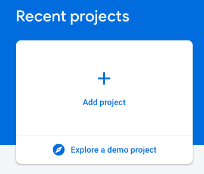
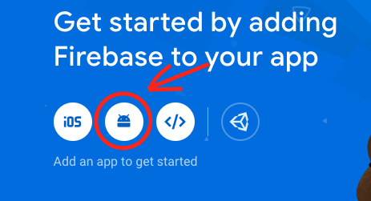

## Setting Up Firebase on Android.
### What's Firebase?

Firebase is a mobile platform that helps you quickly develop high-quality apps, grow your user base, and more. Firebase is made up of complementary features that you can mix-and-match to fit your needs, helping you to build apps fast, without managing infrastructure. Firebase gives you functionality like analytics, databases, messaging, and crash reporting so you can move quickly and focus on your users. [[from google]](https://developer.android.com/studio/write/firebase)

### What can we do with Firebase?

Firebase provides a lot of tools that we will talk about in next posts but resuming Firebase allow as to:
- Push notifications
- Analytics
- A/B Testing
- Authentication
- Real time db
- App distributions
- Google cloud: Hosting, Storage
- Machine Learning

And many more tools which I invite you to test.

### Initial Configuration

1. #### Adding dependencies**

On your project  Gradle file "build.gradle"

    ```java
    repositories {
        google()
        jcenter()
        maven {
            url 'https://maven.fabric.io/public'
        }
    }

    dependencies {
    	....        
        classpath 'com.google.gms:google-services:4.3.2'  // Google Services plugin
        classpath 'io.fabric.tools:gradle:1.31.2'  // Crashlytics plugin
    	....
    }

    ```

On your module (app) Gradle file "build.gradle"

    ```java
    apply plugin: 'com.android.application'

    android {
       ....
    }
    dependencies {
    		.....
        // Add the Firebase SDK for Google Analytics
        implementation 'com.google.firebase:firebase-analytics:17.2.1'
    }

    // Add the following line to the bottom of the file
    apply plugin: 'com.google.gms.google-services'
    ```

2. #### Create the project on your Firebase console:

    Open the [firebase console](https://console.firebase.google.com/) and add a new project:

    

    Once you create the project in Firebase console, add a new Android app:

    

    In the next step enter the Android application id. You can find it on the Gradle file:

    ```java
    ....
    android {
        ....
        defaultConfig {
            applicationId "com.rootstrap.android"
    		....
        }    
    ```

    **Note: In case you configure several build types with different package names you need to add an Android app to the current Firebase console for each of them.**

    ```java
    productFlavors {
            development {
                dimension "server"
                applicationIdSuffix ".dev"
            }

            production {
                dimension "server"
            }
    }
    ```

Once you create the app, download the google-services.json file and copy it to your module folder (app).

3. #### Finally run your app.
You should be able to see on your project overview 1 daily active user (your current device or emulator)

## That's it.

Firebase has several tools to improve your code and productivity in order to get better performance and user experience. Play around with the console to see which ones could be helpful for your Project.

For more info please check:
[Firebase](https://firebase.google.com/)
