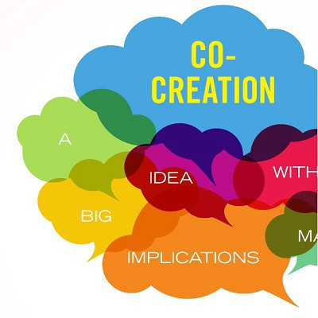

# Software development is agile, not transactional

## Transactional relationships

In today’s world, we usually exchange money for solid, tangible goods or well-defined services. That’s how material transactions work. As an example, we might buy a t-shirt for $50. That means you give someone $50, and they immediately give you the t-shirt. Or you pay a plumber $15 and hour. Then the plumber spends some time fixing your leak. In this case, there’s a high level of certainty that the problem will be solved. 

## Paying for software

Most people have had a transactional software experience. You might have exchanged $399 for a box that contained the amazing Office ‘97. Or you paid $59 and received a CD with the latest game. And these days, you might pay for a subscription and get access to software in the cloud.  

## Why software development is different

When you pay for custom software development, you’re not buying a material product or even a service. You’re paying for an expert’s technological expertise to solve a problem. You’re not buying anything tangible, but you might spend a lot of money. 

## What do you pay for? 

When you buy software development, you don’t merely buy a solution to a problem. Instead, what you really do is co-create a solution that leverages the accumulated knowledge of highly specialized individuals. Yes, you pay for their time. But the results depend as much on you, the client, as on the development team. Collaboration is the name of the game. At Rootstrap, our agile development process assures that what you get for your money will be a platform that you contributed to and approved every step of the way. 

## Technology is an adaptive science

Our clients often ask for certainty, fixed contracts, and strict contract clauses to protect themselves. But that’s not how software development works. As the agile development process unfolds, we get to know you and your business. You can tell us your software needs at the beginning, but you won’t know what additional features you’ll want as the organic build process unfolds. And you can’t estimate the amount of changes that will be needed in order to turn your original vision into reality. 

## How we estimate fees

We estimate how long your project might take and what resources it might need based on the work requirements you give us and our many years of development experience. Even with all that information, technology work estimation isn’t an exact science. We use a technique called [planning poker](https://www.mountaingoatsoftware.com/agile/planning-poker), which aggregates estimations from team members, based on the information that they have at that specific time. 

And the truth is that we never have all the information at the beginning of a project. All we have at the start is an abstract idea. It’s something you’d like us to do that probably has never been done before. Even if similar technology exists, each client is unique. How the tech you want must be built to work for your individual entity is always variable and can only be defined as the project progresses. 

## The agile gold standard

The state-of-the-art software produced in today’s tech environment is always developed through the agile process. So clients who want the best tech services will have to embrace agile, even if it’s a change from how they’re used to operating. Agile teams provide quality work, outstanding communication, and productive thinking. Decisions about processes and products are made only after the viewpoints of both parties are weighed. 

Look for these qualities in a team if you want to succeed. Taking any other route will only lead to loss of your time and money. 

## Adaptability instead of predictability

If a developer tells you, “I worked at Big Tech Company X for 20 years, and I’ve thought about every single detail, so there’s no room for uncertainty,” do not believe it. Every client is unique, and every project is different. 

## Trust instead of enforcement – some perils and pitfalls

**Commoditization.** Building software is an organic, knowledge-based process, not a commodity. Treating software development like creation of a tangible product always produces low-quality results. 

**Restrictive deadlines.** Marketing teams often set random deadlines that can also lower software service results. For example, if programming time is restricted, its quality will be limited to what can be done in that amount of time.

**Order taking.** Do you trust your team to have the professional knowledge you hired them for? If you hire a team that takes whatever orders you give, and you don’t allow any discussion or disagreement, you end up with a product built from your tech knowledge, not theirs.

**Transparency instead of opacity.** Don’t work with anyone who keeps what they’re doing a secret from you. Your full and ongoing participation is the key to agile development success. 

## Building value

High-quality code and technology are the backbone of the agile development process. Poorly written code can cause problems that wreak havoc on your company’s finances before you’re able to scale it. If you work with a service provider that “knows it all,” already has all the answers, and doesn’t need to collaborate with you, chances are high that you’ll end up with a product that doesn’t fully meet your needs. 

## Our agile team includes you

As soon as you begin a product development project as our client, you become part of our team. To get the best results, find a team that embraces this concept, runs agile, adapts fast, pushes back, and challenges your ideas. This is **co-creation**. 

Even in this scenario, mistakes and unforeseen challenges can and will happen. That’s an expected part of the agile development process. It identifies potential problems early on, so they can be fixed before they cause harm during up-and-running business operations. Unexpected things occur because certainty isn’t a part of the agile development process. If you blindly chase certainty now, the issues you don’t want to see will almost certainly bug you later. 

*If you are the owner of a digital platform and would like to discuss the challenges you face on a technical level, contact us [here](https://www.rootstrap.com/contact). Alternatively, you can reach out to [anthony@rootstrap.com](mailto:anthony@rootstrap.com).
