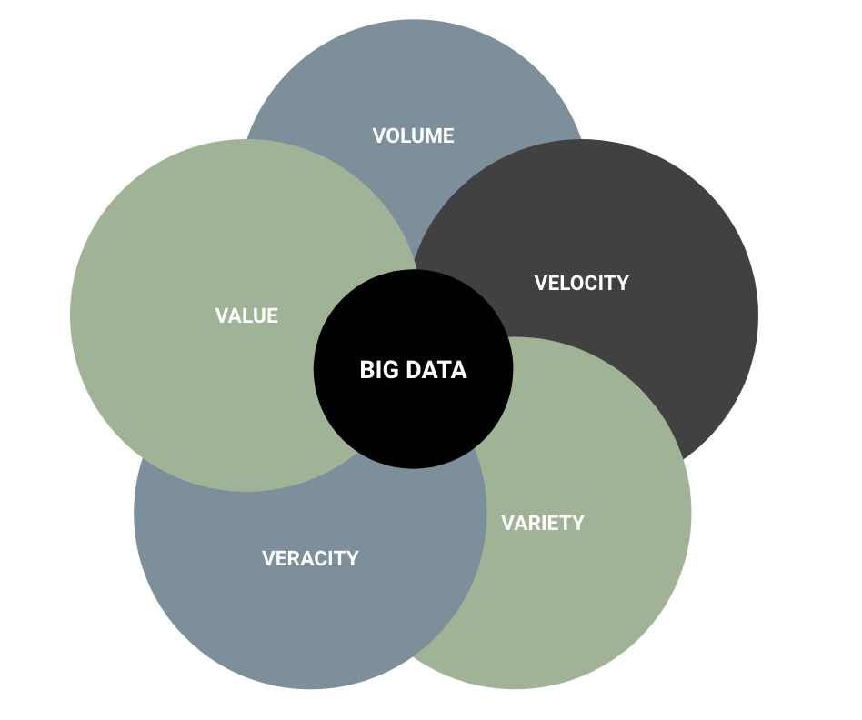

# SOLUTIONS FOR COMMON PROBLEMS IN DATA SCIENCE & MACHINE LEARNING 

## SECTION 1 - DATA

# SOLUTION TO COMMON PROBLEMS

The theory  is not always the same as the reality. When applying data science in practice, several you will have to deal with several problems. Fortunately, you are not alone!, other people might be in a similar situation and there are blogs, slack channels and information around that might help you to resolve your problems. 
 
Plenty of problems are presented during the process of data cleaning and model design and the execution of the model. These problems are generated by the complexity of the data. They might occur because of the size or characteristics of the sample, the amount of features, the hyperparameters used or introduced errors during the data cleaning process. 

In this article problems related with data are presented. Answering questions such as:    
- Which data to use?     
- How much data to use?      
- How to process incoming data in real time?      
- How to deal with complex datasets, unlabeled data, dataset with a lot of missing values?.        

These are some of the problems that you would need to handle over your data, and the decisions in this phase are critical, since data is the base for your algorithm!. Here are listed possible solutions for each detected problem. 

## Not enough data
Data is important for training the algorithmS, if you do not have enough data your predictions will not be very accurate. Some methods for generating data can be used in order to get a bigger dataset to train your model. 

Firstly, If you know possible values you might be able to generate by randomness those values. Secondly, You can use input analysis to understand the distribution of the data and from there simulate values based on its distribution. In addition, for images you can use data augmentation in order to increase the size of the dataset. Finally, it is very important to understand the meaning of the data in order to generate valid inputs. 

What is more, when having small datasets is easy to overfit, so to avoid this problem you can apply techniques such as feature selection, regularization, averaging or cross-validation. 
Another issue in small dataset is that outliers and noise in the data become more problematic, so in those cases you cannot skip the study of outliers in your data. 

## Too much data
Be careful! Having more data does not mean that your model would be accurate!. You might use less data and find that your model not only performs better, but also is faster. All is about choosing the right data and training the model correctly. In fact, according to the article, [“Too Big to Fail: Large Samples and the p-Value Problem”](https://pdfs.semanticscholar.org/262b/854628d8e2b073816935d82b5095e1703977.pdf), large sample size causes the p-value to be deceptively small, which makes the perception about all the variables are dependent on each other. 
Do not get scared when you have a huge amount of information. If you have too much data, you would need to take a sample or several samples from the data to train your model. Training with the whole dataset when you have too much data turns out impossible since you would need a lot of computational power and memory to process the data and it would also take too much time. 
A good practice is to take a [stratified](https://towardsdatascience.com/the-magic-of-stratification-in-data-analysis-f1ee4800a283) sample that is representative of the data, it means that contains the same proportion for classes as the full dataset. Thus, in this way you are sure that is representative. 
If there is still too much data, you can always process data in chunks, parallelize the computation in a cluster, use a database to save the data and use Big Data technologies to take advantage of the power that each technology can offer. 

## How much data?
How big should be the sample size? There is no rule to determine the sample size, it depends on the data, the context of the problem and the complexity of the problem that you are trying to solve. 
Make a research of similar problems and estimate how much data would you need.     

Some ideas to take a sample:       
1. Take a sample that has a certain percentage of each class, so you make sure that all cases are covered.    
Take a stratified sample, which contains the same proportion for the classes in play.       
2. Follow some these rules of thumb based on heuristics:    
	* In function of the number of predictors variables: take 70 or 60 times the number of variables. For example, if you have 10 variables take a sample of 700 rows.      
	* For multiple regression analysis: the desired level is between 15 to 20 observations for each predictor variable.      
	* For factor analysis: at least 10 observations per variable. Is recommended to have more than 300 rows.       

More information about this issue can be found:       
- [https://stats.idre.ucla.edu/spss/output/factor-analysis/](https://stats.idre.ucla.edu/spss/output/factor-analysis/)     
- [https://scholarworks.umass.edu/cgi/viewcontent.cgi?article=1144&context=pare](https://scholarworks.umass.edu/cgi/viewcontent.cgi?article=1144&context=pare)    
- [https://stats.stackexchange.com/questions/45820/minimum-sample-size-for-pca-or-fa-when-the-main-goal-is-to-estimate-only-few-com](https://stats.stackexchange.com/questions/45820/minimum-sample-size-for-pca-or-fa-when-the-main-goal-is-to-estimate-only-few-com)   
- [https://easyai.tech/en/blog/how-do-you-know-you-have-enough-training-data/](https://easyai.tech/en/blog/how-do-you-know-you-have-enough-training-data/)           

## Too much variables 
Too much variables 
If your data has too many predictors, it might be very difficult to understand and the computational time will be affected. Also, there might be predictors highly correlated with each other, this phenomenon is called **multicollinearity**. Multicollinearity can lead to skewed or misleading results when analyzing the effect of the predictors variables in a statistical model.

What is more, when having high-dimensional spaces, the **curse of dimensionality** takes place, it is when the dimension increases, the volume of the space increases very fast that the available data becomes sparse and objects appear to be dissimilar in many ways. Thus, sparsity is problematic for methods based on statistics because the amount of data needed to find reliable results grows exponentially as the dimension increases. 

Therefore, if some of these problems are presented, you would need to apply dimension reduction techniques, in order to reduce the amount of columns in your dataset and be able to understand the model more clearly.

## Feature selection
Which type of correlation to use? Depending on the type of variables, which type of correlation you will need to use. Here there is a table that shows the possible cases. 

|   |  Continuous |  Categorical | 
|---|---|---|---|---|
| Continuous | Pearson’s correlation | LDA | 
| Categorical | Anova | Chi-Square |

- Pearson correlation: it is a number between -1 and 1 which indicates the level at which the variables are linearly related.    
- Anova: it provides a statistical test that compares the difference between means    
- Linear Discrimination Analysis (LDA): it finds a linear combination of variables that separates into groups a categorical variable.     

More information about feature selection can be found here:

- [https://www.analyticsvidhya.com/blog/2016/12/introduction-to-feature-selection-methods-with-an-example-or-how-to-select-the-right-variables/](https://www.analyticsvidhya.com/blog/2016/12/introduction-to-feature-selection-methods-with-an-example-or-how-to-select-the-right-variables/)       
- [https://machinelearningmastery.com/feature-selection-with-real-and-categorical-data/](https://machinelearningmastery.com/feature-selection-with-real-and-categorical-data/)     
- [https://datascience.stackexchange.com/questions/893/how-to-get-correlation-between-two-categorical-variable-and-a-categorical-variab](https://datascience.stackexchange.com/questions/893/how-to-get-correlation-between-two-categorical-variable-and-a-categorical-variab)       
- [http://michaelminn.net/tutorials/r-categorical/](http://michaelminn.net/tutorials/r-categorical/)      

## Categorical data 
Sometimes categorical data gives you a headache. Here are some of the problems that you might need to face:  

- **Data does not have labels:** the data that you need to categorize does not have obvious labels, you might need to perform some transformations to get the labels. Doing this step correctly is crucial in order to the algorithm learning procedure.      
- **Imbalanced data:** a dataset might contain a small amount of cases for a certain class. For instance, if you are classifying whether it is an error or not, you might have little information for error cases. So, in order to ensure that you are getting those cases when doing the sample, you might need to perform oversampling.      
- **Too many categories:** if a variable has too many categories, if there is no order over the categories eventually the variable would need to be transformed to dummy variables.  This maybe affects the model performance and gets the data and the model difficult to understand. You might consider grouping the categories or applying dimension reduction before performing your model.

## Streaming - Real time processing
In some cases input data is coming in a flow or every certain time. If the amount of information is huge, you would need to automate the process and use some tools that facilitate the processing. There are several tools that let you through configuration set the flow of actions to process the data, schedule inputs and generating outputs in several formats. Those tools are extensible, so you can customize the functions to create something specific. This can be used just to predict the new input data that is coming, or to improve the model by re-training the model.

## Big Data
Big Data technologies are needed to process a huge amount of information in real time. Some people confuse machine learning with big data. But both terms are not the same and can be applied together or independently. Machine learning with a lot of information might need Big Data, and Big Data does not necessarily means applying machine learning models over the data, it might only be used to make queries or set up alerts. 

Big Data is a combination of these 5 characteristics, called the “5Vs” of Big Data. 
- Volume: huge amount of information    
- Variety: data comes from different sources     
- Velocity: data needs to be processed quickly    
- Veracity: degree of which data can be trusted    
- Value: datasets might need to be combined and processed to generate value 

   

When managing big data the consistency of the data becomes less important than before. Instead, it turns out to be more important the availability and the speed of processing that is reached by partitioning. As the [CAP Theorem](https://dzone.com/articles/understanding-the-cap-theorem) states, we cannot have these three conditions at the same time. This fact implies a huge change in the culture of the organization. Migrating to BIg Data implies not only a paradigm change, but also a technology change. Since, other tools and infrastructure are needed. [Data management](https://www.talend.com/resources/what-is-data-governance/) and governance are needed to handle a variety of information from different sources and formats, avoiding corrupted data and establish standards for processing, saving and protecting the data. Making the data available to be trustable and be able to base decisions on it.  

### Platform
Generally a common platform is used to perform all the big data activities such as input data, processing, storing. This platform is in a cluster mode. Hadoop is the most common platform used, although other alternatives are starting to emerge. 

### Input data 
The incoming data can be from several sources, here are provided examples and some tools used to input the data to the platform.      

- External databases: refers to databases that are not in the platform: Sqoop, Attunity Replicate (Qlik).   
- Message queue: Apache Kafka, Apache Flume y RabbitMQ.     
- Web Service: Apache Flume, Apache Nifi.     
- Input Files in several formats: Apache Nifi, Apache Flume.     
- Log files: Apache Flume, LogStash and Fluentd.     

### Process data
The data can come in any format, it is necessary to keep the data from interest before saving it into the platform. Several tools and frameworks are used for this purpose, some examples are: Apache Nifi, Apache Spark y Apache Pig. 

### Store data 
Once pre-processed the data, it needs to be stored in the platform. Several tools are used according to the requirements for the processing phase.     

- The most common file systems are HDFS and Ceph.      
- Common databases used are: Apache Hive, Apache HBase, MongoDb, Cassandra      
- Object-storage: S3     
- Cache: Redis       
- Log storage and analysis: ElasticSearch 
All the data stored in the platform is called a [Data Lake](https://insidebigdata.com/2019/08/02/data-lakes-the-future-of-data-warehousing/)

### ETL
The complete process is called ETL (Extract, Transform and Load). Nowadays, with the huge amount of information which has to be processed in time, the ETL has been evoluted and sometimes those activities are done at the same time. Since, the new conception about data, where it does not matter to have duplicated information or inconsistent information, what does matter is time!. So, if you can save time and transform the data while the extraction, go for it. Depending on the problem that you are trying to solve, depending on which data do you need, the required format, etc.

Further reading about big data can be found:    
- [https://towardsdatascience.com/breaking-the-curse-of-small-datasets-in-machine-learning-part-1-36f28b0c044d](https://towardsdatascience.com/breaking-the-curse-of-small-datasets-in-machine-learning-part-1-36f28b0c044d)   
- [https://www.quora.com/What-are-the-best-tips-to-scale-Python-on-large-datasets-for-Machine-Learning](https://www.quora.com/What-are-the-best-tips-to-scale-Python-on-large-datasets-for-Machine-Learning)       
- [https://machinelearningmastery.com/large-data-files-machine-learning/](https://machinelearningmastery.com/large-data-files-machine-learning/) 
-  [https://www.semanticscholar.org/paper/Heuristics-for-Sample-Size-Determination-in-Siddiqui/fa7a1c2e306b2aa2a4e9f8b15de7075246e1e0ba](https://www.semanticscholar.org/paper/Heuristics-for-Sample-Size-Determination-in-Siddiqui/fa7a1c2e306b2aa2a4e9f8b15de7075246e1e0ba)
-  [https://www.povertyactionlab.org/sites/default/files/resources/2018.03.21-Rules-of-Thumb-for-Sample-Size-and-Power.pdf](https://www.povertyactionlab.org/sites/default/files/resources/2018.03.21-Rules-of-Thumb-for-Sample-Size-and-Power.pdf)        
- [https://machinelearningmastery.com/much-training-data-required-machine-learning/](https://machinelearningmastery.com/much-training-data-required-machine-learning/)     
- [https://medium.com/business-data-quality-analyst/sample-size-for-cluster-analysis-72260a40e41d](https://medium.com/business-data-quality-analyst/sample-size-for-cluster-analysis-72260a40e41d)    
- [https://papers.ssrn.com/sol3/papers.cfm?abstract_id=2447286](https://papers.ssrn.com/sol3/papers.cfm?abstract_id=2447286)   
- [https://machinelearningmastery.com/much-training-data-required-machine-learning/](https://machinelearningmastery.com/much-training-data-required-machine-learning/)      
- [https://datascience.stackexchange.com/questions/13901/machine-learning-best-practices-for-big-dataset](https://datascience.stackexchange.com/questions/13901/machine-learning-best-practices-for-big-dataset)     
- [https://towardsdatascience.com/breaking-the-curse-of-small-datasets-in-machine-learning-part-1-36f28b0c044d](https://towardsdatascience.com/breaking-the-curse-of-small-datasets-in-machine-learning-part-1-36f28b0c044d)    
- [https://pdfs.semanticscholar.org/262b/854628d8e2b073816935d82b5095e1703977.pdf](https://pdfs.semanticscholar.org/262b/854628d8e2b073816935d82b5095e1703977.pdf)     
- [https://www.bmc.com/blogs/data-governance-data-management/](https://www.bmc.com/blogs/data-governance-data-management/)  

  
# Conclusion
Thus, if you want to be a data scientist, part of your job would consist of resolving numerous issues and dealing with problems before being able to take insights from the data. But do not be afraid and challenge yourself. The information is available for you, you just need to be a good “google searcher” and patient. The key is to identify your problem, investigate the different possibilities that you have, filter the information available, make decisions and try. Trying and failing is the best way to learn, so do not be afraid to fail. 

