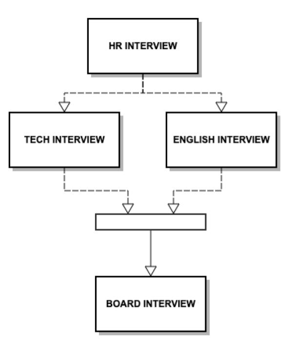
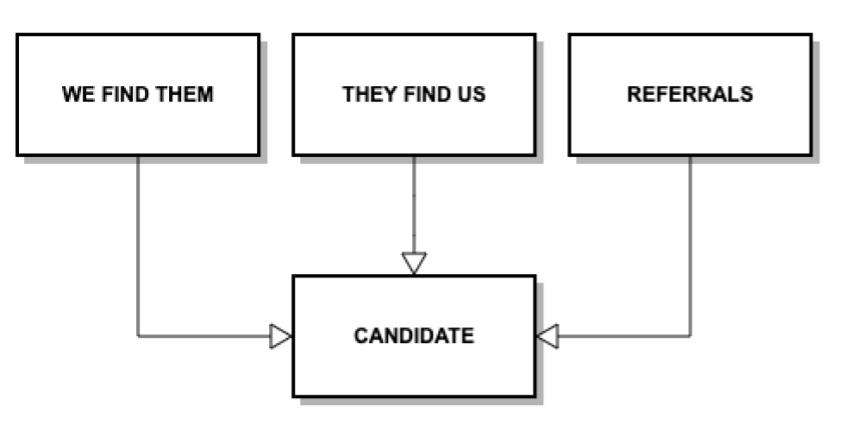

# The Engineering Hiring Process at Rootstrap

Hiring people should be considered one of the most important daily tasks for your organization if your goals are creating remarkable products, offering a premium service, and making your office a creative and relaxed environment to work in.

The hiring process (yes, you should have a well defined and executed process to hire employees) is the ultimate tool to help your organization find the perfect candidates to become part of your team. It should help detect those people who would fit not just technically but also those who despite having different personalities would contribute to the company's culture.

Everything starts with the hiring process. Hopefully, at this point you already understand that this is an important thing to do, now we’re going to focus on explaining how we implement this process here at Rootstrap: how it looks like, what are the steps, which areas participate in each of those steps, etc.

### Step 0: Getting the Candidates

There are basically three different ways of getting candidates into the process: 

__*They find us:*__ Through articles, flyers or posts on dedicated hiring sites where we ask for developers, designers, product owners, etc. 

__*We find them:*__ Using sites like LinkedIn we target specific roles or abilities that the company needs. 

__*Referrals:*__ This is one of the best ways of contact between the candidate and the company. Not only is it a good indicator of your employees’ happiness with the company (they are probably not going to recommend a place to work to their friends if they are not comfortable with their own situation), but also people generally present candidates that are going to fit well inside the company's ecosystem.

These three different approaches lead to the same point, once we finish with step 0 we get a candidate, and we are ready to start our interview process.

### Step 1: Human Resources Interview

Depending on the candidate’s location and availability, this interview can take place in the office itself or via a video call. It’s a 30-minute meeting carried out by one or two of our HR Analysts. Generally, it consists of a first part in which we explain a lot of things about Rootstrap, what we do, our history, how we work, the technologies we work with, growth and learning possibilities within the company, the environment, etc. And then, it’s time to get to know them, we want to know about previous experiences, their attitude towards work and in general, how they see themselves in the future, and what they are looking for in their next job, among other things. A pretty important aspect of this meeting, apart from evaluating their experience, is to assess their personality and see if the person would fit within Rootstrap’s culture.

Once this is complete, and if the candidate seems like a good fit, a technical interview will be set with one or two of our engineers depending on the technologies the person works with and the level of experience they have.

### Step 2: Technical Interview

The technical interview is the longest of all steps (it usually takes about two hours), because it’s an instance where our engineers have to assess the technological proficiency of the candidate, their reasoning and thinking process, as well as how the person seems to work in a team, what other tasks they are used to doing within a team context, how would they fit in Rootstrap, etc.

There are mainly three different parts to this interview.

First, we explain to them what we do, our teams, how they are organized, internal teams, processes, and feedback. All of this from an engineering standpoint. We also want to answer any question they have about the work they’ll be doing and their place within the company. And we want to know about them, past job experiences, teams they’ve worked on, projects they’ve helped create, and what are their future expectations. 

Secondly, we spend some time making them technical questions. Some of these cover general programming subjects and the rest are specific to the technologies they work with. We also show them code snippets and discuss with them what is wrong with the code they are seeing, or how that code can be improved. With these, we aim to verify the level of knowledge they manage.

Lastly, we give them two short written exercises to solve. These are technology-agnostic and we use them to assess their problem-solving abilities.

### Step 3: English Interview

This step is very important, because the great majority of our clients are English speakers, so it’s vital that we can all communicate fluently with them.

We usually have a video call with the candidate which takes about 15 minutes. Depending on the level of English the candidate expressed to have, we take one of two approaches:

- If the candidate has a basic level of English we have a simple conversation about general topics where we try to cover different subjects and grammatical structures.

- On the other hand, if their level is higher, we play pretend and ask them to select a web page they would like to demo for us, pretending they are the ones that developed it.

We obviously check for grammatical correctness, sentence building, and vocabulary diversity, but most of all, we try to see that the person is able to communicate their ideas effectively and is able to get their message across.

### Step 4: Board Member Interview

The fourth and last step would be to have an interview with someone from the management team in order to meet them before joining the company and explain to them about the area they are going to be working in. This is also done to bring closure to the process and to greet them for joining.

And that is how people have been joining the engineering Rootstrap team in the last year. It’s the process we have had success with, but that doesn’t mean it’s the best. We are constantly evaluating it, modifying the things that are not working, and making improvements where we see fit to accommodate to a growing company with new challenges each day.
